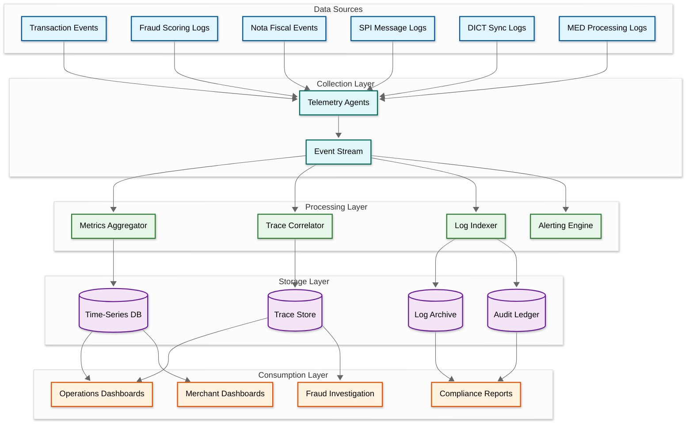

# Observability — AI-Native PIX Commerce Platform

## Observability Architecture

### The Challenge

A PIX commerce platform has observability requirements beyond typical web services: every transaction is a financial operation with regulatory audit requirements, the system spans multiple external dependencies (SPI, DICT, SEFAZ) with different observability characteristics, and real-time fraud detection creates a feedback loop where observability data directly influences transaction decisions. The observability system must serve four audiences: operations (uptime and performance), compliance (audit trails and regulatory reporting), merchants (transaction visibility), and fraud analysts (pattern investigation).

### Observability Stack



---

## Metrics

### Golden Signals (Payment-Specific)

| Signal | Metric | Warning | Critical | Rationale |
|---|---|---|---|---|
| **Transaction throughput** | `pix.transactions.per_second` | <80% of expected for time-of-day | <50% of expected | Drop may indicate PSP routing issues, SPI problems, or merchant-side failures |
| **Transaction latency** | `pix.transaction.e2e_latency_ms` (p50, p95, p99) | p99 > 5s | p99 > 8s | Approaching BCB's 10s SLO; payer's PSP may timeout |
| **Settlement success rate** | `pix.settlement.success_rate` | <99.5% | <99.0% | Each failed settlement is a lost merchant sale |
| **Fraud scoring latency** | `pix.fraud.scoring_latency_ms` | p99 > 150ms | p99 > 200ms | Exceeding budget causes transaction timeout or fallback to rules |
| **Fraud decline rate** | `pix.fraud.decline_rate` | >0.5% | >1.0% | Sudden increase may indicate model issue (false positives) or actual fraud spike |
| **Error rate** | `pix.transaction.error_rate` | >0.5% | >1.0% | Covers all non-success outcomes (SPI errors, DICT failures, internal errors) |

### SPI Integration Metrics

| Metric | Description | Alert Condition |
|---|---|---|
| `spi.connection.status` | RSFN connection health (primary/backup) | Primary down for >30s |
| `spi.message.send_latency_ms` | Time to send message to SPI | p99 > 2s |
| `spi.message.receive_latency_ms` | Time from SPI send to confirmation received | p99 > 8s |
| `spi.settlement_account.balance` | Pre-funded settlement account balance | Below 2× daily average volume |
| `spi.message.queue_depth` | Outbound SPI message queue size | >100 messages queued |
| `spi.message.error_rate` | SPI message rejection rate | >0.1% |

### DICT Metrics

| Metric | Description | Alert Condition |
|---|---|---|
| `dict.cache.hit_rate` | Local cache hit percentage | <99% |
| `dict.cache.sync_lag_seconds` | Time since last successful sync from BCB | >60s |
| `dict.cache.entries_count` | Total entries in local cache | Deviation >1% from expected |
| `dict.lookup.latency_ms` | Key lookup latency (cache + fallback) | p99 > 20ms |
| `dict.sync.gap_detected` | Sequence gap detected in sync feed | Any occurrence |
| `dict.portability.pending_count` | Keys with portability in progress | Informational |

### Nota Fiscal Metrics

| Metric | Description | Alert Condition |
|---|---|---|
| `nf.generation.latency_ms` | Time from settlement to NF authorization | p99 > 10s |
| `nf.sefaz.authorization_rate` | Percentage of NF-e authorized on first submission | <98% |
| `nf.sefaz.availability{state}` | Per-state SEFAZ availability | <95% (triggers contingency mode) |
| `nf.sefaz.response_time_ms{state}` | Per-state SEFAZ response latency | p99 > 8s |
| `nf.contingency.active_count` | NF-e in contingency mode awaiting retroactive auth | >1000 |
| `nf.backlog.pending_count` | NF-e pending generation | >5000 |

### PIX Automático Metrics

| Metric | Description | Alert Condition |
|---|---|---|
| `mandate.active_count` | Total active mandates | Informational (trending) |
| `mandate.billing.success_rate` | Percentage of billings settled successfully | <95% |
| `mandate.billing.window_compliance` | Billings submitted within 2-10 day window | <100% (any miss is critical) |
| `mandate.cancellation.rate_7d` | Cancellation rate over rolling 7 days | >5% (churn spike) |
| `mandate.retry.pending_count` | Mandates in retry queue | >500 |

### Fraud Engine Metrics

| Metric | Description | Alert Condition |
|---|---|---|
| `fraud.model.inference_latency_ms` | ML model inference time | p99 > 100ms |
| `fraud.model.version` | Currently deployed model version | Version mismatch across nodes |
| `fraud.score.distribution` | Histogram of risk scores | Bimodal distribution shift |
| `fraud.decision.approve_rate` | Percentage of transactions approved | <98% or sudden change |
| `fraud.fallback.rule_based_rate` | Percentage using rule-based fallback | >1% (indicates ML issues) |
| `fraud.feature_store.staleness_ms` | Age of real-time features | >5000ms |

---

## Distributed Tracing

### Transaction Trace Structure

Every PIX transaction generates a distributed trace spanning all services involved. The trace ID is derived from the transaction_id (not the endToEndId, which is SPI-assigned later in the flow).

```
Trace: txn-abc-123
├── [50ms] API Gateway: authenticate merchant request
├── [35ms] QR Code Service: generate dynamic charge
│   ├── [5ms] Generate COB payload
│   ├── [10ms] Create charge endpoint
│   └── [20ms] Render QR image
├── [--- wait for payer to scan QR ---]
├── [8ms] SPI Gateway: receive incoming payment notification
├── [12ms] DICT Service: resolve payer key
│   ├── [2ms] Cache lookup (HIT)
│   └── [10ms] Enrich with anti-fraud metadata
├── [85ms] Fraud Engine: score transaction
│   ├── [15ms] Feature extraction
│   ├── [8ms] Velocity lookup
│   ├── [12ms] Graph query
│   └── [50ms] Model ensemble inference
├── [5ms] Transaction Orchestrator: create transaction record
├── [1200ms] SPI Gateway: submit settlement + receive confirmation
├── [3ms] Event Stream: publish settlement event
├── [2ms] Reconciliation: auto-match endToEndId to charge_id
├── [--- async from here ---]
├── [3500ms] Nota Fiscal: generate + submit to SEFAZ
│   ├── [50ms] Tax computation
│   ├── [200ms] XML generation + signing
│   └── [3250ms] SEFAZ API call
└── [150ms] Webhook: deliver payment_confirmed to merchant
```

### Cross-System Correlation

The platform operates across multiple external systems that each have their own identifiers:

| System | Identifier | Our Correlation Field |
|---|---|---|
| **Our platform** | `transaction_id` (UUID) | Primary key |
| **SPI** | `endToEndId` (E2EID format) | Stored in transaction record after SPI assignment |
| **DICT** | PIX key (CPF, phone, etc.) | `payer_key` / `payee_key` in transaction |
| **SEFAZ** | NF-e access key (44 digits) | Stored in nota_fiscal record |
| **Merchant** | `merchant_order_id` | Stored in transaction record |
| **MED** | MED claim ID | Linked via endToEndId |

The trace correlator maintains a cross-reference index enabling lookup by any of these identifiers, supporting compliance investigations that start from a BCB inquiry (endToEndId), a merchant complaint (merchant_order_id), or a SEFAZ audit (NF-e access key).

---

## Logging

### Structured Log Schema

All log entries follow a standardized schema:

```
{
    "timestamp":        ISO-8601 with microsecond precision,
    "trace_id":         transaction_id or correlation ID,
    "span_id":          unique span within trace,
    "service":          emitting service name,
    "level":            DEBUG | INFO | WARN | ERROR | CRITICAL,
    "event":            structured event name (e.g., "pix.settlement.confirmed"),
    "merchant_id":      merchant identifier (for access-scoped queries),
    "amount_cents":     transaction amount (for financial reconciliation),
    "duration_ms":      operation duration,
    "external_ref":     external system reference (endToEndId, NF access key),
    "error_code":       standardized error code (if applicable),
    "details":          JSON object with event-specific data
}
```

### Log Retention

| Category | Retention | Storage Tier |
|---|---|---|
| **Transaction logs** | 10 years | Hot (90 days) → Warm (1 year) → Cold (10 years) |
| **Fraud scoring logs** | 5 years | Hot (30 days) → Warm (1 year) → Cold (5 years) |
| **Nota Fiscal logs** | 5 years | Hot (30 days) → Cold (5 years) |
| **SPI message logs** | 10 years | Hot (30 days) → Cold (10 years) |
| **MED processing logs** | 10 years | Hot (1 year) → Cold (10 years) |
| **API access logs** | 2 years | Hot (30 days) → Cold (2 years) |
| **Infrastructure logs** | 90 days | Hot (7 days) → Cold (90 days) |

---

## Alerting

### Alert Hierarchy

```
Tier 1 (Page on-call immediately):
    - SPI connectivity loss (primary + backup)
    - Settlement success rate < 95%
    - Settlement account balance below daily minimum
    - Fraud engine completely unavailable (no fallback)
    - MED block request processing failure
    - PIX Automático billing window about to close with unsubmitted mandates

Tier 2 (Page within 15 minutes):
    - Transaction p99 latency > 8 seconds
    - Fraud decline rate > 1% (potential false positive spike)
    - DICT cache sync gap detected
    - SEFAZ down for 2+ states simultaneously
    - Database replication lag > 5 seconds

Tier 3 (Alert to channel, investigate within 1 hour):
    - Single SEFAZ state unavailable (contingency mode active)
    - Fraud model version mismatch across nodes
    - NF-e backlog > 5000 pending documents
    - Mandate billing success rate < 98%
    - Merchant webhook delivery failure rate > 5%

Tier 4 (Daily review):
    - DICT cache hit rate < 99.5%
    - Settlement reconciliation auto-match rate < 99.9%
    - Mandate churn rate trend increasing
    - Tax computation error rate > 0.01%
```

### Anomaly Detection

The observability system uses AI-powered anomaly detection for metrics that don't have fixed thresholds:

| Signal | Anomaly Type | Detection Method |
|---|---|---|
| **Transaction volume per merchant** | Sudden spike or drop | Seasonal decomposition + deviation from forecast |
| **Average transaction amount** | Shift in distribution | Kolmogorov-Smirnov test against trailing 30-day distribution |
| **Fraud score distribution** | Distribution drift | Population stability index (PSI) monitoring |
| **SEFAZ response latency** | Gradual degradation | Linear regression on trailing 1-hour latency trend |
| **Mandate cancellation clustering** | Burst of cancellations from one PSP | Z-score on cancellation rate per customer PSP |

---

## Dashboards

### Operations Dashboard

| Panel | Content | Refresh |
|---|---|---|
| **Real-time TPS** | Current transactions per second with 24h overlay | 5s |
| **Settlement funnel** | INITIATED → FRAUD_CHECK → SETTLING → SETTLED with conversion rates | 10s |
| **SPI health** | Connection status, message queue depth, settlement account balance | 5s |
| **Fraud engine** | Scoring latency (p50/p95/p99), decline rate, fallback rate | 10s |
| **SEFAZ status map** | Brazil map with per-state SEFAZ health (green/yellow/red) | 30s |
| **Error breakdown** | Top 10 error codes with trending direction | 30s |

### Merchant Dashboard (Customer-Facing)

| Panel | Content | Refresh |
|---|---|---|
| **Today's sales** | Total received, transaction count, average ticket | 30s |
| **Payment status** | Real-time feed of incoming PIX payments with status | 10s |
| **Nota Fiscal status** | Authorized/pending/rejected counts for today | 60s |
| **Recurring billing** | Active mandates, upcoming billings, churn risk flags | 5m |
| **Settlement report** | Per-transaction settlement confirmation with endToEndId | 60s |
| **Split payment tracker** | Per-participant settlement status for marketplace sellers | 60s |

### Compliance Dashboard

| Panel | Content | Refresh |
|---|---|---|
| **MED cases** | Active MED claims, funds blocked, returns executed, aging | 5m |
| **Regulatory SLAs** | Current compliance with BCB processing SLAs | 1m |
| **Suspicious activity** | Flagged accounts, pending STR filings, mule network alerts | 5m |
| **Audit trail** | Searchable log of all regulatory-relevant events | On-demand |
| **Data subject requests** | LGPD requests received, processing, completed | Daily |

---

## Runbooks

### Runbook: SPI Connectivity Loss

```
Trigger: spi.connection.status == DOWN for primary AND backup

1. VERIFY: Check RSFN network connectivity (ping, traceroute)
2. CHECK: BCB operational status page for announced maintenance
3. IF network issue:
   a. Contact RSFN network operations
   b. Verify firewall rules haven't changed
   c. Check certificate expiration for SPI mTLS
4. IF BCB maintenance:
   a. Confirm expected duration
   b. Enable "payment temporarily unavailable" merchant notification
5. WHILE disconnected:
   a. Monitor SPI outbound queue depth
   b. Ensure queue doesn't exceed memory limits (apply backpressure)
   c. NO transactions will settle; merchants are notified
6. ON reconnection:
   a. Verify SPI handshake completes
   b. Drain outbound queue (oldest first)
   c. Request message replay from BCB for any missed inbound messages
   d. Verify settlement account balance is consistent
   e. Clear merchant "unavailable" notification
```

### Runbook: Fraud Engine Degradation

```
Trigger: fraud.model.inference_latency_ms p99 > 200ms OR error_rate > 5%

1. VERIFY: Check fraud engine node health (CPU, memory, model loaded)
2. CHECK: Recent model deployment (version change in last 24h?)
3. IF latency spike:
   a. Check for feature store degradation (velocity counters, graph DB)
   b. Check for inference node resource exhaustion
   c. Scale up inference nodes if utilization > 80%
4. IF error rate spike:
   a. Check model input validation (schema changes in upstream data?)
   b. Check model serving framework health
5. IF cannot resolve within 5 minutes:
   a. Circuit breaker should auto-trip; verify fallback to rule-based scoring
   b. Monitor rule-based false positive rate
   c. Notify fraud operations team of degraded detection capability
6. ON recovery:
   a. Gradually ramp ML traffic back (10% → 50% → 100%)
   b. Compare ML scores vs. rule-based scores for the degraded period
   c. Post-incident: review any transactions approved during degradation
```

### Runbook: Settlement Reconciliation Mismatch

```
Trigger: reconciliation.unmatched_count > 100 OR unmatched_age > 1 hour

1. IDENTIFY: Pull list of unmatched transactions
   a. Missing settlement: our transaction exists but no SPI confirmation
   b. Orphan settlement: SPI confirmation but no matching transaction
   c. Amount mismatch: SPI amount differs from our charge amount

2. FOR missing settlement:
   a. Check SPI message logs for the endToEndId
   b. If SPI shows settlement: likely a race condition; wait 5 minutes
   c. If SPI shows rejection: update transaction to FAILED; notify merchant
   d. If no SPI record: check if SPI message was queued but not sent

3. FOR orphan settlement:
   a. Check if charge_id in the SPI metadata matches a known charge
   b. If match found: likely a correlation key mapping error; fix and reconcile
   c. If no match: potential duplicate payment; investigate with payer's PSP

4. FOR amount mismatch:
   a. Check for split payment fee deductions
   b. Check for currency rounding differences
   c. If unexplained: flag for manual review; do not auto-settle

5. REPORT: Generate reconciliation exception report for finance team
```
