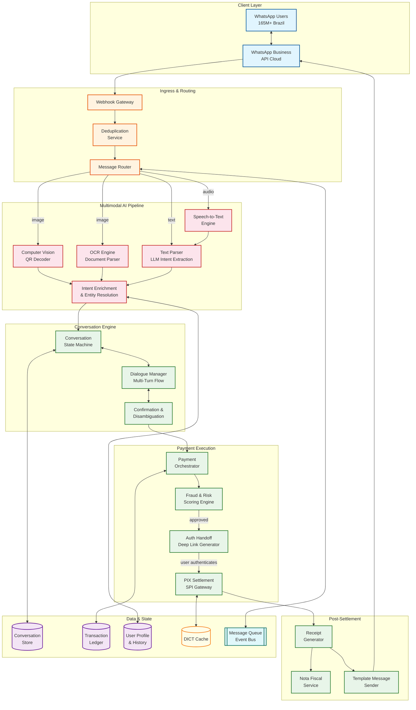
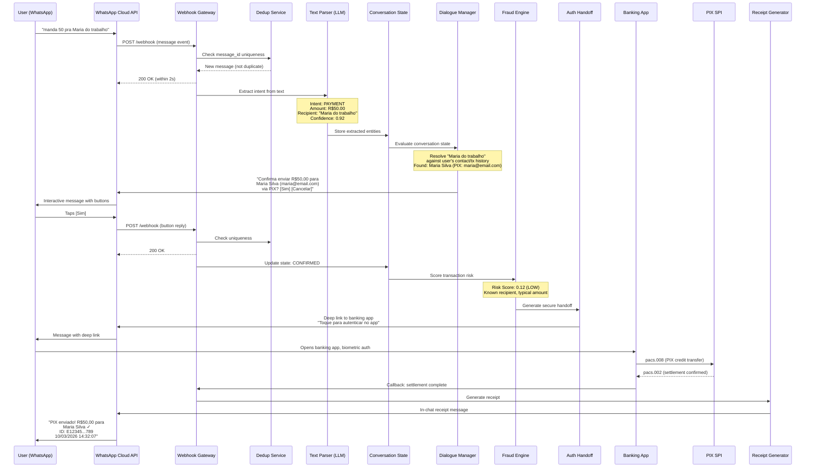
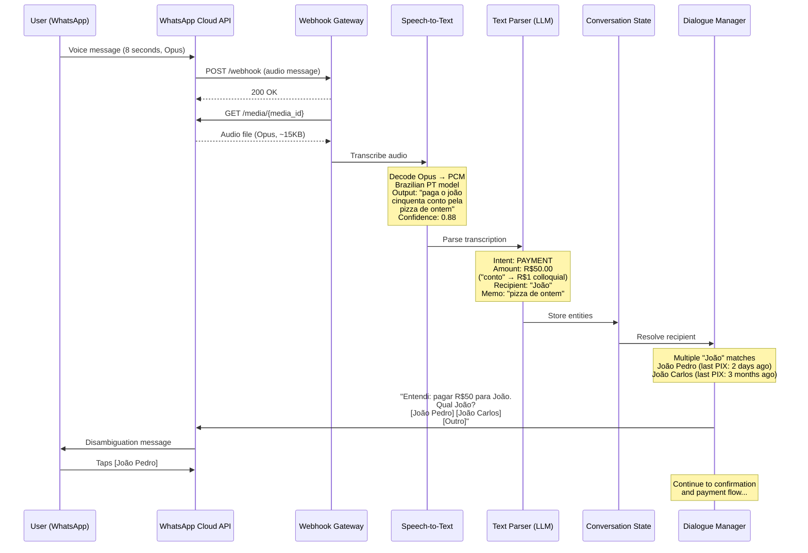
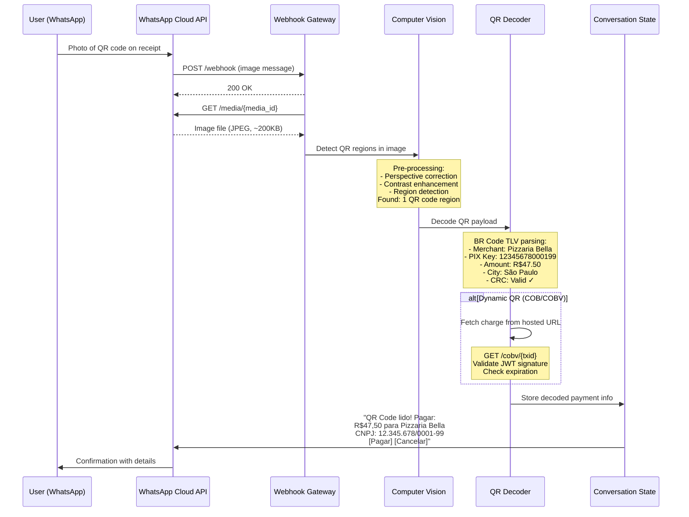

# High-Level Design — AI-Native WhatsApp+PIX Commerce Assistant

## System Architecture

---

## Data Flow: Payment via Text Message

---

## Data Flow: Payment via Voice Message

---

## Data Flow: Payment via QR Code Photo

---

## Key Architectural Decisions

### 1. Sync vs. Async Communication

| Component | Model | Justification |
|---|---|---|
| Webhook ingestion | **Async** | Must acknowledge within 20s (WhatsApp timeout); actual processing happens asynchronously via message queue |
| AI pipeline (STT, CV, LLM) | **Async with streaming** | AI inference takes 1-4 seconds; queue-based with priority (text fastest, voice/image slower) |
| Payment settlement (SPI) | **Sync** | PIX settlement is inherently synchronous; the payer's PSP submits to SPI and waits for pacs.002 confirmation |
| Receipt delivery | **Async** | Decoupled from settlement; receipt generation and WhatsApp message sending happen after settlement callback |

### 2. Event-Driven vs. Request-Response

**Decision: Event-driven core with request-response at boundaries.**

The system's internal architecture is event-driven: each message ingestion produces an event that flows through the AI pipeline, conversation engine, and payment orchestrator. This enables:
- Decoupling between AI processing stages (STT can scale independently of CV)
- Retry and dead-letter handling for failed AI inferences
- Audit trail via event log (every state transition recorded)

Request-response is used only at system boundaries:
- WhatsApp Cloud API (webhooks in, API calls out)
- PIX SPI integration (pacs.008 request, pacs.002 response)
- DICT lookups (key-to-account resolution)

### 3. Database Choices (Polyglot Persistence)

| Data | Store Type | Rationale |
|---|---|---|
| **Conversation state** | Document store (e.g., MongoDB) | Flexible schema for multi-turn dialogue; per-user partition; TTL for 24-hour window expiry |
| **Transaction ledger** | Relational DB (e.g., PostgreSQL) | ACID guarantees for financial records; strong consistency; audit requirements |
| **User profiles & history** | Document store | Semi-structured user preferences, contact mappings, transaction history |
| **DICT cache** | In-memory store (e.g., Redis) | Sub-millisecond key-to-account lookups; TTL-based refresh from BCB |
| **Message deduplication** | In-memory store (e.g., Redis) | WhatsApp message ID dedup with 24-hour TTL |
| **Event bus** | Distributed log (e.g., Kafka) | Ordered event processing per conversation; replay capability; exactly-once semantics |
| **AI model registry** | Object storage + metadata DB | Model versioning, A/B testing, rollback capability |
| **Audit logs** | Append-only store | Immutable, hash-chained for regulatory compliance |

### 4. Caching Strategy

| Cache Layer | Data | TTL | Strategy |
|---|---|---|---|
| **L1 (in-process)** | Active conversation state | 5 min | LRU; ~10K concurrent conversations per node |
| **L2 (distributed)** | Conversation state, user profiles | 24 hours | Write-through for state, read-through for profiles |
| **DICT cache** | PIX key → account mappings | 15 min | Background refresh; fallback to direct DICT query on miss |
| **Template cache** | Pre-approved WhatsApp message templates | 1 hour | Refresh on template approval webhook |
| **AI model cache** | Loaded model weights | Until new version | Blue-green swap on model deployment |

### 5. Message Queue Usage

| Queue/Topic | Purpose | Ordering | Delivery |
|---|---|---|---|
| `inbound-messages` | Raw webhook events | Per-conversation (partition by user phone hash) | At-least-once with dedup |
| `ai-pipeline` | AI processing tasks | Per-conversation | At-least-once; priority sub-queues by modality |
| `payment-commands` | Confirmed payment intents | Per-user | Exactly-once (idempotency key) |
| `settlement-events` | SPI settlement callbacks | Per-transaction | At-least-once with dedup by endToEndId |
| `outbound-messages` | WhatsApp API messages to send | Per-conversation | At-least-once with rate limiting (80-1000 msg/s) |
| `audit-events` | All state transitions | Global ordering | At-least-once; append-only consumer |

---

## Architecture Pattern Checklist

- [x] **Sync vs Async**: Async ingestion + processing; sync at payment settlement boundary
- [x] **Event-driven vs Request-response**: Event-driven core; request-response at WhatsApp and PIX boundaries
- [x] **Push vs Pull**: Push-based (WhatsApp pushes webhooks to us; we push messages back via API)
- [x] **Stateless vs Stateful**: Stateless services with externalized state (conversation store, ledger); AI models loaded in memory (stateful at node level, but horizontally scalable)
- [x] **Read-heavy vs Write-heavy**: Write-heavy for ingestion (35M messages/day); read-heavy for conversation state retrieval during multi-turn flows
- [x] **Real-time vs Batch**: Real-time for all transaction paths; batch for analytics, model retraining, and compliance reporting
- [x] **Edge vs Origin**: Origin processing for AI inference (GPU requirements); edge CDN not applicable (no static content)

---

## Component Interaction Summary

### Happy Path (Text Payment)

1. **Ingress** (50ms): Webhook received → deduplicated → queued
2. **AI Extraction** (500ms-1.5s): LLM parses text → extracts intent, amount, recipient
3. **Entity Resolution** (200ms): Recipient name → PIX key via user history + DICT
4. **Conversation Turn** (100ms): State machine transitions → generates confirmation message
5. **User Confirmation** (human time): User taps "Confirm" button
6. **Fraud Scoring** (100ms): Risk assessment on extracted transaction parameters
7. **Auth Handoff** (200ms): Generate deep link with encrypted, short-lived token
8. **User Authentication** (human time): Biometric/PIN in banking app
9. **PIX Settlement** (3-10s): SPI processes pacs.008 → returns pacs.002
10. **Receipt** (500ms): Generate receipt → send via WhatsApp template message

**Total system time (excluding human interaction):** ~2-13 seconds
**Total user-perceived time (including authentication):** ~15-30 seconds

### Degraded Mode

| Failure | Degraded Behavior |
|---|---|
| LLM unavailable | Fall back to rule-based regex extraction for simple patterns; queue complex messages for retry |
| STT unavailable | Respond with "Voice messages temporarily unavailable, please type your request" |
| CV unavailable | Respond with "Photo processing unavailable, please enter PIX key manually" |
| DICT cache miss | Direct DICT query (30-50ms instead of 2ms); still within latency budget |
| SPI unavailable | Queue payment for retry; notify user of delay; this is extremely rare (PIX operates 24/7) |
| WhatsApp API rate limited | Queue outbound messages; prioritize payment confirmations and receipts over informational messages |
