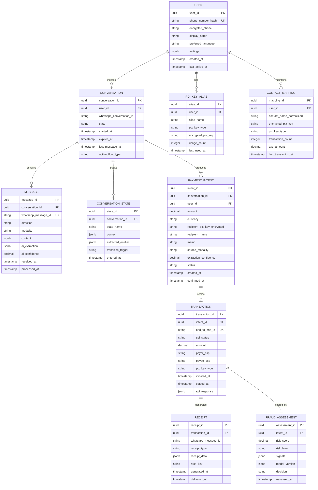
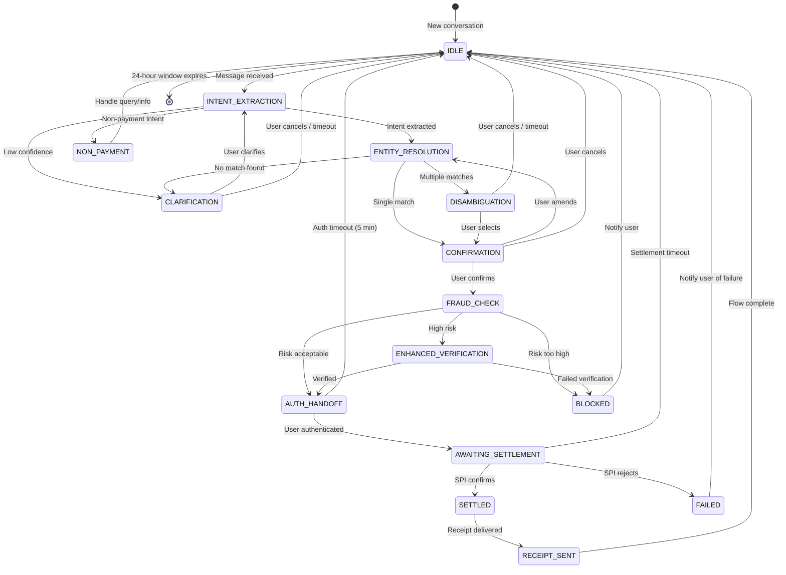

# Low-Level Design — AI-Native WhatsApp+PIX Commerce Assistant

## Data Model

### Entity-Relationship Diagram



### Indexing Strategy

| Table | Index | Type | Purpose |
|---|---|---|---|
| `MESSAGE` | `(whatsapp_message_id)` | Unique | Deduplication of webhook retries |
| `MESSAGE` | `(conversation_id, received_at)` | B-tree | Retrieve conversation history in order |
| `CONVERSATION` | `(user_id, state, expires_at)` | Composite | Find active conversations for a user |
| `CONTACT_MAPPING` | `(user_id, contact_name_normalized)` | Composite + trigram | Fuzzy recipient name resolution |
| `PAYMENT_INTENT` | `(user_id, status, created_at)` | Composite | Pending intent lookup |
| `TRANSACTION` | `(end_to_end_id)` | Unique | Settlement reconciliation |
| `TRANSACTION` | `(intent_id)` | B-tree | Join intent to settlement |
| `TRANSACTION` | `(user_id, settled_at)` | Composite | Transaction history queries |

### Partitioning Strategy

| Table | Partition Key | Scheme | Rationale |
|---|---|---|---|
| `MESSAGE` | `received_at` (monthly) | Range | Time-series data; old partitions archived to cold storage |
| `TRANSACTION` | `settled_at` (monthly) | Range | Regulatory retention; efficient range scans for reporting |
| `CONVERSATION` | `user_id` hash | Hash (16 partitions) | Even distribution; co-locates all conversations for a user |
| `CONVERSATION_STATE` | `conversation_id` hash | Hash | Co-locates state transitions with parent conversation |

### Data Retention

| Data | Active | Archive | Deletion |
|---|---|---|---|
| Conversations | 90 days | 2 years (PII masked) | After archive period |
| Transactions | 5 years | 10 years (cold) | Per BCB regulation |
| Raw audio/images | 24 hours | None | Deleted after processing |
| AI extraction results | 90 days (with conversation) | Retained anonymized | With conversation |

---

## Conversation State Machine



### State Transition Rules

| From | To | Trigger | Side Effect |
|---|---|---|---|
| `IDLE` | `INTENT_EXTRACTION` | Any inbound message | Start AI pipeline; set 24h TTL |
| `INTENT_EXTRACTION` | `ENTITY_RESOLUTION` | Confidence > 0.8 | Store extracted entities |
| `INTENT_EXTRACTION` | `CLARIFICATION` | Confidence < 0.8 | Send clarification question |
| `ENTITY_RESOLUTION` | `DISAMBIGUATION` | Multiple PIX key matches | Send disambiguation options |
| `ENTITY_RESOLUTION` | `CONFIRMATION` | Single match found | Send confirmation message with details |
| `CONFIRMATION` | `FRAUD_CHECK` | User taps "Confirm" | Trigger fraud scoring pipeline |
| `FRAUD_CHECK` | `AUTH_HANDOFF` | Risk score < 0.6 | Generate deep link |
| `FRAUD_CHECK` | `ENHANCED_VERIFICATION` | Risk score 0.6-0.85 | Additional verification step |
| `FRAUD_CHECK` | `BLOCKED` | Risk score > 0.85 | Block transaction; log for review |
| `AUTH_HANDOFF` | `AWAITING_SETTLEMENT` | Auth callback received | Submit to SPI |
| `AWAITING_SETTLEMENT` | `SETTLED` | pacs.002 success | Trigger receipt generation |

---

## API Design

### WhatsApp Webhook Endpoint (Inbound)

```
POST /v1/webhook/whatsapp
Headers:
  X-Hub-Signature-256: {HMAC signature}
  Content-Type: application/json

Body:
{
  "object": "whatsapp_business_account",
  "entry": [{
    "id": "{business_account_id}",
    "changes": [{
      "value": {
        "messaging_product": "whatsapp",
        "metadata": {
          "display_phone_number": "{bot_phone}",
          "phone_number_id": "{phone_id}"
        },
        "messages": [{
          "id": "wamid.xxx",
          "from": "{user_phone}",
          "timestamp": "1710072000",
          "type": "text|audio|image|interactive",
          "text": { "body": "..." },
          "audio": { "id": "{media_id}", "mime_type": "audio/ogg" },
          "image": { "id": "{media_id}", "mime_type": "image/jpeg" }
        }]
      }
    }]
  }]
}

Response: 200 OK (within 2 seconds, always)
```

### Internal API: Payment Intent

```
POST /v1/internal/payment-intent
Headers:
  X-Request-Id: {idempotency_key}
  X-Conversation-Id: {conversation_id}
  Authorization: Bearer {internal_token}

Body:
{
  "user_id": "uuid",
  "amount": 50.00,
  "currency": "BRL",
  "recipient": {
    "pix_key": "encrypted_value",
    "pix_key_type": "email|cpf|phone|uuid",
    "display_name": "Maria Silva"
  },
  "source_modality": "text|voice|qr_photo|document",
  "extraction_confidence": 0.92,
  "memo": "pizza de ontem",
  "conversation_context": {
    "conversation_id": "uuid",
    "message_ids": ["wamid.xxx", "wamid.yyy"]
  }
}

Response:
{
  "intent_id": "uuid",
  "status": "PENDING_CONFIRMATION|PENDING_FRAUD_CHECK|APPROVED|BLOCKED",
  "fraud_assessment": {
    "risk_score": 0.12,
    "risk_level": "LOW",
    "signals": []
  },
  "auth_handoff": {
    "deep_link_url": "bankapp://pix/pay?token=xxx",
    "expires_at": "2026-03-10T15:00:00Z"
  }
}
```

### Internal API: Settlement Callback

```
POST /v1/internal/settlement-callback
Headers:
  X-Request-Id: {idempotency_key}
  Authorization: Bearer {spi_callback_token}

Body:
{
  "intent_id": "uuid",
  "end_to_end_id": "E12345678901234567890123456789012",
  "status": "SETTLED|REJECTED|TIMEOUT",
  "amount": 50.00,
  "settlement_timestamp": "2026-03-10T14:32:07.123Z",
  "payer_psp": "PICPAY",
  "payee_psp": "NUBANK",
  "rejection_reason": null
}

Response: 200 OK
```

### Rate Limiting

| Endpoint | Rate Limit | Window | Strategy |
|---|---|---|---|
| Webhook ingestion | 10,000 req/s | Per second | Token bucket; excess queued |
| Payment intent creation | 5 req/min per user | Per minute | Fixed window; prevent rapid-fire payments |
| Settlement callback | Unlimited (trusted) | N/A | SPI-authenticated; no rate limit |
| Outbound WhatsApp messages | 80-1,000 msg/s | Per second (WhatsApp tier) | Token bucket with priority queue |
| Balance queries | 10 req/min per user | Per minute | Sliding window |

### Idempotency Handling

```
FUNCTION handle_webhook(webhook_payload):
    message_id = webhook_payload.messages[0].id

    // Check deduplication cache (Redis)
    IF redis.SET(key="dedup:{message_id}", value="processing",
                 NX=true, EX=86400) == false:
        RETURN 200  // Already processing or processed

    // Acknowledge immediately
    RESPOND 200

    // Process asynchronously
    ENQUEUE to "inbound-messages" with key=message_id

FUNCTION handle_payment_execution(intent_id, idempotency_key):
    // Distributed lock per user to prevent concurrent payments
    lock = acquire_lock(key="payment:{user_id}", ttl=30s)
    IF lock == null:
        RETURN CONFLICT "Payment already in progress"

    TRY:
        // Check if already executed
        existing = db.query("SELECT * FROM transaction WHERE intent_id = ?", intent_id)
        IF existing != null:
            RETURN existing  // Idempotent response

        // Execute payment
        result = spi_gateway.submit_pacs008(intent)
        db.insert(transaction_record)
        RETURN result
    FINALLY:
        release_lock(lock)
```

---

## Core Algorithms

### 1. Multimodal Intent Extraction Pipeline

```
FUNCTION extract_payment_intent(message):
    modality = detect_modality(message)

    SWITCH modality:
        CASE TEXT:
            raw_text = message.text.body
            extraction = llm_extract(raw_text, system_prompt=PAYMENT_EXTRACTION_PROMPT)

        CASE AUDIO:
            audio_bytes = fetch_media(message.audio.id)
            pcm_audio = decode_opus(audio_bytes)
            transcript = speech_to_text(pcm_audio, language="pt-BR")
            extraction = llm_extract(transcript.text, system_prompt=PAYMENT_EXTRACTION_PROMPT)
            extraction.source_confidence *= transcript.confidence  // Compound confidence

        CASE IMAGE:
            image_bytes = fetch_media(message.image.id)
            qr_result = detect_and_decode_qr(image_bytes)

            IF qr_result.found:
                extraction = parse_br_code(qr_result.payload)
            ELSE:
                ocr_result = extract_text_from_image(image_bytes)
                extraction = llm_extract(ocr_result.text, system_prompt=PAYMENT_EXTRACTION_PROMPT)
                extraction.source_confidence *= ocr_result.confidence

    // Validate extraction
    IF extraction.amount != null AND extraction.amount <= 0:
        extraction.valid = false
        extraction.error = "Invalid amount"

    IF extraction.confidence < CONFIDENCE_THRESHOLD:  // 0.8
        extraction.needs_clarification = true

    RETURN extraction
```

### 2. QR Code Detection and BR Code Parsing

```
FUNCTION detect_and_decode_qr(image_bytes):
    // Pre-processing for mobile photos
    image = load_image(image_bytes)
    image = auto_orient(image)  // Fix EXIF rotation
    image = enhance_contrast(image, factor=1.3)

    // Multi-scale QR detection
    FOR scale IN [1.0, 0.75, 0.5, 1.5]:
        scaled = resize(image, scale)
        regions = find_qr_finder_patterns(scaled)

        FOR region IN regions:
            corrected = perspective_correct(scaled, region)
            payload = decode_qr(corrected)

            IF payload != null:
                RETURN { found: true, payload: payload, confidence: region.confidence }

    RETURN { found: false }

FUNCTION parse_br_code(payload):
    // TLV (Tag-Length-Value) parsing per BR Code specification
    result = {}
    position = 0

    WHILE position < length(payload):
        tag = payload[position:position+2]
        length = int(payload[position+2:position+4])
        value = payload[position+4:position+4+length]
        position += 4 + length

        SWITCH tag:
            CASE "00": result.format_indicator = value
            CASE "01": result.initiation_method = value  // "11"=static, "12"=dynamic
            CASE "26"-"51":  // Merchant Account Info (PIX)
                sub_tlv = parse_sub_tlv(value)
                IF sub_tlv.tag_00 == "br.gov.bcb.pix":
                    result.pix_key = sub_tlv.tag_01
                    result.description = sub_tlv.tag_02
                    result.fss_url = sub_tlv.tag_25  // Dynamic QR URL
            CASE "52": result.merchant_category = value
            CASE "53": result.currency = value  // "986" = BRL
            CASE "54": result.amount = decimal(value)
            CASE "58": result.country = value
            CASE "59": result.merchant_name = value
            CASE "60": result.merchant_city = value
            CASE "62":  // Additional Data
                sub_tlv = parse_sub_tlv(value)
                result.txid = sub_tlv.tag_05
            CASE "63":  // CRC checksum
                result.crc = value

    // Validate CRC
    computed_crc = crc16_ccitt(payload[0:-4])
    IF computed_crc != result.crc:
        RETURN { valid: false, error: "CRC mismatch" }

    // For dynamic QR, fetch charge details
    IF result.initiation_method == "12" AND result.fss_url != null:
        charge = fetch_dynamic_charge(result.fss_url)
        result.amount = charge.amount
        result.expiration = charge.expiration
        result.debtor = charge.debtor

    RETURN { valid: true, extraction: result }
```

### 3. Recipient Resolution Algorithm

```
FUNCTION resolve_recipient(user_id, raw_name, context):
    candidates = []

    // Step 1: Exact match in user's contact mappings
    exact = db.query(
        "SELECT * FROM contact_mapping WHERE user_id = ? AND contact_name_normalized = ?",
        user_id, normalize(raw_name)
    )
    IF exact.count == 1:
        RETURN { match: exact[0], confidence: 0.98, source: "exact_contact" }
    candidates.extend(exact)

    // Step 2: Fuzzy match in contacts (trigram similarity)
    fuzzy = db.query(
        "SELECT *, similarity(contact_name_normalized, ?) as sim FROM contact_mapping
         WHERE user_id = ? AND similarity(contact_name_normalized, ?) > 0.4
         ORDER BY sim DESC LIMIT 5",
        normalize(raw_name), user_id, normalize(raw_name)
    )
    candidates.extend(fuzzy)

    // Step 3: Check recent transaction history for recency bias
    FOR candidate IN candidates:
        recency_score = exponential_decay(
            days_since=days_since(candidate.last_transaction_at),
            half_life=30
        )
        frequency_score = log(candidate.transaction_count + 1) / log(100)
        candidate.combined_score = (
            0.4 * candidate.similarity +
            0.3 * recency_score +
            0.2 * frequency_score +
            0.1 * context_relevance(candidate, context)
        )

    // Sort by combined score
    candidates.sort(by=combined_score, descending=true)

    IF candidates.count == 0:
        RETURN { match: null, confidence: 0.0, needs_input: true }
    ELIF candidates.count == 1 OR candidates[0].combined_score > 0.85:
        RETURN { match: candidates[0], confidence: candidates[0].combined_score }
    ELSE:
        RETURN { matches: candidates[:3], needs_disambiguation: true }

FUNCTION context_relevance(candidate, context):
    // If conversation mentions context clues, score relevance
    // e.g., "Maria do trabalho" + candidate works at same company = high relevance
    // e.g., "pizza" + candidate has previous pizza-related transactions = moderate
    IF context.memo != null:
        memo_matches = count_keyword_overlap(context.memo, candidate.transaction_memos)
        RETURN min(memo_matches / 3, 1.0)
    RETURN 0.0
```

### 4. Conversational Fraud Scoring

```
FUNCTION score_conversational_fraud(intent, user, conversation):
    signals = []
    score = 0.0

    // Signal 1: New recipient + high amount
    IF intent.recipient NOT IN user.known_recipients:
        IF intent.amount > user.avg_transaction_amount * 3:
            signals.append("NEW_RECIPIENT_HIGH_AMOUNT")
            score += 0.25

    // Signal 2: Unusual hour for this user
    hour = intent.created_at.hour
    IF hour NOT IN user.typical_transaction_hours:
        signals.append("UNUSUAL_HOUR")
        score += 0.10

    // Signal 3: Rapid conversation (coached by fraudster)
    avg_response_time = conversation.avg_inter_message_delay()
    IF avg_response_time < 2_SECONDS:  // User responding unusually fast
        signals.append("RAPID_RESPONSE_PATTERN")
        score += 0.15

    // Signal 4: Copy-pasted PIX key (vs. natural description)
    IF intent.source_modality == "text":
        IF looks_like_copypaste(intent.raw_text, intent.pix_key):
            signals.append("COPYPASTED_PIX_KEY")
            score += 0.20

    // Signal 5: Transaction velocity
    recent_tx_count = count_transactions(user, window=1_HOUR)
    IF recent_tx_count > user.normal_hourly_rate * 2:
        signals.append("HIGH_VELOCITY")
        score += 0.15

    // Signal 6: Voice message emotional distress indicators
    IF intent.source_modality == "voice" AND conversation.has_audio_analysis:
        IF conversation.audio_stress_score > 0.7:
            signals.append("VOICE_STRESS_DETECTED")
            score += 0.20

    // Signal 7: Amount is suspiciously round or just under limit
    IF intent.amount IN [100, 200, 500, 1000, 2000, 5000]:
        IF intent.recipient NOT IN user.known_recipients:
            signals.append("ROUND_AMOUNT_NEW_RECIPIENT")
            score += 0.10

    // Signal 8: DICT metadata check
    dict_info = dict_cache.get_metadata(intent.recipient_pix_key)
    IF dict_info.key_age_days < 7:
        signals.append("NEW_PIX_KEY")
        score += 0.15
    IF dict_info.unique_payer_count_24h > 50:
        signals.append("MULE_ACCOUNT_INDICATOR")
        score += 0.30

    RETURN {
        risk_score: min(score, 1.0),
        risk_level: categorize(score),  // LOW < 0.3, MEDIUM < 0.6, HIGH < 0.85, CRITICAL >= 0.85
        signals: signals,
        decision: score < 0.6 ? "APPROVE" : score < 0.85 ? "CHALLENGE" : "BLOCK"
    }

FUNCTION categorize(score):
    IF score < 0.3: RETURN "LOW"
    IF score < 0.6: RETURN "MEDIUM"
    IF score < 0.85: RETURN "HIGH"
    RETURN "CRITICAL"
```

---

## Complexity Analysis

| Algorithm | Time Complexity | Space Complexity | Notes |
|---|---|---|---|
| Intent extraction (LLM) | O(n) on input tokens | O(model_size) ~7-13B params | Dominated by LLM inference; ~500ms-1.5s |
| Speech-to-text | O(audio_length) | O(model_size) | Whisper-class; ~0.3x real-time |
| QR detection (multi-scale) | O(w × h × scales) | O(w × h) | 4 scales; ~200ms per image |
| BR Code TLV parsing | O(n) payload length | O(1) per field | Linear scan; <1ms |
| Recipient resolution | O(k × log n) | O(k) candidates | k fuzzy matches from trigram index |
| Fraud scoring | O(signals) | O(1) per signal | 8 signal evaluations; <50ms total |
| Conversation state transition | O(1) | O(state_size) | Lookup table; <1ms |
