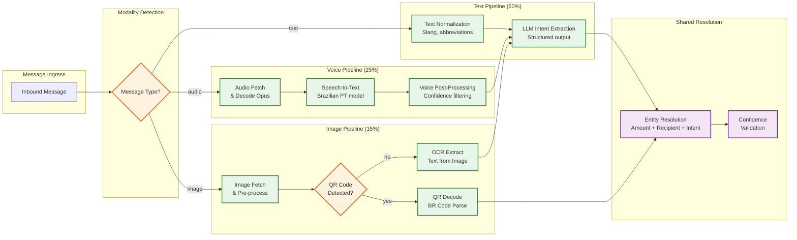
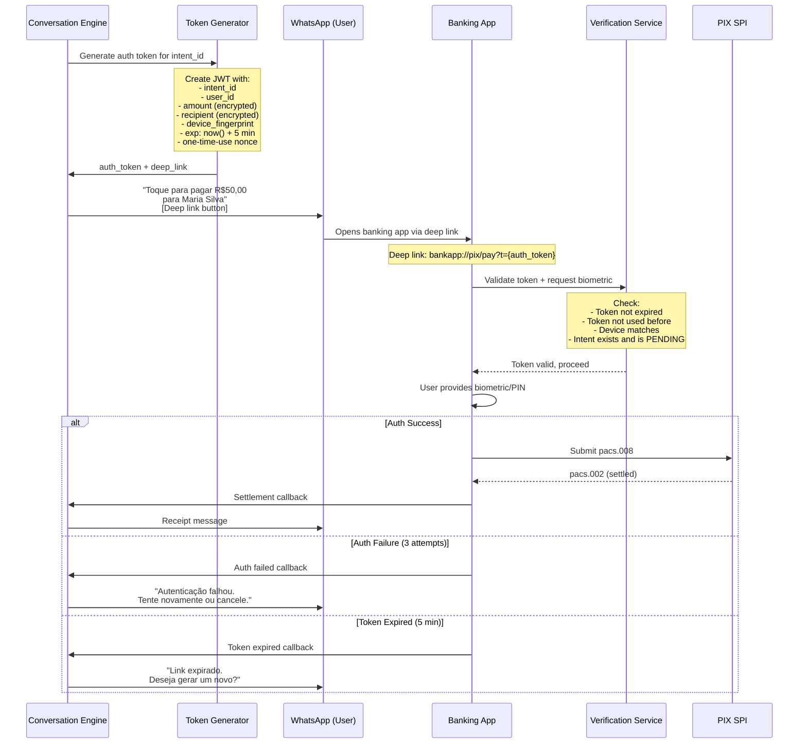

# Deep Dives & Bottlenecks — AI-Native WhatsApp+PIX Commerce Assistant

## Critical Component 1: Multimodal Intent Extraction Pipeline

### Why This Is Critical

The intent extraction pipeline is the system's brain—it transforms unstructured human communication (casual text, noisy voice messages, blurry photos) into structured payment commands. Every error in extraction propagates to the financial layer: a misheard "cinquenta" (50) vs. "quinhentos" (500) is a 10x amount error on an irrevocable PIX transaction. The pipeline must achieve >95% first-attempt accuracy on text messages and >90% on voice messages while processing 35M+ messages per day across three modalities, each with distinct failure characteristics.

### How It Works Internally

**Architecture: Parallel modality-specific pipelines converging to a shared entity resolution stage.**



**Text Pipeline Details:**
1. **Normalization**: Expand abbreviations ("vc" → "você", "msg" → "mensagem"), handle common misspellings, normalize number formats ("50 reais", "R$50", "cinquenta", "50 conto")
2. **LLM Extraction**: Structured output extraction using the LLM with a constrained schema (intent type, amount, recipient, pix_key, memo). The system prompt includes few-shot examples of Brazilian Portuguese payment requests
3. **Confidence scoring**: LLM returns confidence for each extracted field; composite confidence computed as min(amount_conf, recipient_conf) since both must be correct

**Voice Pipeline Details:**
1. **Audio retrieval**: Fetch audio from WhatsApp Media API (OAuth-authenticated); typical voice message is 5-15 seconds, Opus codec at ~32kbps
2. **Transcription**: Whisper-class model fine-tuned on Brazilian Portuguese with emphasis on financial vocabulary ("pix", "boleto", "conto", "centavo"), informal speech, and background noise resilience
3. **Post-processing**: Filter low-confidence segments, apply voice-specific corrections (homophone disambiguation: "cem" [100] vs. "sem" [without], "mil" [1000] vs. "mim" [me])
4. **Compound confidence**: Final confidence = STT confidence × LLM extraction confidence; this reflects the pipeline's serial dependency

**Image Pipeline Details:**
1. **Pre-processing**: EXIF orientation correction (critical for mobile photos), contrast enhancement, optional super-resolution for low-quality images
2. **QR detection**: Multi-scale finder pattern detection across 4 scales to handle QR codes at varying distances; perspective correction for tilted photos
3. **BR Code parsing**: TLV-encoded payload extraction per BCB specification; CRC-16/CCITT validation; dynamic QR charge fetch from hosted URL
4. **OCR fallback**: When no QR code is detected, run OCR for PIX key extraction from screenshots, invoices, price lists

### Failure Modes

| Failure | Impact | Probability | Mitigation |
|---|---|---|---|
| **LLM hallucination** (invents amount/recipient) | Wrong payment details presented to user | Low (2-3%) | Structured output schema constrains LLM; extracted entities validated against known patterns; user confirmation required |
| **STT misrecognition** ("cinquenta" → "quinhentos") | 10x amount error | Medium (5-8% for voice) | Compound confidence scoring flags low-confidence amount extractions; always require explicit confirmation for voice-initiated payments |
| **QR code unreadable** (blur, occlusion) | No payment extracted | Medium (8-12%) | Multi-scale detection with 4 attempts; graceful degradation message asking user to re-photograph or scan directly |
| **LLM service unavailable** | No text processing | Low (0.1%) | Fallback to regex-based extraction for simple patterns ("R$[number] para [name]"); queue complex messages for retry |
| **STT service unavailable** | No voice processing | Low (0.1%) | Respond with "Voice unavailable, please type your request" message |
| **Ambiguous intent** (multiple valid interpretations) | Incorrect payment or excessive friction | Medium (15-20%) | Confidence threshold triggers clarification dialogue rather than guessing |

### Recovery Strategies

- **LLM hallucination**: Every extraction goes through a validation layer that checks: is the amount within plausible bounds (R$0.01 to R$100,000)? Is the recipient name/PIX key in a valid format? Does the intent type match the conversation context?
- **Voice misrecognition**: Send the user a text summary of what was understood before proceeding: "Entendi: pagar R$500 para João. Correto?" The user sees the interpreted amount and can correct it
- **Pipeline timeout**: If any modality pipeline exceeds its SLA (1.5s text, 4s voice, 3s image), return a partial result with lower confidence and ask the user for confirmation on uncertain fields

---

## Critical Component 2: Webhook Deduplication and Exactly-Once Payment Semantics

### Why This Is Critical

WhatsApp Cloud API delivers webhooks with at-least-once semantics—the same message can be delivered multiple times due to network retries, infrastructure failovers, or delayed acknowledgment. In a conversational commerce system, a duplicated webhook can trigger a duplicate payment: the user's single "Confirm" button tap could result in two R$500 PIX transfers. Since PIX settlements are irrevocable, a duplicate payment cannot be "undone" through a chargeback—it requires manual intervention via MED or a reverse transaction that the recipient may not cooperate with. The deduplication system must guarantee exactly-once processing for payment-triggering messages while maintaining high throughput (1,200+ messages/second at peak).

### How It Works Internally

**Three-Layer Deduplication:**

```
Layer 1: Webhook-Level Dedup (Redis)
├── Key: "dedup:{whatsapp_message_id}"
├── Value: "received" | "processing" | "completed"
├── TTL: 24 hours (matches WhatsApp retry window)
├── Operation: SET NX (atomic set-if-not-exists)
└── Outcome: Immediate 200 return for duplicates

Layer 2: Conversation-Level Lock (Distributed Lock)
├── Key: "conv-lock:{conversation_id}"
├── TTL: 30 seconds
├── Purpose: Prevent concurrent state transitions
│   (e.g., two "Confirm" webhooks for the same payment)
└── Outcome: Second webhook waits or is queued

Layer 3: Payment-Level Idempotency (Database)
├── Key: intent_id + idempotency_token
├── Store: Transaction table with unique constraint
├── Purpose: Prevent duplicate SPI submissions
└── Outcome: Database rejects duplicate insert; return existing result
```

**The Critical Race Condition:**

Consider this sequence:
1. User taps "Confirm" button
2. WhatsApp sends webhook A at T=0
3. Webhook A hits dedup cache: SET NX succeeds, starts processing
4. Network hiccup: WhatsApp doesn't receive our 200 acknowledgment
5. WhatsApp retries: sends webhook B at T=5s (same message ID)
6. Webhook B hits dedup cache: SET NX fails (key exists)
7. Webhook B returns 200 immediately — **dedup success**

But what if the timing is different:
1. Webhook A arrives, SET NX succeeds
2. Webhook A processing begins (fraud check, auth handoff generation)
3. Service crashes mid-processing
4. Redis key exists but processing never completed
5. Webhook B arrives, SET NX fails, returns 200
6. **Payment never executes — message is lost**

**Solution: State-Aware Deduplication**

```
FUNCTION handle_webhook_with_state_dedup(webhook):
    msg_id = webhook.message_id

    // Atomic check-and-set with state
    current_state = redis.GET("dedup:{msg_id}")

    IF current_state == "completed":
        RETURN 200  // Already fully processed

    IF current_state == "processing":
        // Check if processing has stalled (>30s)
        processing_start = redis.GET("dedup-ts:{msg_id}")
        IF now() - processing_start > 30_SECONDS:
            // Stale processing state; allow reprocessing
            redis.SET("dedup:{msg_id}", "processing")
            redis.SET("dedup-ts:{msg_id}", now())
            PROCESS(webhook)
        ELSE:
            RETURN 200  // Still processing, don't duplicate

    IF current_state == null:
        // New message
        result = redis.SET("dedup:{msg_id}", "processing", NX=true, EX=86400)
        IF result == false:
            RETURN 200  // Race condition; another handler won
        redis.SET("dedup-ts:{msg_id}", now(), EX=86400)
        PROCESS(webhook)

    RETURN 200

FUNCTION PROCESS(webhook):
    TRY:
        // ... actual processing ...
        redis.SET("dedup:{msg_id}", "completed")
    CATCH error:
        redis.DEL("dedup:{msg_id}")  // Allow retry
        LOG_ERROR(error)
        THROW error
```

### Failure Modes

| Scenario | Risk | Mitigation |
|---|---|---|
| Redis dedup cache failure | Duplicates pass through to payment layer | Layer 3 (database unique constraint) catches duplicates at the payment level |
| Redis key expires before retry | Duplicate processing starts | 24-hour TTL exceeds WhatsApp's max retry window; unlikely but caught by Layer 3 |
| Distributed lock contention | Legitimate messages delayed | Lock TTL of 30s with automatic release; lock acquisition has 5s timeout before falling back to queued processing |
| Service crash during processing | Message stuck in "processing" state | Stale-state detection reprocesses after 30 seconds |

---

## Critical Component 3: Secure Authentication Handoff

### Why This Is Critical

PCI DSS 4.0 explicitly prohibits transmitting payment credentials through end-user messaging technologies. This means the WhatsApp conversation channel **cannot** handle user authentication—the user must be redirected to a secure banking context (native app or secure WebView) for biometric/PIN verification before the PIX transaction executes. The handoff must be seamless enough that the user completes it without abandoning the flow (drop-off rates above 20% defeat the purpose of conversational commerce) while being secure enough that a fraudster who intercepts the handoff link cannot execute the payment without the user's biometric/PIN.

### How It Works Internally

**The Handoff Flow:**



**Token Security Properties:**

| Property | Implementation | Purpose |
|---|---|---|
| **Short-lived** | 5-minute expiration | Limits the window for token interception |
| **One-time use** | Nonce stored in Redis; invalidated after first use | Prevents replay attacks |
| **Device-bound** | Device fingerprint embedded in token; verified at the banking app | Prevents token use from a different device |
| **Encrypted payload** | Amount and recipient encrypted within the JWT; only the banking app's key can decrypt | Prevents amount tampering even if token is intercepted |
| **Non-guessable** | 256-bit random nonce + cryptographic signature | Cannot be brute-forced |

### Failure Modes

| Failure | Impact | Mitigation |
|---|---|---|
| User doesn't have banking app installed | Cannot authenticate; payment blocked | Detect during handoff; offer WebView fallback or guide to app installation |
| Deep link routing fails (wrong app version) | User sees an error in the banking app | Version-aware deep links with fallback to universal link |
| Token expires before user acts | User must restart the payment flow | Send reminder message after 3 minutes; auto-expire at 5 minutes with option to regenerate |
| User's biometric fails (wet fingers, face mask) | Auth blocked | Fall back to PIN authentication after 2 biometric failures |
| Banking app crashes during auth | Orphaned payment intent | Intent has 5-minute TTL; auto-expires and user is notified |

---

## Concurrency & Race Conditions

### Race Condition 1: Duplicate Confirmation

**Scenario:** User taps "Confirm" button twice rapidly. WhatsApp sends two webhook events with different IDs (button responses, not message retries).

**Problem:** Both webhooks pass message-level dedup (different message IDs) and both attempt to transition the conversation from CONFIRMATION → FRAUD_CHECK, potentially creating two payment intents.

**Solution:** Conversation-level distributed lock ensures only one state transition per conversation at a time.

```
FUNCTION handle_confirmation(conversation_id, message):
    lock = acquire_lock("conv-lock:{conversation_id}", ttl=30s)
    IF lock == null:
        // Another confirmation is being processed
        RETURN  // Silently ignore; user will get one receipt

    TRY:
        state = load_state(conversation_id)
        IF state != "CONFIRMATION":
            RETURN  // Already moved past confirmation (first click won)

        transition_state(conversation_id, "CONFIRMATION", "FRAUD_CHECK")
        create_payment_intent(conversation_id, state.entities)
    FINALLY:
        release_lock(lock)
```

### Race Condition 2: Concurrent Payment and Amendment

**Scenario:** User sends "Confirm" at T=0, then immediately sends "actually make it R$75" at T=0.5s. The confirmation webhook arrives at the payment service while the amendment webhook arrives at the conversation engine.

**Problem:** The payment could execute with R$50 while the conversation state shows R$75, creating an inconsistent experience.

**Solution:** State versioning with optimistic concurrency control. Each state transition includes a version number; the amendment can only succeed if the conversation hasn't already moved to FRAUD_CHECK.

### Race Condition 3: Settlement Callback vs. Timeout

**Scenario:** Payment is submitted to SPI. A 30-second timeout fires and transitions the conversation to FAILED. Then at T=35s, the SPI settlement callback arrives with success.

**Problem:** User is told the payment failed, but the payment actually succeeded.

**Solution:** Two-phase settlement tracking:
1. The timeout transitions conversation to UNCERTAIN (not FAILED)
2. The settlement callback is always processed regardless of conversation state
3. If settlement succeeds after timeout, send a corrective message: "Pagamento processado com sucesso! (com atraso)"
4. UNCERTAIN → SETTLED transition is always valid

---

## Bottleneck Analysis

### Bottleneck 1: LLM Inference Latency

**Problem:** LLM-based intent extraction at 500ms-1.5s per message, processing 21M text messages per day, requires ~100-300 GPU-hours per day. At peak (1,200 text messages/second), the system needs to maintain concurrent inference capacity for ~1,800 requests in flight.

**Impact:** If LLM inference becomes the bottleneck, messages queue up, response times degrade beyond the 1.5s SLA, and users experience the conversational assistant as "slow"—destroying the chat-like UX.

**Mitigation Strategies:**
1. **Tiered extraction**: Simple patterns ("R$50 para Maria") handled by a lightweight regex+heuristic engine (10ms); only ambiguous or complex messages escalated to the full LLM
2. **Model distillation**: Train a smaller, task-specific model (1-3B parameters) for payment intent extraction, reserving the large LLM (7-13B) for complex disambiguation
3. **Batched inference**: Group messages arriving within a 50ms window into a single batch for GPU efficiency; trade 50ms latency for 3-5x throughput
4. **Speculative execution**: While the LLM runs, optimistically resolve recipient and check fraud signals in parallel; if the LLM extraction matches the heuristic pre-guess, the downstream work is already done

### Bottleneck 2: WhatsApp Cloud API Rate Limits

**Problem:** WhatsApp Business API imposes rate limits on outbound messages: 80 messages/second at standard tier, up to 1,000/second at the highest tier. During salary-day peaks (3-5x normal volume), the outbound message queue can back up if the rate limit is reached.

**Impact:** Delayed receipt delivery, delayed confirmation messages, and degraded conversational experience. Users see "sent" status on their confirmation but receive no response for seconds or minutes.

**Mitigation Strategies:**
1. **Priority queuing**: Payment confirmations and receipts get highest priority; informational messages (balance updates, marketing) are throttled first
2. **Message batching**: Combine multiple message components (confirmation + deep link) into a single interactive message rather than separate messages
3. **Tier management**: Proactively monitor message volume and request tier upgrades from Meta before anticipated spikes (salary days, Black Friday)
4. **Graceful degradation**: When rate-limited, switch from rich interactive messages to simpler text messages (lower template costs, faster sending)

### Bottleneck 3: Voice Message Processing Throughput

**Problem:** 8.75M voice messages per day, averaging 6 seconds each, equals ~1,460 hours of audio per day requiring STT processing. At peak (2,625 voice messages/minute), the STT cluster must handle ~44 concurrent transcriptions per second.

**Impact:** Voice messages are the most latency-sensitive modality—users who send a voice message expect a fast response (they perceive speaking as faster than typing). If STT processing backs up, voice-initiated payments have multi-second delays that feel broken.

**Mitigation Strategies:**
1. **Streaming transcription**: Begin transcription as the audio downloads, producing partial results that the LLM can start processing before the full transcription completes
2. **Audio pre-filtering**: Detect silence, music, or non-speech audio before sending to STT; reject non-speech audio with a "I couldn't understand the audio" message
3. **Model selection by audio length**: Short messages (<5s) use a fast, lightweight model; longer messages use the full-accuracy model
4. **Geographic-aware scaling**: Pre-scale STT capacity for Brazilian time zones; peak voice messaging is 18:00-21:00 BRT

### Bottleneck Summary

| Bottleneck | Severity | Resolution Cost | Priority |
|---|---|---|---|
| LLM inference throughput | High | GPU scaling + model distillation | P0 |
| WhatsApp API rate limits | Medium | Priority queuing + tier management | P1 |
| Voice processing throughput | Medium | Streaming STT + pre-filtering | P1 |
| DICT lookup latency at scale | Low | Local cache with background sync | P2 |
| Image processing (QR + OCR) | Low | Dedicated GPU pool with auto-scaling | P2 |
