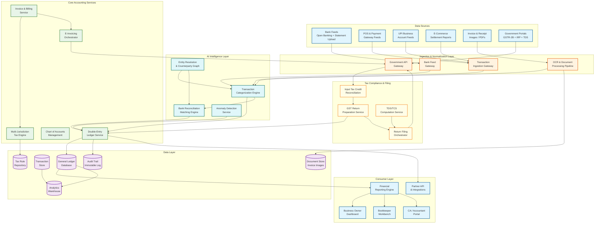
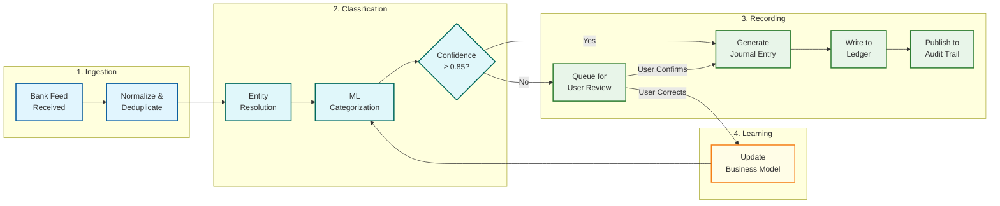
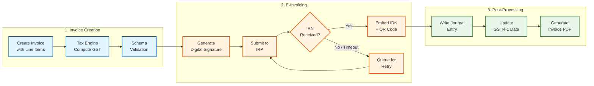
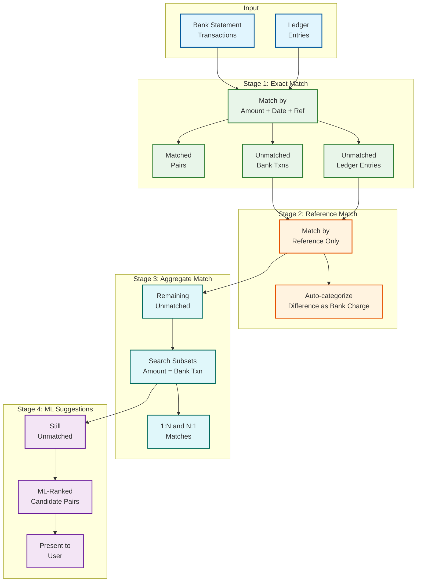

# 14.3 AI-Native MSME Accounting & Tax Compliance Platform — High-Level Design

## System Architecture

---

## Component Descriptions

### 1. Bank Feed Gateway

The bank feed gateway manages real-time and batch ingestion of bank transactions from multiple sources. For banks supporting open banking APIs, it maintains persistent webhook connections that receive transaction notifications within minutes of posting. For banks without API support, it provides statement upload handling for CSV, MT940, OFX, and PDF formats. The gateway normalizes all incoming data into a canonical transaction format (amount, date, narration, reference, balance, currency) regardless of source format, assigns globally unique transaction IDs, and publishes normalized transactions to the categorization engine via an event stream. It maintains connection health monitoring per bank, handles authentication token refresh cycles, and implements deduplication logic to prevent the same transaction from being ingested twice when multiple channels overlap (e.g., a bank API feed and a manually uploaded statement both containing the same transactions).

### 2. Transaction Categorization Engine

The categorization engine is the platform's primary ML service, responsible for classifying every incoming transaction into the correct chart of accounts entry. It operates a hierarchical classification pipeline: first, the industry classifier determines the business vertical (retail, manufacturing, services, etc.) which selects the appropriate account taxonomy; second, the account group classifier maps the transaction to a top-level category (revenue, cost of goods sold, operating expense, asset purchase, liability payment); third, the specific account classifier maps to the exact account (e.g., "Rent Expense - Office" vs. "Rent Expense - Warehouse"). The engine maintains a global model (trained on millions of labeled transactions across all businesses) and a per-business adaptation layer (updated via user corrections through online learning). It uses features from the transaction narration (tokenized text), amount patterns (recurring amounts suggest subscriptions or salaries), counterparty identity (resolved via the entity resolution service), temporal patterns (day-of-month, frequency), and business-specific context (industry, size, previous categorizations). Low-confidence categorizations (below a configurable threshold, typically 0.85) are flagged for user review rather than auto-committed.

### 3. Double-Entry Ledger Service

The ledger service is the system's source of truth for all financial data. It accepts journal entry requests from all upstream services (categorization engine, invoice service, reconciliation engine, tax computation, manual entries) and atomically writes them as balanced debit-credit pairs. The service enforces three invariants at the database level: (1) every journal entry must have total debits equal to total credits (the accounting equation), (2) every journal entry must reference valid accounts in the chart of accounts, and (3) journal entries must be written in causal order per business entity (no backdating beyond the locked period). The ledger service exposes both real-time query APIs (current balance of any account, recent transactions for any account) and point-in-time query capabilities (balance of any account as of a specific historical date, enabling comparative reporting and audit queries). It publishes every journal entry to the audit trail service for immutable logging and to the analytics warehouse for reporting.

### 4. Bank Reconciliation Matching Engine

The reconciliation engine matches bank statement transactions to ledger entries using a multi-stage matching pipeline. Stage 1 (exact match): transactions with identical amount, date (within settlement window), and reference number are matched with high confidence. Stage 2 (reference-guided match): transactions sharing a reference number but with amount differences (e.g., bank charges deducted) are matched with the difference auto-categorized as a bank charge. Stage 3 (aggregate match): the engine searches for subsets of ledger entries whose total matches a bank statement amount within a tolerance window, resolving 1:N and N:1 patterns. Stage 4 (ML-ranked suggestions): remaining unmatched items are presented to the user with ML-ranked candidate matches based on historical reconciliation patterns for that business. The engine learns from user confirmations and rejections, updating the matching model's feature weights for that business. It also auto-detects and categorizes bank charges, interest income, and other bank-generated transactions that have no corresponding ledger entry.

### 5. Multi-Jurisdiction Tax Computation Engine

The tax engine evaluates tax obligations per transaction line item by traversing a jurisdiction rule graph. For GST (India), it determines the applicable rate by looking up the HSN/SAC code, identifying the supply type (B2B, B2C, export, SEZ, inter-state, intra-state), applying any applicable exemptions or reduced rates, computing CGST/SGST or IGST components, and handling special schemes (composition, reverse charge, e-commerce TCS). For VAT (EU), it applies similar logic with EU-specific rules (standard/reduced/zero rates per member state, reverse charge for B2B cross-border, intra-community supply treatment). For US sales tax, it integrates with jurisdiction databases covering 13,000+ taxing districts, applies product taxability rules, and handles economic nexus threshold tracking. All rules are externalized in a versioned rule repository with effective-date semantics, allowing tax consultants to update rules through a configuration interface without requiring code deployments. The engine supports backdated rate changes (recompute tax for transactions in affected periods) and prospective rate changes (new rates take effect from a future date).

### 6. E-Invoicing Orchestrator

The e-invoicing orchestrator manages the lifecycle of e-invoices as mandated by India's GST e-invoicing regime (and analogous mandates in other jurisdictions). When an invoice is created, the orchestrator validates it against the GST INV-01 schema (50 mandatory fields including GSTIN, HSN codes, tax amounts, and item-level details), generates a digital signature, submits the payload to the Invoice Registration Portal (IRP) via their API, receives the IRN (Invoice Reference Number) and signed QR code, and embeds these back into the invoice record. The orchestrator handles IRP failures gracefully: if the primary IRP endpoint is unavailable, it fails over to secondary endpoints; if all endpoints are down, it queues the invoice and retries with exponential backoff, marking the invoice as "pending e-invoice" to prevent dispatch to the buyer before IRN generation. It also manages e-invoice cancellation (allowed within 24 hours of IRN generation) and amendment workflows.

### 7. GST Return Preparation and Filing Service

The return filing service continuously pre-computes GST return data as transactions are recorded throughout the month, rather than assembling returns as a batch job at month-end. For GSTR-1 (outward supplies), it aggregates all sales invoices by category (B2B large, B2B small, B2C, exports, nil-rated, exempted) and validates against the government schema. For GSTR-3B (summary return), it computes tax liability, input tax credit available, and net tax payable. The ITC reconciliation sub-service fetches the government-published GSTR-2B data (inward supply details as reported by suppliers) and matches it against the business's purchase ledger, flagging mismatches (supplier reported different amount, supplier hasn't filed, duplicate invoices in GSTR-2B). The filing orchestrator manages the actual submission to the government portal with deadline-aware prioritization, retry logic for portal congestion, and acknowledgment tracking.

### 8. OCR and Document Processing Pipeline

The document pipeline extracts structured data from unstructured documents (invoices, receipts, purchase orders, bank statements in PDF format). It uses a multi-stage extraction approach: (1) image preprocessing (deskewing, noise removal, contrast enhancement), (2) text detection using a layout-aware model that identifies text regions and their spatial relationships (table cells, header-value pairs, line items), (3) OCR using a character recognition model optimized for financial documents (handles ₹ symbol, decimal alignment, and common accounting abbreviations), (4) entity extraction that identifies key fields (vendor name, invoice number, date, line items, amounts, tax breakdowns, total), and (5) validation that cross-checks extracted totals against line item sums and verifies tax computation. The pipeline is trained on 15+ common invoice layouts and uses few-shot learning to adapt to new formats: after processing 5-10 invoices from a new vendor, it learns the vendor-specific layout.

### 9. Financial Reporting Engine

The reporting engine generates financial statements and management reports by querying the ledger service. It supports the full reporting pipeline: trial balance → adjusting entries (accruals, depreciation, provisions) → adjusted trial balance → financial statements (balance sheet, P&L, cash flow statement). Reports conform to the selected accounting standard (Ind AS, IFRS, local GAAP) with appropriate disclosure formatting. The engine supports comparative period analysis (current vs. previous year, actual vs. budget), ratio computation (liquidity, solvency, profitability, efficiency ratios), and drill-down from any reported figure to the underlying journal entries and source transactions. Reports are generated on-demand with caching for frequently accessed periods.

### 10. Audit Trail Service

The audit trail service maintains an immutable, append-only record of every financial event in the system. Every journal entry creation, modification, reversal, and deletion (soft delete with reason code) is logged with the user who performed the action, the timestamp, the before/after state, and the preceding entry's hash. The hash chain forms a Merkle tree structure that allows auditors to verify that no historical entries have been tampered with by recomputing hashes and comparing against stored root hashes. The service supports regulatory audit queries (trace a balance sheet line item through journal entries to source transactions), user access auditing (who accessed what financial data when), and compliance reporting (generate audit trail extracts in regulator-specified formats).

---

## Data Flow: Key Operations

### Transaction Ingestion and Categorization Flow

### E-Invoice Generation Flow

### Bank Reconciliation Flow

---

## Key Design Decisions

| Decision | Choice | Alternatives Considered | Trade-off |
|---|---|---|---|
| **Ledger storage model** | Append-only journal entries with materialized balances | Mutable balance updates (simpler writes, no history); pure event sourcing without materialized views (slower reads) | Append-only preserves full audit trail and enables point-in-time queries; materialized balances avoid computing running totals on every read; cost is storage overhead for both journal entries and balance snapshots |
| **Transaction categorization architecture** | Global model + per-business fine-tuning layer | Single global model (simpler, but can't learn business-specific patterns); fully independent per-business models (accurate, but no cold start) | Global model provides 95% accuracy on day one; per-business fine-tuning lifts to 99% within 3 months; cost is maintaining a two-layer model with careful isolation to prevent per-business corrections from corrupting the global model |
| **Tax rule storage** | Externalized rule repository with DAG evaluation | Hardcoded in application code (fast, but requires deployment for every rate change); database-stored simple key-value rates (easy to update, but can't express complex conditional logic) | DAG evaluation handles complex conditional rules (cascading exemptions, rate overrides by supply type) with runtime updates; cost is rule-authoring complexity and testing burden |
| **Reconciliation matching strategy** | Cascading multi-stage pipeline (exact → reference → aggregate → ML) | Single-pass ML matching (conceptually simpler); human-in-the-loop for all matching (accurate, but doesn't scale) | Cascading stages resolve 85-90% of matches with high confidence in fast stages, reserving expensive ML and human review for the remaining 10-15%; cost is pipeline complexity and tuning of stage transition thresholds |
| **E-invoicing integration** | Synchronous inline with async fallback | Fully asynchronous (simpler, but invoice isn't valid until IRN received); batch submission (efficient, but delays invoice availability) | Synchronous gives immediate IRN for most invoices (<3s); async fallback handles IRP outages without blocking invoice creation; cost is complexity of managing two code paths and eventual consistency for failed synchronous attempts |
| **Filing orchestration** | Pre-computed returns with deadline-aware submission queue | On-demand return generation at filing time (simpler, but creates month-end bottleneck); fully automated filing without human review (faster, but risky if data has errors) | Pre-computation distributes processing load throughout the month; deadline-aware queue ensures filings complete before cutoff; human review step before submission prevents filing errors; cost is maintaining continuously updated return state and handling amendment flows when transactions are modified after pre-computation |
| **Audit trail implementation** | Cryptographically chained append-only log (Merkle tree) | Application-level logging (simpler, but logs can be tampered); database triggers (captures mutations, but doesn't prove non-tampering) | Merkle tree enables auditors to independently verify data integrity by recomputing hashes; append-only design prevents deletion of audit records; cost is hash computation overhead (minimal) and storage for hash chains |
| **Multi-entity architecture** | Shared infrastructure with logical tenant isolation | Separate database per business (strongest isolation, but expensive and hard to operate); single shared database with row-level security (efficient, but risk of cross-tenant data leakage) | Logical isolation (schema-per-tenant or discriminator column with row-level security) balances operational efficiency with data isolation; consolidated reporting across entities requires cross-tenant queries with explicit authorization; cost is complexity of enforcing tenant boundaries in every query path |
