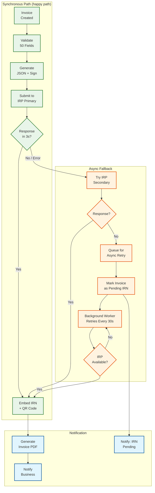
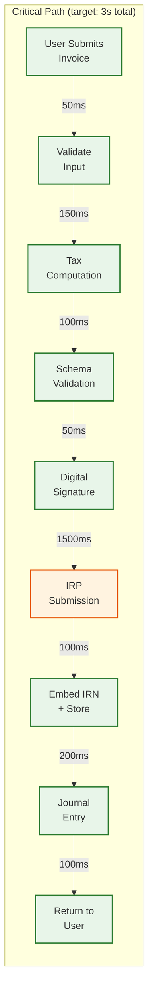

# 14.3 AI-Native MSME Accounting & Tax Compliance Platform — Deep Dives & Bottlenecks

## Deep Dive 1: ML-Powered Transaction Categorization at Scale

### The Classification Challenge

Transaction categorization is the foundational AI capability of the platform. Every incoming bank transaction must be mapped to the correct chart of accounts entry, and this categorization directly determines the accuracy of financial statements, tax computations, and compliance filings. A miscategorized transaction doesn't just show up as a wrong number in one report—it cascades: if a ₹1,00,000 supplier payment is categorized as "Revenue" instead of "Cost of Goods Sold," the P&L overstates revenue by ₹1,00,000 and understates COGS by ₹1,00,000, the balance sheet shows ₹2,00,000 more profit than actual, the GST computation may add an incorrect output tax liability, and the income tax liability increases. A single miscategorization can trigger audit queries, incorrect tax payments, and regulatory penalties.

### Feature Engineering for Bank Narrations

Bank narrations are the most information-dense but least standardized data source. The same logical transaction—a payment to a telecom provider—appears differently across banks:

| Bank | Narration | Challenge |
|---|---|---|
| Bank A | `NEFT/N012345678/AIRTEL BROADBAND/JAN FEE` | Structured, counterparty clear |
| Bank B | `BIL/BPAY/000123/AIRTEL` | Abbreviated, needs code lookup |
| Bank C | `UPI/airtel@okaxis/RECHARGE` | UPI format, purpose ambiguous (recharge vs. broadband) |
| Bank D | `IMPS/234567/BHARTI AIRTEL LTD` | Full legal name, different from trading name |
| Bank E | `TRF TO A/C XXXXX4567` | No counterparty information at all |

**Feature extraction pipeline:**

1. **Bank-specific tokenization:** Each of the top 50 banks has a custom tokenizer that understands the bank's narration format (prefix codes, field separators, reference number positions). The tokenizer extracts structured fields (payment mode, reference number, counterparty name fragment) from the raw narration.

2. **Counterparty resolution:** The extracted counterparty name fragment is matched against the business's counterparty registry using fuzzy matching (edit distance, phonetic matching for Hindi/regional language names transliterated to English). If no match exists, the platform queries a global counterparty database (cross-business entity resolution) to identify whether "BHARTI AIRTEL LTD" and "AIRTEL BROADBAND" are the same entity.

3. **Numerical features:** Amount-based features include: absolute amount, is_round_number (amounts like ₹10,000 suggest different categories than ₹9,847), amount_relative_to_business_size (a ₹5L transaction for a ₹10L/month business is significant; for a ₹5Cr/month business it's routine), and recurring_amount_flag (same amount appearing on same day-of-month for 3+ months suggests subscription or salary).

4. **Temporal features:** Day-of-month (salary payments cluster around 1st-5th), day-of-week (business purchases cluster on weekdays), proximity to quarter-end (advance tax payments due on 15th of Mar/Jun/Sep/Dec), and filing period context (GST payment due around 20th of each month).

5. **Business context features:** The business's industry (retail, manufacturing, services), size tier, and recent categorization distribution. A manufacturing business is more likely to have raw material purchases than a service business. If 40% of a business's expenses last month were "Raw Materials," a new uncategorized purchase payment is more likely to be raw materials than office supplies.

### The Cold Start Problem and Active Learning

A new business joining the platform has zero categorization history. The ML model must provide useful categorizations from day one using only the global model and the business's declared industry. The cold start strategy:

1. **Day 1-7 (cold start):** Global model provides categorizations with 85-90% accuracy. The confidence threshold for auto-categorization is raised to 0.92 (stricter), so more transactions are routed to user review. Each user review generates a labeled training sample.

2. **Day 8-30 (warming):** The per-business adaptation layer has accumulated 50-200 labeled samples. It begins adjusting the global model's output using a Bayesian update: `P(category | transaction, business) ∝ P(category | transaction, global) × P(category | business_prior)`. The business prior captures patterns like "this business frequently categorizes 'UPI CR' transactions as sales revenue, not personal income." Accuracy climbs to 93-95%.

3. **Day 31-90 (tuned):** With 200-1000 labeled samples, the per-business model is well-calibrated. Recurring counterparties and amounts are reliably categorized. The confidence threshold can be lowered to 0.85, reducing the user review burden. Accuracy reaches 97-99%.

4. **Ongoing (maintenance):** The system monitors categorization accuracy using implicit feedback (user changes a categorization = negative feedback) and explicit review campaigns (periodic random sampling to detect silent misclassifications). The per-business model is re-calibrated monthly.

**Preventing catastrophic forgetting:** When user corrections update the per-business model, the corrections must not be propagated back to the global model without validation. A single business incorrectly categorizing all their "office supplies" as "marketing expense" should not shift the global model's understanding of office supplies. The architecture uses a strict separation: user corrections update only the business-specific prior, and only corrections that are consistent across 100+ businesses are candidates for global model retraining.

### Bottleneck: Categorization Latency During Bulk Import

When a new business onboards and uploads 12 months of bank statements (typically 2,000-6,000 transactions), all transactions must be categorized in a batch. The ML model processes transactions at ~50ms each sequentially, meaning 6,000 transactions would take 5 minutes. This is too slow for the onboarding experience.

**Mitigation:**
- **Batch inference with GPU acceleration:** The categorization model is deployed on GPU instances for batch processing. Batch inference processes 256 transactions simultaneously, reducing per-transaction latency to ~2ms and total time for 6,000 transactions to ~50 seconds.
- **Progressive rendering:** The UI shows transactions as they are categorized, rather than waiting for the full batch. The first 100 transactions (most recent) are categorized with highest priority, followed by the rest in chronological order.
- **Counterparty deduplication:** If the same counterparty appears in 50 transactions and the first one is categorized, the remaining 49 can be categorized instantly using the historical match shortcut, bypassing the full ML pipeline.

---

## Deep Dive 2: Bank Reconciliation at Scale

### The N-to-M Matching Problem

Bank reconciliation is computationally one of the hardest problems in the platform because the matching is inherently combinatorial. Consider a realistic scenario for a medium MSME:

- 500 bank transactions in January
- 400 ledger entries (invoices, payments, expenses) in January
- 350 of these should match, leaving 150 bank transactions (bank charges, unrecorded transactions) and 50 ledger entries (unpaid invoices, accruals) unmatched

The naive approach of checking every possible matching is O(2^n × 2^m) which is computationally infeasible. Even the subset-sum approach for aggregate matching has exponential worst-case complexity.

### Real-World Matching Patterns

Analysis of production reconciliation data reveals the following distribution of match types:

| Match Type | Frequency | Typical Scenario | Difficulty |
|---|---|---|---|
| **Exact 1:1** | 45-55% | Single invoice, single payment, same amount | Trivial |
| **Reference-guided 1:1** | 10-15% | Same reference number but amount differs by bank charges or TDS deduction | Easy |
| **Aggregate 1:N** | 8-12% | Customer pays multiple invoices with a single transfer | Medium |
| **Aggregate N:1** | 5-8% | Installment payments against a single invoice | Medium |
| **Aggregate N:M** | 2-4% | Complex batch payments covering multiple invoices with partial payments | Hard |
| **Bank-only** | 8-12% | Bank charges, interest, auto-debit (EMI, insurance), tax debits | Auto-categorize |
| **Timing difference** | 5-8% | Cheque issued but not yet cleared; payment made but not yet reflected | Date-range search |
| **Residual unmatched** | 3-5% | Requires manual investigation | Human review |

### The Subset-Sum Optimization

The most computationally expensive stage is aggregate matching, where the system must find subsets of ledger entries whose total matches a bank transaction amount. This is a variant of the subset-sum problem (NP-hard in general) but with important domain-specific optimizations:

1. **Amount ordering:** Sort ledger entries by amount descending. Start with the largest entries and work down. This creates a natural pruning: if the largest remaining entry exceeds the remaining target, skip it. In practice, financial amounts have a heavy-tailed distribution (a few large invoices and many small ones), so the search tree is pruned aggressively.

2. **Date windowing:** Only consider ledger entries within a configurable settlement window (typically 5-7 business days). This reduces the candidate set from 400 to typically 30-50 entries per bank transaction.

3. **Counterparty filtering:** If the bank transaction has a resolved counterparty, only consider ledger entries for that counterparty. This further reduces candidates to 5-15 entries.

4. **Maximum subset size:** In practice, a single bank payment rarely covers more than 10 invoices. Limiting the search to subsets of size ≤10 converts the exponential search into a bounded one: C(15,10) = 3,003 is manageable.

5. **Amount tolerance:** Financial amounts are rarely perfectly additive due to rounding, currency conversion, and partial adjustments. The tolerance window (typically ₹10 or 0.01% of amount, whichever is larger) adds a small constant factor but doesn't change the complexity class.

With these optimizations, the practical complexity for a typical MSME reconciliation (500 bank transactions, 400 ledger entries) is:
- Stage 1 (exact match): O(n × m) = 200,000 comparisons → ~10ms
- Stage 2 (reference match): O(n × m) on remaining → ~5ms
- Stage 3 (aggregate match): ~50 bank txns × C(15,10) per txn = ~150,000 subsets → ~100ms
- Stage 4 (ML ranking): ~50 pairs × feature computation → ~200ms
- **Total: <500ms** for a full monthly reconciliation

### Bottleneck: Reconciliation During Month-End Batch Processing

At month-end, 500K+ businesses trigger reconciliation simultaneously (many CAs reconcile all their clients' accounts in the first week of the month). This creates a compute spike:

```
500,000 reconciliations × 0.5 seconds each = 250,000 core-seconds
If completed within 4 hours: 250,000 / 14,400 = ~18 cores continuously
Peak hour (10 AM - 12 PM, first 3 business days): 80% of reconciliations in 6 hours
400,000 × 0.5 / 21,600 = ~10 cores (manageable)
```

The compute requirement is modest, but the memory and I/O requirements are significant: each reconciliation loads 500+ bank transactions and 400+ ledger entries from the database. At 500K concurrent reconciliations, this is 500K × 900 records × 1 KB = 450 GB of data loaded from the database, creating I/O pressure.

**Mitigation:**
- **Pre-fetch and cache:** During the last week of the month, pre-fetch bank transactions and ledger entries for businesses that typically reconcile in the first week. Cache in a read-through distributed cache.
- **Incremental reconciliation:** Instead of re-running full reconciliation from scratch, maintain a running reconciliation state. When new transactions arrive, only attempt to match the new transactions against the unmatched set. Full reconciliation is only needed for the first run of the month.
- **Priority queuing:** CA-initiated reconciliations (bulk, deadline-driven) are queued and processed in batch. Business-owner-initiated reconciliations (interactive, expecting real-time results) get priority processing.

### Race Condition: Concurrent Reconciliation and Transaction Ingestion

A subtle race condition occurs when bank feed transactions arrive during an active reconciliation run. The reconciliation engine loads a snapshot of bank transactions and ledger entries, spends 500ms computing matches, and then writes the results. If a new bank transaction arrives during those 500ms and is categorized and posted as a ledger entry, the reconciliation result is already stale.

**Resolution:** The reconciliation engine uses optimistic concurrency control. It loads a snapshot version, computes matches, and writes results with a version check. If the underlying data has changed (new transactions arrived), the write fails and the reconciliation is re-run with the updated data. In practice, this re-run rarely happens because the 500ms window is short, but the system must handle it correctly to prevent stale reconciliation states.

---

## Deep Dive 3: E-Invoicing Pipeline and IRP Integration

### The Synchronous Requirement

India's e-invoicing mandate requires that every B2B invoice above the threshold (₹5 Cr turnover) must have a valid IRN (Invoice Reference Number) from the IRP before it can be shared with the buyer. The IRN is a 64-character hash that uniquely identifies the invoice, and the signed QR code (containing the IRN) must be printed on the invoice. An invoice without a valid IRN is not legally valid for GST purposes.

This creates a synchronous dependency: the invoice creation flow must complete the IRP round-trip before the invoice PDF can be generated and dispatched. The production flow:

1. Business creates invoice (line items, amounts, buyer details)
2. Tax engine computes GST components
3. **Pre-submission validation** (50 mandatory fields, GSTIN format, HSN codes, amount arithmetic)
4. Generate GST INV-01 JSON payload
5. Generate digital signature
6. Submit to IRP API
7. Receive IRN + signed QR code
8. Embed IRN and QR code into invoice record
9. Generate invoice PDF with QR code
10. Post journal entry to ledger

Steps 3-8 must complete within the user's patience threshold (~3 seconds for interactive use). The IRP typically responds in 1-2 seconds, but can degrade to 5-10 seconds during peak hours (11th of month for GSTR-1 deadline, when many businesses generate pending invoices).

### IRP Failure Modes and Resilience

The IRP is a government-operated system with documented reliability issues during peak periods:

| Failure Mode | Frequency | Impact | Mitigation |
|---|---|---|---|
| **HTTP 503 (Service Unavailable)** | 2-5% of requests during peak | Invoice creation blocked | Retry with exponential backoff; queue for async processing |
| **Timeout (>10s)** | 1-3% during peak | User perceives hang | Circuit breaker after 5s; switch to async mode |
| **Validation error** | 5-8% of first-time submissions | Invoice rejected | Pre-submission validation catches 95% of errors; remaining 5% are IRP-specific rules not documented in public schema |
| **Duplicate IRN** | <0.1% | Race condition: same invoice submitted twice due to retry | Idempotency key based on invoice hash; check existing IRN before retry |
| **IRP version change** | 2-3x per year | Schema changes break integration | Schema version detection; multi-version payload generation; automated regression testing |

**Resilience architecture:**



### Pre-Submission Validation: Catching Errors Before IRP Rejection

The most impactful optimization in the e-invoicing pipeline is comprehensive pre-submission validation. IRP rejections are expensive: they consume an API call (rate-limited), add latency (the error response still takes 1-2 seconds), and create a confusing user experience (invoice appears to be created but fails silently).

The validation engine checks:
- **GSTIN validity:** Format check (15 characters, correct checksum digit) + status check (is the GSTIN active, not cancelled or suspended)
- **HSN/SAC code validity:** Must be 4, 6, or 8 digits; must exist in the HSN master
- **Amount arithmetic:** Line items must sum to subtotal; tax must be correctly computed per rate; subtotal + taxes = total
- **Mandatory fields:** All 50 mandatory fields in INV-01 schema must be populated
- **Business rules:** Intra-state supply must have CGST+SGST (not IGST); inter-state must have IGST; export invoices must have shipping bill number; reverse charge invoices must have flag set
- **Rate consistency:** HSN code's tax rate must match the applied rate (catches cases where the rate was overridden incorrectly)

This validation catches 95% of potential IRP rejections before submission, reducing the effective rejection rate from 5-8% to 0.3-0.5%.

---

## Deep Dive 4: Multi-Jurisdiction Tax Computation

### The Rule Explosion Problem

A platform serving MSMEs in India alone must handle significant tax complexity. Adding EU VAT and US sales tax creates a combinatorial explosion:

**India GST complexity:**
- 8,000+ HSN/SAC codes × 4 rate tiers (5%, 12%, 18%, 28%) + special rates
- 2 supply types for rate determination: intra-state (CGST+SGST) vs. inter-state (IGST)
- 36 states/UTs × 36 states/UTs = 1,296 jurisdiction pairs (though simplified to same/different state)
- Special schemes: composition (3 variants), reverse charge (14 service categories), e-commerce TCS
- Quarterly rate changes: GST Council meets every 3 months and frequently changes rates for specific HSN codes

**EU VAT complexity:**
- 27 member states × standard rate (17-27%) + reduced rates (2-3 per state) + zero rate
- Place of supply rules vary by goods vs. services, B2B vs. B2C, digital vs. physical
- Reverse charge for B2B cross-border services
- Intra-community supply (goods) vs. intra-community acquisition (reverse of supply)
- OSS (One Stop Shop) for B2C cross-border e-commerce below threshold
- ViDA (VAT in the Digital Age) mandate: real-time digital reporting starting 2028

**US sales tax complexity:**
- 13,000+ taxing jurisdictions (state, county, city, special district)
- Product taxability varies by jurisdiction (software is taxable in Texas but not in California)
- Economic nexus thresholds (vary by state: $100K revenue or 200 transactions in most states)
- Marketplace facilitator laws (marketplace collects tax for third-party sellers)
- Sales tax holidays (periodic, state-specific, product-specific)

### DAG-Based Rule Evaluation

The tax engine represents rules as a directed acyclic graph (DAG) where each node is a condition and edges lead to either more specific conditions or terminal rate nodes:

```
Root
├── Jurisdiction: IN_GST
│   ├── Scheme: COMPOSITION → flat rate lookup
│   ├── Scheme: REGULAR
│   │   ├── Supply: EXPORT → zero-rated path
│   │   ├── Supply: SEZ → zero-rated or IGST path
│   │   ├── Supply: B2B/B2C
│   │   │   ├── Same State → CGST + SGST path
│   │   │   │   ├── HSN: 8471 (computers) → 18% (9% + 9%)
│   │   │   │   ├── HSN: 0201 (meat) → 0% (exempt)
│   │   │   │   ├── HSN: 2402 (tobacco) → 28% + cess
│   │   │   │   └── ... (8,000+ HSN nodes)
│   │   │   └── Different State → IGST path
│   │   │       ├── HSN: 8471 → 18% IGST
│   │   │       └── ...
│   │   └── Reverse Charge Categories
│   │       ├── SAC: 9965 (transport) → RC applicable
│   │       └── ...
├── Jurisdiction: EU_VAT
│   ├── B2B Cross-border → reverse charge
│   ├── B2C Domestic → standard/reduced rate by member state
│   └── ...
└── Jurisdiction: US_SALES_TAX
    ├── Nexus check → no nexus = no tax
    ├── Product taxability → exempt products
    └── Rate lookup → jurisdiction-specific rate
```

The DAG is stored in the tax rule repository and loaded into memory at startup. Rule updates (rate changes, new exemptions) are applied by publishing new rule versions to the repository, which are picked up by the tax engine within minutes via a configuration refresh mechanism. The engine always evaluates the rule version effective as of the transaction's supply date, ensuring backdated transactions use the correct historical rates.

### Bottleneck: Rate Change Propagation and Historical Recomputation

When a GST rate changes (e.g., HSN 8443 "printers" moves from 28% to 18% effective April 1, 2026), the platform must:

1. Update the rule repository with the new rate and effective date
2. Ensure all new invoices from April 1 use the new rate
3. Identify any draft invoices with dates on or after April 1 that used the old rate
4. Recompute tax for affected draft invoices
5. NOT change any posted invoices (which have already been filed with IRP and included in returns)

The complexity is in step 3-4: during the transition period, some businesses may have created draft invoices in advance with the old rate. The system must detect these and notify the business to review and recompute tax. For posted invoices that are still within the return filing period (i.e., the return hasn't been filed yet), the business may choose to issue a credit note and a new invoice at the correct rate.

**Mitigation:**
- **Rate change alerts:** When a new rate effective date is published, the system scans all draft invoices with dates on or after the effective date and raises alerts.
- **Batch recomputation:** A background job recomputes tax for all affected draft invoices and presents the changes for business review.
- **Immutability of posted invoices:** Posted invoices are never modified. If the rate was wrong, the correction path is always through credit notes and new invoices, preserving the audit trail.

---

## Deep Dive 5: Chart of Accounts Normalization and Industry-Specific Auto-Generation

### Why One-Size-Fits-All Fails

A chart of accounts that works for a retail business is wrong for a manufacturing business:

| Account Category | Retail Business | Manufacturing Business | Services Business |
|---|---|---|---|
| **Revenue** | Sales Revenue, Returns & Allowances | Finished Goods Sales, By-product Sales, Scrap Sales | Professional Fees, Retainer Income, Project Revenue |
| **Cost of Goods** | Purchases, Freight Inward, Import Duties | Raw Materials, WIP Opening/Closing, Manufacturing Overheads, Factory Rent | Not applicable (no COGS) |
| **Expenses** | Rent - Shop, Sales Commission, Display Costs | Rent - Factory, Rent - Warehouse, Power & Fuel, Quality Testing | Rent - Office, Professional Development, Software Subscriptions |
| **Assets** | Inventory (single pool), Shop Fittings | Raw Material Inventory, WIP Inventory, Finished Goods Inventory, Plant & Machinery | Computers, Licenses, Work in Progress (unbilled revenue) |

If a manufacturing business uses a retail chart of accounts, their raw material purchases get lumped into a generic "Purchases" account, making it impossible to track material costs separately from trading goods—which is critical for cost accounting and GST input credit tracking (ITC on raw materials vs. capital goods has different timing and eligibility rules).

### Auto-Generation Algorithm

At onboarding, the platform auto-generates a chart of accounts based on:

1. **Industry classification:** The business declares its primary activity (via NIC/ISIC code or a simplified industry selector). This selects the base template.
2. **Business structure:** Proprietorship, partnership, LLP, or private limited determines the equity and statutory accounts (owner's drawings vs. director's remuneration, partner capital accounts vs. share capital).
3. **Tax registration:** GST registration type (regular, composition, unregistered) determines which tax accounts are needed (CGST/SGST/IGST payable/receivable for regular; single tax payable for composition; no tax accounts for unregistered).
4. **Multi-state presence:** Number of GST registrations determines whether state-wise segregation of tax accounts is needed.

The base template provides 60-80 accounts organized in a standard hierarchy. As the business operates, the categorization engine may encounter transactions that don't map cleanly to any existing account. In this case:

- **Common pattern:** The system suggests adding a standard sub-account (e.g., "You've been categorizing some expenses as 'Office Expenses' but they appear to be software subscriptions. Would you like to create a 'Software Subscriptions' sub-account under 'Office Expenses'?")
- **Novel pattern:** If a transaction type is truly new (e.g., cryptocurrency transactions for a traditional retailer), the system creates a temporary "Suspense" account and alerts the business owner or CA to create an appropriate account.

### The Chart Migration Problem

When a business restructures (e.g., proprietorship converts to private limited), the chart of accounts must be migrated. This is not a simple rename—it involves:

1. **Account reclassification:** "Owner's Drawings" (equity account in proprietorship) becomes "Director's Loan Account" (liability) or is eliminated entirely
2. **New statutory accounts:** Private limited requires Share Capital, Reserves & Surplus, Director's Remuneration, ROC Filing Fees, Statutory Audit Fees
3. **Balance transfer:** Closing balances from old accounts must be transferred to new accounts via migration journal entries
4. **Historical reporting:** Reports for periods before the restructuring must still use the old chart; reports after must use the new chart; comparative reports must map old accounts to new equivalents

The migration wizard guides the user through this process, auto-mapping most accounts and flagging those that require manual decisions.

---

## Bottleneck Analysis

### Critical Path: Invoice Creation with E-Invoicing



The IRP submission (1500ms p95) dominates the critical path. All other steps total ~750ms. The IRP latency is external and uncontrollable. Optimization strategies:

1. **Parallelize where possible:** Tax computation and pre-submission validation can run in parallel (validate schema while computing tax). Digital signature generation can be pre-computed for the static portion.
2. **Connection pooling:** Maintain a pool of authenticated, warmed-up HTTPS connections to IRP. Cold connection establishment (TLS handshake, auth) adds 500ms; warm connections save this.
3. **Async optimization for batch invoices:** When creating multiple invoices (batch billing), submit to IRP in parallel (up to 10 concurrent submissions per IRP rate limit), and return to the user after all complete.

### Filing Deadline Thundering Herd

```mermaid
flowchart TB
    subgraph Normal["Normal Period"]
        A[Filing Rate:\n~100 filings/hour]
    end

    subgraph Deadline["Deadline Window (last 48h)"]
        B[Filing Rate:\n~70,000 filings/hour]
        B --> C{Government\nPortal Status}
        C -->|Healthy| D[Process\nNormally]
        C -->|Degraded| E[Exponential\nBackoff]
        C -->|Down| F[Queue with\nPriority]
    end

    subgraph Priority["Priority Queue"]
        F --> G[P0: Due in <6h]
        F --> H[P1: Due in <24h]
        F --> I[P2: Due in <48h]
        G --> J[Aggressive\nRetry: 30s]
        H --> K[Standard\nRetry: 2min]
        I --> L[Patient\nRetry: 10min]
    end

    classDef normal fill:#e8f5e9,stroke:#2e7d32,stroke-width:2px
    classDef deadline fill:#fff3e0,stroke:#e65100,stroke-width:2px
    classDef priority fill:#f3e5f5,stroke:#6a1b9a,stroke-width:2px

    class A normal
    class B,C,D,E,F deadline
    class G,H,I,J,K,L priority
```



The key insight is that the bottleneck is not the platform's own compute capacity—it's the government portal's capacity to accept filings. The platform's role is to be the best possible client of a degraded external service: retry intelligently, don't waste attempts, and ensure the highest-priority filings (closest to deadline) get attempted first.

### Memory Pressure During Concurrent OCR Processing

OCR processing is memory-intensive: each invoice image consumes 50-100 MB in GPU memory during processing. At 347 invoices/sec throughput with 5-second processing time, the system needs 1,735 concurrent OCR workers, each consuming 100 MB = 173.5 GB of GPU memory. This is the largest resource allocation in the system.

**Mitigation:**
- **Batch grouping:** Group invoices from the same vendor (same layout) and process them with a single loaded template model, reducing per-invoice overhead.
- **Priority tiers:** Interactive OCR (user uploads a single invoice and waits) gets immediate processing. Batch OCR (user uploads 100 invoices) is queued and processed in background.
- **Model quantization:** Use INT8 quantized OCR models that require 4x less memory than FP32, at <1% accuracy loss for financial documents.
- **Tiered processing:** Simple invoices (standard layouts, clear print) use a lightweight model (10 MB). Complex invoices (handwritten, poor quality, unusual layout) escalate to the full model (100 MB).
