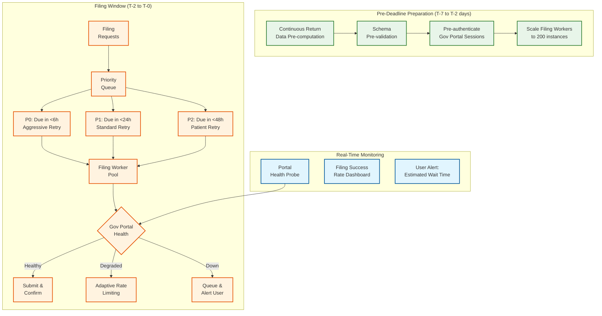
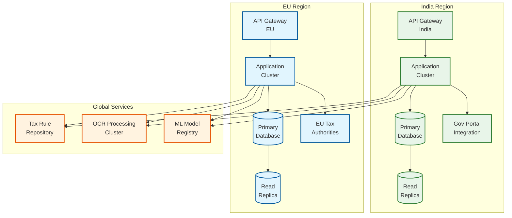

# 14.3 AI-Native MSME Accounting & Tax Compliance Platform — Scalability & Reliability

## Horizontal Scaling Strategy

### Service-Level Scaling Characteristics

Each service in the platform has distinct scaling properties driven by its workload pattern:

| Service | Scaling Dimension | Stateful/Stateless | Scaling Trigger | Min/Max Instances |
|---|---|---|---|---|
| **Transaction Ingestion** | Bank feed volume | Stateless | Queue depth > 10K | 10 / 200 |
| **Categorization Engine** | Transaction throughput | Stateless (model in memory) | Inference queue latency > 100ms | 20 / 500 |
| **Ledger Service** | Write throughput | Stateful (DB-bound) | Write latency p99 > 200ms | 5 / 50 (sharded) |
| **Reconciliation Engine** | Concurrent reconciliations | Stateless | Job queue depth > 1K | 5 / 100 |
| **Tax Computation** | Invoice creation rate | Stateless (rules in memory) | Computation latency > 50ms | 10 / 100 |
| **E-Invoicing Orchestrator** | IRP submission rate | Stateless | Queue depth > 5K | 10 / 200 |
| **OCR Pipeline** | Document processing rate | Stateless (GPU-bound) | Processing queue > 500 | 20 / 500 (GPU) |
| **Filing Service** | Filing submission rate | Stateless | Deadline proximity | 5 / 200 |
| **Reporting Engine** | Report generation rate | Stateless (read-heavy) | Query latency > 10s | 5 / 50 |

### Ledger Service Sharding Strategy

The ledger service is the most critical scaling challenge because it must maintain the double-entry invariant while handling 300M+ journal entries per day across 5M businesses. A single database instance cannot sustain this write throughput.

**Sharding approach: Business-level sharding**

Each business's ledger is entirely contained within a single shard. This guarantees that:
1. All journal entries for a business are on the same shard → the accounting equation can be enforced with a local transaction (no distributed transactions)
2. All queries for a business's financial data (trial balance, reports) are single-shard → no cross-shard joins
3. The per-business causal ordering invariant is maintained by a single shard's write ordering

**Shard allocation:**
- Total shards: 256 (allows 2^8 = 256 parallel write paths)
- Shard key: hash(business_id) mod 256
- Each shard handles: 5M / 256 ≈ 19,500 businesses
- Per-shard write rate: 300M / 256 ≈ 1.17M journal entries/day ≈ 13.5 writes/sec (average)
- Per-shard peak write rate: ~40 writes/sec (manageable for a single database instance)

**Shard rebalancing:** When a shard becomes hot (a large business with high transaction volume), the business can be migrated to a dedicated shard. Migration process:
1. Stop accepting new writes for the business (brief pause, <5 seconds)
2. Copy all historical data to the new shard
3. Redirect the business's shard routing to the new shard
4. Resume writes
5. Delete the historical copy from the old shard after verification

### Categorization Engine Scaling

The categorization engine must handle 200M transactions/day (~2,300/sec average, ~11,500/sec peak). The engine is stateless except for the ML model weights:

- **Global model:** ~50 MB; loaded into memory at startup; updated monthly via model registry push
- **Per-business priors:** ~10 KB per business; loaded on-demand and cached in an LRU cache (top 500K businesses keep priors in memory, covering 80% of traffic)
- **Counterparty index:** ~2 GB (global entity resolution index); loaded into memory; updated hourly

Scaling is purely horizontal: add more categorization engine instances behind a load balancer. Each instance independently handles requests with no coordination required. The LRU cache for per-business priors ensures that hot businesses (those with recent activity) are served from memory.

---

## Filing Deadline Surge Handling

### Traffic Pattern Analysis

GST filing deadlines create extreme traffic spikes:

| Deadline | Filing Type | Due Date | Traffic Pattern |
|---|---|---|---|
| GSTR-1 (monthly filers) | Outward supplies | 11th of following month | 60% of filings in last 24 hours |
| GSTR-3B (monthly filers) | Summary return | 20th of following month | 70% of filings in last 48 hours |
| GSTR-1 (quarterly filers) | Outward supplies | 13th after quarter end | 80% of filings in last 72 hours |
| GSTR-9 (annual return) | Annual return | December 31st | 50% of filings in last week |

**Filing volume during GSTR-3B deadline (20th of month):**

```
Total GSTR-3B filings: 5M per month
Filed in last 48 hours: 3.5M (70%)
Filing rate (last 48 hours average): 3.5M / 172,800s = ~20 filings/sec
Peak hour rate: 5x average = ~100 filings/sec
Peak 15-minute burst: 10x average = ~200 filings/sec
```

### Surge Architecture



**Key strategies:**

1. **Pre-computation:** Return data is assembled continuously throughout the month. By the filing deadline, 99% of the data is already validated and ready. The filing action is just submission, not computation.

2. **Session pool management:** The government portal requires authentication before filing. Session tokens expire in 10 minutes. The platform maintains a rotating pool of authenticated sessions (100+ concurrent sessions), pre-authenticating new sessions as old ones expire. This eliminates the authentication bottleneck during filing.

3. **Adaptive rate limiting:** The filing orchestrator monitors the government portal's response characteristics (latency, error rate, HTTP status codes) and adapts its submission rate. If the portal returns 503s, the orchestrator reduces the submission rate to avoid contributing to the overload, then gradually increases as the portal recovers.

4. **Priority-based scheduling:** Filings are prioritized by deadline proximity. A filing due in 4 hours gets attempted every 30 seconds on failure. A filing due in 36 hours gets attempted every 10 minutes. This ensures the most urgent filings have the highest chance of completing on time.

5. **User transparency:** Businesses see real-time filing status: "Your GSTR-3B is queued. Position 347 of 12,000. Estimated submission time: 2:30 PM. Government portal is currently experiencing delays."

---

## Multi-Region and Multi-Jurisdiction Deployment

### Deployment Topology



**Data residency compliance:**
- Indian businesses' financial data stays in the India region (per India's data localization requirements for financial data)
- EU businesses' data stays in the EU region (per GDPR)
- Tax rule repository and ML models are replicated globally (they contain no customer data)
- OCR processing may cross regions (document images are ephemeral and deleted after extraction)

### Multi-Region Consistency

Each region operates independently for all core operations (ledger writes, tax computation, filing). Cross-region operations are limited to:
- **Tax rule synchronization:** New rules published to the global repository are pulled by each region within 5 minutes
- **ML model updates:** New model versions are pushed from the central registry to each region during off-peak hours
- **Cross-region reporting:** A business with entities in both India and EU requires consolidated reporting, which involves read-only queries across regions

No cross-region distributed transactions are needed because financial data for each business entity is always in a single region.

---

## Fault Tolerance and Disaster Recovery

### Failure Modes and Recovery

| Component | Failure Mode | Impact | Detection | Recovery | RTO | RPO |
|---|---|---|---|---|---|---|
| **Ledger Database (primary)** | Instance crash | No new journal entries | Health check failure (5s) | Automatic failover to standby (synchronous replica) | 30s | 0 (synchronous replication) |
| **Ledger Database (region)** | Region outage | Complete unavailability | Multi-region health monitoring | Manual failover to DR region; redirect DNS | 15 min | <1 min (async replication lag) |
| **Categorization Engine** | All instances crash | Transactions queued uncategorized | Health checks + queue depth spike | Auto-scaling replaces instances | 2 min | 0 (stateless; transactions queued) |
| **E-Invoicing (IRP down)** | External dependency failure | Invoices created without IRN | IRP health probe | Queue invoices for async retry | N/A (external) | 0 (queued for retry) |
| **Filing Service (portal down)** | External dependency failure | Filings delayed | Portal health probe | Queue filings with priority retry | N/A (external) | 0 (queued for retry) |
| **Audit Trail** | Corruption detected | Audit integrity compromised | Hash chain verification (hourly) | Restore from verified backup + replay events | 1 hour | 0 (append-only, corruption is always detected) |
| **OCR Pipeline** | GPU cluster failure | Invoice extraction delayed | GPU health monitoring | Route to CPU-based fallback (slower but functional) | 5 min | 0 (documents queued) |

### Backup Strategy

| Data Type | Backup Frequency | Retention | Storage Tier | Verification |
|---|---|---|---|---|
| Ledger database | Continuous (synchronous replica) + daily snapshot | 8 years (statutory) | Hot: 1 year; Warm: 3 years; Cold: 4 years | Monthly restore test |
| Transaction store | Daily snapshot | 8 years | Hot: 6 months; Warm: 2 years; Cold: 5.5 years | Quarterly restore test |
| Audit trail | Continuous (append-only; replicated 3x) | 8 years | Hot: 2 years; Cold: 6 years | Hourly hash chain verification |
| Invoice images | Daily incremental | 8 years | Hot: 1 year; Cold: 7 years (object storage, compressed) | Annual sample verification |
| Tax rule repository | Version-controlled (every change is a new version) | Forever | Hot (small dataset, <100 MB) | Every rule change triggers regression test |

### Data Consistency During Reconciliation

Bank reconciliation creates potential consistency issues because it modifies multiple records atomically:
1. Mark bank transactions as reconciled
2. Mark ledger entries as reconciled
3. Create difference journal entries (for bank charges)
4. Update reconciliation state

If the process fails mid-way, partial reconciliation state can create confusing results (some transactions marked reconciled, others not, with no journal entry for the difference).

**Resolution: Saga pattern with compensating actions**

The reconciliation operation is implemented as a saga:
1. **Prepare:** Compute all matches and create a reconciliation plan (stored as a draft)
2. **Execute:** Apply all matches atomically within the same shard (since all records for a business are on one shard, this is a local transaction)
3. **Confirm:** Mark the reconciliation as completed
4. **Compensate (on failure):** If any step fails, roll back all changes from this reconciliation run by deleting the draft and reverting any partially applied matches

Because all financial records for a single business are on the same database shard, the reconciliation operation can be wrapped in a single database transaction, making the atomicity straightforward. The saga pattern is only needed for reconciliations that span multiple processes (e.g., triggering journal entries that go through the ledger service).

---

## Scaling for Growth

### Growth Projections and Scaling Milestones

| Milestone | Businesses | Daily Transactions | Ledger Writes/sec (peak) | Storage (annual) | Key Scaling Action |
|---|---|---|---|---|---|
| **Year 1** | 500K | 20M | 1,000 | 25 TB | Single region, 32 shards |
| **Year 2** | 2M | 80M | 4,000 | 100 TB | 128 shards, read replicas |
| **Year 3** | 5M | 200M | 10,000 | 250 TB | 256 shards, second region |
| **Year 4** | 10M | 400M | 20,000 | 500 TB | 512 shards, tiered storage |
| **Year 5** | 20M | 800M | 40,000 | 1 PB | 1024 shards, cold storage archive |

### Cost Optimization at Scale

| Strategy | Implementation | Annual Savings Estimate (at 5M businesses) |
|---|---|---|
| **Tiered storage** | Move ledger data >1 year old to warm storage, >3 years to cold | 60% storage cost reduction for historical data |
| **OCR model tiering** | Use lightweight model for standard invoices (80%), full model for complex (20%) | 50% GPU cost reduction |
| **Spot instances for batch processing** | Reconciliation, report generation, return pre-computation on spot instances | 70% compute cost reduction for batch workloads |
| **Caching** | Cache trial balances, counterparty lookups, tax rate lookups; invalidate on write | 40% database read reduction |
| **Connection pooling** | Pool and reuse authenticated sessions to government portals and banks | 30% reduction in authentication overhead |
| **Compression** | Compress journal entries >6 months old; compress invoice images with lossy compression after extraction | 40% reduction in warm/cold storage costs |
