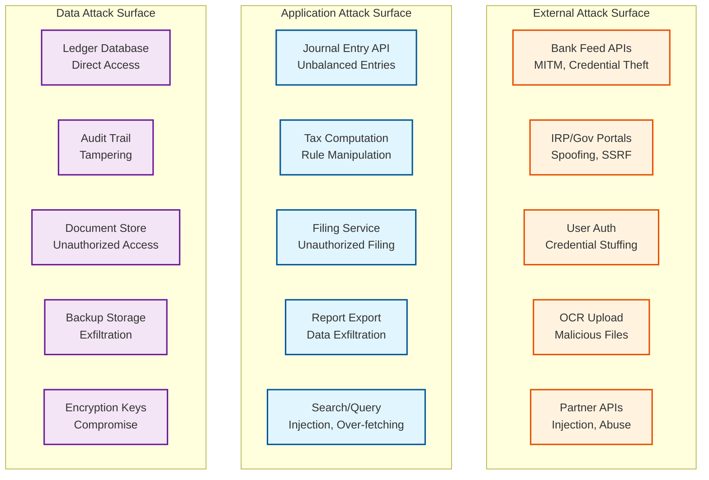
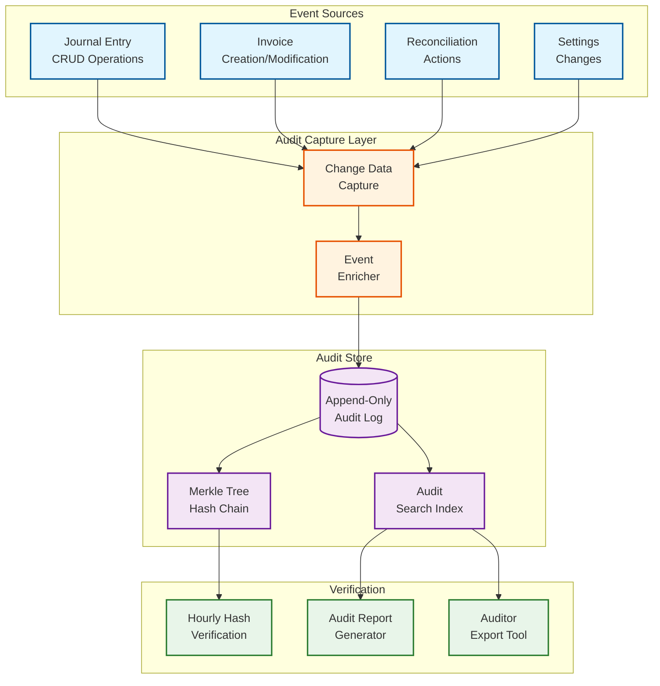

# 14.3 AI-Native MSME Accounting & Tax Compliance Platform — Security & Compliance

## Threat Model

### Threat Actors and Attack Vectors

| Threat Actor | Motivation | Attack Vectors | Risk Level |
|---|---|---|---|
| **External attacker** | Financial data theft, ransom | API exploitation, SQL injection, session hijacking, credential stuffing | Critical |
| **Malicious insider (employee)** | Data exfiltration, financial fraud | Privileged access abuse, database direct access, audit log manipulation | Critical |
| **Compromised CA/accountant** | Unauthorized modifications | Fraudulent journal entries, return filing manipulation, data export to competitors | High |
| **Malicious business owner** | Tax evasion, financial fraud | Fabricated invoices for fake ITC claims, suppressed revenue, dual books | High |
| **Supply chain attack** | Platform compromise | Compromised dependencies, malicious OCR model updates, bank feed API man-in-the-middle | High |
| **Government portal spoofing** | Credential theft, fake filings | Fake IRP endpoint, phishing for GST portal credentials | Medium |
| **Competitor** | Business intelligence theft | Scraping aggregated financial data, accessing industry benchmarks | Medium |

### Attack Surface Analysis

---

## Financial Data Protection

### Encryption Architecture

**Data at rest:**
- Database: Transparent data encryption (TDE) with AES-256
- Field-level encryption for sensitive fields: bank account numbers (encrypted with per-business key), PAN numbers, GSTIN (encrypted with platform key), financial amounts in audit logs
- Encryption key management: Hardware security module (HSM) for master key; per-business data encryption keys (DEKs) encrypted with the master key and stored alongside the data
- Key rotation: Master key rotated annually; DEKs rotated on business owner request or security incident

**Data in transit:**
- TLS 1.3 for all external communication (bank APIs, government portals, user browsers)
- mTLS (mutual TLS) for internal service-to-service communication
- Certificate pinning for government portal connections (IRP, GST portal) to prevent MITM attacks

**Data in use:**
- Financial computations (tax computation, reconciliation) operate on decrypted data in memory
- Memory is cleared (zeroed) after computation completes
- No financial data in log messages (structured logging with field-level redaction)

### Access Control Model

**Role-based access control (RBAC) with row-level security:**

| Role | Ledger Read | Ledger Write | Invoice Create | Filing | Settings | Export |
|---|---|---|---|---|---|---|
| **Business Owner** | All accounts | All (manual JE, approval) | Yes | Authorize | Full | All data |
| **Bookkeeper** | All accounts | Categorization, reconciliation | Yes | Prepare (not submit) | Limited | Reports only |
| **CA / Accountant** | All accounts | Adjusting entries, reversal | Yes | Submit (with delegation) | View only | All data (audit) |
| **Auditor** | All accounts (read-only) | None | None | None | View only | Audit trail only |
| **API Partner** | Scoped to integration | Scoped to integration | Scoped | None | None | None |

**Row-level security enforcement:**
Every database query includes a mandatory `business_id` filter. This is enforced at the database level (row-level security policies), not just at the application level. Even if an application-level access control check is bypassed, the database will only return rows belonging to the authenticated business.

**Session management:**
- Session tokens expire after 30 minutes of inactivity (shorter for CA delegation tokens: 15 minutes)
- Concurrent session limit: 5 per user (to prevent credential sharing)
- Session binding: sessions are bound to IP address and device fingerprint; IP change requires re-authentication
- MFA required for: filing authorization, bulk export, settings changes, CA delegation

### Financial Data Integrity

**Double-entry invariant enforcement:**
The most critical integrity requirement is that the accounting equation is never violated. This is enforced at three levels:

1. **Application level:** The journal entry API rejects any entry where total debits ≠ total credits before attempting a database write
2. **Database level:** A database constraint (CHECK constraint or trigger) verifies that the sum of debit_amount = sum of credit_amount for every journal entry
3. **Audit level:** A background verification job runs hourly, summing all debits and credits across all journal entries for each business and verifying they balance

If the database-level check ever fails (which would indicate a bug or corruption), the system immediately:
- Halts all writes for the affected business
- Alerts the operations team
- Creates an incident with the specific imbalance amount and affected entries
- The business sees a "maintenance in progress" message until the issue is resolved

---

## Tax Authority Integration Security

### Government Portal Credential Management

The platform stores credentials for government portals (GST portal, IRP) on behalf of businesses. This is a high-value target because compromised GST portal credentials enable fraudulent filings.

**Credential storage architecture:**
- Portal credentials are encrypted with the business's DEK (not the platform master key)
- The DEK is itself encrypted with the master key in the HSM
- Decryption requires both: the HSM (for master key) and the business's authentication (to authorize DEK use)
- Credentials are never stored in application memory longer than necessary (decrypt → use → zero memory)

**Credential usage authorization:**
- Every use of stored government credentials (filing, IRP submission) requires explicit user authorization
- Authorization can be: real-time approval (user clicks "submit"), pre-authorized (user sets up automatic filing with a standing authorization and MFA confirmation), or delegated (CA has a time-limited delegation token)
- Each credential use is logged in the audit trail: who authorized, when, what action, from what IP

**IRP connection security:**
- The IRP requires digital signatures on e-invoice payloads
- Digital signing certificates are stored in the HSM (never exported to application servers)
- Signing requests are sent to the HSM, which returns the signed payload
- Certificate rotation is managed by the platform with advance notification to the business

### Preventing Fraudulent Filings

A compromised account could be used to file fraudulent GST returns (claiming fake ITC, suppressing revenue). Mitigations:

1. **Filing data validation:** Before filing, the system validates that the return data matches the underlying ledger data. A discrepancy (e.g., return shows ₹10L revenue but ledger shows ₹15L) triggers a mandatory review.

2. **Filing confirmation ritual:** Filing requires a multi-step confirmation: review summary → confirm amounts → enter OTP/PIN → submit. Each step is a separate API call, preventing automated filing without user awareness.

3. **Post-filing verification:** After filing, the system fetches the filed return from the government portal and compares it to what was submitted. Any discrepancy (indicating potential tampering during transmission) is flagged immediately.

4. **Filing reversal monitoring:** If a filed return is subsequently revised (which could indicate unauthorized access), the original filer is notified immediately.

---

## Multi-Country Compliance Framework

### India: GST Compliance

| Requirement | Implementation |
|---|---|
| **E-invoicing** | Mandatory for turnover >₹5 Cr; IRP integration with IRN generation; 30-day reporting deadline for turnover >₹10 Cr |
| **GSTR-1** | Monthly/quarterly filing of outward supplies; B2B invoices with GSTIN, B2C aggregated; due by 11th/13th |
| **GSTR-3B** | Monthly summary return with tax payment; ITC set-off computation; due by 20th |
| **GSTR-9** | Annual return with reconciliation to financial statements; due by December 31st |
| **GSTR-2B reconciliation** | Auto-generated inward supply statement; must reconcile with purchase ledger for ITC eligibility |
| **Composition scheme** | Simplified scheme for turnover <₹1.5 Cr; flat rate, no ITC, quarterly filing (CMP-08) |
| **TDS/TCS** | TDS on specified services (194C, 194J, etc.); TCS for e-commerce operators (206C(1H)) |
| **E-way bill** | Required for goods movement >₹50,000; integration with e-way bill portal |
| **Audit trail mandate** | Companies Act 2013 mandates audit trail in accounting software from April 2023; immutable, non-editable log of all changes |

### EU: VAT Compliance

| Requirement | Implementation |
|---|---|
| **Standard/reduced rates** | 27 member states with varying standard rates (17-27%) and multiple reduced rates per state |
| **Reverse charge** | B2B cross-border services: buyer accounts for VAT; system auto-generates reverse charge journal entries |
| **Intra-community supply** | Goods sold B2B cross-border within EU: zero-rated for seller, acquisition tax for buyer; requires EC Sales List reporting |
| **OSS (One Stop Shop)** | B2C cross-border e-commerce below €10K threshold: home country VAT; above threshold: destination country VAT via OSS portal |
| **ViDA (VAT in Digital Age)** | Mandatory real-time digital reporting starting July 2028; structured e-invoicing with EU-wide standard; platform must prepare for this mandate |
| **Intrastat** | Statistical reporting for goods crossing EU borders; value and quantity by commodity code |

### US: Sales Tax Compliance

| Requirement | Implementation |
|---|---|
| **Economic nexus** | Each state has thresholds ($100K revenue or 200 transactions in most states); platform tracks per-state revenue and alerts when approaching nexus |
| **Product taxability** | Same product may be taxable in one state and exempt in another (e.g., clothing exempt in Pennsylvania, taxable in Texas); platform maintains product-taxability matrix |
| **Jurisdiction determination** | Tax rate depends on buyer's location at 5 levels: state, county, city, special district, transit district; requires address-to-jurisdiction mapping |
| **Marketplace facilitator** | Marketplace collects and remits tax for third-party sellers in most states; platform tracks whether a sale is marketplace-facilitated |
| **Sales tax holidays** | Periodic exemption windows (back-to-school, hurricane preparedness); platform auto-applies during configured holiday periods |
| **Filing and remittance** | Frequency varies by state and volume: monthly, quarterly, or annual; platform generates returns per state's specific form requirements |

### Compliance Monitoring and Alerts

The platform continuously monitors compliance status and proactively alerts businesses:

| Alert Type | Trigger | Urgency | Action |
|---|---|---|---|
| **Filing deadline approaching** | Return due in 5 days, data not yet reviewed | High | Notify business owner and CA |
| **ITC at risk** | Supplier hasn't filed GSTR-1 for an invoice claimed as ITC | Medium | Flag invoice, suggest follow-up with supplier |
| **E-invoicing threshold** | Business turnover approaching ₹5 Cr e-invoicing mandate threshold | Medium | Notify and prepare e-invoicing workflow |
| **Nexus threshold approaching** | Revenue in a US state approaching economic nexus threshold | High | Alert with registration guidance |
| **Rate change** | Tax rate changed for HSN codes used by business | Medium | Show affected invoices and draft adjustments |
| **GSTIN status change** | A counterparty's GSTIN has been suspended or cancelled | High | Flag invoices from/to this counterparty; ITC may be ineligible |
| **Reconciliation discrepancy** | GSTR-3B liability doesn't match GSTR-1 outward supplies | High | Must be resolved before filing |

---

## Audit Trail Requirements

### Statutory Audit Trail Standards

India's Companies Act 2013 (Section 128, Rule 3) and the MCA notification effective April 1, 2023 require:
1. Every accounting software must maintain an audit trail of every transaction
2. The audit trail must capture: date of change, nature of change, unique identifier of the person making the change, and the original and changed values
3. The audit trail cannot be disabled or edited
4. The audit trail must be maintained for the period required by law (8 years for tax records)

### Implementation Architecture

**Change Data Capture (CDC):** Every mutation to any financial table is captured via database triggers or CDC framework. The trigger captures the before-state and after-state of every modified row, the user who made the change, the timestamp, and the operation type (INSERT, UPDATE, DELETE).

**Enrichment:** The raw CDC event is enriched with context: the API endpoint that triggered the change, the session ID, the IP address, the business justification (if provided by the user), and the approval chain (if the change required approval).

**Hash chaining:** Each audit log entry includes the hash of the previous entry, forming a Merkle chain. The chain can be verified by recomputing hashes from the beginning: if any entry has been modified or deleted, the hash chain breaks. Root hashes are periodically published to an external tamper-evident log (conceptually similar to certificate transparency logs).

**Verification:** An hourly background job verifies the hash chain for each business. If a chain break is detected (indicating potential tampering), the system alerts the operations team and the business's statutory auditor.

---

## Data Privacy and Retention

### Data Classification

| Classification | Examples | Encryption | Access | Retention |
|---|---|---|---|---|
| **Highly Sensitive** | Bank account numbers, PAN, GSTIN, financial amounts, government portal credentials | Field-level encryption (per-business key) | Business owner + authorized CA only | 8 years (statutory minimum) |
| **Sensitive** | Counterparty names, invoice details, journal entry descriptions | Database-level encryption (TDE) | Business team + CA | 8 years |
| **Internal** | Categorization ML features, reconciliation scores, OCR confidence | Database-level encryption | Platform services (automated) | 3 years |
| **Metadata** | Request logs, performance metrics, aggregated usage statistics | In-transit encryption only | Platform operations team | 1 year |

### Right to Deletion vs. Statutory Retention

A fundamental tension exists between data privacy regulations (right to erasure under GDPR for EU businesses) and statutory retention requirements (8-year minimum retention for tax records). Resolution:

1. **Statutory records are exempt:** Financial records required by tax law cannot be deleted upon user request. The platform explains this to the user: "Your financial records for periods where tax returns have been filed must be retained for 8 years per [applicable law]. These records will be automatically deleted after the retention period expires."

2. **Non-statutory data is deletable:** User profile data, preferences, non-financial activity logs, and OCR processing metadata can be deleted upon request.

3. **Pseudonymization option:** For users who want maximum privacy after closing their account, the platform can pseudonymize financial records: replace PII (name, address, contact details) with pseudonyms while retaining the financial data needed for statutory compliance. The mapping between pseudonyms and real identities is deleted, making the data non-attributable.

4. **Automated deletion after retention period:** The platform tracks retention expiry for every record and automatically deletes records when the statutory retention period expires. This is not a cron job that runs annually—it's a precise, per-record expiry with deletion within 30 days of expiry.
