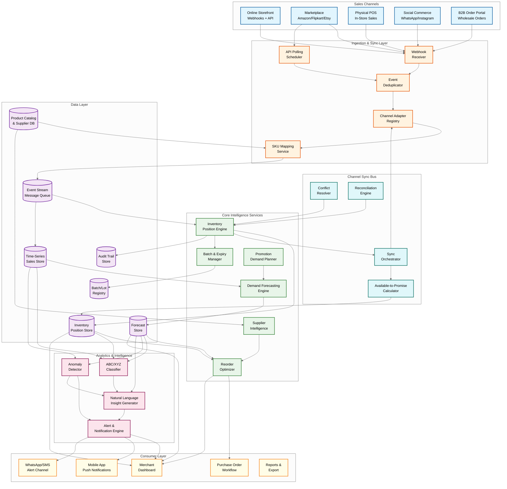
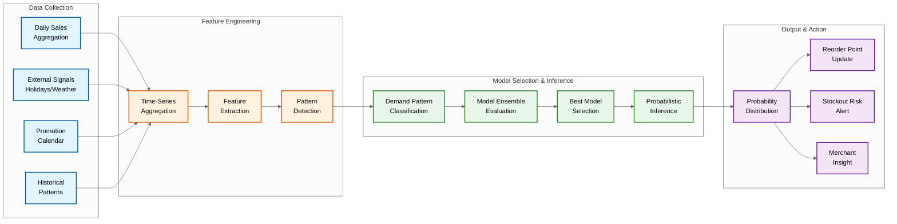
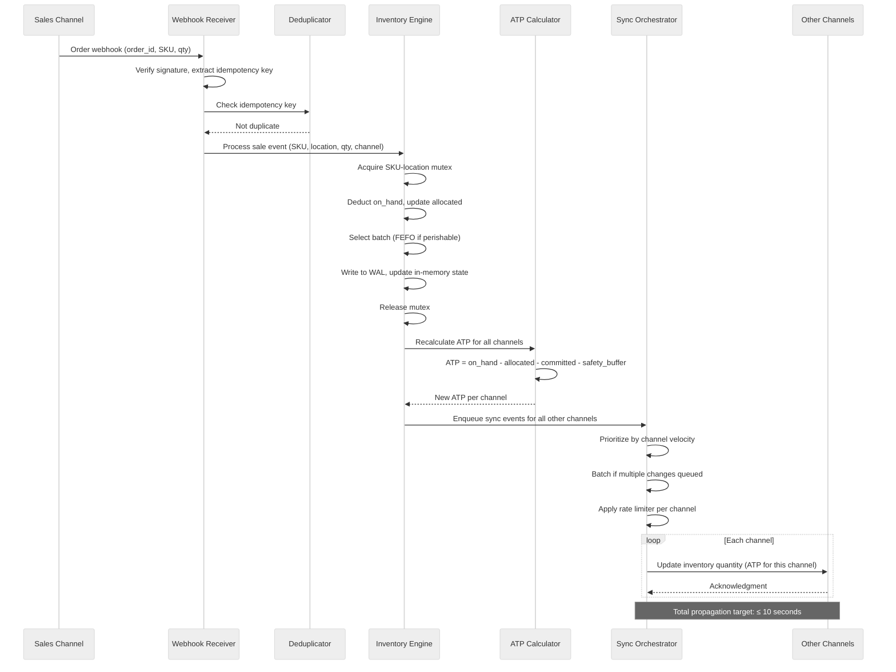
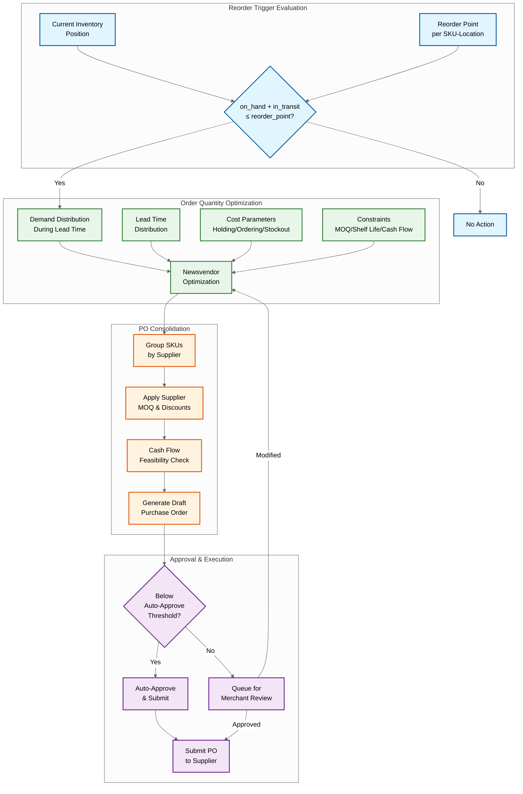
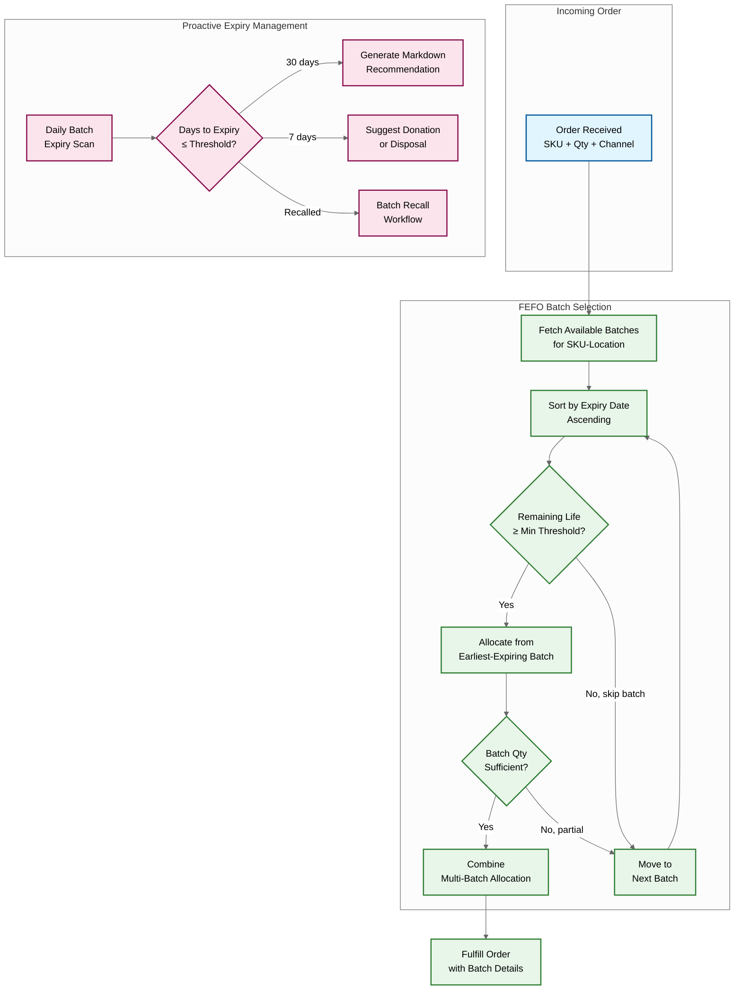

# 14.4 AI-Native SME Inventory & Demand Forecasting System — High-Level Design

## System Architecture

---

## Component Descriptions

### 1. Ingestion & Sync Layer

| Component | Responsibility | Key Design Details |
|---|---|---|
| **Webhook Receiver** | Accepts real-time event notifications (orders, cancellations, refunds, inventory adjustments) from connected channels | Stateless HTTP endpoint fleet behind a load balancer; immediate acknowledgment (HTTP 202) before processing; idempotency key extraction from webhook payload to prevent duplicate processing; channel-specific signature verification for webhook authenticity |
| **API Polling Scheduler** | Periodically polls channels that don't support reliable webhooks, or as fallback when webhooks are suspected to be missing events | Per-tenant-channel polling schedules stored in scheduler database; adaptive polling frequency (more frequent for high-volume tenants); jittered polling to avoid thundering herd against channel APIs; exponential backoff on API errors |
| **Channel Adapter Registry** | Translates between channel-specific data formats and the platform's canonical event schema | Plugin architecture with one adapter per channel; each adapter handles authentication, pagination, rate limiting, error handling, and data transformation; hot-reloadable without platform restart; adapter versioning for channel API changes |
| **SKU Mapping Service** | Maps channel-specific product identifiers to the platform's unified SKU catalog; handles product variants, bundles, and kits | Configurable mapping rules (exact match, barcode match, title fuzzy match); bundle/kit decomposition into component SKUs for inventory deduction; mapping suggestions via ML-based product matching for new listings |
| **Event Deduplicator** | Ensures each business event (order, adjustment) is processed exactly once despite webhook retries, polling overlap, and channel-specific duplication | Bloom filter for fast probable-duplicate detection; confirmed deduplication via idempotency key lookup in time-windowed dedup store (24-hour window); idempotency key composition: channel_id + event_type + channel_event_id |

### 2. Core Intelligence Services

| Component | Responsibility | Key Design Details |
|---|---|---|
| **Demand Forecasting Engine** | Produces probabilistic demand forecasts at SKU-location-day granularity using automated model selection from an ensemble | Nightly batch processing with daily sales data; per-SKU model selection from ensemble (exponential smoothing, Croston/SBA, hierarchical Bayesian, gradient-boosted trees); forecast output is a probability distribution (mean, standard deviation, percentiles at 5/25/50/75/95); cold-start handling via attribute-based transfer learning; external signal incorporation (promotions, holidays, weather) |
| **Reorder Optimizer** | Computes optimal reorder policies (when to order, how much) using stochastic optimization over probabilistic demand and lead times | Per-SKU (Q, R) policy computation using newsvendor-based optimization; accounts for holding cost, ordering cost, stockout cost, MOQs, volume discounts, shelf life, and cash flow constraints; PO consolidation across SKUs per supplier; configurable service levels per ABC class |
| **Inventory Position Engine** | Maintains the real-time unified inventory position for every SKU-location-channel combination; processes all stock mutations | In-memory state with write-ahead log for durability; per-SKU-location mutex for serialized mutations; computes on-hand, allocated, in-transit, committed, and available-to-promise quantities; triggers sync events on every position change |
| **Batch & Expiry Manager** | Tracks inventory at the batch/lot level with expiry dates; enforces FEFO allocation; manages expiry alerts and markdown recommendations | Batch registry with manufacturing date, expiry date, quantity, and location; FEFO allocation algorithm for outbound orders; proactive markdown pricing recommendation based on remaining shelf life vs. expected sell-through rate; batch recall workflow with forward/backward traceability |
| **Promotion Demand Planner** | Models expected demand uplift from planned promotions and adjusts forecasts accordingly | Historical promotion response curves per promotion type (BOGO, percentage off, bundle); demand uplift multiplier estimation; cannibalization impact on substitute/complementary SKUs; post-promotion demand dip modeling; integration with channel promotion calendars for automatic detection |
| **Supplier Intelligence** | Builds probabilistic lead time models per supplier-SKU and generates supplier performance analytics | Lead time distribution tracking (actual delivery dates vs. promised dates); supplier reliability scoring; lead time trend detection (improving/stable/deteriorating); multi-supplier preference ranking per SKU; automatic reorder point recalculation on lead time distribution change |

### 3. Channel Sync Bus

| Component | Responsibility | Key Design Details |
|---|---|---|
| **Sync Orchestrator** | Coordinates inventory level updates across all connected channels whenever the inventory position changes | Priority queue: update highest-velocity channels first; batching: consolidate multiple rapid changes into single API call per channel; rate limiter: respect per-channel API rate limits with token bucket; retry with exponential backoff for transient failures; circuit breaker for sustained channel API outages |
| **Available-to-Promise Calculator** | Computes the quantity available for sale on each channel, accounting for pending orders, channel-specific safety buffers, and allocation rules | ATP = on_hand - allocated - committed - channel_safety_buffer; per-channel safety buffer based on channel's sync latency characteristics and recent velocity; support for channel-specific inventory allocation caps (e.g., reserve 20 units for marketplace, remaining for storefront) |
| **Conflict Resolver** | Detects and resolves inventory inconsistencies caused by simultaneous sales across channels, webhook delays, or sync failures | Oversell detection: allocated > on_hand triggers conflict resolution; resolution strategies: auto-cancel (lowest-priority channel), backorder (inform customer of delay), cross-location fulfillment (ship from alternate warehouse); configurable resolution priority per channel |
| **Reconciliation Engine** | Periodically performs full inventory reconciliation between platform state and each channel's reported quantities | Scheduled reconciliation every 4 hours per tenant-channel; detects drift between platform ATP and channel's published quantity; generates correction events for detected discrepancies; alerting for persistent drift indicating integration issues |

### 4. Analytics & Intelligence

| Component | Responsibility | Key Design Details |
|---|---|---|
| **ABC/XYZ Classifier** | Categorizes SKUs by revenue contribution (ABC) and demand variability (XYZ) to inform differentiated stocking policies | Monthly reclassification; A (top 80% revenue), B (next 15%), C (bottom 5%); X (CV < 0.5), Y (0.5 ≤ CV < 1.0), Z (CV ≥ 1.0); 9-cell matrix determines service level, count frequency, and review priority |
| **Anomaly Detector** | Identifies unusual patterns in demand, supply, and operations that require merchant attention | Statistical anomaly detection on sales velocity (z-score > 3 vs. rolling baseline); demand shape anomalies (sudden intermittent pattern for previously stable SKU); supply anomalies (lead time spike, short shipment pattern); operational anomalies (unusual adjustment frequency) |
| **Natural Language Insight Generator** | Transforms quantitative analytics into merchant-readable explanations and recommendations | Template-based generation with dynamic data binding; tone calibrated to urgency (informational, advisory, urgent); context-aware (references merchant's own data and past patterns); multilingual support for regional SME markets |
| **Alert & Notification Engine** | Delivers prioritized alerts through configured channels with deduplication and fatigue prevention | Alert scoring based on financial impact (stockout cost, waste cost, oversell count); configurable thresholds per alert type; channel routing (critical → WhatsApp + push, informational → dashboard only); deduplication (don't re-alert same condition within 24 hours); weekly digest summarizing all alerts and actions |

---

## Data Flow: Key Operations

### 1. Demand Forecasting Pipeline

**Step-by-step flow:**

1. **Daily aggregation** — At midnight (tenant's timezone), aggregate previous day's sales by SKU-location. Compute daily units sold, revenue, order count, return count, and channel breakdown.

2. **Feature extraction** — For each SKU-location, compute rolling features: 7/14/28/90-day moving averages, day-of-week patterns, trend direction (linear regression slope over 28 days), intermittency ratio (% of zero-sales days in last 28 days), coefficient of variation.

3. **Pattern classification** — Classify each SKU-location's demand pattern: **smooth** (CV < 0.5, intermittency < 20%), **erratic** (CV ≥ 0.5, intermittency < 20%), **intermittent** (CV < 0.5, intermittency ≥ 20%), **lumpy** (CV ≥ 0.5, intermittency ≥ 20%). Pattern determines which models are candidates.

4. **Model ensemble evaluation** — For each SKU-location, evaluate applicable models on last 8 weeks using rolling-origin cross-validation: exponential smoothing (smooth/erratic), Croston/SBA/TSB (intermittent/lumpy), hierarchical Bayesian (all patterns, especially sparse), gradient-boosted trees (promotion-sensitive). Rank by WAPE on held-out weeks.

5. **Model selection** — Select best-performing model. If top two models are within 5% WAPE, prefer the simpler model (exponential smoothing > Croston > Bayesian > gradient-boosted trees). Store selection with performance metrics for monitoring.

6. **Probabilistic inference** — Selected model generates 90-day forecast as probability distribution per day. Output: mean, standard deviation, and percentiles (P5, P25, P50, P75, P95). For intermittent demand, output is a mixed distribution (probability of zero sales + distribution conditional on non-zero sales).

7. **Downstream propagation** — Forecast distributions flow to: reorder optimizer (compute new R and Q), stockout risk calculator (P(demand > available inventory) over lead time), insight generator (trend narratives), anomaly detector (forecast vs. actual comparison for yesterday's data).

### 2. Multi-Channel Inventory Sync

**Key design decisions in sync flow:**

| Decision | Choice | Rationale |
|---|---|---|
| Sync trigger | Event-driven (on every inventory mutation) | Batch sync (every N minutes) introduces overselling risk proportional to batch interval × sales velocity |
| Sync ordering | Highest-velocity channel first | Oversell probability is highest on highest-velocity channel during sync delay |
| Batching | Consolidate changes within 500ms window | Multiple rapid changes (e.g., burst of orders) consolidated into single API call per channel to avoid rate limit exhaustion |
| Failure handling | Retry with backoff + circuit breaker | Transient failures (network, rate limit) retried 3x with exponential backoff; sustained failures trip circuit breaker to prevent queue buildup; stale ATP on channel is better than no updates at all |
| Consistency model | Eventually consistent with oversell protection | Strong consistency across channels is impossible due to channel API latency; instead, safety buffers absorb the inconsistency window |

### 3. Reorder Automation Pipeline

### 4. Batch/Expiry Management (FEFO Allocation)

---

## Key Design Decisions

| Decision | Choice | Alternative Considered | Trade-off |
|---|---|---|---|
| **Forecasting approach** | Probabilistic ensemble with automated per-SKU model selection | Single model (e.g., Prophet) for all SKUs | Higher implementation complexity but critical for handling diverse demand patterns (smooth, intermittent, lumpy) across SME catalogs; single-model approach fails badly on intermittent demand (40% of SKUs) |
| **Inventory position store** | In-memory state with write-ahead log | Pure database (relational or document store) | Sub-millisecond reads for real-time ATP calculation; WAL provides durability; higher operational complexity than pure database but channel sync SLO (≤10s) requires in-memory read path |
| **Channel sync model** | Event-driven with safety buffers | Periodic batch sync (every 5/15 minutes) | Event-driven minimizes overselling window but requires reliable event processing and idempotent sync; batch sync is simpler but creates proportional overselling risk during the batch interval |
| **Multi-tenancy model** | Shared infrastructure with logical isolation | Dedicated infrastructure per tenant | Cost per tenant must be less than $50/month to serve SME price sensitivity; shared infrastructure amortizes compute across 100K tenants; logical isolation via tenant_id in all queries and per-tenant encryption keys |
| **Forecast batch vs. streaming** | Nightly batch with intra-day anomaly triggers | Real-time streaming forecasts | SME demand patterns don't change intra-day in ways that affect ordering decisions; batch processing is 10x cheaper and simpler; anomaly detection (sudden demand spike) runs on streaming events and can trigger mid-day forecast refresh for specific SKUs |
| **FEFO implementation** | Application-level batch tracking with sorted allocation | Database-level batch management or WMS integration | Application-level gives full control over allocation logic, markdown recommendations, and recall workflows; WMS integration would require each SME to have a WMS (most don't); database-level batch tracking adds latency to every allocation query |
| **Reorder optimization method** | Newsvendor-based with stochastic lead times | Simple EOQ formula; full simulation-based optimization | EOQ ignores demand and lead time uncertainty, producing suboptimal results for variable SME supply chains; full simulation is computationally expensive at 500M SKU-locations; newsvendor-based approach is analytically tractable with O(1) computation per SKU while properly accounting for uncertainty |
| **Alert delivery** | Multi-channel (dashboard + WhatsApp + push) with priority scoring | Dashboard-only alerts | SME owners are not at their dashboard continuously; WhatsApp/SMS reaches them where they are; priority scoring prevents alert fatigue (the #1 reason SME owners disable notifications); critical alerts (stockout imminent on hero product) break through quiet hours |
| **Supplier lead time modeling** | Per-supplier-SKU probability distribution | Fixed lead time per supplier | Lead time variability is the primary source of safety stock inflation in SME supply chains; a supplier with mean 7-day lead time but occasional 21-day delays needs much more safety stock than one with consistent 10-day lead times; distribution captures this distinction |
| **Cold-start SKU forecasting** | Attribute-based transfer learning with Bayesian posterior update | Wait for N weeks of sales data before forecasting | Waiting for data means merchants fly blind for weeks on new products, often resulting in stockouts (underordered) or excess (overordered); attribute-based transfer produces useful (if wide-confidence-interval) forecasts from day 1, converging to data-driven forecasts within 4–6 weeks |
