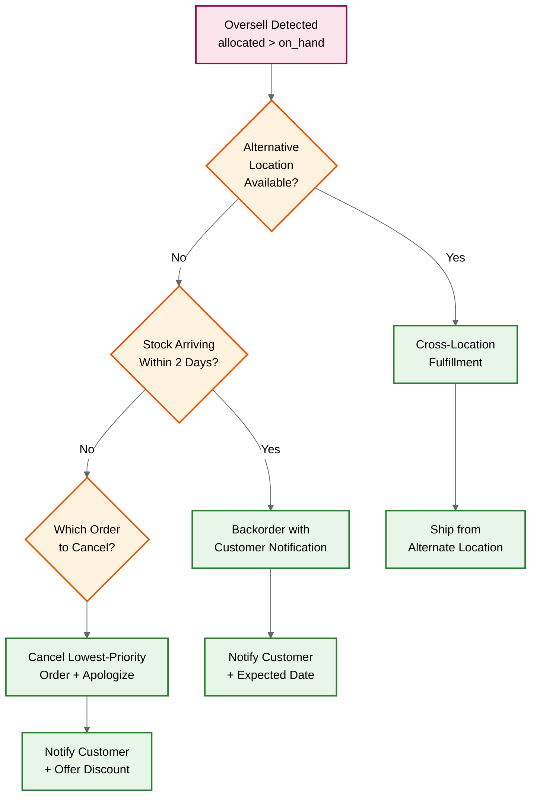
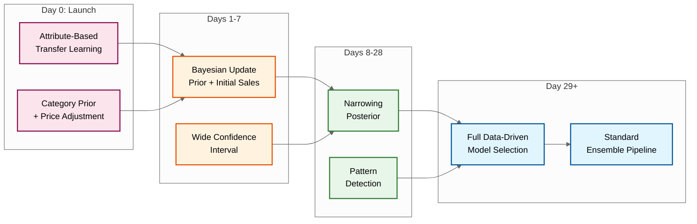
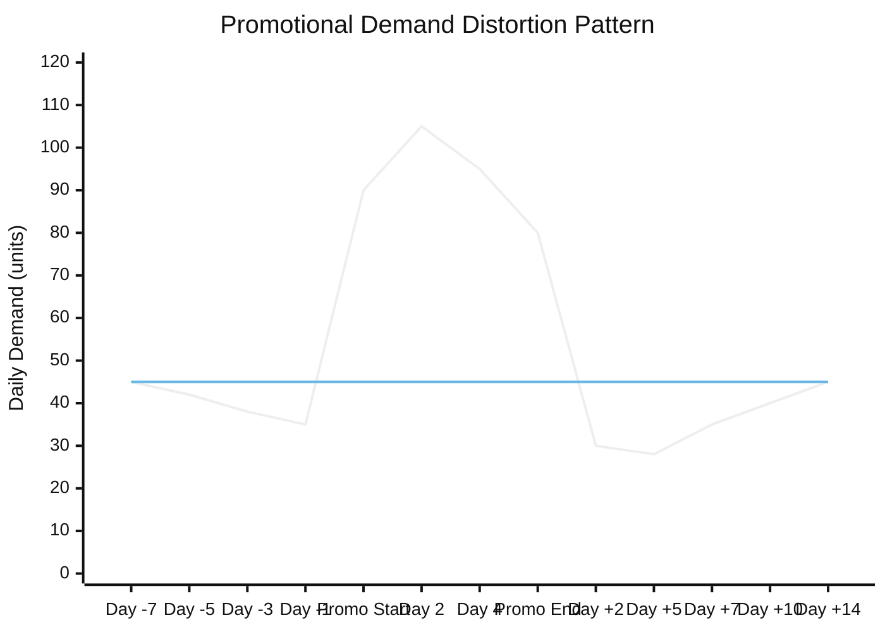
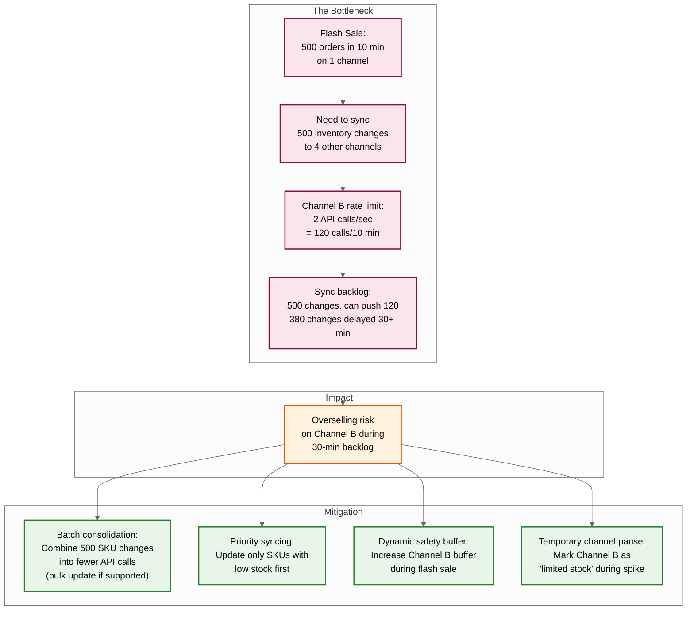

# 14.4 AI-Native SME Inventory & Demand Forecasting System — Deep Dives & Bottlenecks

## Deep Dive 1: Probabilistic Demand Forecasting for Sparse and Intermittent Data

### The Problem

40% of SKUs in a typical SME catalog exhibit intermittent demand—selling fewer than 5 units per week with many zero-sales days. Classical time-series methods (ARIMA, Holt-Winters, Prophet) assume continuous, non-zero demand and fail catastrophically on intermittent patterns: they either predict fractional units (0.3 units/day is meaningless for ordering decisions) or smooth away the intermittency, producing forecasts that are systematically biased. A naive moving average of 0.5 units/day over 14 days suggests ordering 7 units—but if the actual demand pattern is "0, 0, 0, 5, 0, 0, 0, 0, 3, 0, 0, 0, 0, 0," the inventory dynamics are entirely different from a product that genuinely sells 0.5 units per day.

### Demand Pattern Classification

The first critical step is classifying each SKU's demand pattern to route it to the appropriate forecasting model. The system uses the ADI (Average Demand Interval) and CV² (squared coefficient of variation) framework:

| Pattern | ADI | CV² | Characteristics | Model Family |
|---|---|---|---|---|
| **Smooth** | < 1.32 | < 0.49 | Regular, predictable demand | Exponential smoothing (ETS), simple methods |
| **Erratic** | < 1.32 | ≥ 0.49 | Regular timing but variable quantities | ETS with higher uncertainty, gradient-boosted trees |
| **Intermittent** | ≥ 1.32 | < 0.49 | Irregular timing but consistent quantities when they occur | Croston, SBA |
| **Lumpy** | ≥ 1.32 | ≥ 0.49 | Irregular timing and variable quantities | TSB, hierarchical Bayesian |

### Croston's Method and Variants for Intermittent Demand

Croston's method (1972) decomposes intermittent demand into two components:
1. **Demand size** — the quantity sold when a sale does occur
2. **Inter-arrival interval** — the time between consecutive non-zero demand events

Each component is forecast separately using simple exponential smoothing, and the demand rate is estimated as size/interval. This captures the "lumpy" nature of intermittent demand that continuous methods miss.

```
ALGORITHM CrostonSBA(demand_series, alpha=0.15):
    // Separate into demand sizes and intervals
    sizes ← []
    intervals ← []
    periods_since_last ← 0

    FOR d IN demand_series:
        periods_since_last += 1
        IF d > 0:
            sizes.add(d)
            intervals.add(periods_since_last)
            periods_since_last ← 0

    // Initialize with averages
    z_hat ← mean(sizes)         // smoothed demand size
    p_hat ← mean(intervals)     // smoothed inter-arrival interval

    // Update with exponential smoothing
    FOR i IN range(len(sizes)):
        z_hat ← alpha * sizes[i] + (1 - alpha) * z_hat
        p_hat ← alpha * intervals[i] + (1 - alpha) * p_hat

    // SBA correction (Syntetos-Boylan Approximation)
    // Corrects the upward bias in Croston's estimator
    demand_rate ← (z_hat / p_hat) * (1 - alpha / 2)

    // Variance estimation for safety stock
    variance ← estimate_compound_variance(z_hat, p_hat, sizes, intervals)

    RETURN ProbabilisticForecast(
        mean_per_period=demand_rate,
        variance_per_period=variance,
        prob_zero_per_period=1 - (1 / p_hat),
        distribution_type=COMPOUND_POISSON_GAMMA
    )
```

**The SBA correction matters**: Croston's original method overestimates demand by approximately α/2 (where α is the smoothing parameter). For α = 0.15, this is a 7.5% upward bias—which translates directly into 7.5% excess safety stock. The Syntetos-Boylan Approximation corrects this bias, reducing inventory holding costs without increasing stockout risk.

### Hierarchical Bayesian Models for Sparse History

For SKUs with fewer than 90 days of history, even Croston-family methods lack sufficient data to produce reliable parameter estimates. The hierarchical Bayesian approach addresses this by "borrowing strength" from similar SKUs:

```
HIERARCHICAL MODEL:

  Category level (shared prior):
    μ_category ~ Normal(global_mean, global_variance)
    σ_category ~ HalfNormal(global_scale)

  SKU level (specific to each SKU within category):
    demand_rate[sku] ~ Normal(μ_category, σ_category)
    observation[sku][day] ~ Poisson(demand_rate[sku])

  Learning dynamics:
    - SKU with 90+ days of data: posterior dominated by its own observations
    - SKU with 7 days of data: posterior heavily influenced by category prior
    - New SKU with 0 days: forecast equals category average (pure prior)
```

The hierarchical structure means a new SKU in the "organic snacks" category starts with a forecast based on the average demand of all organic snacks, then rapidly adapts as its own sales data accumulates. After approximately 4 weeks of data, the SKU's own observations dominate the posterior, and the category prior has minimal influence.

### External Signal Incorporation

For promotion-sensitive SKUs and seasonal patterns, gradient-boosted tree models incorporate external features:

| Feature Category | Specific Features | Impact |
|---|---|---|
| **Calendar** | Day of week, week of month, month of year, holiday flags, payday proximity | Captures weekly and monthly cyclical patterns |
| **Promotions** | Active promotion flag, discount depth, promotion type (BOGO/% off), days since promotion start, days until promotion end | Models demand uplift and its decay curve |
| **Weather** | Temperature bucket, precipitation flag, extreme weather alerts | Critical for seasonal products (ice cream, umbrellas) |
| **Events** | Local event flags (festivals, school holidays, sports events), event proximity in days | Captures event-driven demand spikes |
| **Competitive** | Price relative to category median (if available), new competitor flag | Competitive dynamics affecting demand |
| **Cannibalization** | Promotion active on substitute SKU, new product launch in same category | Cross-SKU demand effects |

### Forecast Accuracy Monitoring

The system continuously monitors forecast accuracy using multiple metrics:

| Metric | Formula | Why This Metric |
|---|---|---|
| **WAPE** (Weighted Absolute Percentage Error) | Σ\|actual - forecast\| / Σ actual | Robust to zero-demand periods (unlike MAPE which divides by zero) |
| **Bias** | Σ(forecast - actual) / Σ actual | Detects systematic over/under-forecasting |
| **RMSSE** (Root Mean Squared Scaled Error) | √(MSE / naive_MSE) | Scale-independent comparison against naive forecast |
| **Coverage** | % of actuals within P5-P95 interval | Tests calibration of probability distribution |
| **Forecast Value Add (FVA)** | 1 - (WAPE_model / WAPE_naive) | Measures whether the model adds value over simply using last period's demand |

```
ALGORITHM MonitorForecastAccuracy(sku_id, location_id):
    // Compare yesterday's forecast with yesterday's actual demand
    forecast ← get_forecast(sku_id, location_id, target_date=yesterday)
    actual ← get_actual_demand(sku_id, location_id, date=yesterday)

    // Update rolling accuracy metrics (28-day window)
    rolling_window ← get_last_28_days(sku_id, location_id)
    wape ← sum(|rolling_window.actual - rolling_window.forecast|) / sum(rolling_window.actual)
    bias ← sum(rolling_window.forecast - rolling_window.actual) / sum(rolling_window.actual)

    // Coverage check: was actual within predicted P5-P95?
    in_interval ← (actual >= forecast.p5 AND actual <= forecast.p95)
    coverage_28d ← count(in_interval=true in last 28 days) / 28

    // Trigger model re-selection if accuracy degrades
    IF wape > threshold_for_sku_class OR coverage_28d < 0.80:
        trigger_model_reselection(sku_id, location_id)
        generate_alert("Forecast accuracy degradation", sku_id, wape, coverage_28d)
```

---

## Deep Dive 2: Multi-Channel Inventory Consistency and Overselling Prevention

### The Distributed Consistency Challenge

Multi-channel inventory is fundamentally a distributed consistency problem where the "database" (each channel's inventory count) has no native distributed transaction support. Each channel maintains its own view of inventory that the platform must keep synchronized, but:

1. **Channels have different sync latencies**: Storefront webhooks arrive in 1–2 seconds; marketplace webhooks may be delayed 5–30 minutes during peak traffic; POS uploads may be batched every 5 minutes.
2. **Channels have different API rate limits**: One marketplace allows 20 inventory updates/second; another limits to 2/second, meaning updating 1,000 SKUs takes 8+ minutes.
3. **Channels have different consistency guarantees**: Some channels acknowledge an inventory update but don't reflect it in their storefront for 30–60 seconds (eventual consistency); others are immediately consistent.
4. **Network failures are common**: Channel API outages, timeout, rate limiting responses happen daily.

### Overselling Probability Model

The probability of an oversell event for a given SKU depends on:

```
P(oversell) = P(sale_on_channel_B during sync_delay after sale_on_channel_A)
            = 1 - e^(-λ_B × t_sync)

Where:
  λ_B = demand rate on channel B (units per second)
  t_sync = sync propagation delay from channel A sale to channel B inventory update

Example:
  SKU sells 50 units/day across 4 channels (12.5 units/channel/day)
  λ_B = 12.5 / 86400 = 0.000145 units/second
  t_sync = 300 seconds (5-minute marketplace delay)
  P(oversell per event) = 1 - e^(-0.000145 × 300) = 0.043 = 4.3%

  With 12.5 sales per day on the triggering channel:
  Expected oversells per day = 12.5 × 0.043 = 0.54
  Expected oversells per month = 16.2 oversells

  For last-unit scenarios (on_hand = 1):
  P(oversell) approaches 100% if last unit is sold on slow-sync channel
```

### Safety Buffer Strategy

The platform uses channel-specific safety buffers to absorb sync delay risk:

```
ALGORITHM ComputeChannelSafetyBuffer(sku_id, channel_id):
    // Get channel's typical sync delay
    sync_delay_p95 ← get_sync_latency_percentile(channel_id, 0.95)  // seconds

    // Get SKU's demand rate on this channel
    daily_demand ← get_avg_daily_demand(sku_id, channel_id, period=28_days)
    demand_rate_per_second ← daily_demand / 86400

    // Target: less than 1% oversell probability per sale event
    target_p_oversell ← 0.01

    // Buffer = demand expected during sync delay, inflated for safety
    expected_demand_during_sync ← demand_rate_per_second * sync_delay_p95
    buffer ← ceiling(expected_demand_during_sync * 2.0)  // 2x for safety margin

    // Minimum buffer of 1 for any channel with sync delay > 60 seconds
    IF sync_delay_p95 > 60:
        buffer ← max(buffer, 1)

    // Cap buffer at 10% of total available (don't over-reserve)
    total_available ← get_available(sku_id)
    buffer ← min(buffer, ceiling(total_available * 0.10))

    RETURN buffer
```

### Oversell Resolution Workflow

When an oversell is detected (allocated > on_hand after processing concurrent orders):



**Cancellation priority** (lowest priority cancelled first):
1. Orders from channel with lowest margin
2. Most recent order (customer has had least time to expect fulfillment)
3. Smallest order value (minimizes customer impact)
4. Orders from channel with best cancellation experience (some channels handle cancellations gracefully; others damage seller metrics)

---

## Deep Dive 3: Batch/Expiry Optimization — Joint Ordering and Markdown Decisions

### The Perishable Inventory Problem

For perishable goods, the inventory optimization problem becomes fundamentally different from non-perishable because unsold inventory has a hard deadline after which it becomes worthless (or worse, a disposal cost). This transforms the optimization from a single-objective problem (minimize total cost) to a multi-objective problem with competing costs:

| Cost Component | Non-Perishable | Perishable |
|---|---|---|
| **Stockout cost** | Lost sales + customer churn | Same, but more severe (fresh goods customers switch permanently) |
| **Holding cost** | Storage + capital | Same, plus quality degradation over time |
| **Ordering cost** | Admin + shipping | Same, but higher frequency due to shorter shelf life |
| **Waste cost** | Minimal (can hold indefinitely) | Dominant cost: expired units are total loss |
| **Markdown cost** | Optional, not time-critical | Required: must decide markdown timing before expiry |

### Joint Ordering-Markdown Optimization

The platform optimizes ordering and markdown decisions jointly rather than independently:

```
ALGORITHM OptimizePerishableInventory(sku_id, location_id):
    shelf_life ← sku.default_shelf_life_days
    demand_dist ← get_forecast_distribution(sku_id, location_id)
    lead_time_dist ← get_lead_time_distribution(sku_id)
    cost_price ← sku.cost_price
    selling_price ← sku.selling_price

    // Decision variables: (order_quantity, markdown_timing, markdown_depth)
    best_expected_profit ← -infinity
    best_policy ← null

    // Simulation-based optimization (1000 scenarios per policy)
    FOR order_qty IN range(0, max_shelf_life_demand, step=MOQ):
        FOR markdown_days_before_expiry IN [14, 10, 7, 5, 3]:
            FOR markdown_depth IN [0.20, 0.30, 0.40, 0.50]:

                scenario_profits ← []
                FOR scenario IN 1..1000:
                    // Sample a demand trajectory
                    daily_demand ← sample_demand(demand_dist, shelf_life)

                    // Simulate inventory dynamics
                    inventory ← order_qty
                    revenue ← 0
                    waste ← 0

                    FOR day IN 1..shelf_life:
                        remaining_life ← shelf_life - day

                        // Apply markdown if within markdown window
                        IF remaining_life <= markdown_days_before_expiry:
                            effective_price ← selling_price * (1 - markdown_depth)
                            // Markdown may increase demand (price elasticity)
                            demand_today ← daily_demand[day] * (1 + markdown_depth * price_elasticity)
                        ELSE:
                            effective_price ← selling_price
                            demand_today ← daily_demand[day]

                        sold ← min(inventory, round(demand_today))
                        revenue += sold * effective_price
                        inventory -= sold

                    waste ← inventory  // remaining inventory is expired
                    waste_cost ← waste * cost_price + waste * disposal_cost_per_unit
                    profit ← revenue - order_qty * cost_price - waste_cost

                    scenario_profits.add(profit)

                expected_profit ← mean(scenario_profits)
                IF expected_profit > best_expected_profit:
                    best_expected_profit ← expected_profit
                    best_policy ← (order_qty, markdown_days_before_expiry, markdown_depth)

    RETURN PerishablePolicy(
        order_quantity=best_policy.order_qty,
        markdown_trigger_days=best_policy.markdown_days_before_expiry,
        markdown_depth=best_policy.markdown_depth,
        expected_waste_rate=compute_waste_rate(best_policy),
        expected_profit=best_expected_profit
    )
```

### Near-Expiry Alert Cascade

The system uses a graduated alert system as batches approach expiry:

| Days to Expiry | Alert Level | Action Recommended | Automation |
|---|---|---|---|
| 30 days | **Informational** | Review demand forecast; consider promotion | Dashboard notification |
| 15 days | **Advisory** | Apply markdown (10-20% off); accelerate via fast-moving channels | Markdown suggestion + one-tap apply |
| 7 days | **Urgent** | Deep markdown (30-50% off); bundle with fast sellers; remove from slow channels | Auto-markdown if pre-authorized by merchant |
| 3 days | **Critical** | Last-chance clearance or donation; remove from all online channels | Auto-remove from channels + donation partner notification |
| 0 days | **Expired** | Quarantine and dispose; update waste metrics | Auto-quarantine; disposal workflow trigger |

---

## Deep Dive 4: Cold-Start Problem for New SKUs

### The Data Desert

When an SME lists a new product, the forecasting system has zero sales history for that specific SKU. Without intervention, the system would either:
- **Refuse to forecast** — leaving the merchant to guess ordering quantities (defeating the platform's purpose)
- **Use a trivial default** — like the category average, which ignores the SKU's specific attributes (a premium organic coffee at ₹800/pack has very different demand from a mass-market coffee at ₹100/pack, even though they're in the same category)

### Multi-Stage Cold-Start Resolution

The system uses a progressive approach that evolves as data accumulates:



**Stage transitions:**

| Stage | Data Available | Forecast Method | Confidence Level | Safety Stock Multiplier |
|---|---|---|---|---|
| Day 0 | Zero sales | Transfer learning from analogous SKUs | Very low (wide intervals) | 2.0x (conservative) |
| Days 1–7 | 1–7 data points | Bayesian posterior (prior-dominated) | Low | 1.7x |
| Days 8–28 | 8–28 data points | Bayesian posterior (transitioning) | Medium | 1.3x |
| Days 29+ | 29+ data points | Standard model selection pipeline | Normal | 1.0x |

### Analogous SKU Selection Quality

The quality of cold-start forecasts depends entirely on finding good analogous SKUs. The system ranks attributes by predictive power for demand similarity:

| Attribute | Weight | Rationale |
|---|---|---|
| **Category (leaf level)** | 0.35 | Strongest predictor of demand magnitude and pattern |
| **Price point (within category)** | 0.25 | Price segments within a category have vastly different velocities |
| **Brand** | 0.15 | Brand recognition drives initial demand; same brand = similar curve |
| **Perishability/shelf life** | 0.10 | Determines purchase frequency patterns |
| **Unit of measure** | 0.10 | "Per kg" vs. "per unit" vs. "per pack" affects demand rates |
| **Storage requirements** | 0.05 | Ambient vs. refrigerated products have different turn patterns |

### Feedback Loop and Convergence

The system tracks how quickly cold-start forecasts converge to acceptable accuracy:

```
ALGORITHM TrackColdStartConvergence(sku_id):
    // For each day since launch, compute forecast accuracy
    FOR day IN range(1, days_since_launch + 1):
        forecast_at_day ← get_forecast(sku_id, generated_on=launch_date + day - 1)
        actual_at_day ← get_actual_demand(sku_id, date=launch_date + day)

        // Track rolling accuracy
        IF day >= 7:
            wape_7d ← compute_wape(sku_id, window=7, ending=launch_date + day)

            // Check convergence: WAPE within acceptable range for SKU class?
            abc_class ← get_abc_class(sku_id)  // may not be available yet; use projected class
            target_wape ← {A: 0.25, B: 0.35, C: 0.50}[abc_class]

            IF wape_7d <= target_wape:
                convergence_day ← day
                graduate_to_standard_pipeline(sku_id)
                BREAK

    // If not converged by day 28, force graduation and investigate
    IF day >= 28 AND NOT converged:
        force_graduate(sku_id)
        flag_for_investigation(sku_id, "Cold-start forecast failed to converge in 28 days")
```

---

## Deep Dive 5: Promotional Demand Spike Handling

### The Promotion Whiplash Effect

Promotions create a three-phase demand distortion that naive systems handle badly:

1. **Pre-promotion cannibalization** — Some customers delay purchases anticipating the promotion, creating a demand dip in the days before the promotion starts
2. **Promotion uplift** — Demand spikes during the promotion period, often 2–5x normal demand
3. **Post-promotion hangover** — Customers who stocked up during the promotion reduce purchases for days/weeks after, creating a demand dip below baseline



### Promotion Impact Modeling

The system builds promotion response models from historical promotion data:

```
ALGORITHM ModelPromotionImpact(sku_id, promotion):
    // Find similar past promotions for this SKU or category
    past_promos ← get_past_promotions(
        sku_id=sku_id,
        type=promotion.type,
        discount_depth_range=[promotion.discount_depth * 0.8, promotion.discount_depth * 1.2]
    )

    IF len(past_promos) >= 3:
        // Sufficient history to model from own data
        avg_uplift ← mean([p.actual_uplift for p in past_promos])
        avg_pre_dip_factor ← mean([p.pre_dip_factor for p in past_promos])
        avg_post_dip_days ← mean([p.post_dip_duration for p in past_promos])
        avg_post_dip_factor ← mean([p.post_dip_factor for p in past_promos])
    ELSE:
        // Use category-level promotion response curves
        category_promos ← get_category_promotions(sku_id.category, promotion.type)
        // Apply price-elasticity adjustment for this SKU's price point
        base_uplift ← category_mean_uplift * elasticity_adjustment(sku_id, promotion.discount_depth)
        avg_uplift ← base_uplift
        avg_pre_dip_factor ← 0.85  // 15% demand reduction 3 days before
        avg_post_dip_days ← 7
        avg_post_dip_factor ← 0.70  // 30% demand reduction for 7 days after

    // Adjust forecast for promotion period
    adjusted_forecast ← []

    FOR day IN forecast_horizon:
        base_demand ← baseline_forecast[day]

        IF day < promotion.start_date - 3:
            adjusted_demand ← base_demand                    // no effect yet
        ELSE IF day < promotion.start_date:
            adjusted_demand ← base_demand * avg_pre_dip_factor  // pre-promotion dip
        ELSE IF day <= promotion.end_date:
            adjusted_demand ← base_demand * avg_uplift          // promotion uplift
        ELSE IF day <= promotion.end_date + avg_post_dip_days:
            // Linear recovery from post-promo dip to baseline
            days_after ← day - promotion.end_date
            recovery_factor ← avg_post_dip_factor + (1 - avg_post_dip_factor) * (days_after / avg_post_dip_days)
            adjusted_demand ← base_demand * recovery_factor
        ELSE:
            adjusted_demand ← base_demand                    // back to normal

        adjusted_forecast.add(adjusted_demand)

    // Compute additional stock needed for promotion
    total_promo_demand ← sum(adjusted_forecast[promo_start..promo_end])
    total_baseline_demand ← sum(baseline_forecast[promo_start..promo_end])
    additional_stock_needed ← total_promo_demand - total_baseline_demand

    // Verify sufficient stock or recommend PO
    current_available ← get_available(sku_id)
    in_transit ← get_in_transit(sku_id)

    IF current_available + in_transit < total_promo_demand:
        shortfall ← total_promo_demand - current_available - in_transit
        generate_alert(
            type=PROMOTION_STOCK_INSUFFICIENT,
            message="Promotion '{promotion.name}' needs {additional_stock_needed} extra units of {sku_name}. Current stock + in-transit covers only {days_covered} of {promo_duration} promotion days.",
            action=GENERATE_PO_RECOMMENDATION
        )

    RETURN PromotionAdjustedForecast(
        adjusted_daily_forecast=adjusted_forecast,
        estimated_uplift_multiplier=avg_uplift,
        additional_stock_needed=additional_stock_needed,
        stock_sufficient=(current_available + in_transit >= total_promo_demand)
    )
```

---

## Bottleneck Analysis

### Bottleneck 1: Channel API Rate Limits During Flash Sales



### Bottleneck 2: Forecast Computation Window

| Dimension | Constraint | Mitigation |
|---|---|---|
| **Batch window** | 6 hours (midnight to 6 AM) | Timezone-partitioned processing: tenants processed in their local midnight window, spreading load across 24 hours globally |
| **500M SKU-location forecasts** | ~23K forecasts/second required | Model caching: category-level models trained once, specialized per SKU with lightweight parameter update; amortized model selection: re-evaluate model choice weekly, not daily |
| **Model selection overhead** | 4 models × 8-week cross-validation per SKU | Incremental evaluation: only re-select model when accuracy metric degrades beyond threshold; cache cross-validation results |
| **Memory per tenant** | Large tenants (50K SKUs × 5 locations) need all data in memory for feature computation | Streaming feature computation: process SKUs sequentially within tenant, don't materialize entire tenant dataset |

### Bottleneck 3: Hot SKU Contention

A "hero product" selling 200+ units/day across 5 channels creates contention on the inventory position record:

| Problem | Impact | Solution |
|---|---|---|
| Multiple concurrent sales mutations on same SKU-location | Mutex contention delays sync propagation | Per-SKU-location mutex with 10ms timeout; batch mutations within 50ms window into single atomic update |
| Reorder optimizer and sync engine both reading/writing same position | Read-write contention during forecast batch window | Snapshot isolation: optimizer reads a point-in-time snapshot; sync engine operates on live state |
| Channel reconciliation discovers drift during high-velocity period | Reconciliation correction conflicts with ongoing sales | Reconciliation deferred for SKUs with >5 mutations in last minute; retry during quiet period |

### Bottleneck 4: Webhook Storm During Platform-Wide Sales Events

During festival sales (equivalent of Black Friday), all channels simultaneously experience 3–10x normal order volume, creating a webhook storm:

```
Normal: 578 orders/sec → 578 webhooks/sec
Festival peak: 5,208 orders/sec → 5,208 webhooks/sec + retries from overloaded channels

Mitigation stack:
1. Auto-scaling webhook receiver fleet (pre-scaled 2 hours before expected peak based on historical patterns)
2. Admission control: shed load from non-critical event types (inventory adjustment webhooks can be delayed; order webhooks cannot)
3. Priority queue: order events > cancellation events > adjustment events
4. Backpressure signal to sync orchestrator: temporarily increase batching window from 500ms to 2s during peak, trading sync latency for throughput
```
