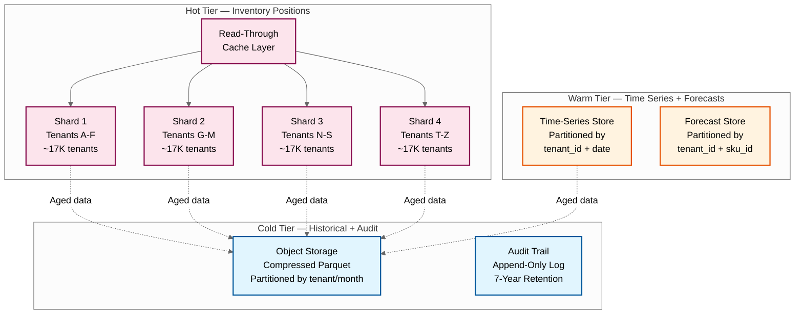
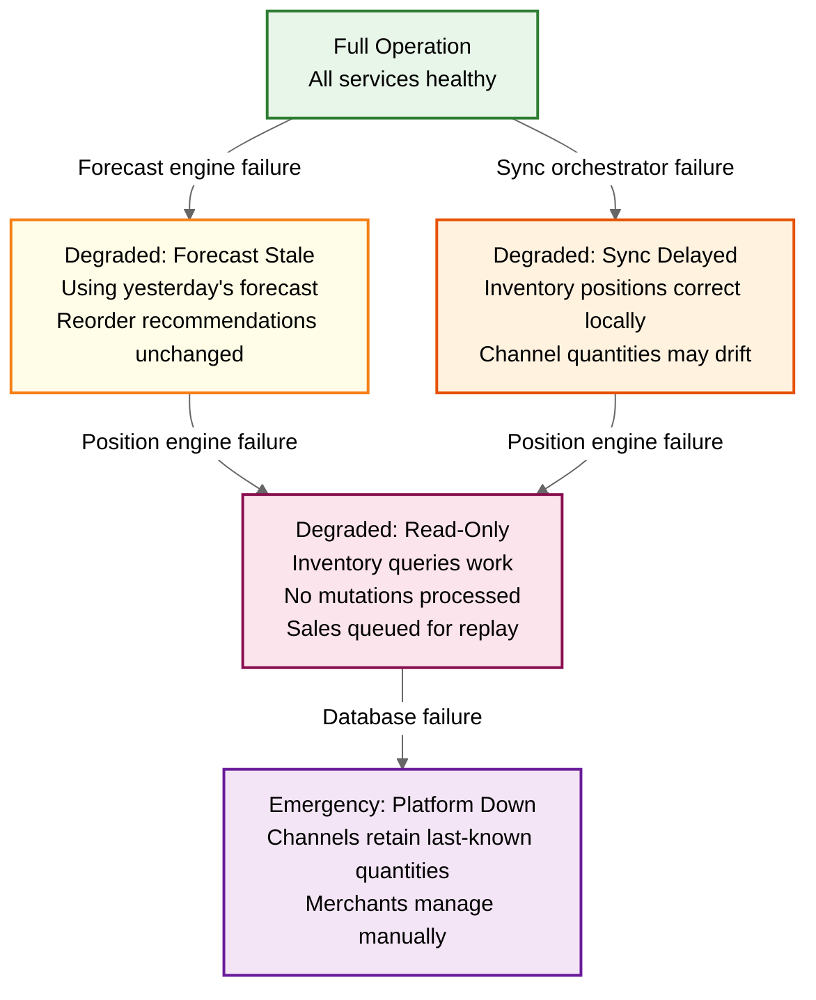

# 14.4 AI-Native SME Inventory & Demand Forecasting System — Scalability & Reliability

## Multi-Tenant Architecture at SME Scale

### The Economics of SME Multi-Tenancy

The defining constraint of an SME inventory platform is cost per tenant. Enterprise inventory systems charge $5,000–$50,000/month; an SME platform must operate at $20–$100/month per tenant to be viable. This means infrastructure cost per tenant must be under $5/month, with the remainder covering margin, support, and R&D. At 100,000 tenants and $5/tenant/month, the total infrastructure budget is $500,000/month—for a system handling 50M orders/day, 500M forecasts/night, and 255M sync events/day.

### Tenant Isolation Strategy

| Layer | Isolation Model | Rationale |
|---|---|---|
| **Compute** | Shared compute with tenant-scoped rate limiting | Dedicated compute per tenant would cost $50+/month; shared compute with per-tenant quotas achieves density |
| **Application** | Tenant ID in every query, enforced at middleware | All API calls carry tenant_id in authentication token; middleware injects tenant_id into every database query; no business logic can omit tenant scoping |
| **Data — Hot** | Shared database with tenant_id partition key | Inventory positions, channel sync state partitioned by tenant_id + sku_id; ensures queries never scan cross-tenant data |
| **Data — Analytics** | Shared time-series store with tenant_id prefix | Sales history, forecast data use tenant_id as partition prefix; analytical queries are tenant-scoped by construction |
| **Data — Sensitive** | Per-tenant encryption key for channel credentials | OAuth tokens and API keys encrypted with tenant-specific keys derived from a master key; key rotation per tenant |
| **ML Models** | Shared category-level models; tenant-specific parameters | Category-level forecast models (e.g., "food > snacks") trained once on pooled anonymized data; per-tenant SKU parameters stored separately |
| **Channel Connections** | Per-tenant connection pool with shared infrastructure | Each tenant's channel OAuth tokens managed independently; connection pooling shared across tenants hitting the same channel API |

### Tenant Size Tiers and Resource Allocation

| Tier | SKU Count | Orders/Day | Forecast Budget | Sync Budget | Tenant Count |
|---|---|---|---|---|---|
| **Micro** | 1–200 | 1–50 | 200 SKU-location × 4 models = 800 evaluations | 50 sync events/day | 40,000 |
| **Small** | 201–2,000 | 51–500 | 5,000 SKU-loc × 4 models = 20,000 evaluations | 2,500 sync events/day | 35,000 |
| **Medium** | 2,001–10,000 | 501–3,000 | 25,000 SKU-loc × 4 models = 100,000 evaluations | 15,000 sync events/day | 20,000 |
| **Large** | 10,001–50,000 | 3,001–10,000 | 125,000 SKU-loc × 4 models = 500,000 evaluations | 50,000 sync events/day | 5,000 |

### Noisy Neighbor Prevention

Large tenants can monopolize shared resources during peak operations. Mitigation:

```
ALGORITHM TenantRateLimiting(tenant_id, operation_type):
    tier ← get_tenant_tier(tenant_id)

    rate_limits ← {
        MICRO:  { api: 10/sec, sync: 5/sec, forecast: 100/min },
        SMALL:  { api: 50/sec, sync: 25/sec, forecast: 500/min },
        MEDIUM: { api: 200/sec, sync: 100/sec, forecast: 2000/min },
        LARGE:  { api: 500/sec, sync: 250/sec, forecast: 5000/min }
    }

    limit ← rate_limits[tier][operation_type]

    // Token bucket rate limiter per tenant per operation type
    bucket ← get_token_bucket(tenant_id, operation_type)
    IF bucket.try_consume(1):
        ALLOW operation
    ELSE:
        IF operation_type == SYNC AND is_critical_sku(context):
            // Allow critical SKU syncs (low stock, hero products) to bypass rate limit
            ALLOW with priority flag
        ELSE:
            REJECT with 429 Too Many Requests
            queue_for_later(tenant_id, operation)
```

---

## Horizontal Scaling Strategy

### Service-Level Scaling

| Service | Scaling Dimension | Scaling Mechanism | Scaling Trigger |
|---|---|---|---|
| **Webhook Receiver** | HTTP request rate | Horizontal pod autoscaling on request rate | > 80% CPU or > 10K requests/sec/pod |
| **Inventory Position Engine** | SKU mutation rate | Partition by tenant_id hash; add partitions for hot tenants | > 5K mutations/sec on any partition |
| **Sync Orchestrator** | Channel API call rate | Horizontal scaling bounded by channel API rate limits | Queue depth > 1000 or sync latency > 10s |
| **Forecast Engine** | SKU-location count | Horizontal scaling during batch window; scale to zero off-window | Batch completion deadline risk (projected finish > 6 AM) |
| **Reorder Optimizer** | SKU-location count | Co-located with forecast engine; scales together | Same as forecast engine |
| **Channel Adapters** | Per-channel connection count | Independent scaling per channel type | Channel-specific API error rate > 5% |

### Data Layer Scaling



**Sharding strategy:**
- **Inventory positions**: Hash-partitioned by `tenant_id`. Each shard handles ~25K tenants. Shard splitting when any shard exceeds 50K tenants or 200K mutations/second.
- **Time-series data**: Range-partitioned by `tenant_id + date`. Recent data (last 90 days) on SSD-backed storage; older data migrated to object storage in compressed columnar format.
- **Forecasts**: Hash-partitioned by `tenant_id + sku_id`. Rolling 90-day window; expired forecasts archived.

---

## Peak Season Handling

### Predictable Peaks (Festivals, Holidays)

| Phase | Timing | Action |
|---|---|---|
| **Planning** | T-30 days | Analyze previous year's peak patterns; project this year's peak magnitude; pre-compute peak-adjusted forecasts for top tenants |
| **Pre-scaling** | T-7 days | Scale webhook receivers to 3x baseline; scale sync orchestrator to 2x; pre-warm caches with hot-SKU inventory positions |
| **Active peak** | T to T+3 days | Dynamic autoscaling active; increased batching windows for sync (500ms → 2s); elevated safety buffers on all channels; deferred non-critical operations (analytics, classification) |
| **Cool-down** | T+3 to T+7 days | Gradual scale-down; process deferred operations; run comprehensive reconciliation across all tenants and channels; generate post-peak analytics |

### Unpredictable Peaks (Viral Products, Flash Sales)

Individual tenants may experience sudden 10x traffic spikes that are unpredictable:

```
ALGORITHM HandleUnexpectedSpike(tenant_id):
    // Detect spike: current order rate > 5x 28-day average for this time of day
    current_rate ← get_order_rate(tenant_id, window=5_minutes)
    baseline_rate ← get_baseline_rate(tenant_id, time_of_day=now)

    IF current_rate > 5 * baseline_rate:
        spike_detected ← true

        // 1. Elevate tenant priority in processing queues
        set_tenant_priority(tenant_id, ELEVATED)

        // 2. Increase safety buffers on all channels for affected SKUs
        hot_skus ← get_top_selling_skus(tenant_id, window=5_minutes, top=20)
        FOR sku IN hot_skus:
            increase_safety_buffer(sku, multiplier=3.0)

        // 3. Trigger real-time forecast refresh for affected SKUs
        trigger_forecast_refresh(tenant_id, hot_skus, reason="demand_spike")

        // 4. Alert merchant
        send_alert(tenant_id,
            type=DEMAND_SPIKE,
            message="Unusual demand spike detected: {current_rate}x normal rate. Safety buffers increased automatically. Review stock levels for top-selling items.",
            urgency=HIGH
        )

        // 5. Pre-generate reorder recommendations for hot SKUs
        FOR sku IN hot_skus:
            IF projected_stockout(sku) < 2_days:
                generate_urgent_reorder(sku)
```

---

## Multi-Region Deployment

### Geographic Distribution Strategy

| Region | Purpose | Services Deployed | Data Residency |
|---|---|---|---|
| **Primary (Region A)** | Full platform operation for tenants in geography | All services; primary database shards | Tenant data stored in tenant's home region |
| **Secondary (Region B)** | Full platform for different geography + DR | All services; independent database shards | Independent tenant set; cross-region replication for DR |
| **Edge (per geography)** | Low-latency webhook reception and API serving | Webhook receivers, API gateway, read cache | No persistent data; proxies to home region |

### Cross-Region Considerations

Channel APIs are typically global (one marketplace API endpoint serves all regions), so channel sync doesn't benefit from regional deployment. However:

- **Webhook reception** benefits from edge deployment: lower latency acknowledgment reduces webhook timeout retries
- **API serving** benefits from regional deployment: merchant dashboards served from nearest region
- **Forecast computation** is region-independent: batch workloads can be distributed across regions based on capacity availability

### Disaster Recovery

| Component | RPO (Recovery Point Objective) | RTO (Recovery Time Objective) | Strategy |
|---|---|---|---|
| **Inventory positions** | 0 (zero data loss) | < 5 minutes | Synchronous replication to standby; automatic failover |
| **Channel sync state** | ≤ 1 minute | < 10 minutes | Async replication + reconciliation on failover |
| **Sales history** | ≤ 5 minutes | < 30 minutes | Async replication; acceptable to replay last 5 minutes of events |
| **Forecast data** | ≤ 24 hours | < 2 hours | Regenerated from sales history; last night's forecasts available from replica |
| **Audit trail** | 0 (zero data loss) | < 15 minutes | Append-only log with synchronous replication |

---

## Fault Tolerance

### Service Failure Impact and Mitigation

| Service | Failure Impact | Detection | Mitigation |
|---|---|---|---|
| **Webhook Receiver** | Missed sales events → inventory drift | Health check failure; webhook acknowledge rate drop | Multiple receiver instances behind load balancer; channel retries (most channels retry webhooks 3–5 times over 24 hours); polling scheduler as fallback |
| **Inventory Position Engine** | Cannot process mutations → stale positions | Mutation queue depth growing; latency spike | Multi-instance with partitioned ownership; failover partition to standby instance within 30 seconds |
| **Sync Orchestrator** | Channel quantities not updated → overselling risk | Sync success rate drop; queue depth growing | Circuit breaker prevents cascading failure; last-known-good quantities remain on channels; reconciliation corrects drift on recovery |
| **Forecast Engine** | No new forecasts → stale reorder recommendations | Batch job failure; forecast freshness metric | Previous day's forecasts remain valid for 24–48 hours; reorder points calculated with safety margin absorb short-term forecast staleness |
| **Channel Adapter** | Cannot communicate with specific channel | API error rate > 10%; circuit breaker trips | Per-channel circuit breaker; other channels unaffected; queued updates applied when channel recovers |
| **Database (hot tier)** | Cannot read/write inventory positions | Connection failures; replication lag | Primary-replica with automatic failover; read replicas for dashboard queries; WAL for durability |

### Graceful Degradation Hierarchy



### Inventory Consistency Guarantees

The system provides the following consistency guarantees under different failure scenarios:

| Guarantee | Description | Implementation |
|---|---|---|
| **Monotonic position updates** | Inventory position version is monotonically increasing; stale updates are rejected | Version field in inventory position record; compare-and-swap for all mutations |
| **At-least-once processing** | Every sales event is processed at least once (idempotent processing prevents double-deduction) | Idempotency key stored for 24-hour window; duplicate events detected and skipped |
| **Causal ordering per SKU-location** | Events for the same SKU-location are processed in causal order | Per-SKU-location mutex; events queued by receipt timestamp within partition |
| **Eventually consistent cross-channel** | All channels converge to the same ATP within bounded time (< 1 hour under normal operations) | Reconciliation engine detects and corrects drift every 4 hours; sync orchestrator pushes on every mutation |
| **Durable audit trail** | Every inventory mutation is durably recorded before acknowledgment | Write-ahead log with synchronous disk flush; audit records immutable after write |

### Event Replay and Recovery

When a service recovers from failure, it must process events that accumulated during the outage:

```
ALGORITHM RecoverFromOutage(service, outage_start, outage_end):
    // 1. Identify unprocessed events during outage window
    unprocessed ← event_queue.get_events(
        service=service,
        from=outage_start,
        to=outage_end,
        status=UNPROCESSED
    )

    // 2. Sort events by timestamp (causal ordering within each SKU-location)
    sorted_events ← unprocessed.sort_by(timestamp ASC)

    // 3. Process events sequentially within each SKU-location partition
    partitions ← group_by(sorted_events, key=(tenant_id, sku_id, location_id))

    FOR partition IN partitions:
        FOR event IN partition.events:
            process_event(event)  // idempotent — safe to replay

    // 4. Trigger reconciliation for all affected tenant-channels
    affected_tenants ← unique(sorted_events.tenant_id)
    FOR tenant IN affected_tenants:
        FOR channel IN get_tenant_channels(tenant):
            reconcile(tenant, channel)

    // 5. Report recovery metrics
    RETURN RecoveryReport(
        events_replayed=len(sorted_events),
        partitions_affected=len(partitions),
        tenants_affected=len(affected_tenants),
        recovery_duration=now - recovery_start
    )
```

---

## Capacity Planning and Growth

### Growth Projections

| Metric | Year 1 | Year 2 | Year 3 | Scaling Strategy |
|---|---|---|---|---|
| **Tenants** | 20,000 | 60,000 | 100,000 | Add database shards; scale compute linearly |
| **Total SKU-locations** | 100M | 300M | 500M | Time-series store partition management; forecast compute scaling |
| **Daily orders** | 10M | 30M | 50M | Webhook receiver fleet scaling; queue throughput |
| **Daily sync events** | 50M | 150M | 255M | Sync orchestrator fleet + channel adapter pool |
| **Storage (total)** | 20 TB | 60 TB | 100 TB | Tiered storage with automated lifecycle policies |
| **Forecast compute (nightly)** | 100M | 300M | 500M | Timezone-distributed batch processing |

### Scaling Bottleneck Prediction

| Growth Milestone | Expected Bottleneck | Pre-emptive Action |
|---|---|---|
| **50K tenants** | Database connection pool exhaustion | Implement connection multiplexing; move read queries to replicas |
| **100K tenants** | Forecast batch window exceeds 6 hours | Implement incremental forecasting (only re-forecast SKUs with new data or accuracy degradation) |
| **200M daily syncs** | Channel API aggregate rate limits | Negotiate higher rate limits with channels; implement smarter batching |
| **500M SKU-locations** | Memory pressure on feature store | Implement tiered feature store: hot features in memory, warm features on SSD |
| **1B daily events** | Event queue throughput | Partition event queue by tenant hash; add queue cluster capacity |
