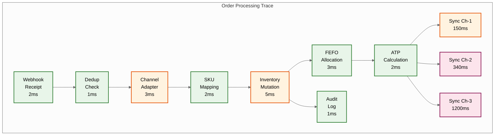
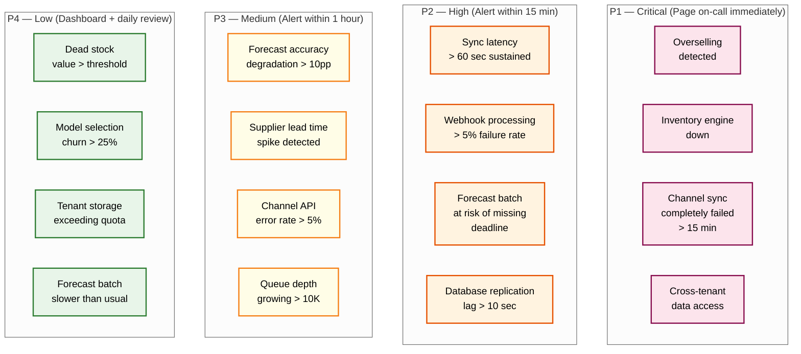

# 14.4 AI-Native SME Inventory & Demand Forecasting System — Observability

## Key Metrics

### Forecast Accuracy Metrics

| Metric | Computation | Granularity | Target | Alert Threshold |
|---|---|---|---|---|
| **WAPE (Weighted Absolute Percentage Error)** | Σ\|actual - forecast\| / Σ actual | Per SKU-location, aggregated by ABC class, tenant, and platform | A-class: ≤ 25%; B-class: ≤ 35%; C-class: ≤ 50% | Degradation > 10 percentage points from 28-day rolling average |
| **Forecast Bias** | Σ(forecast - actual) / Σ actual | Per SKU-location, aggregated by model type | -5% to +5% (unbiased) | Bias > ±15% sustained over 7 days |
| **Coverage (calibration)** | % of actuals within P5-P95 forecast interval | Per model type, aggregated across SKUs | 85-95% (expected: 90%) | Coverage < 80% or > 98% (under/over-confident) |
| **Forecast Value Add (FVA)** | 1 - (WAPE_model / WAPE_naive) | Per model type vs. naive forecast (last week's demand) | > 0.15 (model adds ≥ 15% value over naive) | FVA < 0.05 (model barely better than naive) |
| **Cold-Start Convergence Days** | Days from SKU launch until WAPE drops below target | Per SKU, aggregated by category | ≤ 28 days for A/B class | > 42 days without convergence |
| **Model Selection Stability** | % of SKUs that changed model in last reclassification | Platform-wide | < 10% per week (stable) | > 25% in a single week (systemic shift) |
| **Promotion Forecast Accuracy** | WAPE during promotion periods only | Per promotion type | ≤ 40% (promotions are harder to forecast) | > 60% across multiple promotions |

### Inventory Health Metrics

| Metric | Computation | Granularity | Target | Alert Threshold |
|---|---|---|---|---|
| **Stockout Rate** | SKU-location-days with zero available / total SKU-location-days | Per tenant, ABC class | A-class: < 2%; B-class: < 5%; C-class: < 10% | A-class stockout > 5%; any hero SKU stockout |
| **Overstock Rate** | SKU-locations where days_of_supply > 2x target | Per tenant | < 15% of SKU-locations | > 25% overstocked; individual SKU with > 90 days of supply |
| **Dead Stock Value** | Sum of cost_price × on_hand for SKUs with zero sales in 90+ days | Per tenant | < 5% of total inventory value | > 10% of inventory value is dead stock |
| **Inventory Turnover** | COGS / average inventory value | Per tenant, per category | Category-dependent (food: 12-24x/year; electronics: 6-12x/year) | Below category 25th percentile |
| **Days of Supply** | on_hand / avg_daily_demand | Per SKU-location | 7-30 days depending on lead time and ABC class | < 3 days for A-class (imminent stockout); > 90 days (overstock) |
| **Fill Rate** | Orders fulfilled completely / total orders | Per tenant, per channel | > 98% | < 95% |
| **Waste Rate (perishable)** | Wasted units / (sold units + wasted units) | Per SKU, per category | < 3% for food; < 1% for pharma | > 5% for any SKU; > 3% for tenant average |
| **Reorder Recommendation Adoption** | Approved recommendations / total recommendations | Per tenant | > 70% | < 50% (merchant doesn't trust recommendations) |

### Channel Sync Metrics

| Metric | Computation | Granularity | Target | Alert Threshold |
|---|---|---|---|---|
| **Sync Latency (p95)** | Time from inventory mutation to channel acknowledgment | Per channel type | < 10 seconds | > 30 seconds sustained; > 60 seconds for any single sync |
| **Sync Success Rate** | Successful syncs / total sync attempts | Per channel, per tenant | > 99.5% | < 98% for any channel |
| **Inventory Drift** | \|channel_reported - platform_published\| / platform_published | Per channel, per tenant | < 2% of SKUs with drift | > 5% of SKUs with drift; any A-class SKU with drift |
| **Oversell Count** | Orders where allocated > on_hand at time of processing | Per tenant, per day | 0 (zero oversells) | Any oversell on A-class SKU; > 3 oversells/day per tenant |
| **Reconciliation Correction Volume** | Quantity corrections applied during reconciliation | Per channel, per sweep | < 1% of SKUs require correction | > 5% of SKUs corrected in single sweep |
| **Circuit Breaker State** | Current state of channel circuit breakers | Per channel adapter | CLOSED (healthy) | OPEN for > 15 minutes |
| **Webhook Processing Rate** | Webhooks processed / webhooks received | Platform-wide | > 99.9% | < 99% (losing events) |
| **Webhook Processing Latency (p99)** | Time from webhook receipt to inventory update | Platform-wide | < 2 seconds | > 5 seconds |

### Supplier Performance Metrics

| Metric | Computation | Granularity | Target | Alert Threshold |
|---|---|---|---|---|
| **On-Time Delivery Rate** | POs delivered within promised window / total POs | Per supplier, per tenant | > 90% | < 80%; declining trend over 3 consecutive months |
| **Lead Time Accuracy** | Actual lead time vs. predicted lead time | Per supplier-SKU | Actual within ±2 days of prediction | Actual > predicted + 5 days (safety stock insufficient) |
| **Fill Rate** | Received quantity / ordered quantity | Per supplier | > 95% | < 90%; consistent short shipments |
| **Quality Rejection Rate** | Rejected units / received units | Per supplier | < 2% | > 5% |

### Platform Operational Metrics

| Metric | Computation | Granularity | Target | Alert Threshold |
|---|---|---|---|---|
| **API Response Time (p99)** | Server-side response latency | Per endpoint | < 200 ms | > 500 ms |
| **API Error Rate** | 5xx responses / total responses | Per endpoint | < 0.1% | > 1% |
| **Forecast Batch Completion** | Time from batch start to all-tenants-complete | Per nightly run | < 6 hours | > 5 hours (risk of missing 6 AM deadline) |
| **Event Queue Depth** | Unprocessed events in queue | Per queue partition | < 1000 | > 10,000 (processing falling behind) |
| **Tenant Data Size** | Storage per tenant | Per tenant | < 10 GB for median tenant | > 50 GB (investigation needed) |
| **Multi-Tenant Resource Fairness** | CPU/memory consumption per tenant vs. tier allocation | Per tenant tier | Within 2x tier allocation | > 5x tier allocation (noisy neighbor) |

---

## Logging Strategy

### Log Classification

| Log Level | Use Case | Retention | Storage |
|---|---|---|---|
| **AUDIT** | Every inventory mutation, PO state change, credential access, channel connection change | 7 years | Immutable append-only store; encrypted at rest |
| **ERROR** | Service failures, unhandled exceptions, data integrity violations, sync failures | 90 days | Searchable log store with structured fields |
| **WARN** | Forecast accuracy degradation, approaching capacity limits, retry attempts, partial failures | 30 days | Searchable log store |
| **INFO** | Request/response summaries (no PII), batch job start/complete, model selection decisions | 14 days | Time-partitioned log store; auto-archived |
| **DEBUG** | Detailed processing traces, algorithm intermediate values, sync negotiation details | 3 days | Only enabled per-tenant via debug flag; auto-purged |

### Structured Log Format

```
LogEntry:
  timestamp:        datetime_us           # microsecond precision
  level:            enum[AUDIT, ERROR, WARN, INFO, DEBUG]
  service:          string                # originating service name
  instance_id:      string                # specific instance/pod
  trace_id:         string                # distributed trace identifier
  span_id:          string                # span within trace
  tenant_id:        string                # ALWAYS present; never null
  operation:        string                # e.g., "inventory.adjust", "sync.push", "forecast.run"

  context:
    sku_id:          string (optional)
    location_id:     string (optional)
    channel_id:      string (optional)
    supplier_id:     string (optional)
    po_id:           string (optional)
    batch_id:        string (optional)

  payload:
    // Operation-specific data
    // NEVER contains: passwords, tokens, full names, email addresses, physical addresses
    // Financial amounts are logged for AUDIT level only

  duration_ms:      float                 # operation duration
  outcome:          enum[SUCCESS, FAILURE, PARTIAL]
  error_code:       string (optional)
  error_message:    string (optional)     # sanitized; no PII
```

### Critical Log Points

| Operation | Log Level | Fields Captured | Purpose |
|---|---|---|---|
| **Order received** | INFO | tenant_id, channel_id, order_id, line_item_count, total_quantity | Order volume monitoring; channel health |
| **Inventory mutation** | AUDIT | tenant_id, sku_id, location_id, mutation_type, previous_qty, new_qty, actor | Full audit trail for every stock change |
| **Channel sync** | INFO/WARN | tenant_id, channel_id, sku_id, published_qty, sync_latency_ms, outcome | Sync health monitoring |
| **Forecast model selection** | INFO | tenant_id, sku_id, selected_model, wape, runner_up_model, runner_up_wape | Model performance tracking |
| **Reorder triggered** | INFO | tenant_id, sku_id, current_available, reorder_point, recommended_qty | Reorder automation monitoring |
| **Oversell detected** | ERROR | tenant_id, sku_id, channel_id, allocated, on_hand, resolution_action | Oversell investigation and prevention |
| **Batch expiry alert** | WARN | tenant_id, sku_id, batch_id, days_to_expiry, current_quantity, value | Waste prevention tracking |
| **Credential access** | AUDIT | tenant_id, channel_id, accessing_service, operation, success | Security monitoring |

---

## Distributed Tracing

### Trace Architecture

Every user-facing request and webhook event generates a trace that follows the event through all services:



### Key Trace Scenarios

| Scenario | Spans | Expected Duration | SLO |
|---|---|---|---|
| **Order → Inventory Update** | Webhook → Dedup → Adapter → Mapping → Mutation | < 50 ms | p99 < 200 ms |
| **Order → Channel Sync Complete** | Above + ATP Calc → Sync to all channels | < 5 seconds | p95 < 10 seconds |
| **Forecast for Single SKU** | Feature extraction → Model selection → Inference → Distribution computation | < 50 ms | p95 < 100 ms |
| **Reorder Recommendation** | Forecast lookup → Lead time lookup → Stochastic optimization → PO generation | < 200 ms | p99 < 500 ms |
| **Full Reconciliation** | Fetch channel inventory → Compare → Process missing orders → Push corrections | < 30 seconds per channel | p95 < 60 seconds |

### Trace Sampling Strategy

| Traffic Type | Sampling Rate | Rationale |
|---|---|---|
| Error traces | 100% | Every error needs investigation capability |
| Oversell event traces | 100% | Critical business event; always retain |
| High-latency traces (> 2x p50) | 100% | Performance debugging |
| Normal webhook processing | 1% | Volume too high for 100%; 1% gives statistical significance |
| Forecast batch processing | 10% | Moderate volume; useful for performance optimization |
| API read queries | 0.5% | Very high volume; minimal debugging value |

---

## Alerting Rules

### Alert Hierarchy



### Alert Definitions

| Alert | Condition | Evaluation Period | Action |
|---|---|---|---|
| **Oversell Detected** | `allocated > on_hand` for any SKU-location after mutation processing | Every mutation | Page on-call; auto-trigger oversell resolution workflow; log full trace |
| **Inventory Engine Down** | Health check failure for > 30 seconds | Every 10 seconds | Page on-call; auto-failover to standby; queue all mutations for replay |
| **Channel Sync Stalled** | No successful sync for any channel adapter for > 15 minutes | Every minute | Page on-call; check circuit breaker state; escalate to channel API status page |
| **Sync Latency Spike** | p95 sync latency > 60 seconds sustained for 5 minutes | Every minute | Alert on-call; investigate channel API response times; consider increasing batching window |
| **Webhook Storm** | Incoming webhook rate > 5x baseline for > 2 minutes | Every 30 seconds | Auto-scale webhook receivers; enable admission control; alert platform team |
| **Forecast Accuracy Degradation** | WAPE increase > 10 percentage points for > 20% of A-class SKUs for > 7 days | Daily | Alert data science team; investigate for data quality issues, regime change, or external events |
| **Batch Expiry Imminent** | Any batch with > 100 units reaching expiry within 7 days without merchant action | Daily | Escalate alert to merchant via WhatsApp/SMS; suggest deep markdown |
| **Stockout Imminent (Hero SKU)** | A-class SKU with days_of_supply < lead_time and no in-transit stock | Every 4 hours | Alert merchant with urgent reorder recommendation; auto-generate draft PO |
| **Cross-Tenant Access Attempt** | Any query returning data for non-authenticated tenant | Every query (inline) | Immediate block; P1 security alert; incident investigation |
| **Credential Rotation Failure** | Channel credential refresh failed 3 consecutive times | On failure | Alert merchant to re-authorize channel; disable channel sync to prevent stale operations |

### Alert Fatigue Prevention

| Mechanism | Implementation |
|---|---|
| **Deduplication** | Same alert condition for same tenant-SKU-channel not re-fired within 24 hours |
| **Aggregation** | "5 SKUs approaching stockout" instead of 5 individual alerts |
| **Severity auto-adjustment** | Alert downgraded if merchant has consistently ignored similar alerts (they may have context the system doesn't) |
| **Quiet hours** | Non-critical alerts suppressed during merchant-configured quiet hours (e.g., 10 PM – 7 AM); critical alerts always fire |
| **Weekly digest** | All low-severity alerts aggregated into weekly summary email/message |

---

## Dashboard Design

### Merchant Dashboard — Primary View

| Section | Content | Refresh Rate |
|---|---|---|
| **Health Score** | Single number (0-100) combining stockout rate, overstock rate, waste rate, forecast accuracy, and sync health | Real-time |
| **Urgent Actions** | Prioritized list of actions needing attention: reorder approvals, expiring inventory, oversell resolution, supplier delays | Real-time |
| **Inventory Overview** | Total SKUs, total value, average days of supply, trend direction (improving/stable/declining) | Hourly |
| **Channel Sync Status** | Green/amber/red indicators per channel; last sync time; any failed syncs | Real-time |
| **Top 10 Stockout Risk** | SKUs most likely to stock out within lead time, with estimated stockout date and recommended action | Every 4 hours |
| **Sales Velocity** | Today's sales vs. forecast, by channel; trend over last 7 days | Hourly |
| **Approaching Expiry** | Batches expiring within 30 days, with quantity, value, and markdown recommendations | Daily |

### Platform Operations Dashboard

| Section | Content | Audience |
|---|---|---|
| **Tenant Health Heatmap** | Color-coded grid showing health score per tenant; drill-down to specific issues | Platform SRE |
| **Forecast Batch Progress** | Real-time progress of nightly forecast batch; projected completion time; per-timezone breakdown | Data Engineering |
| **Channel API Health** | Per-channel adapter status, error rates, latency percentiles, circuit breaker states | Platform Engineering |
| **Sync Pipeline** | Event queue depths, processing rates, backlog trends, per-channel sync success rates | Platform SRE |
| **Resource Utilization** | CPU, memory, storage, network per service; per-tenant resource consumption for top 20 tenants | Infrastructure |
| **Model Performance** | Per-model-type accuracy trends; model selection distribution; FVA trends | Data Science |

### Forecast Accuracy Dashboard

| Section | Content | Audience |
|---|---|---|
| **Accuracy by ABC Class** | WAPE trend over 90 days, broken down by A/B/C class; comparison against target | Data Science, Product |
| **Accuracy by Model Type** | Per-model WAPE; model selection share; cases where model selection changed | Data Science |
| **Bias Analysis** | Systematic over/under-forecasting by category, channel, day-of-week | Data Science |
| **Cold-Start Performance** | Average convergence days for new SKUs; convergence rate by category; analogous SKU quality | Data Science |
| **Promotion Impact** | Promotion forecast accuracy vs. non-promotion; actual uplift vs. predicted uplift | Data Science, Product |
| **Worst Performers** | SKUs with worst forecast accuracy (excluding long-tail); investigation queue | Data Science |

### Anomaly Investigation Dashboard

| Section | Content | Trigger |
|---|---|---|
| **Demand Anomaly Detail** | Time series showing actual vs. forecast with anomaly highlighted; external events on timeline; similar SKU comparison | Demand anomaly alert |
| **Sync Drift Investigation** | Platform vs. channel quantity history; sync event timeline; missing order analysis | Inventory drift alert |
| **Oversell Post-Mortem** | Timeline of events leading to oversell; sync latency at time of incident; safety buffer analysis | Oversell alert |
| **Forecast Degradation Root Cause** | Feature importance shifts; data quality metrics; recent model changes; external regime changes | Accuracy degradation alert |
