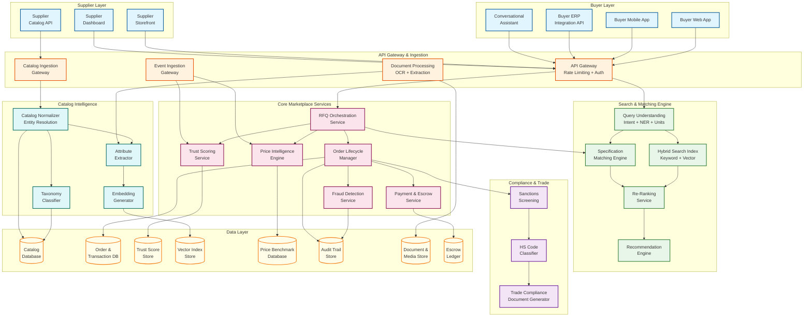
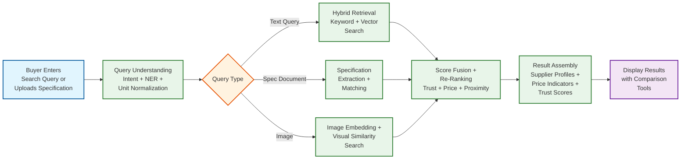
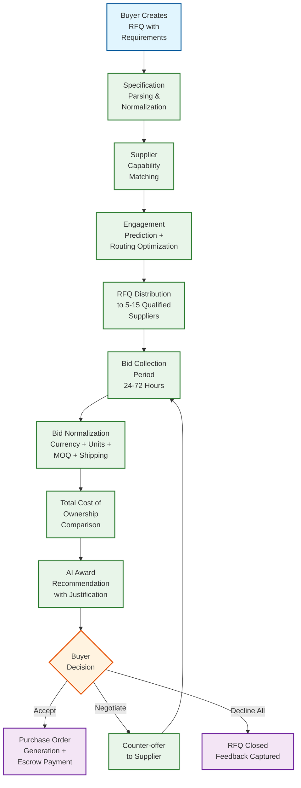
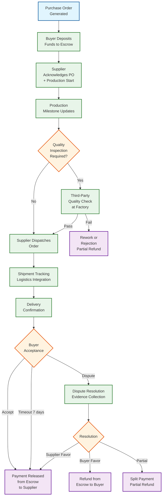

# 14.5 AI-Native B2B Supplier Discovery & Procurement Marketplace — High-Level Design

## System Architecture



---

## Key Design Decisions

### Decision 1: Hybrid Retrieval Architecture with Field-Aware Embeddings

The search and matching engine uses a hybrid retrieval architecture that combines sparse keyword retrieval (inverted index on product attributes, category codes, and certification identifiers) with dense vector similarity search (transformer-based embeddings of product descriptions and specifications). Rather than encoding the entire product listing into a single embedding vector, the system generates field-aware embeddings: separate vectors for material properties, dimensional specifications, certification attributes, and general product description. This allows the re-ranking model to weight different attribute matches independently—a buyer searching for "316 stainless steel pipe, 2 inch, DN50" needs an exact match on material (316 SS) and dimension (2 inch / DN50) but can tolerate flexibility on brand or surface finish.

**Implication:** The vector index stores 4 sub-vectors per product listing (material: 96-dim, dimension: 96-dim, certification: 64-dim, general: 128-dim = 384 total dimensions). The search pipeline runs 4 parallel ANN queries, one per field, and fuses scores with learned weights. This quadruples the ANN query count but dramatically improves precision for specification-heavy queries compared to single-vector approaches. The index size is equivalent to a single 384-dim vector per product (50M × 384 × 4 bytes ≈ 77 GB) but requires separate HNSW graphs per field for independent querying.

### Decision 2: Multi-Signal Trust Scoring with Exponential Decay

The supplier trust score is not a simple average of buyer ratings. It is a composite index computed from 5 signal categories, each with configurable weights and exponential time decay:

1. **Verification signals (30% weight, no decay):** Factory audit completion, business registration validation, certification authenticity, financial health from GST filings—these are point-in-time verifications that do not decay but can be refreshed.
2. **Transaction metrics (35% weight, 90-day half-life):** Order fulfillment rate, quality rejection rate, on-time delivery percentage, order completion rate—computed from completed orders with exponential decay so recent performance dominates.
3. **Behavioral signals (15% weight, 30-day half-life):** RFQ response time, quotation accuracy (how often quoted price matches final invoice), communication responsiveness—fast-decaying to reflect current engagement level.
4. **Buyer reviews (15% weight, 180-day half-life):** Review sentiment analysis, rating distribution, review velocity—slower decay because reputation effects are persistent.
5. **Platform engagement (5% weight, 30-day half-life):** Catalog freshness, login frequency, profile completeness—minor signal but penalizes dormant suppliers.

**Implication:** The trust score changes continuously as new signals arrive and old signals decay. A supplier who had excellent performance 12 months ago but has been declining will see their trust score drop even without new negative events, because the high-weight positive signals from 12 months ago have decayed significantly. The daily batch recalculation recomputes all scores from raw signals with current decay weights, serving as a consistency checkpoint for the real-time incremental updates.

### Decision 3: RFQ Routing as a Constrained Optimization Problem

RFQ distribution is not a simple "send to the top-10 matching suppliers." It is a constrained optimization that maximizes expected bid quality while respecting supplier fatigue constraints:

**Objective:** Maximize P(≥3 qualified bids received) × E[bid quality | bids received]

**Constraints:**
- Each supplier receives ≤ 20 RFQs per day (fatigue cap)
- Selected suppliers must span ≥ 2 geographic regions (diversity)
- At least 1 verified/premium supplier must be included (quality floor)
- Total RFQ distribution ≤ 15 suppliers per RFQ (cost constraint)
- Suppliers with <10% historical response rate for this category are excluded

**Implication:** The optimization runs a constrained beam search over the candidate supplier set (typically 50-200 matched suppliers per RFQ). The engagement prediction model (logistic regression on supplier response history, current RFQ load, category match quality, and time-of-day) estimates P(response) for each supplier-RFQ pair. The solver selects the 5-15 supplier subset that maximizes expected competitive bid coverage while satisfying all constraints. This runs in ~200ms per RFQ—fast enough for the real-time path.

### Decision 4: Event-Sourced Order Lifecycle with Escrow State Machine

Every order state transition is recorded as an immutable event in an append-only event store. The order lifecycle is modeled as a state machine with escrow payment gates at critical transitions:

```
PO_CREATED → SUPPLIER_ACKNOWLEDGED → PRODUCTION_STARTED → QUALITY_INSPECTION →
DISPATCHED → IN_TRANSIT → DELIVERED → BUYER_ACCEPTED → PAYMENT_RELEASED → COMPLETED
```

Escrow gates: buyer deposits funds at PO_CREATED; funds are held until BUYER_ACCEPTED; partial release at DISPATCHED for milestone-based payments; full release at BUYER_ACCEPTED; automatic release after 7-day timeout at DELIVERED if buyer does not explicitly accept or dispute.

**Implication:** The event-sourced design provides a complete audit trail for dispute resolution (the system can replay the exact sequence of events for any order), enables analytics on order lifecycle patterns (average time in each state, bottleneck identification), and supports the escrow state machine which must be provably consistent (funds must never be both held and released). The escrow ledger is a separate double-entry bookkeeping system with its own consistency guarantees, connected to the order event stream via an event handler that validates every escrow state transition against the order state machine rules.

### Decision 5: Catalog Normalization Pipeline with Entity Resolution

Supplier catalogs arrive in wildly different formats and quality levels. The catalog normalization pipeline transforms raw supplier input into standardized, searchable product listings through a multi-stage AI pipeline:

1. **Format normalization:** Convert CSV, Excel, XML, and manual entries into a canonical JSON schema.
2. **Attribute extraction:** NLP-based extraction of structured attributes (material, dimensions, weight, certifications) from unstructured product descriptions using domain-specific named entity recognition.
3. **Category classification:** Assign each product to the 5,000+ leaf category taxonomy using a hierarchical text classification model.
4. **Unit normalization:** Convert all dimensional attributes to canonical units (metric base units) while preserving the original values for display.
5. **Entity resolution:** Identify and merge duplicate product listings across suppliers (same underlying product listed by multiple distributors or with slightly different descriptions by the same supplier).
6. **Embedding generation:** Generate dense vector embeddings for each normalized product listing for vector similarity search.

**Implication:** Entity resolution is the most challenging step because false positives (merging distinct products) are far more costly than false negatives (failing to merge duplicates). A "2-inch stainless steel pipe" from Supplier A and a "DN50 SS pipe" from Supplier B may be the same product, but a "2-inch stainless steel pipe" and a "2-inch stainless steel tube" are different products (pipe vs. tube have different wall thickness standards). The entity resolution model uses a conservative threshold (merge only when similarity >0.95) and maintains a "candidate duplicate" queue for manual review when similarity is 0.85-0.95.

---

## Data Flow: Buyer Search to Supplier Discovery



---

## Data Flow: RFQ Lifecycle



---

## Data Flow: Order Lifecycle with Escrow



---

## Component Responsibilities Summary

| Component | Primary Responsibility | Key Interface |
|---|---|---|
| **Query Understanding Service** | Parse buyer search queries: intent classification (product search, supplier search, price check), named entity recognition (material, dimension, standard), unit normalization, synonym expansion, and query reformulation for improved recall | Receives raw query from API gateway; produces structured query with extracted entities and normalized units |
| **Hybrid Search Index** | Maintain inverted index (keyword search) and HNSW vector index (dense similarity search) over 50M+ product listings; execute parallel sparse + dense retrieval; return candidate sets with relevance scores | Receives structured query from QU service; returns top-K candidates with scores from both retrieval paths |
| **Specification Matching Engine** | Deep specification compatibility analysis: parse buyer requirement documents, extract structured specifications, match against supplier product attributes with tolerance-aware scoring, unit conversion, and standards equivalence resolution | Receives specification documents; returns compatibility scores per candidate product |
| **Re-Ranking Service** | Combine retrieval scores with business signals (trust score, price competitiveness, delivery capability, geographic proximity, buyer preference history) using a learned re-ranking model; produce final ranked result list | Receives candidate set with retrieval scores; produces final ranked list with explanation |
| **Catalog Normalizer** | Transform raw supplier catalog entries into standardized listings: format conversion, attribute extraction, category classification, unit normalization, entity resolution for duplicate detection, and embedding generation | Receives raw catalog data; produces normalized listings written to catalog DB and search indices |
| **RFQ Orchestration Service** | Manage the complete RFQ lifecycle: specification parsing, supplier matching and routing optimization, RFQ distribution, bid collection and normalization, total-cost-of-ownership comparison, award recommendation, and PO generation | Receives buyer RFQ; orchestrates matching, distribution, collection, and award |
| **Price Intelligence Engine** | Maintain historical transaction price database; compute real-time price benchmarks by category, specification, quantity, and geography; detect price anomalies in quotations; generate price trend analytics | Receives price queries from RFQ and search services; returns benchmark data and anomaly flags |
| **Trust Scoring Service** | Compute and maintain supplier trust indices from verification, transaction, behavioral, review, and engagement signals with exponential decay weighting; detect trust manipulation; provide trust scores for search ranking and RFQ routing | Receives trust signals from event bus; provides real-time trust scores to search and RFQ services |
| **Order Lifecycle Manager** | Orchestrate order state machine from PO creation through delivery and acceptance; manage milestone tracking, quality inspection gates, shipment tracking integration, and performance data capture | Receives POs from RFQ service; manages order states; feeds transaction signals to trust scoring |
| **Payment & Escrow Service** | Manage escrow-based B2B payments: buyer deposit, fund holding, milestone-based partial release, delivery-triggered full release, dispute-triggered holds, and refund processing; maintain double-entry escrow ledger | Receives payment instructions from order manager; manages escrow fund lifecycle |
| **Fraud Detection Service** | Detect fake supplier profiles, review manipulation, bid rigging, catalog spam, and price manipulation; score supplier legitimacy at onboarding; monitor behavioral anomalies in marketplace activity | Receives supplier and transaction data; produces fraud scores and alerts |
| **Sanctions Screening Service** | Screen buyers and suppliers against international sanctions lists (OFAC, EU, UN) for cross-border transactions; classify products for export control compliance; maintain screening audit trail | Receives entity data before order placement; returns screening results with compliance status |
