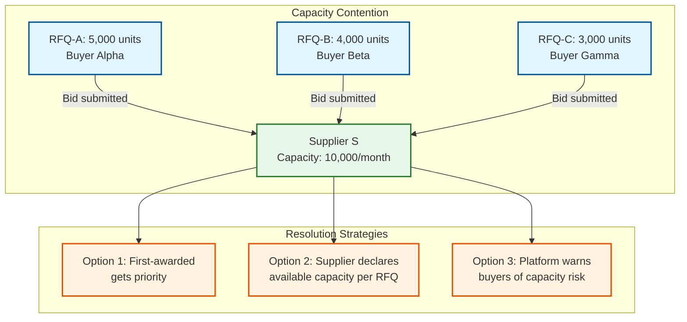

# 14.5 AI-Native B2B Supplier Discovery & Procurement Marketplace — Deep Dives & Bottlenecks

## Deep Dive 1: AI-Powered Supplier Matching with Field-Aware Embeddings

### The Vocabulary Gap Problem

B2B product search fundamentally differs from consumer product search. In B2C, buyers search for brands and categories ("Nike Air Max size 10") with a shared vocabulary between buyer and seller. In B2B procurement, buyers and suppliers use different terminology for the same product:

**Buyer query:** "food-grade stainless steel pipe, 2 inch, schedule 40, for dairy processing"

**Supplier A listing:** "SS304 Seamless Pipe, DN50, SCH40, ASTM A312, FDA Compliant"

**Supplier B listing:** "2-inch food-safe steel piping, 3mm wall, sanitary finish, USDA approved"

**Supplier C listing:** "Stainless 304L Welded Tube, 50.8mm OD, 3.68mm WT, 3A certified"

All three suppliers offer compatible products, but a keyword search for the buyer's query would miss Supplier A (no "food-grade" or "pipe" match) and Supplier C (uses "tube" not "pipe," lists in metric). The matching engine must bridge multiple gap types:

1. **Terminology gaps:** "pipe" vs. "tube" vs. "piping" (related but technically distinct—pipes are measured by nominal bore, tubes by outer diameter)
2. **Unit gaps:** "2 inch" vs. "DN50" vs. "50.8mm OD" (all referring to approximately the same physical dimension but in different systems)
3. **Standards gaps:** "food-grade" → FDA, USDA, 3A certification equivalence; "schedule 40" → specific wall thickness by pipe size
4. **Implicit requirements:** "for dairy processing" implies sanitary finish, specific surface roughness (Ra ≤ 0.8 μm), and weldability for CIP (clean-in-place) systems

### Field-Aware Embedding Architecture

Rather than encoding the entire product listing into a single embedding vector, the system generates separate embeddings for different attribute families:

```
Material Embedding (96 dimensions):
  Input: material name + grade + composition
  Examples: "SS304" → vector_m1, "316L stainless steel" → vector_m2
  Training: contrastive learning on material equivalence pairs
  Property: SS304 and AISI 304 have high cosine similarity (>0.95)
            SS304 and SS316 have moderate similarity (~0.75)
            SS304 and "aluminum 6061" have low similarity (~0.2)

Dimension Embedding (96 dimensions):
  Input: normalized dimensional attributes (diameter, length, thickness, weight)
  Examples: "2 inch" → vector_d1, "DN50" → vector_d2, "50.8mm" → vector_d3
  Training: metric learning with unit-normalized ground truth
  Property: "2 inch pipe" and "DN50" have high similarity (>0.9)
            Tolerance-aware: "2 inch ± 0.005" and "2 inch ± 0.001" encoded differently

Certification Embedding (64 dimensions):
  Input: certification names + standards
  Examples: "FDA compliant" → vector_c1, "food-grade" → vector_c2, "3A certified" → vector_c3
  Training: equivalence learning on certification hierarchy and scope
  Property: "FDA" and "food-grade" have high similarity (>0.85)
            "ISO 9001" and "food-grade" have low similarity (~0.3)

General Embedding (128 dimensions):
  Input: full product title + description (after entity removal)
  Purpose: captures product type, use case, and application context
  Training: standard text embedding with B2B product corpus fine-tuning
```

### Query Understanding Pipeline

The query understanding pipeline transforms a raw buyer query into structured search parameters:

```
Input: "food-grade stainless steel pipe, 2 inch, schedule 40, for dairy processing"

Step 1: Named Entity Recognition (NER)
  Material: "stainless steel" (type=MATERIAL)
  Grade: "food-grade" (type=CERTIFICATION_ALIAS)
  Dimension: "2 inch" (type=NOMINAL_SIZE)
  Specification: "schedule 40" (type=WALL_THICKNESS_CLASS)
  Application: "dairy processing" (type=USE_CASE)

Step 2: Entity Resolution
  "food-grade" → [FDA, USDA, 3A, EC 1935/2004]  (certification aliases)
  "2 inch" → {nominal_bore: 2.0 inch, OD: 60.3 mm (pipe), DN: 50}
  "schedule 40" → {wall_thickness: 3.91 mm (for 2-inch pipe)}
  "stainless steel" → [SS304, SS304L, SS316, SS316L]  (common food-grade grades)

Step 3: Implicit Requirement Inference
  "dairy processing" → {
    surface_finish: "sanitary/mirror" (Ra ≤ 0.8 μm),
    weldability: required,
    cip_compatible: true,
    preferred_certifications: ["3A", "FDA"],
    preferred_material: ["SS304", "SS316L"]
  }

Step 4: Query Expansion
  Original: "food-grade stainless steel pipe 2 inch schedule 40"
  Expanded: "food-grade stainless steel SS304 SS316 pipe tube piping
             2 inch DN50 50.8mm schedule 40 SCH40 3.91mm wall
             dairy sanitary FDA 3A ASTM A312"
```

### Bottleneck: Embedding Drift and Catalog Freshness

The vector index must stay synchronized with the continuously changing product catalog (2M price/inventory updates + 500K new listings daily). Re-embedding every product on every update is computationally prohibitive.

**Mitigation:**
- **Incremental embedding updates:** Price and inventory changes do not alter the semantic meaning of a product and do not require re-embedding. Only changes to product title, description, specifications, or certifications trigger re-embedding.
- **Batch re-embedding:** New and modified listings are queued for embedding generation. The embedding pipeline processes 500K listings/day with ~20ms per embedding (4 forward passes for 4 sub-vectors) = ~10,000 seconds = ~3 hours on a 1-GPU worker or 20 minutes on a 10-GPU cluster.
- **Index refresh strategy:** The HNSW index supports incremental insertion without full rebuild. New vectors are inserted in real-time. Full index rebuild (for defragmentation and recall optimization) runs weekly during low-traffic periods.
- **Stale embedding detection:** Monitor the gap between listing text and embedding generation timestamp. Alert when >5% of active listings have embeddings older than their content.

---

## Deep Dive 2: Supplier Trust Scoring and Manipulation Detection

### The Multi-Signal Trust Index

Unlike consumer marketplace ratings (5-star average of buyer reviews), B2B trust must capture dimensions that simple ratings cannot:

1. **Can this supplier actually deliver?** (Manufacturing capability, capacity, certifications)
2. **Will they deliver on time?** (Historical delivery reliability)
3. **Will the quality be acceptable?** (Quality rejection history, inspection outcomes)
4. **Are they responsive and professional?** (Communication speed, quotation accuracy)
5. **Are they financially stable?** (Risk of mid-order default, capacity constraints)

### Exponential Decay Weighting

Each trust signal is weighted by recency using exponential decay:

```
Signal weight = base_weight × 2^(-age_days / half_life)

Transaction signals (half_life = 90 days):
  Order completed 7 days ago:    weight = 1.0 × 2^(-7/90) = 0.947
  Order completed 90 days ago:   weight = 1.0 × 2^(-90/90) = 0.500
  Order completed 365 days ago:  weight = 1.0 × 2^(-365/90) = 0.057

Behavioral signals (half_life = 30 days):
  Response 1 day ago:     weight = 1.0 × 2^(-1/30) = 0.977
  Response 30 days ago:   weight = 1.0 × 2^(-30/30) = 0.500
  Response 90 days ago:   weight = 1.0 × 2^(-90/30) = 0.125
```

This ensures that a supplier with excellent performance 12 months ago but deteriorating recently sees their score decline naturally, without requiring explicit negative signals.

### Trust Manipulation Detection

Sophisticated suppliers attempt to game the trust system through several vectors:

**1. Fake Review Farming:**
Create buyer accounts, place small "test orders," and leave 5-star reviews. Detection signals:
- **Temporal clustering:** Multiple reviews arriving in a 24-48 hour burst from accounts with no other activity.
- **Reviewer graph analysis:** Reviewers who only review one supplier, or a small cluster of suppliers, with no organic purchasing pattern.
- **Order value anomaly:** Reviews from orders with unusually low value (below the category median by 5x+) relative to the supplier's typical order size.
- **Sentiment uniformity:** Legitimate reviews exhibit varied sentiment across dimensions (delivery was great, packaging could improve); fake reviews are uniformly positive across all dimensions.

**2. Bid Rigging in RFQ Processes:**
Colluding suppliers submit coordinated bids where one supplier quotes a competitive price while others quote artificially high to create the illusion of competitive bidding. Detection signals:
- **Price coordination:** Multiple bids in the same RFQ with suspiciously round or mathematically related prices (e.g., all within exactly 10% of each other, or one always exactly 5% below the next).
- **Collusion graph:** Suppliers who appear together in multiple RFQs with a consistent winner-loser pattern. If suppliers A, B, and C participate in 20 RFQs together and A always wins by a narrow margin while B and C always quote higher, this is statistically improbable without coordination.
- **Bid timing:** Colluding suppliers often submit bids in rapid succession (within minutes of each other) because they coordinate externally and submit together.

**3. Catalog Spam:**
Listing thousands of products in irrelevant categories to increase search visibility. Detection signals:
- **Category spread anomaly:** A manufacturer of industrial chemicals listing products in "electronics" and "textiles" categories.
- **Description quality score:** Copy-pasted descriptions with keyword stuffing; unusually low description specificity.
- **Zero-inquiry rate:** Products that never receive buyer inquiries despite high search impressions indicate irrelevant listings.

### Bottleneck: Trust Cold Start for New Suppliers

A new supplier with zero transaction history receives a trust score based solely on verification signals (~30% of the total weight). This means their maximum possible trust score is ~0.30 (if all verifications pass), compared to an established supplier with a full history scoring 0.85+. This disadvantages new suppliers in search ranking and RFQ routing.

**Mitigation:**
- **New supplier boost:** For the first 90 days, new verified suppliers receive a temporary boost in search ranking (+0.15 to their effective trust score for ranking purposes only—not displayed to buyers). This degrades linearly over 90 days.
- **Starter tier guarantees:** Include at least 1 new-but-verified supplier in every RFQ distribution (if capability matches), giving them exposure to build transaction history.
- **Verification-based credit:** Premium verification (factory audit + financial health check) allows a higher initial trust floor (0.45 instead of 0.30) because third-party audits provide independent evidence of capability.
- **Transaction velocity incentives:** New suppliers who complete their first 5 orders with zero disputes receive an accelerated trust score update (2x weight on early transactions) to build credibility faster.

---

## Deep Dive 3: Dynamic Pricing Intelligence and Benchmarking

### Building the Price Benchmark Database

The price intelligence engine maintains a continuously updated database of market prices indexed by:
- **Product category** (5,000+ leaf categories)
- **Specification hash** (normalized specification vector → hash for lookup)
- **Quantity tier** (different benchmark for MOQ-level vs. bulk orders)
- **Geography** (prices vary by buyer region due to logistics costs)
- **Time period** (rolling 90-day, 180-day, and 365-day windows)

Data sources:
1. **Completed transactions:** The most reliable signal—actual prices at which B2B transactions completed on the marketplace. Each transaction contributes to the benchmark for its category + specification + quantity + geography combination.
2. **RFQ bid data:** Quotations submitted in RFQ processes provide broader price visibility, even for RFQs that did not convert to orders. Discounted by 10% weight vs. completed transactions (bids may be inflated).
3. **Supplier catalog prices:** Listed prices provide baseline signals but are often aspirational (negotiated prices are typically 10-30% lower). Lowest weight in the benchmark.
4. **Commodity indices:** For categories with strong commodity correlation (steel products, plastic products, chemical raw materials), the benchmark incorporates commodity price movements as a leading indicator.

### Price Anomaly Detection Logic

```
Anomaly classification thresholds:
  SUSPICIOUSLY_LOW: quoted_price < benchmark_p25 × 0.6
    → Risk: quality compromise, bait-and-switch, counterfeit, or loss-leader trap
    → Action: alert buyer, recommend quality inspection, check supplier quality history

  BELOW_MARKET: benchmark_p25 × 0.6 ≤ quoted_price < benchmark_p25
    → Note: competitive but below typical range; may indicate cost advantage or volume capacity

  MARKET_RATE: benchmark_p25 ≤ quoted_price ≤ benchmark_p75
    → Normal: within expected market range

  ABOVE_MARKET: benchmark_p75 < quoted_price ≤ benchmark_p75 × 1.3
    → Note: above median but within range; may indicate premium quality or brand premium

  SUSPICIOUSLY_HIGH: quoted_price > benchmark_p75 × 1.3
    → Risk: overcharging, lack of competitive awareness, or niche/specialty pricing
    → Action: alert buyer, recommend additional quotation collection
```

### Commodity Price Correlation

For product categories with raw material cost as a significant component (>30% of product cost), the benchmark engine tracks correlation with commodity indices:

```
Steel products:
  Correlated with: Hot Rolled Coil (HRC) index
  Correlation strength: r = 0.82
  Lag: product prices follow commodity prices with a 2-4 week delay
  Price elasticity: 10% increase in HRC → ~6-7% increase in steel product prices

Plastic products:
  Correlated with: HDPE/LDPE/PP resin prices
  Correlation strength: r = 0.78
  Lag: 1-3 weeks
  Price elasticity: varies by polymer type

Copper products:
  Correlated with: LME copper price
  Correlation strength: r = 0.91
  Lag: 1-2 weeks
  Price elasticity: ~0.85 (high pass-through)
```

When commodity prices move significantly (>5% in 7 days), the benchmark engine proactively adjusts price expectations and notifies buyers with pending RFQs that market conditions have changed.

### Bottleneck: Sparse Data Categories

For niche product categories (specialty chemicals, custom industrial components), the marketplace may have <10 completed transactions, making statistical benchmarking unreliable.

**Mitigation:**
- **Category hierarchy rollup:** If the leaf category has insufficient data, roll up to the parent category and apply a specification-based adjustment. "SS316L pharmaceutical-grade pipe fittings" with 5 transactions can borrow from "stainless steel pipe fittings" with 500 transactions, adjusted for the material grade premium.
- **Confidence scoring:** Every benchmark includes a confidence score (0.0-1.0) based on sample size, data recency, and volatility. Benchmarks with confidence <0.3 are labeled "limited data—use with caution" in the UI.
- **Cross-marketplace signals:** For commodity-linked categories, use the commodity index as a proxy benchmark even without marketplace transaction data, with a wider confidence interval.
- **Supplier self-reported pricing:** For new categories, aggregate supplier catalog prices as a rough benchmark (with a "catalog-based, not transaction-verified" disclaimer).

---

## Deep Dive 4: RFQ Optimization and Supplier Fatigue Management

### The Supplier Fatigue Problem

A high-trust, well-verified supplier in a popular category (e.g., "stainless steel fasteners") may be matched to hundreds of RFQs per day. If the platform sends all matching RFQs, the supplier's sales team becomes overwhelmed, response rates drop, and eventually the supplier reduces engagement with the platform. This creates a paradox: the best suppliers are the most overloaded, leading to declining response quality.

**Observed engagement decay curve:**
```
RFQs received per day vs. response rate:
  1-5 RFQs/day:    92% response rate (supplier reviews each carefully)
  6-10 RFQs/day:   78% response rate (selective attention)
  11-20 RFQs/day:  55% response rate (batch processing, quick dismissals)
  21-50 RFQs/day:  30% response rate (only responds to large/familiar orders)
  50+ RFQs/day:    12% response rate (essentially ignoring platform)
```

### Engagement Prediction Model

The RFQ routing optimizer uses a logistic regression model to predict P(supplier responds to this specific RFQ):

```
Features:
  - historical_response_rate: supplier's 30-day RFQ response rate (0.0-1.0)
  - rfqs_received_today: count of RFQs already received today
  - category_match_quality: how well the RFQ matches supplier's primary categories (0.0-1.0)
  - order_value_log: log(estimated order value) — suppliers prefer larger orders
  - buyer_repeat: has this buyer ordered from this supplier before? (0/1)
  - day_of_week: Mon-Sat (weekday vs. weekend effect)
  - hour_of_day: business hours vs. off-hours
  - supplier_trust_score: higher-trust suppliers are more engaged
  - rfq_complexity: simple (catalog product) vs. custom (specification-heavy)
  - supplier_capacity_utilization: estimated current production load (0.0-1.0)

Model coefficients (illustrative):
  Intercept:                    0.5
  rfqs_received_today:         -0.08 per RFQ (fatigue effect)
  category_match_quality:      +1.2
  order_value_log:             +0.3
  buyer_repeat:                +0.8
  supplier_trust_score:        +0.6
  rfq_complexity:              -0.4 (custom RFQs get lower response)
```

### Bid Quality Optimization

The routing optimizer does not simply maximize response rate—it maximizes expected bid quality, which incorporates:
1. **Specification compliance:** Will the supplier's bid actually meet the specification requirements?
2. **Price competitiveness:** Based on historical pricing, how competitive will this supplier's bid likely be?
3. **Reliability:** What is the probability that an accepted bid translates to successful order fulfillment?

```
Expected bid quality = P(response) × P(spec compliant | response) ×
                       price_competitiveness × fulfillment_reliability
```

### Bottleneck: Concentration Risk in Supplier Selection

The optimization naturally gravitates toward the "safe" set of well-known, high-trust suppliers, creating market concentration. The top 10% of suppliers receive 60% of all RFQs, while new and mid-tier suppliers struggle for visibility.

**Mitigation:**
- **Diversity constraint:** The optimization must select suppliers from ≥2 geographic regions and include ≥1 new-but-verified supplier when available.
- **Exploration budget:** 10% of RFQ routing slots are allocated for "exploration"—sending RFQs to suppliers who would not be selected by pure optimization but have potential (new, good capability match, limited data). This is the equivalent of the explore-exploit trade-off in multi-armed bandits.
- **Rotation fairness:** Track cumulative RFQ exposure per supplier per category per week. If a supplier has received <50% of the category average, boost their selection probability.
- **Supplier-opt-in categories:** Allow suppliers to self-select the categories they want RFQs for (rather than matching on all catalog categories), reducing irrelevant RFQ noise.

---

## Deep Dive 5: Cross-Border Trade Compliance and Sanctions Screening

### The Compliance Pipeline

Cross-border B2B procurement introduces regulatory requirements absent in domestic transactions:

```
Transaction: Indian buyer purchases "industrial flow control valves" from Turkish supplier

Compliance pipeline:
  1. Entity screening:
     - Screen buyer against OFAC SDN list, EU consolidated list, UN sanctions list
     - Screen supplier against same lists
     - Screen supplier's ultimate beneficial owners (if known)
     Latency: ~200ms (pre-cached list, local matching)

  2. Product classification:
     - Classify "industrial flow control valves" to HS code: 8481.80
     - Check against dual-use goods lists (flow control valves can have nuclear
       applications depending on specifications)
     - If dual-use flagged: check end-use certification and buyer's industry
     Latency: ~300ms (HS code classifier + dual-use list lookup)

  3. Country-pair restrictions:
     - Check Turkey → India trade relationship: no comprehensive restrictions
     - Check product-specific restrictions for this country pair
     - Verify no embargo or special licensing requirements
     Latency: ~50ms (pre-cached country-pair matrix)

  4. Document requirements:
     - Determine required trade documents: commercial invoice, packing list,
       certificate of origin, bill of lading
     - For food/pharma: phytosanitary certificate, FSSAI import license
     - Auto-generate document templates with transaction data pre-filled
     Latency: ~100ms (template rendering)

  5. Customs duty estimation:
     - HS code 8481.80 → India BCD (basic customs duty): 7.5%
     - IGST: 18%
     - Social welfare surcharge: 10% on BCD
     - Estimated total duty: ~27% of CIF value
     Latency: ~50ms (duty rate lookup)
```

### Sanctions Screening at Scale

The sanctions screening service must process every cross-border transaction with sub-500ms latency while maintaining compliance with rapidly updated sanctions lists.

```
Screening architecture:
  List sources: OFAC SDN (6,500+ entries), EU consolidated (2,000+ entries),
                UN list (800+ entries), country-specific lists
  Total screened entities: ~15,000 unique names/aliases
  Matching algorithm: fuzzy name matching with transliteration support
    - Exact match on unique identifiers (tax IDs, registration numbers)
    - Jaro-Winkler similarity on entity names (threshold: 0.88)
    - Transliterated matching for non-Latin scripts (Arabic, Chinese names)
    - Alias expansion (Mohammed/Mohamed/Muhammad treated as equivalent)

  List update frequency: OFAC updates 2-3× per week; EU updates monthly
  Update propagation: new list version loaded within 1 hour of publication
  Audit requirement: every screening decision (match or no-match) logged
                     with timestamp, list version, and matching details

  False positive rate: ~2% (legitimate businesses matching sanctioned entity names)
  False positive review: automated escalation to compliance team; SLA <4 hours
```

### Bottleneck: HS Code Classification Accuracy

Harmonized System (HS) code classification determines the customs duty rate and identifies restricted products. Misclassification can result in incorrect duty estimation (buyer pays more or less than expected), compliance violations (shipping a restricted product without proper licensing), or customs delays (goods held at port for classification disputes).

**Mitigation:**
- **Hierarchical classification model:** A cascading classifier first predicts the 2-digit HS chapter (96 chapters), then the 4-digit heading (~1,200 headings), then the 6-digit subheading (~5,000 subheadings). Each level uses the parent's prediction to narrow the candidate set.
- **Specification-aware classification:** The classifier uses extracted product specifications (material, dimensions, function) as features, not just product descriptions. "Stainless steel pipe fittings" (HS 7307) vs. "stainless steel pipe" (HS 7306) requires understanding the product's form and function.
- **Confidence threshold with manual fallback:** When the classifier's confidence is <80%, the transaction is flagged for manual HS code verification by a trade compliance specialist. This applies to ~15% of cross-border transactions.
- **Historical validation:** Compare the AI-classified HS code against the same supplier's previous shipment declarations. If the supplier previously shipped the same product under a different HS code, flag the discrepancy.

---

## Bottleneck Analysis: System-Wide Contention Points

### Concurrent RFQ Bidding and Capacity Constraints

When a popular product category has multiple active RFQs, multiple buyers may simultaneously bid for the same supplier's limited production capacity. Supplier S has capacity for 10,000 units/month. Three concurrent RFQs request 5,000, 4,000, and 3,000 units respectively (total: 12,000—exceeding capacity).



**Production mitigation:**
- **Capacity tracking:** Suppliers declare available monthly capacity per product category. The RFQ routing engine subtracts committed capacity (from in-progress orders) to estimate available capacity.
- **Concurrent RFQ alerts:** When a supplier receives multiple simultaneous RFQs that collectively exceed estimated capacity, the platform alerts all buyers: "This supplier has multiple pending RFQs; capacity allocation is not guaranteed until order confirmation."
- **Bid validity windows:** Suppliers specify bid validity (typically 7-14 days). If a bid is not accepted within the validity window, the supplier can withdraw or update the bid based on changed capacity availability.

### Search Index Consistency During High-Volume Catalog Updates

During bulk catalog uploads (supplier onboarding events, price refresh cycles), the search index may lag behind the catalog database, causing inconsistencies: a buyer sees a product in search results, clicks through, and finds the price has changed or the product is now out of stock.

**Production mitigation:**
- **Read-your-writes consistency:** After a supplier updates their catalog, subsequent search queries from that supplier's dashboard reflect the update immediately (query routed to the updated shard).
- **Versioned search results:** Each search result includes a `listing_version` field. When the buyer clicks through to the product detail page, the system compares the click version with the current version. If they differ, the page shows a "price updated since your search" notice.
- **Price staleness indicator:** Search results display the age of the price data. Prices older than 7 days show a "price may have changed" indicator. Prices older than 30 days trigger a real-time price refresh request to the supplier's catalog API (if available).
