# 14.5 AI-Native B2B Supplier Discovery & Procurement Marketplace — Security & Compliance

## Threat Model

### Threat 1: Fake Supplier Profiles

**Attack vector:** Fraudsters create supplier accounts with stolen or fabricated business registrations, list products at attractive prices, collect buyer payments through the platform (or direct bank transfers), and never deliver goods. Variants include "ghost factories" (fabricated factory audit reports), cloned identities (copying a legitimate supplier's profile and certifications), and shell companies that exist only on paper.

**Impact:** Financial loss for buyers; reputation damage to marketplace; regulatory complaints if fraud volume is significant.

**Detection and prevention:**
- **Registration verification pipeline:** Every new supplier undergoes automated verification: GSTIN validation against government GST portal (confirms business is registered and filing returns), PAN verification via NSDL, bank account ownership verification via penny-drop (confirms the bank account belongs to the registered business, not a personal account).
- **Document cross-validation:** Certification documents are verified against issuing body databases where APIs exist (ISO registrar databases, BIS certification database). When API verification is unavailable, document metadata analysis checks for tampering (embedded fonts, PDF creation timestamps, watermark consistency).
- **Clone detection:** New supplier profiles are compared against existing profiles using fuzzy matching on business name, address, phone number, and uploaded images. If a new profile shares >80% similarity with an existing profile, it is flagged for manual review. Image reverse-search detects factory photos copied from legitimate suppliers' websites.
- **Behavioral monitoring:** Newly onboarded suppliers are placed on a 90-day watchlist with enhanced monitoring: unusual patterns (very low prices, immediate RFQ responses, pressure to move communication off-platform) trigger fraud alerts. First 5 orders are subject to mandatory quality inspection at dispatch.
- **Financial health signals:** Integration with business credit databases and GST filing records. A supplier whose GST returns show zero revenue but lists products worth crores is flagged as suspicious.

### Threat 2: Price Manipulation

**Attack vector:** Suppliers manipulate the price intelligence engine through phantom quotations (submitting artificially high bids in RFQ processes to inflate the benchmark, then submitting the "real" bid through a different account at a seemingly competitive price), bid shielding (colluding with other suppliers who submit high bids to make the manipulator's bid look competitive), or catalog price gaming (listing products at inflated prices, then offering "special discounts" that are actually market rate).

**Impact:** Buyers pay more than fair market value; marketplace loses credibility as a price-transparent platform.

**Detection and prevention:**
- **Quotation source verification:** Track the identity chain from supplier account to bid submission. Flag bids from accounts that share IP addresses, devices, or payment details with other bidders on the same RFQ.
- **Statistical anomaly detection:** For each product category, maintain a price distribution model. Bids that deviate >2σ from the category mean (in either direction) are flagged for review. Track bid submission patterns: suppliers who consistently bid high in RFQs where a specific competitor also bids are flagged for potential collusion.
- **Benchmark isolation:** Price benchmarks are computed from completed transactions only (not quotations), with outlier removal (top and bottom 5% of prices excluded). This prevents phantom quotations from influencing the benchmark.
- **Buyer feedback integration:** Post-transaction, buyers are asked to confirm the final invoiced price. If the invoiced price differs from the quoted price by >10%, the supplier's quotation accuracy metric is penalized, and the anomaly is logged for pattern analysis.

### Threat 3: Review Manipulation

**Attack vector:** Suppliers create fake buyer accounts to leave positive reviews for themselves (self-reviewing), hire review farms to generate fake positive reviews, or leave negative reviews on competitor supplier profiles (sabotage). Advanced variants include "review laundering" where small, real transactions are created solely to generate verified-purchase reviews.

**Impact:** Trust scores become unreliable; legitimate buyers make supplier selection decisions based on fabricated reputation data.

**Detection and prevention:**
- **Reviewer credibility scoring:** Each reviewer receives a credibility weight based on: account age, total orders placed (not just with this supplier), review history distribution (reviews only for one supplier = suspicious), and payment method diversity.
- **Review velocity monitoring:** Alert when a supplier receives >5 reviews in 24 hours (unusual for B2B where order cycles are weeks-long). Compare review arrival rate against order completion rate—reviews arriving faster than orders complete indicates fabrication.
- **Linguistic analysis:** NLP-based similarity detection across reviews. Fake reviews often use similar sentence structures, vocabulary, and sentiment patterns (uniformly positive across all dimensions). Genuine B2B reviews are typically more specific: "delivered 3 days late but quality was good" vs. fake: "excellent supplier, highly recommended, best prices."
- **Review-order correlation:** Verify that every review corresponds to a completed order. Reviews without matching orders are rejected. Reviews on orders with unusually low value (below category p10) receive reduced weight.
- **Competitor sabotage detection:** Negative reviews from accounts that are associated with (share IP, device, or payment method with) competing suppliers are flagged for manual review.

### Threat 4: Catalog Spam

**Attack vector:** Suppliers list thousands of products in irrelevant categories to increase their search visibility, sometimes copying product descriptions from other suppliers or generating descriptions using AI text generators. This degrades search quality for buyers and creates unfair visibility advantage over legitimate suppliers with focused catalogs.

**Impact:** Search relevance decreases; buyer trust in search results erodes; legitimate suppliers lose visibility.

**Detection and prevention:**
- **Category consistency scoring:** For each supplier, compute the coherence between their claimed business type, verified capabilities, and the categories they list products in. A "steel pipe manufacturer" listing products in "electronics" and "textiles" receives a category consistency penalty.
- **Description uniqueness check:** New product descriptions are checked against existing listings (not just duplicate detection, but plagiarism detection). Descriptions with >80% text overlap with another supplier's listing are flagged and rejected.
- **Zero-engagement pruning:** Products that receive zero buyer interactions (no clicks, no inquiries) for 90 days are automatically demoted in search ranking and eventually deactivated with a notice to the supplier.
- **Listing velocity monitoring:** A supplier uploading >1,000 new products per day (outside of initial onboarding) triggers review. Legitimate catalog updates are typically incremental (10-50 products/day), not wholesale.
- **AI-generated content detection:** Detect listings created by language models based on telltale patterns (overly uniform description structure, generic specifications, inconsistent technical details). These are flagged for manual quality review.

---

## Trade Compliance

### Export Controls and Sanctions Screening

For cross-border transactions, the platform must comply with international trade regulations:

```
Screening framework:
  Entity screening:
    Lists screened: OFAC SDN (US), EU Consolidated, UN Security Council,
                    Indian DGFT denied parties, country-specific lists
    Screening frequency: at supplier onboarding, at order placement,
                         and on monthly re-screening of active suppliers
    Match handling:
      Exact match on unique ID → automatic block + compliance alert
      High fuzzy match (>0.92 Jaro-Winkler) → automatic hold + manual review
      Moderate fuzzy match (0.88-0.92) → flagged for compliance review within 4 hours
      Below threshold (<0.88) → logged, no action

  Product classification:
    Dual-use goods screening for products that could have military/nuclear applications
    Categories requiring enhanced screening:
      - Flow control valves (potential nuclear application)
      - Industrial chemicals (potential weapons precursors)
      - Electronics components (potential military/surveillance use)
      - Carbon fiber and advanced composites (aerospace/defense)
    Classification process: automated HS code assignment + dual-use list lookup
    Manual review: required for all dual-use flagged products before cross-border shipment

  Country-pair restrictions:
    Embargo check: US-sanctioned countries, EU-sanctioned countries
    Sector-specific sanctions: energy sector restrictions, technology restrictions
    Arms trade restrictions: defense articles require export licenses
    Pre-computed country-pair matrix updated weekly from regulatory sources

  Record keeping:
    All screening decisions retained for 7 years (regulatory requirement)
    Audit trail includes: entity screened, lists checked, list version,
    match results, disposition, reviewer (if manual), timestamp
    Available for regulatory inspection within 24 hours of request
```

### Customs and Trade Documentation

```
Document generation pipeline:
  For each cross-border order, the platform generates:
    1. Commercial Invoice: auto-populated from order details
       (buyer, supplier, goods description, HS codes, values, incoterms)
    2. Packing List: generated from order items with weight/dimensions
    3. Certificate of Origin: template filled from supplier registration data
       (requires supplier signature — digital signature supported)
    4. Customs Declaration: HS codes, duty rates, declared values
    5. Phytosanitary Certificate: for agricultural/food products
       (requires integration with issuing authority — template generated,
        physical certificate obtained by supplier)

  Document validation:
    - Auto-check consistency: invoice amount matches PO, HS codes match
      product descriptions, declared origin matches supplier registration
    - Flag discrepancies for manual review before shipment
```

---

## Payment Security

### Escrow Payment Protection

```
Escrow security model:
  Fund isolation:
    - Escrow funds held in a regulated trust account, separate from marketplace
      operating funds
    - No commingling of marketplace revenue and escrow deposits
    - Trust account at a scheduled commercial bank with independent audit

  Transaction flow:
    1. Buyer deposits funds → designated escrow bank account
    2. Deposit confirmed via bank webhook → escrow status updated
    3. Order lifecycle proceeds (production → dispatch → delivery)
    4. Buyer confirms acceptance → release instruction sent to bank
    5. Bank transfers funds from escrow to supplier's verified bank account
    6. Settlement confirmation recorded in escrow ledger

  Anti-diversion controls:
    - Funds can only be released to the supplier's verified bank account
      (verified via penny-drop at onboarding — not changeable via self-service)
    - Bank account changes require re-verification + 7-day cooling-off period
    - Release instructions require dual authorization for amounts > ₹50 lakhs
      (system-generated + compliance team approval)

  Dispute handling:
    - Buyer disputes freeze escrow release until resolution
    - Evidence collection: buyer uploads photos/videos of received goods,
      specification comparison, communication history
    - Automated resolution for common disputes (quantity shortfall → proportional refund)
    - Manual arbitration for complex disputes (quality disagreements, specification interpretation)
    - Arbitration decision logged immutably; appealable once to senior arbitrator

  Fraud prevention:
    - Deposit-to-delivery monitoring: alert if delivery date passes without shipment update
    - Supplier absence detection: alert if supplier stops responding after receiving order
    - Automatic refund: if supplier fails to acknowledge order within 7 days, auto-refund buyer
```

### Payment Method Security

```
Supported payment methods and their security controls:

  Bank Transfer (NEFT/RTGS):
    - Verified beneficiary accounts only
    - Amount limits per transaction tier
    - Reconciliation via bank statement parsing (daily)

  Trade Credit:
    - Platform-facilitated credit from verified lenders
    - Credit assessment of buyer before approval
    - Credit limits based on buyer's transaction history and business health
    - Separate credit risk from marketplace risk

  Letter of Credit (for international):
    - Platform generates LC application template
    - Integration with banking partners for LC issuance
    - Document compliance checking before LC drawing
    - Discrepancy detection in shipping documents vs. LC terms
```

---

## Data Privacy for Business Information

### Competitive Data Protection

B2B marketplace data is competitively sensitive: supplier pricing strategies, buyer purchasing volumes, supplier-buyer relationships, and negotiation patterns are business secrets that must be protected.

```
Data access controls:
  Supplier A cannot see:
    - Supplier B's pricing (even for the same product category)
    - Which buyers have purchased from Supplier B
    - Supplier B's bid history in RFQ processes
    - Supplier B's trust score component breakdown (only overall score visible)

  Buyer X cannot see:
    - Other buyers' purchase volumes or order history
    - Other buyers' negotiated prices with the same supplier
    - Other buyers' RFQ details or bid responses
    - Which other buyers use the platform

  Platform analytics must anonymize:
    - Price benchmarks are computed from aggregate data (minimum 10 data points
      per category before benchmark is published — prevents reverse-engineering
      individual transaction prices)
    - Category-level statistics (number of active buyers, average order size)
      are published only when sufficient volume exists (minimum 50 transactions)
    - Supplier performance metrics visible to buyers are limited to aggregate
      scores (fulfillment rate, quality score) without individual order details

  Internal access controls:
    - Marketplace operations team: access to aggregated analytics, individual
      order details only for dispute resolution
    - Customer support: access to specific orders/RFQs with audit logging
    - Engineering: no access to production business data; anonymized datasets
      for development/testing
    - Analytics team: access to anonymized, aggregated data pipelines only
    - Compliance team: full access with audit trail and justification requirement
```

### Data Retention and Deletion

```
Retention policy:
  Active listing data: retained while supplier account is active
  Deactivated listings: retained 1 year after deactivation (for search history consistency)
  Transaction records: 8 years (tax and legal compliance)
  Escrow records: 10 years (financial regulation)
  Communication logs: 5 years (dispute resolution evidence)
  Audit trails: 10 years (regulatory compliance)
  Buyer search history: 2 years (recommendation engine training)
  Trust signal events: 3 years (trust score computation)

  Right to erasure (GDPR):
    - Personal data (contact person names, emails, phone numbers): erasable on request
    - Business registration data: retained for tax compliance (lawful basis)
    - Transaction records: retained for legal compliance (lawful basis override)
    - Reviews and ratings: anonymized (reviewer identity removed) but content retained
    - Erasure request processing: 30 days
    - Erasure verification: automated check that personal data removed from all systems
      including backups (90-day backup retention means full erasure within 120 days)
```

---

## Anti-Fraud and Trust & Safety

### Comprehensive Fraud Detection Pipeline

```mermaid
flowchart TB
    subgraph OnboardingFraud["Onboarding Fraud Detection"]
        R1[Registration\nValidation]
        R2[Document\nVerification]
        R3[Clone\nDetection]
        R4[Financial\nHealth Check]
    end

    subgraph TransactionalFraud["Transaction Fraud Detection"]
        T1[Price\nManipulation]
        T2[Bid\nRigging]
        T3[Payment\nFraud]
        T4[Non-Delivery\nRisk]
    end

    subgraph ReputationFraud["Reputation Fraud Detection"]
        E1[Fake Review\nDetection]
        E2[Review\nBombing]
        E3[Catalog\nSpam]
        E4[Trust Score\nGaming]
    end

    subgraph Response["Response Actions"]
        A1[Auto-Block]
        A2[Manual Review\nQueue]
        A3[Enhanced\nMonitoring]
        A4[Trust Score\nPenalty]
        A5[Account\nSuspension]
    end

    R1 & R2 & R3 & R4 --> A1 & A2 & A3
    T1 & T2 & T3 & T4 --> A2 & A4 & A5
    E1 & E2 & E3 & E4 --> A3 & A4

    classDef onboarding fill:#e1f5fe,stroke:#01579b,stroke-width:2px
    classDef transactional fill:#fff3e0,stroke:#e65100,stroke-width:2px
    classDef reputation fill:#e8f5e9,stroke:#2e7d32,stroke-width:2px
    classDef response fill:#f3e5f5,stroke:#6a1b9a,stroke-width:2px

    class R1,R2,R3,R4 onboarding
    class T1,T2,T3,T4 transactional
    class E1,E2,E3,E4 reputation
    class A1,A2,A3,A4,A5 response
```



### Fraud Response Tiers

| Tier | Signal Strength | Response | SLA |
|---|---|---|---|
| **Critical** | Registration with known fraudulent documents; exact match on sanctions list; confirmed payment fraud | Immediate account block; escrow freeze; notify affected buyers; report to law enforcement | < 1 hour |
| **High** | Clone detection match >90%; multiple bid rigging indicators; fake review farm pattern detected | Account suspended pending manual review; existing orders flagged for enhanced monitoring; buyer alerts | < 4 hours |
| **Medium** | Moderate document authenticity concern; single price anomaly; unusual catalog upload pattern | Enhanced monitoring flag; trust score penalty; supplier notified of concern; listing-level restrictions | < 24 hours |
| **Low** | Minor inconsistencies; first-time behavioral anomaly; single suspicious review | Monitoring flag; no immediate action; pattern tracked for escalation if repeated | < 72 hours |

### Marketplace Integrity Metrics

```
Trust & Safety KPIs:
  Fake supplier detection rate: >90% caught before first transaction
  Buyer fraud loss rate: <0.1% of GMV
  Average time-to-detection (fake supplier): <48 hours from onboarding
  False positive rate (legitimate suppliers flagged): <2%
  Review manipulation detection rate: >85%
  Bid rigging detection rate: >70% (harder to detect, requires pattern accumulation)
  Dispute resolution time (median): <7 days
  Dispute resolution satisfaction: >80% (both parties surveyed)

  Monthly reporting:
    - Total accounts blocked/suspended with reason breakdown
    - Financial impact: prevented fraud amount, buyer loss amount
    - Trust score accuracy: correlation between trust score and actual performance
    - False positive review: suppliers incorrectly flagged and resolution time
```
