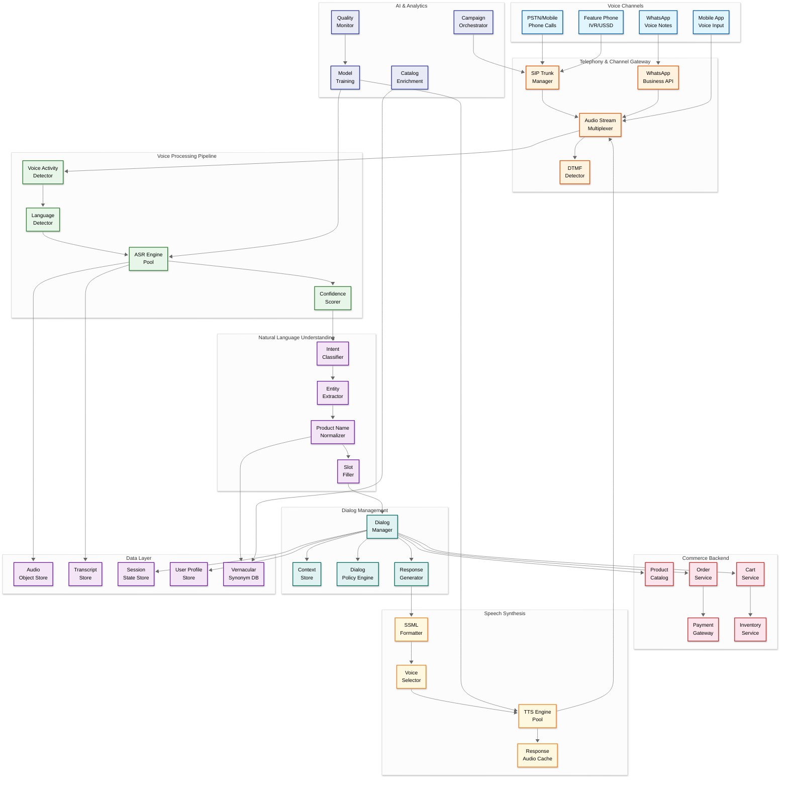
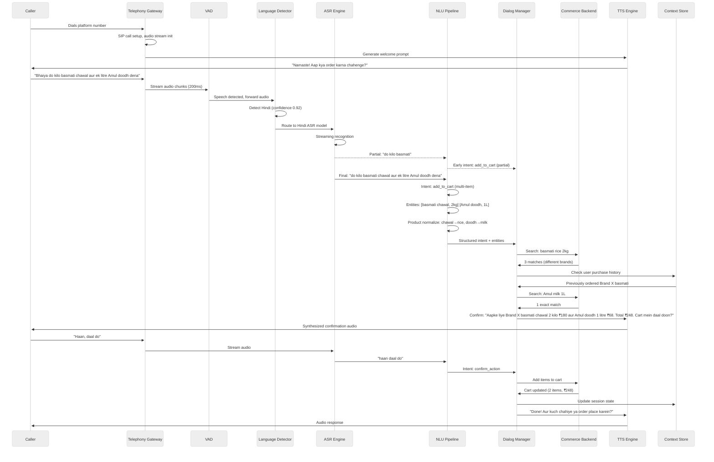
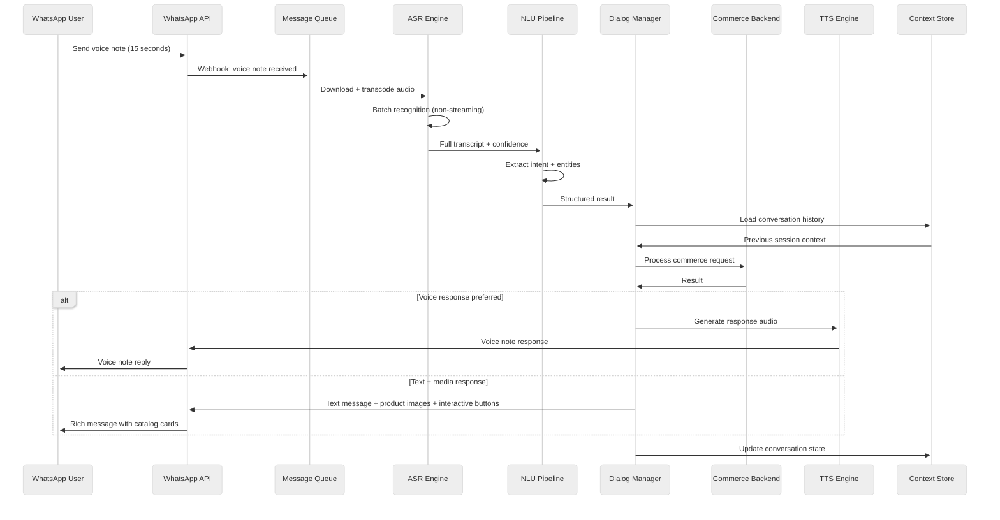
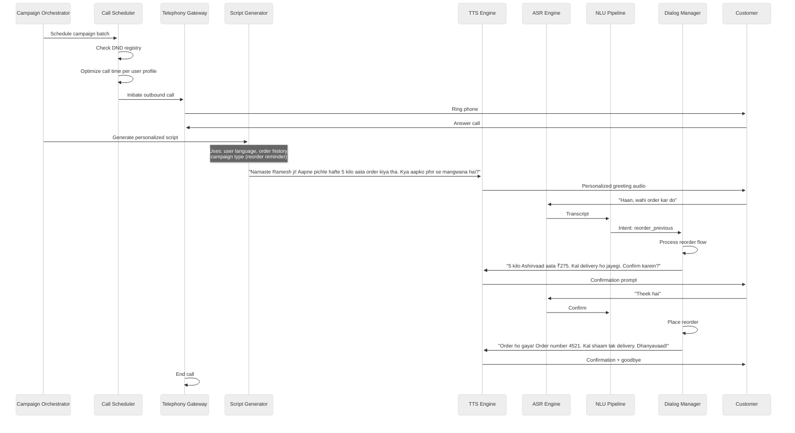

# 14.6 AI-Native Vernacular Voice Commerce Platform — High-Level Design

## Architecture Overview

The platform follows a streaming event-driven architecture where audio flows through a real-time processing pipeline (telephony gateway → voice activity detection → ASR → NLU → dialog manager → commerce backend → response generator → TTS → audio delivery), with each stage operating as an independent microservice communicating through low-latency message streams. The architecture is split into three processing tiers: (1) a **real-time tier** for live phone calls requiring sub-second end-to-end latency, (2) a **near-real-time tier** for WhatsApp voice notes and asynchronous interactions with 5-second SLOs, and (3) a **batch tier** for voice analytics, model retraining, catalog enrichment, and outbound campaign planning.

---

## Component Descriptions

### Telephony & Channel Gateway

| Component | Responsibility | Key Details |
|---|---|---|
| **SIP Trunk Manager** | Manages inbound/outbound phone call connections via SIP protocol; handles call setup, teardown, hold, transfer, and conferencing; interfaces with telecom carrier SIP trunks | Supports 25,000+ concurrent calls; codec negotiation (G.711 for PSTN, Opus for VoIP); WebRTC bridge for app-based calls; SBC (Session Border Controller) for security |
| **WhatsApp Business API** | Receives and sends WhatsApp messages (voice notes, text, interactive messages, media); manages conversation sessions and template messages | Webhook-based message delivery; voice note download and transcoding; message template management for outbound notifications; rate limiting per conversation tier |
| **Audio Stream Multiplexer** | Routes audio streams from all channels into the voice processing pipeline; normalizes audio format (sample rate, codec, channel count); manages bidirectional streaming for real-time calls | Transcodes to 16 kHz mono PCM for wideband ASR or 8 kHz for narrowband; adds stream metadata (channel type, caller ID, session ID); WebSocket-based streaming for real-time channels |
| **DTMF Detector** | Detects dual-tone multi-frequency signals for keypad input; provides fallback input method when ASR confidence is low or for sensitive data (OTP, PIN codes) | In-band and out-of-band DTMF detection; configurable for tone duration thresholds; concurrent operation with ASR (user can speak and press keys) |

### Voice Processing Pipeline

| Component | Responsibility | Key Details |
|---|---|---|
| **Voice Activity Detector (VAD)** | Detects speech vs. silence vs. background noise in audio stream; triggers ASR processing only during speech segments; detects end-of-utterance for turn-taking | WebRTC VAD with Silero VAD fallback; adaptive threshold based on ambient noise level; detects barge-in (user starts speaking while TTS is playing); endpointing with 700 ms silence threshold (configurable per language) |
| **Language Detector** | Identifies the speaker's language from initial audio; continuously monitors for language switches mid-conversation; emits language probability distribution for routing decisions | Acoustic language identification model covering 22+ languages; decision within 2–3 seconds of speech; confidence threshold for routing (≥ 0.8 routes to language-specific model; below 0.8 routes to multilingual model); per-utterance re-evaluation for code-switching detection |
| **ASR Engine Pool** | Pool of ASR model instances serving concurrent recognition requests; language-specific models for high-traffic languages, multilingual models for low-traffic and code-mixed speech; streaming recognition with partial hypotheses | 30+ model variants loaded across GPU pool; streaming with 200 ms chunk processing; partial hypothesis emission every 200 ms; final hypothesis with confidence score and word-level timestamps; domain-adapted language models for commerce vocabulary |
| **Confidence Scorer** | Evaluates ASR output confidence at word and utterance level; triggers fallback strategies when confidence is below threshold (ask for clarification, switch to larger model, or request DTMF input) | Per-word confidence scores; utterance-level acoustic confidence and language model confidence; n-best list with alternative hypotheses; triggers targeted clarification when product name confidence < 0.6 |

### Natural Language Understanding

| Component | Responsibility | Key Details |
|---|---|---|
| **Intent Classifier** | Classifies the user's commerce intent from the ASR transcript: product_search, add_to_cart, modify_order, check_status, make_payment, complaint, general_query, etc. | 25+ commerce-specific intents; multi-intent detection for compound utterances ("add milk to cart and tell me the total"); confidence-gated: low confidence triggers disambiguation; trained on multilingual commerce transcripts |
| **Entity Extractor** | Extracts structured entities from conversational transcripts: product_name, quantity, unit, brand, variant (color, size), address components, payment method, phone number, order ID | Named entity recognition with commerce-specific entity types; handles code-mixed entities (English brand in Hindi sentence); quantity expression parsing ("dedh kilo" = 1.5 kg, "paav" = 250g); cross-referential resolution ("same as last time") |
| **Product Name Normalizer** | Maps extracted vernacular product names to canonical product identifiers; handles regional synonyms (47 names for rice), brand name pronunciation variants, and colloquial abbreviations | Vernacular synonym dictionary with 500,000+ entries; phonetic similarity matching using Soundex variants for Indic scripts; TF-IDF based semantic similarity for novel product descriptions; threshold-gated: below similarity threshold triggers disambiguation dialog |
| **Slot Filler** | Maintains a structured representation of all required fields for the current commerce action; identifies which slots are filled vs. missing; generates targeted prompts for missing information | Per-intent slot schemas (e.g., add_to_cart requires: product, quantity, variant; place_order requires: delivery_address, payment_method, delivery_slot); slot carryover from previous turns; explicit confirmation for critical slots (total amount, delivery address) |

### Dialog Management

| Component | Responsibility | Key Details |
|---|---|---|
| **Dialog Manager** | Orchestrates the multi-turn conversation flow; decides next action (ask question, call commerce API, confirm information, transfer to agent); maintains conversation state machine with commerce-specific states | Hybrid approach: rule-based state machine for critical commerce flows (order placement, payment) overlaid on ML-based dialog policy for open-ended interactions; supports concurrent dialog tracks (e.g., browsing products while checking order status) |
| **Context Store** | Maintains per-session and per-user conversational context; stores resolved entities, dialog history, cart state, and user preferences; enables session resumption across channels | In-memory store with persistent backup; session TTL of 30 minutes for phone calls, 24 hours for WhatsApp; cross-channel context: user can start on phone and continue on WhatsApp; stores last 50 interactions for personalization |
| **Dialog Policy Engine** | Determines the optimal dialog action given current state: when to ask for confirmation vs. proceed, when to offer recommendations, when to escalate to human agent | Configurable policies per commerce flow; frustration detection triggers agent handoff; confirmation policy: always confirm for amounts > ₹500 or new delivery addresses; recommendation policy: suggest frequently ordered items for repeat customers |
| **Response Generator** | Generates natural language responses in the user's detected language; personalizes based on user profile (name, order history, language preference); formats commerce data (prices, quantities, delivery dates) for spoken delivery | Template-based generation for structured commerce responses (order confirmation, price listing); LLM-based generation for open-ended responses (product descriptions, complaint handling); chunked delivery for long responses (max 3 items before checkpoint) |

### Commerce Backend

| Component | Responsibility | Key Details |
|---|---|---|
| **Product Catalog** | Serves product information (name, description, price, variants, availability) with multilingual metadata; supports fuzzy search and category browsing through voice-optimized queries | Multilingual product names and descriptions in 22 languages; voice-optimized product descriptions (concise, speakable); category hierarchy with vernacular category names; real-time price and availability from upstream commerce platform |
| **Cart Service** | Manages user's shopping cart across voice sessions; supports add, remove, modify quantity, clear; persists cart state for session resumption; calculates running totals | Cart persistence across sessions (24-hour TTL); voice-optimized cart review (items chunked in groups of 3); running total update after each modification; coupon and discount application |
| **Order Service** | Creates and manages orders; handles order placement, modification, cancellation, and tracking; integrates with fulfillment and logistics systems | Order creation from finalized cart; order status tracking with voice-friendly status descriptions; modification window (30 minutes post-placement for item changes); cancellation with refund initiation |
| **Payment Gateway** | Processes payments initiated through voice channel; generates UPI collect requests, manages COD orders, and handles wallet payments; ensures PCI compliance for voice-initiated transactions | UPI collect request via payment service provider; OTP verification through DTMF or spoken digits; payment confirmation read-back; refund processing for cancellations; no card number capture via voice |
| **Inventory Service** | Real-time inventory availability check during voice ordering; manages inventory reservation during active voice sessions to prevent overselling | Soft reservation during active session (5-minute hold); release on session timeout; inventory check before order confirmation; back-in-stock notification via outbound call |

### Speech Synthesis

| Component | Responsibility | Key Details |
|---|---|---|
| **TTS Engine Pool** | Pool of TTS model instances generating speech in 22+ languages; streaming synthesis for real-time phone calls; pre-generated audio for common responses | Streaming: first audio byte within 300 ms; per-language voices with regional variants; GPU-accelerated inference with CPU fallback; concurrent synthesis for 25,000+ active calls |
| **SSML Formatter** | Converts response text into SSML (Speech Synthesis Markup Language) for fine-grained TTS control; adds pronunciation hints for numbers, currency, addresses, and product names | Number formatting (₹1,299 → "ek hazaar do sau ninyanave rupaye"); address component pronunciation; emphasis on key information (total amount, delivery date); pause insertion for comprehension |
| **Voice Selector** | Selects the appropriate TTS voice based on detected user language, regional dialect, and session preferences; matches prosodic style to the user's speech patterns | 44+ voice variants (2 per language, male/female); dialect-aware prosody (standard Hindi vs. Bihari Hindi cadence); age-appropriate speed selection; consistent voice across session turns |
| **Response Audio Cache** | Caches pre-generated audio for frequently used responses (greetings, confirmations, error messages, common product descriptions) to reduce TTS GPU load | Cache 10,000+ audio fragments per language; cache hit rate target > 40% for common interactions; dynamic cache eviction based on usage frequency; cache key includes language + voice + response text hash |

---

## Data Flows

### Flow 1: Inbound Voice Call — Product Ordering

### Flow 2: WhatsApp Voice Note Commerce

### Flow 3: Outbound Campaign Call

---

## Key Design Decisions

| Decision | Choice | Rationale | Trade-offs |
|---|---|---|---|
| **ASR architecture** | Per-language-family models with multilingual fallback, NOT a single universal multilingual model | Language-specific models achieve 20–30% lower WER than universal models for high-resource languages; multilingual model handles code-mixed speech and low-resource languages where language-specific data is insufficient | Higher operational complexity (30+ model variants); more GPU memory; model routing adds latency |
| **Streaming vs. batch ASR** | Streaming for phone calls, batch for WhatsApp voice notes | Phone calls require real-time feedback; WhatsApp is inherently asynchronous so batch processing is acceptable and more GPU-efficient (larger batch sizes) | Two processing paths to maintain; batch can use larger/more accurate models since latency is relaxed |
| **Dialog management approach** | Hybrid: rule-based state machine for critical commerce flows + ML-based policy for open-ended interactions | Commerce flows (order, payment) require deterministic behavior with explicit confirmations; open-ended interactions (product recommendations, complaints) benefit from ML flexibility | More complex dialog system; rule maintenance burden; boundary between rule and ML zones can be ambiguous |
| **TTS voice selection** | Dialect-matched prosody (not just language-matched) | A standard Hindi TTS voice sounds unnatural to a Bhojpuri speaker; dialect-matched prosody increases trust and comprehension, especially for non-literate users | Need 44+ voice variants instead of 22; more TTS model hosting; dialect detection adds complexity |
| **Product resolution strategy** | Multi-stage pipeline (ASR → entity → normalize → fuzzy match → disambiguate) rather than end-to-end voice-to-product model | Each stage can be independently debugged, improved, and monitored; the disambiguation stage provides a critical safety net before committing to a product match | Higher latency than an end-to-end model; error compounds across stages; pipeline maintenance is complex |
| **Audio storage** | Store compressed audio with configurable retention (7–90 days), NOT raw PCM; transcripts retained permanently | Raw PCM at 16 kHz consumes 1.9 MB/min; Opus at 64 kbps consumes 0.48 MB/min (4x compression); transcripts are sufficient for most analytics after the retention window | Compressed audio may not be suitable for all model retraining tasks; retention policy must comply with local regulations |
| **GPU allocation strategy** | Dedicated GPU pools per tier (real-time vs. batch) with overflow capability, NOT shared pools | Real-time phone calls cannot tolerate queuing; dedicated pools ensure latency SLOs; batch processing absorbs GPU overflow during off-peak hours | GPU utilization for real-time pool may be low during off-peak; cost inefficiency vs. latency guarantee |
| **Human handoff approach** | Warm transfer with AI-generated summary and live ASR assist for agent | Warm transfer avoids user repeating context; live ASR gives the agent real-time transcription of the caller's speech; AI-generated summary provides structured context (intent, cart state, issues) | Requires agent tooling investment; live ASR for agent adds GPU load; summary generation adds 1–2 seconds to handoff |
