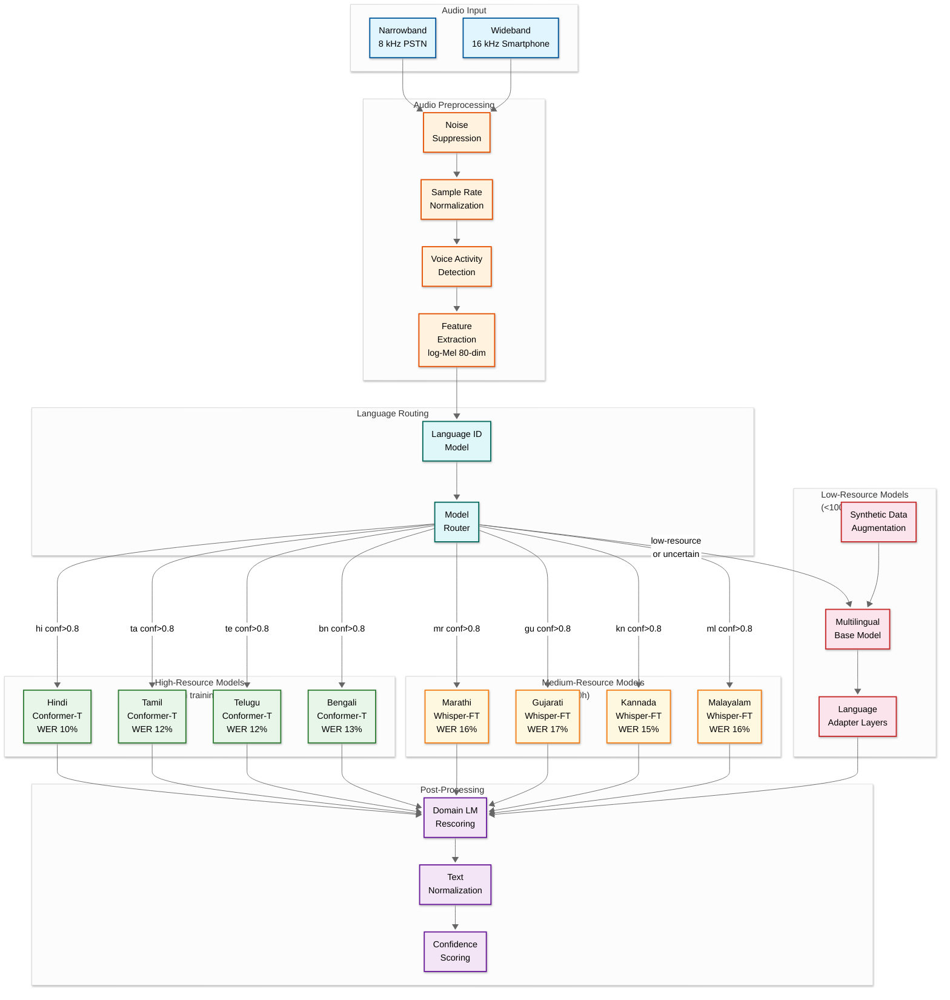
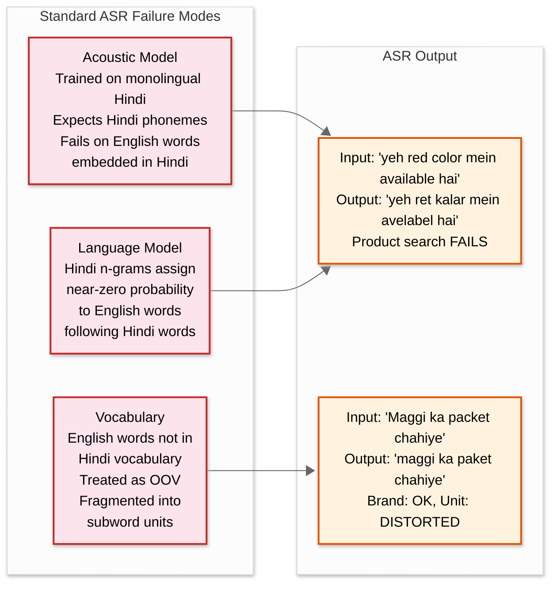
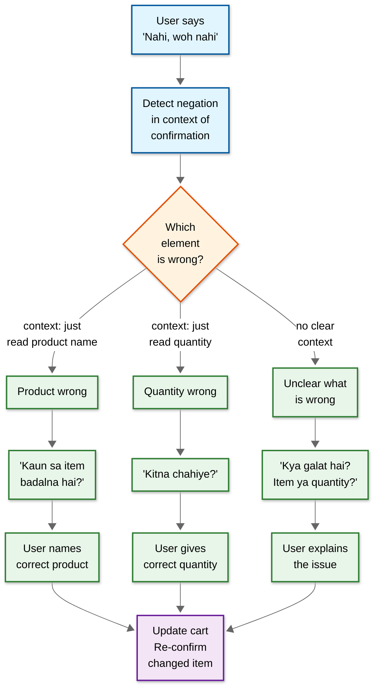
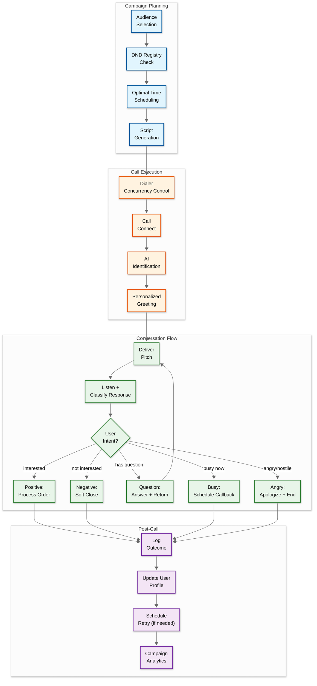
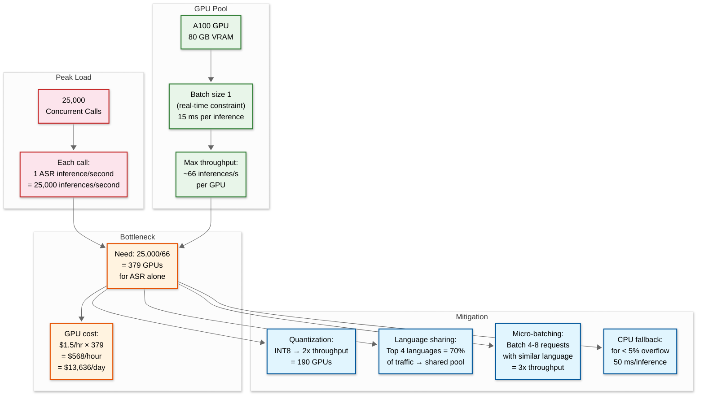

# 14.6 AI-Native Vernacular Voice Commerce Platform — Deep Dives & Bottlenecks

## Deep Dive 1: Multilingual ASR for Low-Resource Indian Languages

### The Problem

Building production-grade ASR for 22+ Indian languages requires handling a 1000x disparity in training data availability: Hindi and English have 100,000+ hours of transcribed audio, while languages like Maithili, Dogri, Bodo, and Santali have less than 100 hours. A model trained on abundant Hindi data achieves 8–12% WER; the same architecture trained on 100 hours of Santali achieves 40–60% WER—unusable for commerce where misrecognizing a product name or quantity leads to wrong orders and immediate trust erosion.

### Production Architecture



### Three-Tier ASR Strategy

| Tier | Languages | Training Data | Architecture | WER Target | Strategy |
|---|---|---|---|---|---|
| **High-resource** | Hindi, Tamil, Telugu, Bengali, Marathi, Gujarati, Kannada, Malayalam | 1,000–10,000+ hours | Language-specific Conformer-Transducer models fine-tuned on commerce domain | 10–15% | Dedicated per-language models with commerce vocabulary domain adaptation; streaming with 200 ms chunks; quantized INT8 for latency |
| **Medium-resource** | Odia, Punjabi, Assamese, Urdu, Nepali | 100–1,000 hours | Fine-tuned multilingual Whisper models with language-specific adapters | 15–22% | Start from multilingual Whisper large; add LoRA adapters per language; commerce domain fine-tuning; narrowband-specific variants |
| **Low-resource** | Maithili, Dogri, Santali, Bodo, Konkani, Manipuri, Kashmiri | < 100 hours | Multilingual base model + language adapter layers + synthetic data augmentation | 22–30% | Cross-lingual transfer from related high-resource languages (Maithili ← Hindi, Konkani ← Marathi); TTS-based synthetic data generation; active learning from production interactions |

### Low-Resource Language Strategies

**Cross-Lingual Transfer Learning:**
- Languages within the same family share acoustic and phonetic characteristics
- A Hindi ASR model provides a strong initialization for Maithili, Bhojpuri, and Rajasthani
- A Tamil model transfers well to Malayalam due to shared Dravidian phonology
- Transfer reduces WER by 15–25% compared to training from scratch on low-resource data alone

**Synthetic Data Augmentation:**
- Use available TTS models for the low-resource language to generate synthetic training audio from text corpora
- Parallel text corpora (translations) can be read by TTS to create aligned audio-text pairs
- Speed/pitch perturbation, noise injection, and room impulse response simulation increase diversity
- Synthetic data can provide 5–10x the volume of real data, though with diminishing returns beyond 3x real data volume

**Active Learning from Production:**
- Sample low-confidence ASR outputs from production interactions for human transcription
- Focus annotation budget on utterances where the ASR model is least certain (uncertainty sampling)
- Each annotation cycle (weekly) adds 5–10 hours of transcribed data for the most impactful utterances
- Requires consent-based audio sampling pipeline with privacy controls

### Domain Adaptation for Commerce

Generic ASR models fail on commerce-specific vocabulary: product names, brand names, quantity expressions, and local market terminology are poorly represented in general-purpose training data. Domain adaptation adds:

| Adaptation | Method | Impact |
|---|---|---|
| **Commerce language model** | N-gram and neural LM trained on commerce transcripts, product catalog names, and order histories | 8–12% relative WER reduction on product names |
| **Product name biasing** | At inference time, boost recognition of product names in the user's recent order history and popular catalog items | 15–20% improvement on product name recognition for repeat customers |
| **Quantity expression handling** | Specialized post-processing for vernacular quantity expressions: "dedh" = 1.5, "paav" = 0.25, "sawaa" = 1.25 | Eliminates common quantity misrecognition errors |
| **Narrowband-specific models** | Models trained/fine-tuned specifically on 8 kHz PSTN audio rather than downsampled wideband | 10–15% WER improvement on phone calls vs. using wideband model on narrowband audio |

---

## Deep Dive 2: Code-Mixing and Code-Switching in Voice Commerce

### The Phenomenon

Code-mixing in Indian voice commerce is not an edge case—it is the predominant speech pattern. Research on Indian speech patterns shows:

| Pattern | Example | Frequency |
|---|---|---|
| **Intra-sentential code-mixing** | "Yeh *red color* mein *available* hai kya?" (Hindi frame + English content words) | 35–45% of urban utterances |
| **Inter-sentential code-switching** | "I want to order. Lekin delivery kal tak ho jayegi?" (Full English sentence → full Hindi sentence) | 15–20% of sessions |
| **Borrowing + nativization** | "Ek *packet* Maggi dena" (English 'packet' nativized into Hindi phonology) | 80%+ of utterances contain at least one borrowed word |
| **Tri-lingual mixing** | "Bhaiya ek *cheese* *dosa* dena" (Hindi address + English ingredient + Kannada food item) | 10–15% in multilingual cities |
| **Script mixing in text** | "Mujhe 2kg atta chahiye tomorrow delivery" (Hindi in Romanized script + English) | 60%+ of WhatsApp text messages |

### Why Standard ASR Fails on Code-Mixed Speech



### Production Solution: Multilingual Acoustic Model with Code-Mix-Aware NLU

**Acoustic Model Architecture:**
- Single multilingual Conformer-Transducer model trained on code-mixed corpora alongside monolingual data
- Shared encoder processes audio regardless of language; language-specific decoder heads produce tokens
- Key innovation: the tokenizer uses a merged vocabulary of all supported languages + English, allowing the model to emit mixed-language token sequences without language segmentation
- Training data includes 500+ hours of annotated code-mixed speech (expensive but critical)

**Language Model Adaptation:**
- Standard n-gram LMs assign near-zero probability to cross-lingual bigrams ("yeh red" = Hindi-English)
- Code-mix-aware LM trained on transliterated social media text (Twitter, WhatsApp messages) where code-mixing is natural
- The LM explicitly models cross-lingual transition probabilities: P("red" | "yeh") is estimated from code-mixed text corpora

**Post-ASR Entity Extraction:**
- The entity extractor must operate on mixed-language transcripts
- Product names may be in any language: "Maggi" (brand, any language), "dosa" (Kannada/Tamil), "chawal" (Hindi)
- Entity extraction uses a multilingual NER model trained on code-mixed commerce text
- Cross-lingual entity normalization maps recognized entities to canonical catalog entries regardless of source language

### Code-Mixing Handling Pipeline

| Stage | Input | Processing | Output |
|---|---|---|---|
| **ASR** | Mixed-language audio | Multilingual Conformer with merged vocabulary; emits tokens in whatever language they appear | Mixed-language transcript: "do kilo basmati rice aur one packet Maggi dena" |
| **Language tagging** | Mixed transcript | Per-word language identification using script detection + lexicon lookup | Tagged: "do/hi kilo/hi basmati/hi rice/en aur/hi one/en packet/en Maggi/brand dena/hi" |
| **Entity extraction** | Tagged transcript | Multilingual NER with cross-lingual entity types | Entities: [{product: "basmati rice", qty: 2, unit: "kg"}, {product: "Maggi", qty: 1, unit: "packet"}] |
| **Normalization** | Entities with language tags | Map to canonical catalog regardless of language | Catalog IDs: [basmati-rice-2kg, maggi-noodles-1pkt] |
| **Response generation** | Canonical intents | Generate response matching the user's code-mixing pattern | "Basmati rice 2 kilo ₹180 aur Maggi ek packet ₹14. Total ₹194." |

### Matching User's Code-Mixing Pattern in Responses

A critical UX insight: the system should respond in the same code-mixing style as the user. If the user says "yeh red color mein available hai kya?", the response should be "Haan, red color mein available hai, ₹399" rather than pure Hindi "Haan, lal rang mein uplabdh hai" or pure English "Yes, it's available in red, ₹399." Matching the user's language mix:
- Increases comprehension (the user understands "red" better than "lal" because they chose to say "red")
- Reduces cognitive load (no translation needed between user's expression and system's)
- Builds rapport (the system "speaks their language")

The response generator tracks the user's code-mix ratio per session and templates are adapted to match: high English mixing → more English content words; pure vernacular → pure vernacular responses.

---

## Deep Dive 3: Real-Time Voice Streaming Architecture

### The Latency Challenge

Voice commerce has a hard latency budget that determines the interaction quality:

| End-to-End Latency | User Perception | Impact |
|---|---|---|
| < 500 ms | Natural conversation | Ideal; indistinguishable from human |
| 500–1,000 ms | Slightly slow but acceptable | Usable for commerce |
| 1,000–1,500 ms | Noticeable delay | Users tolerate but start to lose patience |
| 1,500–2,000 ms | Uncomfortable silence | Users repeat themselves, causing ASR confusion |
| > 2,000 ms | Broken conversation | Users hang up; 40%+ call abandonment |

The latency budget must accommodate: audio capture/encoding (50 ms) + network transit (50–200 ms) + VAD/endpointing (300–700 ms waiting for silence) + ASR inference (100–300 ms) + NLU processing (50–150 ms) + response generation (50–200 ms) + TTS synthesis (100–300 ms) + network transit back (50–200 ms) + audio playback start (50 ms). Total: 800–2,100 ms, with VAD endpointing being the dominant and most variable component.

### Streaming Pipeline Architecture

```mermaid
---
config:
  theme: neutral
  look: neo
---
flowchart LR
    subgraph Capture["Audio Capture"]
        MIC["Microphone\n200ms chunks"]
    end

    subgraph Transport["Network Transport"]
        WS["WebSocket\nSRTP/RTP"]
    end

    subgraph Ingest["Audio Ingest"]
        BUF["Chunk\nBuffer"]
        NS["Noise\nSuppress"]
        VAD2["VAD\n+ Barge-in"]
    end

    subgraph ASRStream["Streaming ASR"]
        ENC["Encoder\n(causal)"]
        JNT["Joint\nNetwork"]
        DEC["Decoder\n(autoregressive)"]
        PART["Partial\nHypothesis"]
    end

    subgraph NLUStream["Streaming NLU"]
        EINT["Early Intent\nDetection"]
        SPEC["Speculative\nProcessing"]
    end

    subgraph ResponsePipeline["Response Pipeline"]
        RG["Response\nGenerator"]
        TTSStream["Streaming\nTTS"]
    end

    subgraph Playback["Audio Output"]
        SPK["Speaker\nAudio Stream"]
    end

    MIC --> WS --> BUF --> NS --> VAD2

    VAD2 -->|"200ms\nchunks"| ENC --> JNT --> DEC --> PART

    PART -->|"partial\ntranscript"| EINT -->|"early\nintent"| SPEC -->|"speculative\nresponse"| RG

    DEC -->|"final\ntranscript"| RG
    RG -->|"token\nstream"| TTSStream -->|"audio\nchunks"| WS --> SPK

    classDef capture fill:#e1f5fe,stroke:#01579b,stroke-width:2px
    classDef transport fill:#e0f7fa,stroke:#00695c,stroke-width:2px
    classDef ingest fill:#fff3e0,stroke:#e65100,stroke-width:2px
    classDef asr fill:#e8f5e9,stroke:#2e7d32,stroke-width:2px
    classDef nlu fill:#f3e5f5,stroke:#6a1b9a,stroke-width:2px
    classDef response fill:#fff8e1,stroke:#f57f17,stroke-width:2px
    classDef playback fill:#fce4ec,stroke:#c62828,stroke-width:2px

    class MIC capture
    class WS transport
    class BUF,NS,VAD2 ingest
    class ENC,JNT,DEC,PART asr
    class EINT,SPEC nlu
    class RG,TTSStream response
    class SPK playback
```



### Key Latency Optimization Techniques

| Technique | How It Works | Latency Saved | Trade-off |
|---|---|---|---|
| **Speculative NLU execution** | Begin NLU processing on partial ASR transcript; if intent is clear early ("add to cart…"), start preparing the response before the user finishes speaking | 200–500 ms | May start wrong computation if partial transcript is misleading; must discard speculative result if final transcript changes intent |
| **Streaming TTS** | Begin synthesizing speech audio from the first few tokens of the response text, before the full response is generated | 300–500 ms | Response must be generated left-to-right (no rewriting); if downstream information changes the response, audio already sent cannot be recalled |
| **Adaptive endpointing** | Adjust silence duration threshold based on context: shorter (500 ms) after a yes/no question, longer (900 ms) when user is describing a product | 100–400 ms | Too-short endpointing cuts off the user mid-sentence; too-long adds unnecessary delay |
| **Model warm-up and pre-loading** | Keep per-language ASR and TTS models loaded in GPU memory; pre-warm inference graphs | 50–200 ms (eliminates cold start) | Higher GPU memory usage; must manage model loading/eviction for 30+ variants |
| **Response fragment caching** | Pre-synthesize common TTS fragments (greetings, confirmations, numbers, product names) and serve from cache | 200–300 ms (cache hit eliminates TTS inference) | Cache size per language; cache invalidation when prices or product names change; voice consistency between cached and live-generated audio |
| **Connection pre-warming** | For outbound calls, establish the audio processing pipeline before the call connects | 100–300 ms | Resource allocation before call is answered; must release if call is not answered |

### Barge-In Handling

Barge-in occurs when the user starts speaking while the system is still playing a TTS response. This is a natural conversational behavior (especially for impatient or experienced users) but creates a technical challenge:

1. **Detection**: The VAD must distinguish between echo of the TTS playback (which comes back through the user's microphone) and actual user speech on top of the TTS audio
2. **TTS interruption**: Once barge-in is detected, TTS playback must stop immediately (within 100 ms) to prevent the system from talking over the user
3. **ASR during barge-in**: The ASR must process the user's speech even though TTS audio was playing simultaneously; echo cancellation must remove the TTS component from the audio
4. **Context management**: The dialog manager must understand that the user interrupted the system mid-response and may be responding to only the portion they heard

Production implementation uses acoustic echo cancellation (AEC) at the gateway level, with the TTS audio signal provided as a reference for echo subtraction. Post-AEC, the clean user signal is fed to the ASR. The dialog manager tracks how much of the TTS response was played before barge-in and adjusts its context accordingly.

---

## Deep Dive 4: Voice Ordering with Confirmation Loops

### The Confirmation Challenge

In text-based commerce, the user sees their cart visually and can instantly verify correctness. In voice commerce, every confirmation is serialized through the audio channel, creating a fundamental tension:

| Aspect | Text Commerce | Voice Commerce |
|---|---|---|
| Cart review | Glance at screen (0.5 s) | Listen to each item read out (15–30 s for 5 items) |
| Error detection | Visual scan spots wrong item immediately | Must hold items in working memory while listening to the next |
| Correction | Tap the wrong item → delete | "Not that one, the other one" → disambiguation required |
| Address confirmation | Read address on screen | Listen to address components → confirm or correct each |
| Total verification | See number on screen | Listen to amount → remember it → confirm |

### Chunked Confirmation Strategy

Reading out a 7-item cart in one continuous stream overwhelms the listener's working memory. The production system uses chunked confirmation:

```
System: "Aapke cart mein hain: pehla, basmati chawal 2 kilo 180 rupaye.
         Doosra, Amul doodh 1 litre 68 rupaye.
         Teesra, Maggi 4 packet 56 rupaye.
         Ab tak sahi hai?"

User:    "Haan"

System: "Aur bhi hain: chautha, atta 5 kilo 275 rupaye.
         Paanchva, sugar 1 kilo 48 rupaye.
         Total paanch items, 627 rupaye.
         Order place karoon?"
```

**Rules for chunked confirmation:**
1. Maximum 3 items per chunk
2. Each item: product name → quantity → price (consistent format)
3. Checkpoint after each chunk: "Ab tak sahi hai?"
4. Final chunk includes running total
5. Any negative response at any checkpoint → enter modification mode for that chunk

### Critical Confirmation Points

| What | When to Confirm | How |
|---|---|---|
| **Product selection** | After disambiguation (2+ candidates) | "Aapko Brand X chahiye ya Brand Y?" |
| **Quantity** | When quantity > 10 or when ASR confidence < 0.7 on quantity word | "Aapne 20 kilo bola? Sahi hai?" |
| **Cart total** | Before payment initiation | Read total with emphasis: "Total **627 rupaye**. Sahi hai?" |
| **Delivery address** | For new address or first order | Read back component by component |
| **Payment method** | Before initiating payment | "UPI se payment karein ya cash on delivery?" |
| **Order placement** | Final confirmation before creating order | "Order confirm karoon? [item count] items, [total] rupaye, [delivery time]." |

### Error Recovery Patterns



---

## Deep Dive 5: Outbound Calling with Dynamic Script Generation

### The Outbound Challenge

Outbound voice campaigns for commerce (reorder reminders, promotional offers, delivery confirmations) must navigate a unique set of constraints:

1. **Regulatory compliance**: TRAI regulations in India require DND registry checks, restrict calling hours (9 AM–9 PM), mandate caller ID display, and require opt-out mechanisms
2. **Consent management**: Users must have explicitly or implicitly consented to receive outbound calls; campaign-specific consent may differ from transactional consent
3. **User hostility**: Outbound calls face higher rejection rates than inbound; the system must detect and respect user irritation within 5–10 seconds
4. **Dynamic scripting**: Unlike inbound calls where the user drives the conversation, outbound calls require the system to lead the conversation with a specific goal while adapting to the user's responses
5. **Language detection at scale**: 100,000+ calls/day to users across 22+ languages; the system must detect language within the first response and switch the conversation accordingly

### Outbound Call Flow Architecture



### Call Time Optimization

The probability of a user answering and converting varies dramatically by time of day, day of week, and user behavior pattern:

| User Segment | Best Call Time | Conversion Rate | Worst Call Time | Conversion Rate |
|---|---|---|---|---|
| Homemakers | 10 AM – 12 PM | 18% | 1 PM – 3 PM (rest time) | 4% |
| Small shopkeepers | 2 PM – 4 PM (low footfall) | 22% | 10 AM – 12 PM (busy) | 6% |
| Office workers | 6 PM – 8 PM (after work) | 15% | 9 AM – 5 PM (at work) | 3% |
| Farmers | 6 AM – 8 AM (before field) | 12% | 10 AM – 4 PM (in field) | 2% |

The campaign scheduler uses a Thompson Sampling approach: for each user segment × time slot combination, it maintains a posterior distribution over answer+convert probability. Each campaign run updates the posterior with observed outcomes. New campaigns benefit from prior knowledge accumulated across previous campaigns.

### Sentiment and Hostility Detection

The system must detect user irritation within 5 seconds and adapt:

| Signal | Detection Method | Response |
|---|---|---|
| **Angry tone** | Prosody analysis: elevated pitch, increased volume, fast speech rate | Immediately apologize, offer opt-out, end call |
| **"Who is this?" / "Kaun bol raha hai?"** | Intent classification | Re-identify as AI, state purpose clearly, ask permission to continue |
| **Silence > 3 seconds after greeting** | VAD detects no speech | "Kya aap sun sakte hain? Main [platform] se bol raha hoon." |
| **"Mujhe call mat karo" / "Don't call me"** | Intent: opt_out | Immediately add to DND, confirm opt-out, end call |
| **Repeated "haan haan" without engagement** | Pattern detection: quick affirmatives without substantive responses | User is passively dismissing; wrap up politely within 15 seconds |

---

## Edge Cases

### Background Noise and Adverse Audio Conditions

| Condition | Impact | Mitigation |
|---|---|---|
| **Outdoor market noise** (60+ dB ambient) | SNR drops below 5 dB; ASR WER increases 2–3x | Multi-channel noise suppression; noise-robust ASR models trained on noisy data; automatic gain control |
| **Multiple speakers** (family ordering together) | Speaker diarization confusion; multiple voices provide conflicting inputs | Speaker diarization to separate voices; dialog policy defaults to the primary speaker; explicit "ek ek karke boliye" (one at a time) prompt |
| **Vehicle/road noise** | Low-frequency rumble masks speech; intermittent horn blasts corrupt individual words | High-pass filtering; horn/siren detection and segment masking; request user to move to quieter location after 3 failed recognitions |
| **Low-quality feature phone** | Narrow bandwidth, distortion, echo | Narrowband-specific ASR model; aggressive echo cancellation; DTMF fallback for critical inputs |
| **Network congestion** | Audio packet loss; gaps in audio stream | Forward error correction; packet loss concealment (PLC) for gaps < 60 ms; graceful degradation messaging for longer gaps |

### Accent and Dialect Variation

| Challenge | Example | Mitigation |
|---|---|---|
| **Retroflex vs. dental** confusion | "dal" (lentil) vs. "daal" (dal/put) — retroflex and dental 'd' sound identical to non-native ears | Context-aware disambiguation: in commerce context, "dal" almost always means lentil |
| **Schwa deletion** variation | "dukan" vs. "dukaan" — schwa is variably deleted across Hindi dialects | ASR trained on multi-dialectal data; phonetic normalization in product matching |
| **Vowel length variation** | "chaawal" vs. "chawal" vs. "chawwal" — different dialects elongate different vowels | Phonetic matching uses vowel-length-normalized representations |
| **Regional product names** | "Toor dal" (Hindi) = "Arhar dal" (UP Hindi) = "Togari bele" (Kannada) = "Thuvaram paruppu" (Tamil) | Comprehensive vernacular synonym dictionary; cross-regional product mapping |

### Incomplete and Interrupted Utterances

| Scenario | Example | Handling |
|---|---|---|
| **False start** | "Mujhe do— nahi, teen kilo chahiye" | Detect self-correction pattern; use the corrected value (3 kg, not 2) |
| **Mid-utterance interruption** | "Bhaiya ek packet—" [child crying] "—Maggi dena" | Buffer partial hypothesis; rejoin with context after noise subsides |
| **Trailing off** | "Aur haan, woh cheez bhi chahiye, woh..." | Detect incomplete reference; prompt: "Kaun si cheez?" |
| **Overlapping household speech** | "Ek kilo atta—" [background: "aur sugar bhi mangwa lo"] | Primary speaker tracking; option to ask "Abhi aur kuch bola kisi ne?" |

---

## Bottleneck Analysis

### Bottleneck 1: GPU Compute for Concurrent Real-Time ASR



**Resolution:** Combined INT8 quantization + micro-batching reduces the GPU requirement from 379 to ~65 A100 GPUs for peak load ASR. Language-aware request routing enables micro-batching of same-language requests (4–8 per batch) without violating the real-time constraint, because same-language batches can share the same model and process in parallel.

### Bottleneck 2: VAD Endpointing Latency

The Voice Activity Detector must decide when the user has finished speaking. Too early → cuts off the utterance. Too late → adds unnecessary delay.

| Endpointing Strategy | Silence Threshold | False Positive Rate | Added Latency |
|---|---|---|---|
| Fixed 700 ms silence | 700 ms | 5% (clips mid-pause speech) | 700 ms |
| Fixed 1,200 ms silence | 1,200 ms | 1% | 1,200 ms |
| **Context-adaptive** | 400–900 ms based on dialog state | 3% | 400–900 ms |

**Resolution:** Context-adaptive endpointing adjusts the silence threshold based on:
- **After yes/no question**: 400 ms (user will respond quickly with a short word)
- **After open-ended question**: 900 ms (user needs time to formulate response)
- **Mid-list recitation**: 800 ms (user pauses between items but is not done)
- **After system asks for address**: 1,000 ms (user pauses between address components)

### Bottleneck 3: Vernacular Synonym Dictionary Cold Start

New products, brands, and regional terms are constantly entering the market. The synonym dictionary starts incomplete and must grow organically.

| Phase | Dictionary Size | Product Match Rate | Unresolved Rate |
|---|---|---|---|
| Launch | 50,000 entries | 65% | 35% |
| 3 months | 150,000 entries | 78% | 22% |
| 6 months | 300,000 entries | 85% | 15% |
| 12 months | 500,000 entries | 92% | 8% |

**Resolution:** Active synonym mining pipeline:
1. Log all unresolved product references with audio + transcript + session context
2. Cluster similar unresolved references (phonetic similarity)
3. Human annotators map clusters to catalog products (10 annotators → 500 new entries/day)
4. Validated synonyms automatically deployed to production dictionary
5. Feedback loop: resolved interactions confirm synonym quality; low-confirmation-rate synonyms flagged for review

### Bottleneck 4: TTS Voice Quality Gap Across Languages

TTS quality varies dramatically across languages due to training data availability:

| Language | TTS Training Data | MOS Score | User Satisfaction |
|---|---|---|---|
| Hindi | 50+ hours studio recording | 4.2 / 5.0 | 85% satisfactory |
| Tamil | 20 hours | 3.8 / 5.0 | 72% satisfactory |
| Bengali | 15 hours | 3.7 / 5.0 | 68% satisfactory |
| Maithili | 3 hours | 2.9 / 5.0 | 40% satisfactory |
| Santali | 1 hour | 2.3 / 5.0 | 20% satisfactory |

**Resolution:** Multi-pronged TTS quality improvement:
1. **Voice cloning**: 10 seconds of high-quality reference audio can produce natural-sounding TTS in low-resource languages using voice cloning techniques (as demonstrated by Gnani.ai's Vachana TTS)
2. **Cross-lingual transfer**: Prosodic patterns from related high-resource languages provide naturalness for low-resource TTS
3. **Hybrid approach**: For extremely low-resource languages, pre-record the 200 most common response fragments with a native speaker; use TTS only for dynamic content (names, numbers, product details)
4. **Community recording campaigns**: Partner with language communities to collect studio-quality voice data
