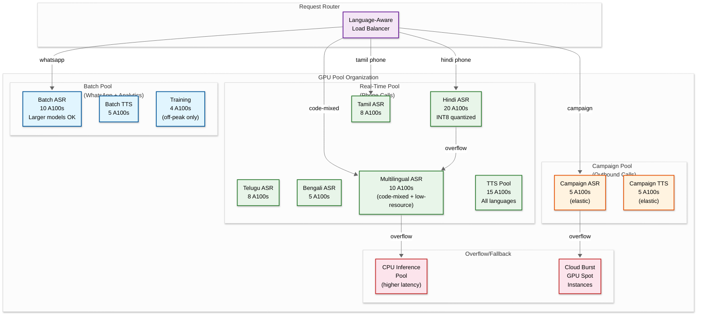
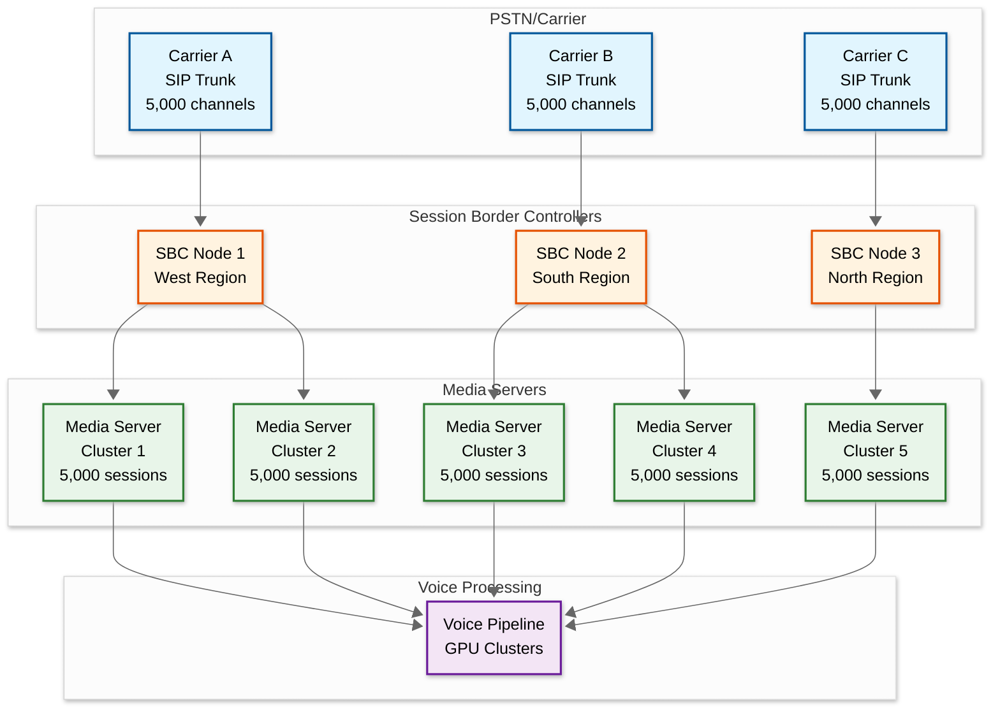

# 14.6 AI-Native Vernacular Voice Commerce Platform — Scalability & Reliability

## GPU Scaling for ASR/TTS Inference

### The Scaling Challenge

Voice commerce GPU scaling differs fundamentally from typical ML serving because of the real-time constraint: a phone call cannot be queued for later processing. Every concurrent call requires dedicated GPU cycles every second for the duration of the call. This makes GPU scaling a **capacity reservation** problem rather than a **throughput optimization** problem.

| Workload | Characteristics | Scaling Pattern |
|---|---|---|
| **Real-time phone calls** | 15 ms ASR inference per second per call; zero tolerance for queuing; must scale to 25,000 concurrent calls | Capacity-reserved: GPU pool sized for peak concurrent calls, not average throughput |
| **WhatsApp voice notes** | Batch processing; 5-second SLO; variable message lengths | Queue-based: process in batches; burst absorption via queue depth |
| **TTS synthesis** | 80 ms per response; 2 responses per session average; streaming reduces perceived latency | Mixed: real-time calls need dedicated capacity; async channels share a pool |
| **Outbound campaigns** | Predictable load; scheduled in advance; 500–1,000 concurrent calls | Pre-provisioned: scale up GPU pool before campaign start; scale down after |

### GPU Pool Architecture

### Scaling Strategies by Load Pattern

| Load Pattern | Trigger | Scaling Action | Time to Scale |
|---|---|---|---|
| **Daily peak (10 AM–1 PM, 6 PM–9 PM)** | Predicted from historical traffic | Pre-scale GPU pools 30 minutes before predicted peak | 5–10 minutes (pre-warm models) |
| **Festival surge (Diwali, Eid, Pongal)** | Known dates + marketing calendar | 3x capacity pre-provisioned; campaigns paused during organic peak | 2–24 hours advance |
| **Flash sale / promotion** | Marketing team schedules in advance | Dedicated GPU burst pool allocated; batch processing throttled | 1 hour advance |
| **Unexpected spike** | Real-time concurrent call count exceeds 80% pool capacity | (1) Throttle batch processing → redirect GPUs to real-time; (2) Activate CPU fallback; (3) Cloud burst spot instances | 2–5 minutes |
| **Language-specific surge** | Regional festival (e.g., Onam → Malayalam spike) | Rebalance GPU pool: add Malayalam ASR instances, reduce underutilized language pools | 5–10 minutes |

### Model Loading and Hot-Swap

Each ASR model variant consumes 2–12 GB VRAM. With 30+ variants across languages and channel types, managing model loading is critical:

| Strategy | Details | Impact |
|---|---|---|
| **Always-loaded models** | Top 8 languages (Hindi, Tamil, Telugu, Bengali, Marathi, Gujarati, Kannada, Malayalam) + multilingual model kept loaded 24/7 | Eliminates cold-start latency for 90% of traffic |
| **Warm standby models** | Next 8 languages loaded in VRAM but with reduced batch capacity; scale up on demand | 200 ms cold-start for first request; handles 95%+ of traffic |
| **Cold models** | Remaining languages loaded on demand; first call triggers model load | 5–15 second cold-start; acceptable for < 0.1% of traffic; DTMF fallback offered during load |
| **Model eviction** | LRU eviction with language-priority override: never evict top 8 languages regardless of recency | Prevents Hindi model eviction during a brief Dogri surge |

---

## Concurrent Call Handling at Scale

### Telephony Infrastructure Scaling

### Scaling Dimensions

| Dimension | Scaling Strategy | Limit | Mitigation at Limit |
|---|---|---|---|
| **SIP trunk capacity** | Multiple carriers with active-active distribution; each carrier provides 5,000–10,000 concurrent channels | Carrier-dependent; typically 30,000 per carrier | Add carriers; geographic distribution across carriers |
| **Media server sessions** | Horizontal scaling: each media server handles 5,000 concurrent sessions; add servers for more capacity | Memory-bound: each session requires 2 MB for audio buffers + state | Dedicated media server clusters per region; session migration for maintenance |
| **WebSocket connections** | Each audio stream requires one persistent WebSocket; load balancer distributes across stream handler nodes | 100,000 connections per node with epoll-based servers | Scale stream handler nodes horizontally; sticky sessions for active calls |
| **Audio processing pipeline** | GPU pool scaled independently of telephony; audio routed to nearest GPU pool | GPU availability and cost | Mixed real-time + batch pools; CPU fallback; cloud burst |
| **Dialog state storage** | In-memory (Redis cluster) for active sessions; persisted to durable store on session end | Redis cluster capacity: 100K+ concurrent sessions per 6-node cluster | Shard by session ID; evict completed sessions aggressively; compress state |

### Call Admission Control

When the system approaches capacity limits, it must gracefully degrade rather than fail unpredictably:

| Capacity Level | Action | User Experience |
|---|---|---|
| **0–70%** | Normal operation | Full service |
| **70–85%** | Warning: pause new outbound campaigns; alert on-call engineer | Inbound calls unaffected |
| **85–95%** | Throttle: switch low-resource language ASR to multilingual model (fewer GPU instances needed); reduce TTS quality (smaller models) | Slightly lower quality for some languages |
| **95–100%** | Shed: new inbound calls get "We're busy, please try again in a few minutes" or callback scheduling | Some callers hear busy message; callbacks prevent lost customers |
| **>100% (should not happen)** | Emergency: drop all outbound campaigns; redirect all GPU capacity to inbound; page engineering team | Campaign callers affected; inbound prioritized |

---

## Multi-Region Deployment for Latency

### Regional Architecture

Voice applications are extremely latency-sensitive: every 50 ms of additional network latency adds 50 ms to the end-to-end response time. For a country like India spanning 3,000 km from Kashmir to Kanyakumari, a single-region deployment adds 30–80 ms of network latency for distant users.

| Region | Data Center | Coverage | Languages Prioritized |
|---|---|---|---|
| **West** | Mumbai | Maharashtra, Gujarat, Rajasthan, Goa | Hindi, Marathi, Gujarati, Rajasthani |
| **South** | Chennai/Hyderabad | Tamil Nadu, Kerala, Karnataka, AP, Telangana | Tamil, Telugu, Kannada, Malayalam |
| **North** | Delhi NCR | UP, Bihar, Haryana, Punjab, HP, J&K | Hindi, Punjabi, Bhojpuri, Maithili, Urdu |
| **East** | Kolkata | West Bengal, Odisha, Assam, NE states | Bengali, Odia, Assamese, NE languages |

### Region-Aware Component Placement

| Component | Deployment | Rationale |
|---|---|---|
| **SIP trunks** | Per-region with local carrier peering | Minimize call setup latency and audio transport delay |
| **Media servers** | Per-region | Audio must be processed close to the caller for low latency |
| **ASR GPU pools** | Per-region with language affinity | Hindi models heavily loaded in North/West; Tamil/Telugu in South |
| **NLU service** | Per-region (lightweight; can be replicated) | 50–150 ms processing; replicate to avoid cross-region calls |
| **Dialog state** | Per-region with async replication | Session state must be in the same region as the call; replicated for failover |
| **Commerce backend** | Central (single region) with caching | Product catalog, inventory, and orders are centralized; edge caches for catalog data |
| **TTS GPU pools** | Per-region with language affinity | TTS audio must flow back to the caller's region with minimal delay |
| **Campaign orchestrator** | Central | Scheduling and targeting are not latency-sensitive |
| **Analytics and training** | Central | Batch processing is latency-tolerant |

### Cross-Region Failover

| Failure Scenario | Detection | Recovery | Impact |
|---|---|---|---|
| **Single GPU node failure** | Health check fails; inference timeout | Requests re-routed to other nodes in same pool; Kubernetes replaces node | < 1 second for active calls (retry on next chunk) |
| **Language-specific pool exhaustion** | Pool utilization > 95% | Overflow to multilingual model pool; if that is also full, overflow to CPU | Possible latency increase for affected language |
| **Regional data center partial failure** | Multiple node failures detected | Auto-scale remaining capacity; redirect overflow to nearest region | 50–100 ms added latency for redirected calls |
| **Regional data center complete failure** | No heartbeat from region | DNS failover to nearest region; all calls routed through backup | 30–80 ms added latency; reduced capacity until backup scales |
| **SIP trunk failure** | Carrier reports outage or call setup failures | Automatic failover to backup carrier for the region | No impact if backup carrier has capacity |

---

## Fault Tolerance

### ASR Model Failover

ASR model failover is the most critical reliability concern: if the ASR model for a language fails during an active call, the caller cannot be understood.

| Failover Level | Trigger | Action | Latency Impact |
|---|---|---|---|
| **Level 0: Hot standby** | Primary instance health check fails | Route to hot standby instance of same model | 0 ms (seamless) |
| **Level 1: Same-language alternate** | All instances of primary model unavailable | Route to alternate version of same-language model (e.g., v3.1 instead of v3.2) | 0–50 ms |
| **Level 2: Multilingual fallback** | No language-specific model available | Route to multilingual model (higher WER but functional) | 0–100 ms; WER increases 5–10% |
| **Level 3: CPU inference** | No GPU capacity available | Route to CPU-based inference (slower but available) | +200–500 ms per chunk; still within acceptable range |
| **Level 4: Degraded mode** | All ASR processing unavailable | DTMF-only mode; prompt user to use keypad; basic IVR menu tree | Completely different UX; only for emergencies |
| **Level 5: Graceful termination** | Total system failure | "We're experiencing technical difficulties. Please try again shortly." → end call; schedule callback | Complete service loss; callback scheduled |

### Session State Durability

Voice sessions are stateful: the dialog manager maintains cart contents, confirmed slots, and conversation context. Losing session state mid-call forces the user to restart, which is unacceptable.

| State Type | Storage | Durability | Recovery |
|---|---|---|---|
| **Active dialog state** | In-memory (Redis) with sync replication to standby | Survives single-node failure | Redis Cluster with 2 replicas per shard; automatic failover in < 5 seconds |
| **Cart state** | In-memory (Redis) + async persistence to database | Survives Redis cluster failure | Cart reconstructed from persistent store; 1–2 second recovery |
| **Conversation transcript** | Streaming to append-only log + async to transcript store | Eventual durability (< 5 second lag) | Transcript catch-up from log on recovery |
| **Audio recording** | Streamed to object storage in 10-second segments | Durable after segment write | Missing segments during failure are acceptable (not compliance-critical for in-flight calls) |

### Circuit Breaker Patterns

| Service | Circuit Breaker Threshold | Fallback Behavior |
|---|---|---|
| **Product catalog** | 5 failures in 10 seconds | Serve from local cache (15-minute staleness acceptable); inform user "prices might not be current" |
| **Inventory service** | 3 failures in 5 seconds | Accept order without real-time inventory check; post-verification with customer notification if out of stock |
| **Payment gateway** | 3 failures in 10 seconds | Offer COD as alternative; "UPI is taking time, shall I place COD order instead?" |
| **Commerce order service** | 5 failures in 10 seconds | Store order in local queue; confirm to user and process asynchronously; "Order received, you'll get confirmation shortly" |
| **Human agent system** | Queue depth > 50 or 5 failures | "All agents are busy. I'll call you back within 30 minutes with a solution." Schedule callback. |

---

## Telephony Infrastructure Scaling

### SIP Trunk Capacity Planning

| Metric | Calculation | Value |
|---|---|---|
| Peak concurrent calls | Target | 25,000 |
| Calls per SIP trunk | Carrier-dependent | 5,000–10,000 |
| Required SIP trunks | 25,000 / 7,500 (average) | 4 trunk groups |
| Carrier redundancy | N+1 per region | 2 carriers per region (active-active) |
| Total trunk capacity | 4 regions × 2 carriers × 7,500 | 60,000 channels (2.4x headroom) |

### Media Server Sizing

| Resource | Per-Session Requirement | For 25,000 Sessions |
|---|---|---|
| CPU | 0.05 cores (audio mixing, transcoding) | 1,250 cores |
| Memory | 2 MB (audio buffers, session state) | 50 GB |
| Network bandwidth | 128 kbps in + 128 kbps out | 6.4 Gbps |
| Media server nodes | 5,000 sessions per node | 5 nodes (+ 2 standby) |

### Outbound Dialer Scaling

| Parameter | Value | Rationale |
|---|---|---|
| Target calls per day | 300,000 (100K campaigns + 200K transactional) | Campaign goals + delivery/payment notifications |
| Available calling hours | 12 hours (9 AM–9 PM per TRAI) | Regulatory constraint |
| Calls per hour | 25,000 | 300,000 / 12 |
| Average call duration | 1.5 minutes (including ring time) | Shorter than inbound; most outbound calls are transactional |
| Concurrent outbound calls | 1,250 (avg) / 3,000 (peak) | 25,000/hr × 1.5min / 60min × 2x peak factor |
| Dialer pacing | 10 calls per second (CPS) | Carrier-limited; burst to 20 CPS for high-priority campaigns |

---

## Capacity Growth Planning

| Metric | Year 1 | Year 2 | Year 3 | Scaling Notes |
|---|---|---|---|---|
| Daily active users | 500K | 2M | 5M | 4x Y1→Y2 (product-market fit); 2.5x Y2→Y3 |
| Peak concurrent calls | 5,000 | 25,000 | 60,000 | Scales with DAU × concurrent ratio |
| GPU pool (A100 equivalent) | 30 | 120 | 250 | Sub-linear scaling due to improved models (smaller, faster) and higher cache hit rates |
| SIP trunk channels | 15,000 | 60,000 | 150,000 | Linear with peak concurrent calls |
| Storage (monthly) | 30 TB | 165 TB | 400 TB | Audio storage dominates; compression and shorter retention reduce growth |
| Languages supported | 10 | 22 | 30+ | Expand to additional Indian languages and African markets |
| Synonym dictionary | 100K | 500K | 1M+ | Network effects: more users → more synonyms discovered |

### Cost Optimization at Scale

| Optimization | Savings | Implementation |
|---|---|---|
| **ASR model distillation** | 40% GPU cost reduction | Train smaller student models from large teacher; 5–10% WER trade-off |
| **Response audio caching** | 30% TTS GPU reduction | Cache common responses (greetings, confirmations, top 1000 product names) |
| **WhatsApp batch optimization** | 50% GPU cost for async channel | Process voice notes in batches of 32–64 during off-peak hours |
| **Spot/preemptible GPU instances** | 60–70% cost for batch pool | Batch processing is interruptible; use spot instances with checkpoint/resume |
| **Regional traffic-based scaling** | 20% overall GPU savings | Scale down unused language pools during off-peak hours per region |
| **On-device ASR for app users** | 80% server GPU savings for app channel | Run lightweight ASR on user's smartphone; send transcript instead of audio |
