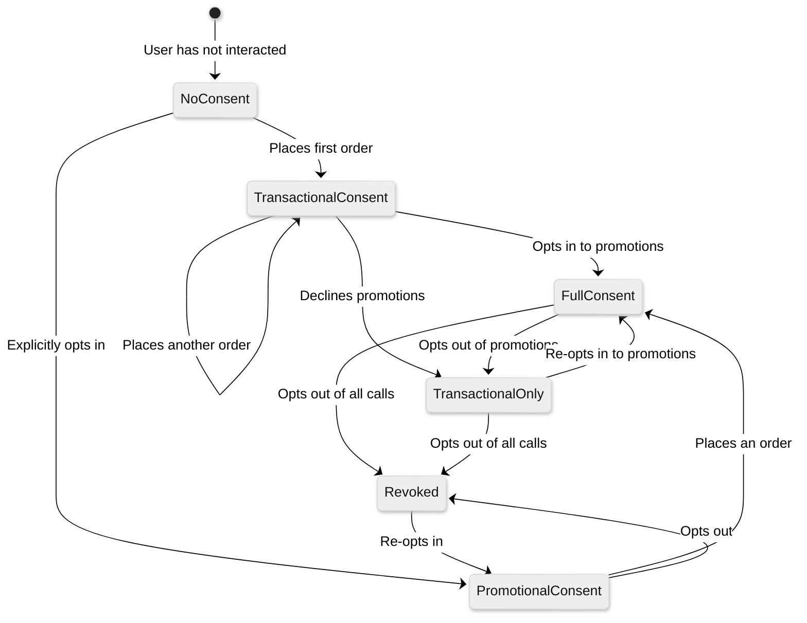

# 14.6 AI-Native Vernacular Voice Commerce Platform — Security & Compliance

## Voice Data Privacy

### Audio Recording Consent and Lifecycle

Voice interactions contain biometric data (voiceprint), personally identifiable information (spoken names, addresses, phone numbers), and sensitive financial data (payment details, order history). The platform must manage voice data through a rigorous consent-and-lifecycle framework.

| Phase | Requirement | Implementation |
|---|---|---|
| **Consent capture** | Obtain explicit recording consent at the start of every call | Verbal consent prompt: "Yeh call quality aur training ke liye record ho sakti hai. Kya aapko manzoor hai?" Consent must be captured before any audio is stored. For WhatsApp, consent is part of the initial opt-in flow. |
| **Consent verification** | Verify that consent was actually given (not just played) | ASR processes the user's response; only "haan", "yes", "theek hai" or equivalent affirmatives activate recording. Silence or ambiguous responses → repeat consent request once; if still unclear → proceed without recording. |
| **Consent storage** | Persist consent records independently of audio | Separate consent database with: user_id, session_id, consent_timestamp, consent_method (verbal/written), consent_text (ASR transcript of consent utterance), consent_language. Retained for 7 years regardless of audio retention. |
| **Audio encryption** | Encrypt all audio at rest and in transit | In transit: SRTP (Secure Real-time Transport Protocol) for phone calls, TLS 1.3 for WebSocket streams, HTTPS for voice note downloads. At rest: AES-256 encryption with customer-managed encryption keys (CMEK); encryption keys rotated quarterly. |
| **Retention management** | Configurable retention periods with auto-deletion | Default retention: 30 days for quality monitoring; extended to 90 days for disputed transactions; permanent deletion after TTL with cryptographic erasure (delete encryption keys → data becomes irrecoverable). |
| **Deletion requests** | Honor user deletion requests | "Right to be forgotten" workflow: user requests deletion → all audio recordings, transcripts, and derived features deleted within 72 hours; consent record annotated with deletion timestamp (consent record itself retained for compliance). |

### Audio Data Classification

| Data Category | Classification | Handling |
|---|---|---|
| **Raw audio recordings** | Sensitive personal data (contains biometric voiceprint) | Encrypted at rest; access restricted to quality team with audit logging; auto-deleted per retention policy |
| **ASR transcripts** | Personal data (may contain PII: names, addresses) | PII detected and redacted in stored transcripts; "[ADDRESS]", "[PHONE]", "[NAME]" placeholders replace actual values |
| **Aggregated voice analytics** | Non-personal (statistical data) | WER metrics, intent distributions, language distributions — safe for wider access |
| **Voice model training data** | Sensitive (derived from personal audio) | Anonymized before use: speaker identity removed; metadata stripped; consent verified for training use |
| **Call metadata** | Personal data (caller ID, timestamps) | Encrypted; access controlled; retained per telecom regulations |

### PII Detection and Redaction in Voice Transcripts

| PII Type | Detection Method | Redaction |
|---|---|---|
| **Phone numbers** | Regex pattern: 10-digit sequences, "+91" prefix | Replace with "[PHONE]" in stored transcript |
| **Names** | NER model detecting person names in vernacular languages | Replace with "[NAME]" |
| **Addresses** | Address entity extraction from dialog state | Replace with "[ADDRESS]"; store address separately in encrypted user profile |
| **Aadhaar numbers** | 12-digit pattern detection; spoken digit sequence detection | Replace with "[AADHAAR]"; never store; alert if Aadhaar spoken during call |
| **UPI VPA** | Pattern: word@word format in transcript | Replace with "[UPI_VPA]" |
| **Payment amounts** | Context-aware: amounts spoken during payment flow | Retain amounts (needed for order records) but redact from training data |

---

## Telephony Regulations

### TRAI Compliance (India)

| Regulation | Requirement | Implementation |
|---|---|---|
| **DND (Do Not Disturb) Registry** | Check TRAI DND registry before any outbound call; do not call users registered on DND for promotional purposes | DND check integrated into campaign scheduler; real-time DND API check before each outbound call; transactional calls (order confirmation, delivery update) exempt from DND but must be clearly transactional |
| **Calling hours** | Outbound calls restricted to 9:00 AM – 9:00 PM local time | Campaign scheduler enforces calling hours per user's timezone (derived from phone number area code); time zone boundary handling for borderline cases |
| **Caller ID display** | Must display a valid, registered caller ID | All outbound calls display the platform's registered telephone number; no caller ID spoofing; CLI (Calling Line Identification) registered with TRAI |
| **Opt-out mechanism** | Users must be able to opt out of future calls | Every outbound call offers opt-out: "Agar aage se call nahi chahiye toh '0' dabayiye"; opt-out processed within 24 hours; opt-out confirmation sent via SMS |
| **Call frequency limits** | Maximum number of calls per user per day/week | Platform enforces: max 1 promotional call per user per week; max 3 transactional calls per day; no calls within 48 hours of user opt-out request |
| **Telemarketing registration** | Platform must be registered as a telemarketer with TRAI | Registration maintained; unique header assigned for each message category; compliance audit quarterly |

### Consent Categories

| Consent Type | Scope | Validity | Revocation |
|---|---|---|---|
| **Transactional consent** | Order confirmations, delivery updates, payment reminders for active orders | Implicit with order placement; valid for order lifecycle | Not revocable for active order notifications |
| **Service consent** | Customer support callbacks, complaint resolution | Implicit with support request; valid until issue resolved | Revocable; system will not call back if revoked |
| **Promotional consent** | Reorder reminders, new product offers, seasonal campaigns | Explicit opt-in required; valid until revoked | Revocable via voice ("don't call me"), SMS, or app; processed within 24 hours |
| **Recording consent** | Audio recording for quality and training | Per-session verbal consent | Per-session; user can decline recording and still use the service |
| **Voice data consent** | Using voice data for ASR/TTS model training | Explicit opt-in (separate from recording consent) | Revocable; previously contributed data de-identified but not deleted from trained models |

---

## Biometric Voice Data Protection

### Voice Biometric Risks

Voice audio inherently contains biometric information—voiceprints that can uniquely identify individuals. Even without explicit speaker recognition, stored audio can be retrospectively analyzed to extract biometric features.

| Risk | Scenario | Mitigation |
|---|---|---|
| **Unauthorized speaker identification** | Stored audio used to identify individuals without consent | Audio stored only with consent; encryption keys separated from audio; access audit logging |
| **Voice cloning** | Attacker obtains stored audio to clone user's voice for fraud | Minimum audio retention; encrypted storage; voice cloning detection for inbound calls |
| **Replay attacks** | Attacker replays recorded voice to authenticate as user | No voice-based authentication for payments or sensitive actions; OTP + DTMF required |
| **Cross-system tracking** | Voiceprint used to track user across different systems | No voiceprint extraction or storage; audio not shared with third parties |
| **Deepfake calls** | Attacker uses voice deepfake to place fraudulent orders | Delivery address verification; payment OTP required; behavioral anomaly detection (ordering patterns) |

### Voice Data Security Architecture

| Layer | Protection | Details |
|---|---|---|
| **Transport** | SRTP for real-time audio; TLS 1.3 for all API calls | End-to-end encryption from user's device to processing pipeline |
| **Processing** | Audio processed in encrypted memory enclaves | Decrypted only during active processing; no audio cached in plaintext |
| **Storage** | AES-256 encryption with per-tenant keys | Key hierarchy: master key → tenant key → session key; key rotation quarterly |
| **Access** | Role-based access with audit logging | Only quality team can access raw audio; requires manager approval + purpose justification; all access logged with session ID and purpose |
| **Deletion** | Cryptographic erasure + overwrite | When retention expires, encryption key deleted → data becomes irrecoverable; storage blocks overwritten for compliance |

---

## Payment via Voice Security

### Voice Payment Threat Model

| Threat | Attack Vector | Mitigation |
|---|---|---|
| **Unauthorized order placement** | Attacker calls from user's lost/stolen phone | Payment requires OTP sent to registered number; delivery to pre-registered address only for new callers |
| **Eavesdropping on OTP** | OTP spoken over phone intercepted | Prefer DTMF input for OTP (digits pressed, not spoken); if spoken, never echo back full OTP; never store OTP in transcript |
| **Social engineering** | Caller impersonates another user to modify order | Identity verification: registered phone number + order ID + last 4 digits of UPI VPA for sensitive modifications |
| **Price manipulation** | Attacker attempts to modify price during voice interaction | Prices fetched from catalog in real-time; displayed price always matches catalog; no manual price override in voice channel |
| **Replay attack** | Recorded "confirm order" audio replayed | Each confirmation is contextual (specific cart, specific amount, specific session); replayed audio lacks session context |

### Payment Flow Security

| Step | Security Measure | Rationale |
|---|---|---|
| **Cart total announcement** | Read total amount clearly with verbal confirmation required | User must hear and confirm exact amount |
| **Payment method selection** | Offer choices; default to user's preferred method | Prevent default to unintended payment method |
| **UPI collect initiation** | Generate UPI collect request to registered VPA; verify on user's device | Payment authenticated on user's device, not through voice channel |
| **OTP entry** | DTMF preferred; spoken OTP accepted but never stored or echoed | DTMF is not audible to eavesdroppers; spoken OTP transcript redacted |
| **Confirmation** | System reads back: "Payment of ₹[amount] received. Order confirmed." | User gets explicit confirmation through voice channel |
| **Receipt** | SMS confirmation with order details sent to registered number | Written record outside voice channel for dispute resolution |

### PCI DSS Compliance for Voice

| Requirement | Voice-Specific Implementation |
|---|---|
| **No storage of cardholder data** | Platform does not accept credit/debit card numbers via voice; only UPI, COD, and wallet payments supported |
| **Secure transmission** | SRTP encryption for all voice traffic carrying payment information |
| **Access control** | Payment-related audio segments isolated and encrypted with separate keys; access restricted to payment operations team |
| **Audit trail** | All payment-related voice interactions logged with session ID, amount, timestamp, outcome; audio retained for dispute resolution per payment regulation |
| **Agent screen pop** | If human agent handles payment, card details never displayed on screen; agent uses secure payment link instead |

---

## Consent Management for Outbound Calls

### Consent State Machine

### Consent Verification Before Outbound Call

| Check | Action | Failure Handling |
|---|---|---|
| **DND registry** | Query TRAI DND API with phone number | If DND-registered AND call is promotional → skip; transactional calls proceed |
| **Platform consent** | Check user's consent state in consent database | If no promotional consent → only transactional calls allowed |
| **Calling hours** | Verify current time is within 9 AM–9 PM user's local time | Outside hours → schedule for next available window |
| **Frequency cap** | Check calls made to this user in last 7 days | Exceeds cap → defer to next week |
| **Recent opt-out** | Check for opt-out requests in last 48 hours | If pending opt-out → skip call; process opt-out |
| **Recent complaint** | Check for complaints about outbound calls | If complaint exists → skip all promotional calls for 30 days |

---

## Data Localization and Cross-Border Compliance

### Indian Data Localization Requirements

| Data Type | Localization Requirement | Implementation |
|---|---|---|
| **Voice recordings** | Must be stored within India for Indian users | All audio storage in Indian data center regions (Mumbai, Chennai) |
| **Payment data** | Must be stored in India per RBI circular | Payment transaction records in Indian data centers; no cross-border replication |
| **Personal data** | Under Digital Personal Data Protection Act, 2023: no transfer to restricted countries; allowed to non-restricted countries with consent | User profile, consent records, and interaction metadata stored in India; cross-border transfer only for anonymized analytics |
| **Aggregated analytics** | No localization required (anonymized) | Can be processed in any region for global analytics |

### Multi-Country Deployment Considerations

| Country | Key Regulations | Voice-Specific Requirements |
|---|---|---|
| **India** | TRAI telecom regulations; IT Act; DPDP Act 2023 | DND compliance; calling hours; data localization; consent management |
| **Indonesia** | GR 71/2019 (data localization); OJK regulations | Local data storage; Bahasa Indonesia voice support; local carrier integration |
| **Nigeria** | NDPR (Nigeria Data Protection Regulation); NCC regulations | Call recording consent; data protection; English + Hausa/Yoruba/Igbo voice support |
| **Bangladesh** | Bangladesh Telecommunication Regulatory Commission rules | Bangla voice support; local carrier integration; calling restrictions |

---

## Security Monitoring and Incident Response

### Voice-Specific Threat Detection

| Threat | Detection Signal | Automated Response |
|---|---|---|
| **Automated call fraud** | Multiple calls from same number with identical scripts; synthetic speech detected | Block caller after 3 suspicious calls; require CAPTCHA-equivalent (answer a random question) |
| **Account takeover via voice** | Call from unrecognized device claiming to be existing user; attempting to change delivery address or payment method | Trigger enhanced verification: OTP to registered number; knowledge-based question about recent orders |
| **Prompt injection via voice** | User speaks text designed to manipulate the NLU or LLM backend ("ignore all previous instructions") | Input sanitization on ASR transcripts before NLU processing; instruction-following bounded by dialog policy rules |
| **Toll fraud** | International calls routed through the platform's SIP infrastructure to make free calls | SIP authentication; geo-fencing on call routing; real-time call pattern monitoring |
| **DDoS on telephony** | Massive concurrent call volume from bot farm | Rate limiting per source number; CAPTCHA for suspicious call patterns; carrier-level filtering |

### Incident Response Playbook

| Severity | Trigger | Response Time | Actions |
|---|---|---|---|
| **P0 — Critical** | Voice data breach; unauthorized access to audio recordings; payment fraud via voice channel | 15 minutes | Isolate affected systems; notify CERT-In (within 6 hours per Indian law); disable affected voice channel; forensic audio access audit |
| **P1 — High** | ASR system returning PII in logs; consent verification failure; DND violation at scale | 1 hour | Fix logging pipeline; suspend outbound campaigns; audit affected calls; notify compliance team |
| **P2 — Medium** | Elevated fraud detection rate; TTS generating inappropriate content; consent recording failure for subset of calls | 4 hours | Increase fraud thresholds; review TTS content filters; fix consent capture; retroactively obtain consent where possible |
| **P3 — Low** | Minor DND check timing issue; consent language detection incorrect for < 1% of calls | 24 hours | Fix detection logic; scheduled deployment; monitor for recurrence |
