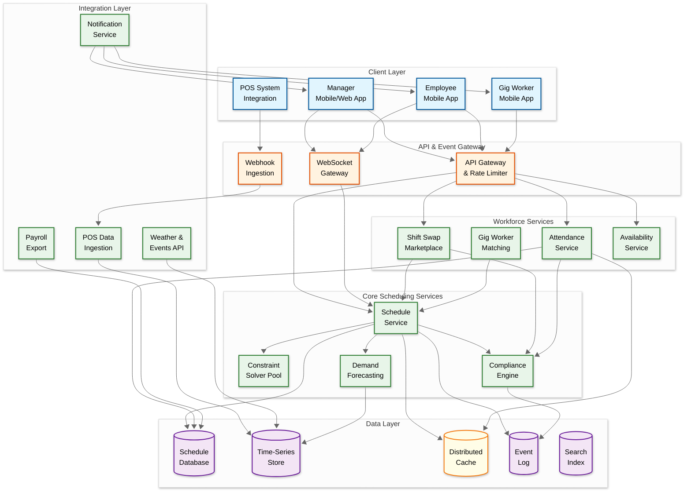
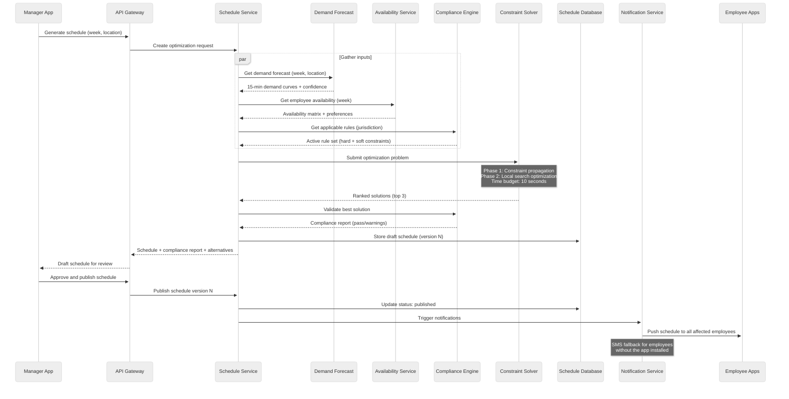
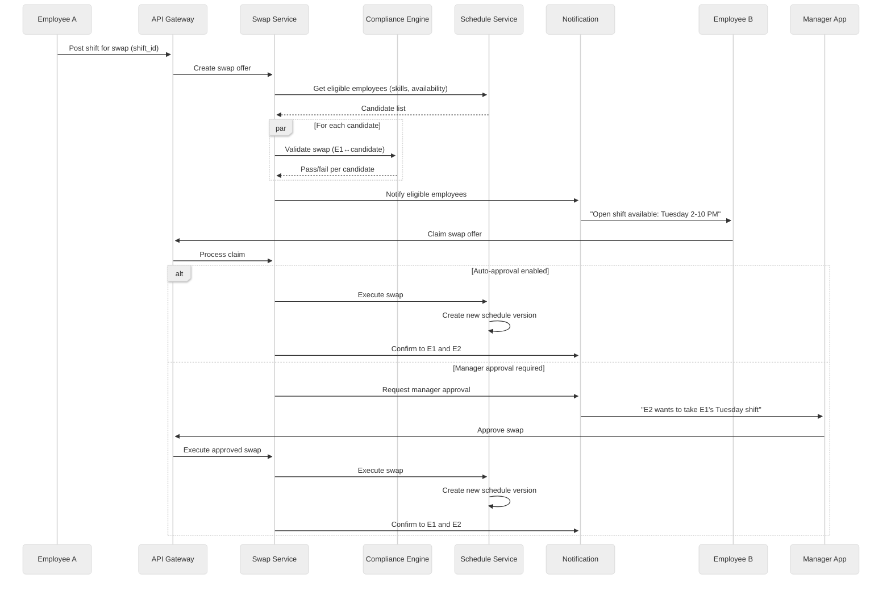

# 14.7 AI-Native SMB Workforce Scheduling & Gig Management — High-Level Design

## Architecture Overview

The platform follows an event-driven microservices architecture with three processing tiers: (1) a **real-time tier** handling clock-in/clock-out events, shift swaps, and live dashboard updates with sub-second latency, (2) a **near-real-time tier** processing demand signal ingestion, compliance validation, and notification delivery with 5-second SLOs, and (3) a **batch tier** running schedule optimization, demand forecast model training, and analytics aggregation on hourly/daily cadences. The constraint solver operates as a stateless, horizontally-scalable compute pool that receives optimization requests from the scheduling service and returns ranked solutions within a time budget.

---

## Data Flow: Schedule Generation

---

## Data Flow: Real-Time Shift Swap

---

## Key Design Decisions

### 1. Schedule as an Immutable Event Log

**Decision:** Every schedule modification (creation, edit, swap, gig fill, manager override) is recorded as an immutable event. The current schedule is the materialized view of all events applied in sequence. Each "version" is a snapshot created at publication.

**Rationale:**
- **Compliance audit trail:** Labor law disputes require proving what the schedule was at any point in time and who changed it. Immutable events provide a complete, tamper-evident audit trail.
- **Undo capability:** Managers can roll back to any previous version by replaying events up to that point.
- **Conflict resolution:** When two managers edit the same schedule concurrently, event ordering resolves conflicts deterministically (last-write-wins per shift, or merge with conflict detection).
- **Predictive scheduling compliance:** Jurisdictions with advance-notice requirements need proof of when the schedule was first published and every subsequent change—the event log provides this automatically.

**Trade-off:** Event sourcing adds complexity (event replay for materialization, snapshot management for performance) compared to simple CRUD. Justified by the compliance requirement that is non-negotiable for this domain.

### 2. Constraint Solver as a Stateless Compute Pool

**Decision:** The optimization solver runs as a pool of stateless worker processes. Each optimization request is self-contained (includes all inputs: demand, availability, rules, preferences). Workers can be horizontally scaled independently of the rest of the platform.

**Rationale:**
- **Burst scaling:** Sunday evening (managers preparing Monday schedules) creates a 10x spike in solver demand. Stateless workers scale up/down with demand.
- **Isolation:** A pathological optimization problem (unusual constraints creating an exponential search space) cannot affect other businesses. Each request runs in its own worker with a time budget and memory limit.
- **Upgradability:** Solver algorithm improvements can be deployed as a new worker version with canary rollout; old and new versions serve requests simultaneously.

**Trade-off:** Each request must serialize the full problem context (~50 KB), creating some overhead. The alternative (stateful solvers that cache business state) would require sticky routing and complicate scaling.

### 3. Dual-Stack Compliance: Pre-Validation + Real-Time Monitoring

**Decision:** Compliance enforcement operates in two modes: (1) **pre-validation** checks every schedule version against the rule set before publication (blocking violations), and (2) **real-time monitoring** tracks live shift execution against compliance rules (alerting on emerging violations like approaching overtime).

**Rationale:**
- Pre-validation alone is insufficient because real-world execution deviates from the schedule (employees stay late, shift swaps happen, call-offs trigger replacements).
- Real-time monitoring alone is insufficient because catching violations after they happen incurs penalties (predictive scheduling premium pay is owed the moment the schedule changes without adequate notice).
- The dual approach prevents violations where possible (pre-validation) and mitigates them when prevention fails (real-time monitoring with early warnings).

### 4. Gig Worker Matching as a Separate Marketplace Service

**Decision:** Gig worker matching operates as an independent service with its own matching algorithm, worker pool management, and rating system—rather than being embedded in the core scheduling optimizer.

**Rationale:**
- **Different optimization objectives:** Employee scheduling optimizes for cost, fairness, and compliance. Gig matching optimizes for fill rate, speed, and quality-of-match. Combining them in one solver would create a multi-objective problem that is harder to reason about and tune.
- **Different SLAs:** Employee scheduling runs on a weekly cadence (batch). Gig matching runs on-demand with a 30-minute fill target (real-time).
- **Independent evolution:** The gig marketplace has its own rating system, pricing model, and worker pool that evolve independently of the employee scheduling algorithms.

**Trade-off:** Separation means the gig matching service may not see the full optimization picture (e.g., it fills a gap with a gig worker at $25/hr when rearranging two employee shifts could fill it at $0 marginal cost). This is mitigated by having the scheduling service first attempt rearrangement before triggering gig broadcast.

### 5. Multi-Tenant Architecture with Shared Compute, Isolated Data

**Decision:** All businesses share the same application infrastructure (API servers, solver pools, notification services) but have strictly isolated data (separate database schemas or row-level security with tenant ID in every query).

**Rationale:**
- **Cost efficiency:** 100K businesses cannot each have dedicated infrastructure. Shared compute amortizes infrastructure costs to $5–20/month per business—critical for SMB pricing.
- **Data isolation:** An accidental cross-tenant data leak (one restaurant seeing another's employee schedules) would be a catastrophic trust violation. Strict isolation at the data layer, enforced by middleware that injects tenant_id into every database query, prevents this.
- **Noisy neighbor protection:** A large business running a complex optimization cannot starve smaller businesses of compute. The solver pool uses per-tenant request queuing with fair-share scheduling.

---

## Component Responsibilities

| Component | Responsibility | Key Dependencies |
|---|---|---|
| **Schedule Service** | Orchestrates schedule lifecycle (create, optimize, publish, modify); manages schedule versions and state transitions | Solver Pool, Compliance Engine, Demand Forecast, Availability Service |
| **Constraint Solver Pool** | Solves the combinatorial optimization problem; returns ranked feasible solutions within time budget | Stateless; receives complete problem context per request |
| **Demand Forecasting** | Produces 15-minute-granularity labor demand curves; ingests POS, weather, and event data; handles cold start | Time-Series Store, POS Integration, Weather API |
| **Compliance Engine** | Validates schedules against jurisdiction-specific labor rules; monitors real-time shift execution for violations; calculates premium pay | Rule database, Schedule Service, Attendance Service |
| **Shift Swap Marketplace** | Manages swap offers, eligibility filtering, compliance validation, and approval workflows | Compliance Engine, Schedule Service, Notification Service |
| **Gig Worker Matching** | Matches unfilled shifts to gig workers; manages worker pool, ratings, and pricing | Schedule Service, Notification Service, external gig worker profiles |
| **Attendance Service** | Processes clock-in/clock-out events; verifies geofence and biometrics; generates timesheets; detects anomalies | GPS verification, facial recognition, Schedule database |
| **Availability Service** | Manages employee availability, time-off requests, and recurring schedules; feeds into optimizer | Schedule Service, Employee profiles |
| **Notification Service** | Delivers push notifications, SMS, and email for schedule updates, shift offers, and compliance alerts | Notification provider APIs, user preference store |
| **POS Integration** | Ingests real-time sales data from POS systems via webhooks; normalizes and stores in time-series format | External POS APIs, Time-Series Store |
| **Payroll Export** | Exports verified timesheets to payroll providers; handles data mapping and format conversion | Attendance Service, external payroll APIs |
| **API Gateway** | Authentication, authorization, rate limiting, tenant routing, and request validation | All services |
| **WebSocket Gateway** | Maintains persistent connections for real-time schedule updates and live dashboard feeds | Schedule Service, Attendance Service |
