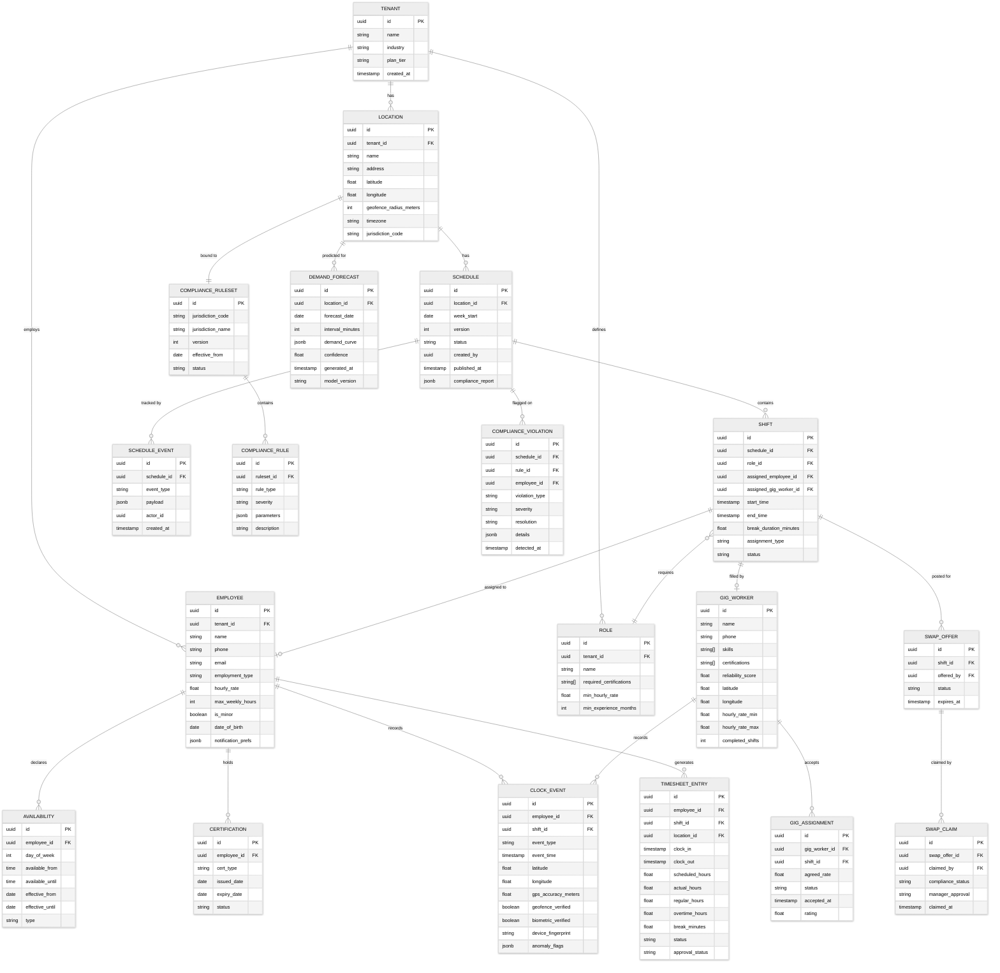

# 14.7 AI-Native SMB Workforce Scheduling & Gig Management — Low-Level Design

## Data Model

### Entity-Relationship Diagram



---

## API Design

### Schedule Management

```
POST /api/v1/schedules/generate
  Request:
    {
      location_id: uuid,
      week_start: date,
      optimization_preferences: {
        priority: "cost" | "fairness" | "coverage" | "balanced",
        overtime_budget_hours: float,
        include_gig_workers: boolean,
        respect_templates: boolean,
        time_budget_seconds: int  // max solver runtime
      }
    }
  Response:
    {
      schedule_id: uuid,
      version: int,
      status: "draft",
      shifts: [ Shift ],
      compliance_report: {
        status: "pass" | "warnings" | "violations",
        warnings: [ ComplianceWarning ],
        violations: [ ComplianceViolation ]
      },
      alternatives: [ AlternativeSchedule ],  // top 3 solutions
      optimization_metrics: {
        total_labor_cost: float,
        coverage_score: float,     // % of demand covered
        fairness_score: float,     // Gini coefficient of hour distribution
        preference_score: float    // % of soft preferences satisfied
      }
    }

POST /api/v1/schedules/{schedule_id}/publish
  Request:
    {
      notify_employees: boolean,
      notification_channels: ["push", "sms"]
    }
  Response:
    {
      schedule_id: uuid,
      version: int,
      status: "published",
      published_at: timestamp,
      notifications_sent: int,
      predictive_scheduling_notice: {
        compliant: boolean,
        advance_days: int,
        required_days: int
      }
    }

PATCH /api/v1/schedules/{schedule_id}/shifts/{shift_id}
  Request:
    {
      assigned_employee_id: uuid | null,
      start_time: timestamp,
      end_time: timestamp,
      reason: string           // required for compliance audit trail
    }
  Response:
    {
      shift: Shift,
      new_version: int,
      compliance_check: ComplianceReport,
      predictive_scheduling_impact: {
        premium_pay_triggered: boolean,
        premium_amount: float,
        affected_employee_id: uuid
      }
    }
```

### Shift Swap

```
POST /api/v1/swaps
  Request:
    {
      shift_id: uuid,
      reason: string
    }
  Response:
    {
      swap_offer_id: uuid,
      eligible_employees: [ { employee_id, name, compliance_status } ],
      expires_at: timestamp
    }

POST /api/v1/swaps/{swap_offer_id}/claim
  Request:
    {
      employee_id: uuid
    }
  Response:
    {
      swap_claim_id: uuid,
      compliance_check: {
        overtime_impact: "none" | "warning" | "violation",
        rest_period_check: "pass" | "fail",
        certification_check: "pass" | "fail"
      },
      requires_manager_approval: boolean,
      status: "pending_approval" | "auto_approved"
    }
```

### Attendance

```
POST /api/v1/attendance/clock-in
  Request:
    {
      employee_id: uuid,
      shift_id: uuid,
      latitude: float,
      longitude: float,
      gps_accuracy: float,
      device_fingerprint: string,
      biometric_token: string | null    // facial recognition result
    }
  Response:
    {
      clock_event_id: uuid,
      status: "accepted" | "rejected",
      geofence_check: "pass" | "fail",
      biometric_check: "pass" | "fail" | "skipped",
      schedule_check: "on_time" | "early" | "late",
      early_minutes: int,
      late_minutes: int,
      rejection_reason: string | null
    }

GET /api/v1/attendance/timesheets
  Query: location_id, week_start, status
  Response:
    {
      timesheets: [
        {
          employee_id: uuid,
          employee_name: string,
          entries: [
            {
              date: date,
              shift_id: uuid,
              scheduled_start: timestamp,
              scheduled_end: timestamp,
              actual_clock_in: timestamp,
              actual_clock_out: timestamp,
              regular_hours: float,
              overtime_hours: float,
              break_minutes: float,
              anomaly_flags: [ string ],
              status: "verified" | "exception" | "pending"
            }
          ],
          week_totals: {
            scheduled_hours: float,
            actual_hours: float,
            regular_hours: float,
            overtime_hours: float,
            total_cost: float
          }
        }
      ]
    }
```

### Gig Marketplace

```
POST /api/v1/gig/broadcast
  Request:
    {
      shift_ids: [ uuid ],
      max_rate: float,
      radius_km: float,
      required_skills: [ string ],
      urgency: "standard" | "urgent"    // urgent = higher rate, wider radius
    }
  Response:
    {
      broadcast_id: uuid,
      matched_workers: int,
      estimated_fill_time_minutes: int,
      status: "broadcasting"
    }

POST /api/v1/gig/accept
  Request:
    {
      broadcast_id: uuid,
      gig_worker_id: uuid,
      shift_id: uuid,
      proposed_rate: float
    }
  Response:
    {
      assignment_id: uuid,
      status: "accepted" | "rate_negotiation" | "already_filled",
      confirmed_rate: float,
      shift_details: Shift
    }
```

---

## Core Algorithms

### Schedule Optimization (Constraint Satisfaction + Local Search)

```
ALGORITHM GenerateOptimalSchedule(demand, employees, rules, preferences, time_budget):
    // Phase 1: Build the constraint model
    model = ConstraintModel()

    // Decision variables: X[e][t] = 1 if employee e is assigned to time slot t
    FOR each employee e IN employees:
        FOR each time_slot t IN weekly_time_slots:
            model.add_variable(X[e][t], domain={0, 1})

    // Hard constraints (must be satisfied)
    FOR each employee e:
        // Availability: can only work when available
        FOR each t WHERE NOT e.is_available(t):
            model.add_constraint(X[e][t] == 0)

        // Max weekly hours
        model.add_constraint(SUM(X[e][t] for all t) * slot_duration <= e.max_weekly_hours)

        // Mandatory rest between shifts (e.g., 10 hours)
        FOR each pair of consecutive shifts (t1_end, t2_start):
            model.add_constraint(t2_start - t1_end >= rules.min_rest_hours)

        // Minor restrictions
        IF e.is_minor:
            FOR each t WHERE t.is_restricted_for_minors(rules):
                model.add_constraint(X[e][t] == 0)

    // Certification requirements
    FOR each shift s requiring certification c:
        model.add_constraint(
            SUM(X[e][s.time_slot] for e WHERE e.has_certification(c)) >= 1
        )

    // Minimum staffing per time slot
    FOR each time_slot t:
        model.add_constraint(
            SUM(X[e][t] for all e) >= demand[t].min_staff
        )

    // Break requirements
    FOR each shift longer than rules.break_threshold_hours:
        // Ensure break is scheduled within the shift
        model.add_break_constraint(shift, rules.break_duration, rules.break_window)

    // Overtime rules
    FOR each employee e:
        daily_hours[e][d] = SUM(X[e][t] for t in day d) * slot_duration
        weekly_hours[e] = SUM(daily_hours[e][d] for all d)

        IF rules.daily_overtime_threshold:
            FOR each day d:
                model.add_constraint(
                    daily_hours[e][d] <= rules.daily_overtime_threshold
                    OR overtime_approved[e][d] == TRUE
                )

    // Phase 2: Find initial feasible solution via constraint propagation
    initial_solution = model.solve_feasibility(timeout=time_budget * 0.3)

    IF initial_solution == INFEASIBLE:
        RETURN {status: "infeasible", relaxation_suggestions: model.identify_conflicting_constraints()}

    // Phase 3: Optimize via local search (simulated annealing)
    best_solution = initial_solution
    temperature = INITIAL_TEMPERATURE
    remaining_time = time_budget * 0.7

    WHILE remaining_time > 0 AND temperature > MIN_TEMPERATURE:
        neighbor = generate_neighbor(best_solution)  // swap two employees, move a shift, etc.

        IF NOT model.satisfies_hard_constraints(neighbor):
            CONTINUE

        delta = objective(neighbor, preferences) - objective(best_solution, preferences)

        IF delta > 0 OR random() < exp(delta / temperature):
            best_solution = neighbor

        temperature *= COOLING_RATE
        remaining_time -= elapsed

    RETURN {
        schedule: best_solution,
        metrics: compute_metrics(best_solution, demand, preferences)
    }

FUNCTION objective(solution, preferences):
    // Multi-objective function (higher is better)
    cost_score = -total_labor_cost(solution) * preferences.cost_weight
    coverage_score = demand_coverage_percentage(solution) * preferences.coverage_weight
    fairness_score = -gini_coefficient(hours_per_employee(solution)) * preferences.fairness_weight
    preference_score = preference_satisfaction(solution) * preferences.preference_weight

    RETURN cost_score + coverage_score + fairness_score + preference_score
```

### Demand Forecasting

```
ALGORITHM ForecastDemand(location_id, target_date_range):
    // Gather input signals
    historical_sales = query_time_series(location_id, "sales", lookback=90_days)
    historical_traffic = query_time_series(location_id, "foot_traffic", lookback=90_days)
    weather_forecast = fetch_weather_api(location_id, target_date_range)
    events = fetch_event_calendar(location_id, target_date_range)
    holidays = get_holiday_calendar(location_id, target_date_range)

    // Check for cold start
    IF length(historical_sales) < 14_days:
        // Use industry priors + transfer learning
        similar_businesses = find_similar_businesses(location_id, industry, size, area_type)
        prior_demand = aggregate_demand_patterns(similar_businesses)
        confidence_discount = 0.5  // lower confidence for cold start

        IF length(historical_sales) > 0:
            // Blend prior with limited data (Bayesian update)
            demand_curve = bayesian_blend(prior_demand, historical_sales, weight=data_days/14)
        ELSE:
            demand_curve = prior_demand

        RETURN {curve: demand_curve, confidence: confidence_discount}

    // Feature engineering
    features = []
    FOR each 15_min_interval IN target_date_range:
        f = {
            day_of_week: interval.day_of_week,
            hour: interval.hour,
            minute: interval.minute,
            is_holiday: holidays.contains(interval.date),
            days_to_nearest_holiday: holidays.distance(interval.date),
            weather_temp: weather_forecast[interval].temperature,
            weather_precip: weather_forecast[interval].precipitation_prob,
            weather_category: weather_forecast[interval].category,
            event_nearby: events.has_event_within(interval, radius=5km),
            event_size: events.max_size_within(interval, radius=5km),
            is_payday: is_common_payday(interval.date),
            historical_same_dow_avg: historical_sales.avg(same_dow, same_hour, last_8_weeks),
            historical_trend: historical_sales.trend(same_dow, same_hour, last_8_weeks),
            historical_same_dow_stddev: historical_sales.stddev(same_dow, same_hour, last_8_weeks)
        }
        features.append(f)

    // Model inference (gradient-boosted ensemble)
    predictions = model.predict(features)

    // Convert sales predictions to staffing demand
    FOR each interval:
        predicted_demand = predictions[interval]
        staff_needed = ceiling(predicted_demand / productivity_rate[location.industry])
        confidence = 1.0 - (predictions[interval].stddev / predictions[interval].mean)

        demand_curve[interval] = {
            min_staff: max(1, staff_needed - confidence_margin(confidence)),
            target_staff: staff_needed,
            max_staff: staff_needed + confidence_margin(confidence),
            predicted_revenue: predicted_demand,
            confidence: confidence
        }

    RETURN {curve: demand_curve, confidence: mean(all confidences)}
```

### GPS Spoofing Detection

```
ALGORITHM VerifyClockIn(employee_id, shift_id, gps_data, device_data):
    shift = get_shift(shift_id)
    location = get_location(shift.location_id)

    // Step 1: Basic geofence check
    distance = haversine(
        gps_data.latitude, gps_data.longitude,
        location.latitude, location.longitude
    )

    IF distance > location.geofence_radius_meters:
        RETURN {status: "rejected", reason: "outside_geofence", distance: distance}

    // Step 2: GPS accuracy check (low accuracy = suspicious)
    IF gps_data.accuracy > 100_meters:
        flag_anomaly("low_gps_accuracy", gps_data)

    // Step 3: GPS spoofing detection via sensor fusion
    spoof_score = 0.0

    // Check 3a: Mock location API detection
    IF device_data.mock_location_enabled:
        spoof_score += 0.8   // strong signal

    // Check 3b: WiFi SSID consistency
    // Real devices near the location should see the location's WiFi networks
    expected_wifi = get_known_wifi_ssids(location.id)
    visible_wifi = device_data.visible_wifi_ssids
    wifi_overlap = intersection(expected_wifi, visible_wifi) / length(expected_wifi)

    IF wifi_overlap < 0.3 AND length(expected_wifi) > 0:
        spoof_score += 0.4   // moderate signal

    // Check 3c: Cell tower consistency
    expected_towers = get_expected_cell_towers(location.latitude, location.longitude)
    connected_tower = device_data.cell_tower_id
    IF connected_tower NOT IN expected_towers:
        spoof_score += 0.3   // moderate signal

    // Check 3d: Impossible travel detection
    last_event = get_last_clock_event(employee_id)
    IF last_event:
        time_delta = gps_data.timestamp - last_event.timestamp
        distance_delta = haversine(gps_data.lat, gps_data.lon, last_event.lat, last_event.lon)
        implied_speed = distance_delta / time_delta

        IF implied_speed > 200_km_per_hour:  // faster than driving
            spoof_score += 0.6   // strong signal

    // Check 3e: Accelerometer data consistency
    // A real device being carried shows movement; a spoofed location from a stationary device doesn't
    IF device_data.accelerometer_variance < STATIONARY_THRESHOLD:
        IF distance_from_last_known_position > 100_meters:
            spoof_score += 0.3   // device didn't move but GPS jumped

    // Decision
    IF spoof_score >= 0.7:
        RETURN {status: "rejected", reason: "spoofing_detected", spoof_score: spoof_score}
    ELSE IF spoof_score >= 0.4:
        RETURN {status: "accepted_with_flag", reason: "suspicious_location", spoof_score: spoof_score}
    ELSE:
        RETURN {status: "accepted", spoof_score: spoof_score}
```

### Compliance Validation

```
ALGORITHM ValidateScheduleCompliance(schedule, ruleset):
    violations = []
    warnings = []

    FOR each employee e IN schedule.employees:
        shifts = schedule.get_shifts_for(e)

        // Rule: Weekly overtime
        weekly_hours = SUM(shift.duration for shift in shifts)
        IF weekly_hours > ruleset.weekly_overtime_threshold:
            overtime_hours = weekly_hours - ruleset.weekly_overtime_threshold
            violations.append({
                rule: "weekly_overtime",
                severity: "hard",
                employee: e,
                detail: "Scheduled {weekly_hours}h, threshold {ruleset.weekly_overtime_threshold}h",
                overtime_cost: overtime_hours * e.hourly_rate * ruleset.overtime_multiplier
            })

        // Rule: Daily overtime (jurisdiction-specific)
        IF ruleset.has_daily_overtime:
            FOR each day d:
                daily_hours = SUM(shift.duration for shift in shifts WHERE shift.date == d)
                IF daily_hours > ruleset.daily_overtime_threshold:
                    violations.append({
                        rule: "daily_overtime",
                        severity: "warning",
                        employee: e,
                        day: d,
                        detail: "Scheduled {daily_hours}h, threshold {ruleset.daily_overtime_threshold}h"
                    })

        // Rule: Rest between shifts (clopening detection)
        sorted_shifts = sort_by_time(shifts)
        FOR i IN range(1, length(sorted_shifts)):
            rest_hours = (sorted_shifts[i].start - sorted_shifts[i-1].end).hours
            IF rest_hours < ruleset.min_rest_between_shifts:
                violations.append({
                    rule: "insufficient_rest",
                    severity: "hard",
                    employee: e,
                    detail: "Only {rest_hours}h between shifts, minimum {ruleset.min_rest_between_shifts}h"
                })

        // Rule: Predictive scheduling advance notice
        IF ruleset.has_predictive_scheduling:
            notice_days = (schedule.published_at.date - schedule.week_start).days
            IF notice_days < ruleset.required_advance_notice_days:
                warnings.append({
                    rule: "predictive_scheduling_notice",
                    severity: "warning",
                    detail: "Publishing {notice_days}d before, requires {ruleset.required_advance_notice_days}d",
                    premium_pay_liability: calculate_premium_pay(schedule, ruleset)
                })

        // Rule: Break requirements
        FOR each shift IN shifts:
            IF shift.duration > ruleset.break_required_after_hours:
                IF shift.break_duration < ruleset.min_break_minutes:
                    violations.append({
                        rule: "insufficient_break",
                        severity: "hard",
                        employee: e,
                        shift: shift,
                        detail: "Shift is {shift.duration}h with {shift.break_duration}min break, requires {ruleset.min_break_minutes}min"
                    })

        // Rule: Minor work restrictions
        IF e.is_minor:
            FOR each shift IN shifts:
                IF shift.end_time.hour > ruleset.minor_max_end_hour:
                    violations.append({
                        rule: "minor_late_hours",
                        severity: "hard",
                        employee: e,
                        shift: shift
                    })
                IF shift.duration > ruleset.minor_max_daily_hours:
                    violations.append({
                        rule: "minor_max_hours",
                        severity: "hard",
                        employee: e,
                        shift: shift
                    })

        // Rule: Split shift premium (jurisdiction-specific)
        IF ruleset.has_split_shift_premium:
            day_shifts = group_by_date(shifts)
            FOR each day, day_shifts IN day_shifts:
                IF length(day_shifts) > 1:
                    gap = day_shifts[1].start - day_shifts[0].end
                    IF gap > ruleset.split_shift_gap_threshold:
                        warnings.append({
                            rule: "split_shift_premium",
                            severity: "warning",
                            employee: e,
                            premium_amount: ruleset.split_shift_premium_rate
                        })

    RETURN {
        status: "pass" IF len(violations)==0 ELSE "violations",
        violations: violations,
        warnings: warnings,
        total_compliance_cost: SUM(v.overtime_cost or v.premium_amount for v in violations + warnings)
    }
```
