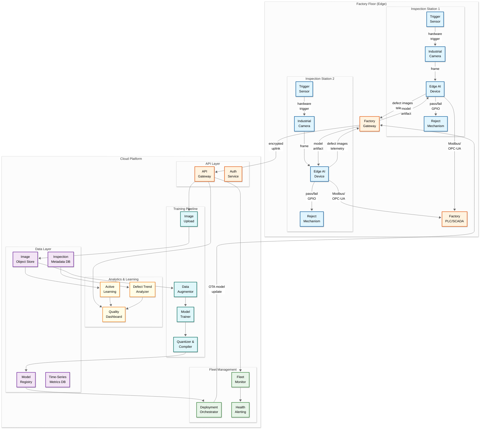

# 14.8 AI-Native Quality Control for SME Manufacturing — High-Level Design

## Architecture Overview

The platform follows a hub-and-spoke edge-cloud hybrid architecture where the critical real-time inspection path runs entirely on edge devices at the factory floor (spokes), while model training, fleet management, analytics, and collaboration happen in a central cloud platform (hub). This separation ensures that inspection never depends on network connectivity—a factory experiencing a WAN outage continues inspecting at full speed—while still enabling centralized model management, cross-factory analytics, and continuous improvement through active learning.



---

## Data Flow

### Real-Time Inspection Flow (On-Edge, No Cloud Dependency)

```
1. Trigger sensor detects part entering inspection zone
   → Sends hardware interrupt to edge device (< 1 ms)

2. Edge device triggers camera capture
   → Global shutter exposure (0.5-5 ms depending on lighting)
   → Frame transferred to edge device memory via USB3/GigE/MIPI (5-10 ms)

3. Preprocessing on edge device
   → White balance correction using pre-calibrated coefficients
   → Region of interest (ROI) extraction
   → Resize to model input dimensions
   → Normalization (mean subtraction, scale to [-1, 1])
   → Time: 5-10 ms

4. Model inference on edge accelerator
   → INT8 quantized model loaded in NPU/TPU memory
   → Forward pass: feature extraction → detection head → classification
   → Output: per-class confidence scores + bounding boxes (if localization model)
   → Time: 30-80 ms

5. Postprocessing and decision
   → Apply per-class confidence thresholds
   → Non-max suppression for overlapping detections
   → Map to pass/fail decision using defect severity rules
   → Time: 2-5 ms

6. Actuation
   → Assert GPIO pin for pass or fail
   → Send result over Modbus/OPC-UA to factory PLC
   → Time: 1-5 ms

7. Local logging
   → Write inspection record to local SQLite DB
   → If defect detected: save full-resolution image to local storage
   → If pass: save image with configurable sampling rate (1-10%)
   → Time: 1-5 ms (async, non-blocking)

Total trigger-to-actuation: 50-115 ms
```

### Cloud Synchronization Flow (Async, Non-Blocking)

```
1. Edge device batches inspection results and images
   → Defect images queued for upload immediately
   → Pass image samples queued at lower priority
   → Telemetry aggregated at 30-second intervals

2. Factory gateway aggregates from all stations
   → Compresses and encrypts batch
   → Uploads to cloud via HTTPS (or queues during network outage)

3. Cloud ingestion
   → API gateway authenticates and rate-limits
   → Images written to object storage
   → Inspection metadata written to time-series DB
   → Telemetry written to metrics DB

4. Async processing
   → Active learning engine flags uncertain inspections for review
   → Trend analyzer updates defect rate dashboards
   → Health monitor evaluates station telemetry for anomalies
```

### Model Training and Deployment Flow

```
1. Operator uploads training images via web UI
   → Drag-and-drop into class buckets (Good, Defect-A, Defect-B, ...)
   → Images uploaded to object storage with class labels

2. Data augmentation pipeline
   → Generate synthetic variants: rotation, flip, scale, color jitter
   → For defect classes: generate synthetic defects via learned priors
   → Split into train/validation/test sets (70/15/15)

3. Model training
   → Select architecture based on target edge hardware
   → Initialize from domain-specific pre-trained backbone
   → Fine-tune on operator's dataset
   → Evaluate on validation set; early stopping on val loss plateau

4. Quantization and compilation
   → Post-training quantization to INT8
   → Compile for target edge accelerator (NPU-specific IR)
   → Benchmark inference latency on reference hardware
   → Package as deployable artifact with metadata

5. Operator review
   → Show validation results: accuracy, per-class recall/precision
   → Visual gallery of correct and incorrect predictions on test set
   → Operator approves or requests adjustments

6. Deployment
   → Push model artifact to deployment orchestrator
   → Orchestrator sends to factory gateway → edge devices
   → New model enters shadow mode (runs in parallel, logs only)
   → After N inspections in shadow mode, compare to production model
   → If shadow model passes, promote to production; else, discard
```

---

## Key Design Decisions

### Decision 1: Edge-First Architecture vs. Cloud Inference

**Choice**: All real-time inference happens on edge devices. The cloud is used only for training, management, and analytics.

**Why**: (1) **Latency**: Round-trip to cloud adds 50-200 ms even on good connections, consuming the entire inference budget before the model even runs. (2) **Reliability**: Factory internet connections fail; a cloud-dependent inspection system stops the production line during outages. (3) **Bandwidth**: Uploading every frame at 120 fps per station would require 2-10 Gbps per station—impractical and expensive. (4) **Cost**: Cloud GPU inference at $1-$3/hour per station × 10 stations × 24 hours = $240-$720/day; a one-time edge device purchase of $1,000-$3,000 per station is cheaper within 2-5 days.

**Trade-off**: Edge inference limits model complexity. The largest models that run in real-time on edge hardware are ~10M parameters (vs. hundreds of millions in cloud). This is acceptable because inspection models are domain-narrow (one model per product type) and benefit more from domain-specific transfer learning than from raw model size.

### Decision 2: Hardware-Triggered Capture vs. Software-Triggered Capture

**Choice**: Image capture is triggered by physical sensors (photoelectric, encoder) via hardware interrupt, not by software polling or video stream analysis.

**Why**: Software-triggered capture introduces non-deterministic timing: the OS scheduler may delay the capture by 1-50 ms depending on system load, causing the part to be in slightly different positions across captures. This positional variation either degrades model accuracy (the model must learn to be invariant to position, consuming capacity that could learn defect features) or requires complex software alignment (finding the part in the frame and cropping, which adds latency and failure modes). Hardware triggers ensure deterministic timing (< 1 ms jitter), meaning every part is captured at the exact same position, simplifying the model's job.

**Trade-off**: Requires physical sensor installation and wiring, adding $20-$50 to station cost and complexity. Worth it for the determinism guarantee.

### Decision 3: Quantized INT8 Inference vs. FP32/FP16 Inference

**Choice**: All edge models are quantized to INT8 precision using quantization-aware training (QAT) or post-training quantization (PTQ) with calibration.

**Why**: INT8 inference is 2-4x faster than FP32 and 1.5-2x faster than FP16 on the same hardware, while using 4x less memory. On typical edge NPUs, INT8 is the native precision with maximum throughput. The accuracy loss from INT8 quantization is typically 0.5-1.5% (e.g., 96.2% recall at FP32 → 95.0% at INT8)—acceptable given the 2-4x performance improvement.

**Trade-off**: Quantization-aware training adds complexity to the training pipeline. Some defect types with subtle intensity gradients (e.g., slight discoloration) may lose sensitivity at INT8 due to reduced dynamic range. For these edge cases, the system supports per-class quantization sensitivity analysis and can flag defect types where INT8 accuracy drops more than 2% vs. FP32, recommending FP16 on supported hardware.

### Decision 4: Domain-Specific Pre-trained Backbones vs. Generic ImageNet Backbones

**Choice**: Train and maintain domain-specific pre-trained backbones for major manufacturing verticals (textiles, food, electronics, metal, plastics) rather than starting from generic ImageNet features.

**Why**: ImageNet features are optimized for natural-image classification (cats vs. dogs), not for industrial defect detection where the signal is often a subtle texture anomaly on a relatively uniform background. A backbone pre-trained on millions of industrial surface images learns feature representations that are 5-10x more data-efficient for defect detection. With domain-specific backbones, operators need 50-200 images to reach production accuracy; with ImageNet backbones, they need 500-2,000.

**Trade-off**: Creating and maintaining domain-specific backbones requires curating large domain datasets (1M+ images per vertical), training large models, and periodically retraining as the data distribution evolves. This is a platform-level investment amortized across all tenants in that vertical.

### Decision 5: SQLite on Edge vs. Remote Database

**Choice**: Each edge device stores inspection results in a local SQLite database that syncs to the cloud asynchronously.

**Why**: (1) Zero network dependency for logging—inspection records are written locally regardless of connectivity. (2) SQLite is file-based, requires no daemon, survives unexpected power loss (write-ahead logging), and handles the write throughput of a single station easily (120 inserts/min is trivial). (3) Local database enables on-device analytics (defect rate for current shift) even offline.

**Trade-off**: Sync logic must handle conflict resolution (though conflicts are rare since each station writes only its own data), eventual consistency (cloud analytics may lag by minutes during normal operation, hours during outages), and storage management (purge synced records to prevent disk exhaustion).
