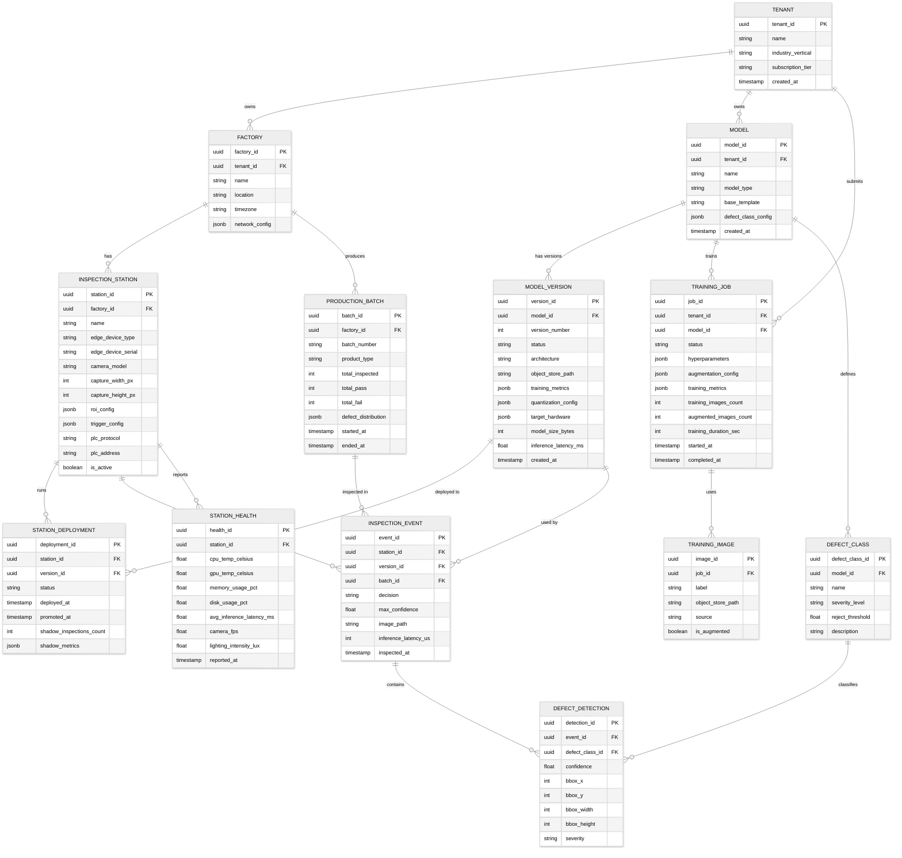

# 14.8 AI-Native Quality Control for SME Manufacturing — Low-Level Design

## Data Model

### Entity Relationship Diagram



---

## API Design

### Edge Device APIs (Local, On-Device)

#### Trigger Inspection

```
POST /api/v1/inspect

Purpose: Called by trigger handler when hardware sensor fires
Latency budget: < 150 ms total

Request:
{
  "trigger_id": "uint64 — monotonic trigger counter",
  "trigger_timestamp_us": "uint64 — microsecond timestamp from hardware timer",
  "camera_id": "string — identifies which camera (for multi-camera stations)",
  "batch_id": "string — current production batch identifier (optional)"
}

Response:
{
  "event_id": "uuid",
  "decision": "pass | fail | uncertain",
  "confidence": "float — max defect confidence",
  "detections": [
    {
      "defect_class": "string",
      "confidence": "float",
      "severity": "critical | major | minor | cosmetic",
      "bbox": { "x": "int", "y": "int", "w": "int", "h": "int" }
    }
  ],
  "inference_latency_us": "uint32",
  "actuation_signal": "pass | reject",
  "image_archived": "boolean"
}
```

#### Get Station Status

```
GET /api/v1/station/status

Response:
{
  "station_id": "uuid",
  "model_version": "string",
  "model_status": "production | shadow | loading",
  "uptime_seconds": "uint64",
  "inspections_today": "uint32",
  "defect_rate_today": "float",
  "avg_inference_latency_ms": "float",
  "cpu_temp_celsius": "float",
  "gpu_temp_celsius": "float",
  "memory_usage_pct": "float",
  "disk_usage_pct": "float",
  "cloud_sync_status": "synced | pending | offline",
  "pending_upload_count": "uint32"
}
```

### Cloud Platform APIs

#### Create Training Job

```
POST /api/v1/models/{model_id}/train

Request:
{
  "training_config": {
    "base_template": "string — domain template ID (optional)",
    "target_hardware": ["string — edge device type IDs"],
    "augmentation_level": "light | standard | aggressive",
    "training_budget_hours": "float — max training duration"
  }
}

Response:
{
  "job_id": "uuid",
  "status": "queued",
  "estimated_duration_minutes": "int",
  "dataset_summary": {
    "total_images": "int",
    "per_class_count": { "good": "int", "defect_a": "int", ... },
    "augmented_total": "int"
  }
}
```

#### Deploy Model to Stations

```
POST /api/v1/models/{model_id}/versions/{version_id}/deploy

Request:
{
  "station_ids": ["uuid — target stations"],
  "deploy_mode": "shadow | production",
  "shadow_config": {
    "min_inspections": "int — minimum inspections before promotion eligible",
    "auto_promote": "boolean",
    "min_accuracy_improvement": "float — required improvement over current model"
  },
  "rollback_config": {
    "auto_rollback": "boolean",
    "accuracy_threshold": "float — rollback if accuracy drops below"
  }
}

Response:
{
  "deployment_id": "uuid",
  "status": "in_progress",
  "stations": [
    {
      "station_id": "uuid",
      "download_status": "queued | downloading | ready",
      "current_model_version": "string"
    }
  ]
}
```

#### Query Inspection Results

```
GET /api/v1/inspections

Parameters:
  - station_id: uuid (optional)
  - batch_id: uuid (optional)
  - decision: pass | fail | uncertain (optional)
  - defect_class: string (optional)
  - from_timestamp: ISO8601
  - to_timestamp: ISO8601
  - page: int
  - page_size: int (max 1000)

Response:
{
  "inspections": [
    {
      "event_id": "uuid",
      "station_id": "uuid",
      "decision": "fail",
      "confidence": 0.94,
      "detections": [...],
      "image_url": "string — pre-signed URL, expires in 1 hour",
      "inspected_at": "ISO8601"
    }
  ],
  "pagination": { "page": 1, "total_pages": 47, "total_count": 4612 }
}
```

#### Active Learning Review Queue

```
GET /api/v1/models/{model_id}/review-queue

Response:
{
  "items": [
    {
      "event_id": "uuid",
      "image_url": "string",
      "model_prediction": "defect_a",
      "model_confidence": 0.52,
      "station_id": "uuid",
      "inspected_at": "ISO8601"
    }
  ],
  "total_pending": "int"
}

POST /api/v1/models/{model_id}/review-queue/{event_id}/label

Request:
{
  "label": "string — correct class label",
  "notes": "string — optional operator notes"
}
```

---

## Core Algorithms

### Algorithm 1: Edge Inference Pipeline

```
FUNCTION RunInspection(trigger_event):
    // Phase 1: Image Acquisition
    raw_frame = Camera.CaptureWithExposure(
        exposure_time = station_config.exposure_us,
        gain = station_config.gain
    )

    // Phase 2: Preprocessing
    frame = ApplyWhiteBalance(raw_frame, station_config.wb_coefficients)
    roi = CropRegionOfInterest(frame, station_config.roi_bounds)

    // Quality gate: reject frames with motion blur or exposure issues
    blur_score = ComputeLaplacianVariance(roi)
    IF blur_score < station_config.min_sharpness_threshold:
        RETURN InspectionResult(decision="uncertain", reason="motion_blur")

    brightness = ComputeMeanIntensity(roi)
    IF brightness < station_config.min_brightness OR brightness > station_config.max_brightness:
        RETURN InspectionResult(decision="uncertain", reason="exposure_anomaly")

    // Phase 3: Normalize for model input
    input_tensor = Resize(roi, model.input_width, model.input_height)
    input_tensor = Normalize(input_tensor, model.mean, model.std)
    input_tensor = QuantizeToINT8(input_tensor, model.input_scale, model.input_zero_point)

    // Phase 4: Model Inference (on NPU/accelerator)
    output_tensor = NPU.RunInference(model.compiled_graph, input_tensor)

    // Phase 5: Postprocessing
    detections = DecodeDetections(output_tensor, model.anchors, model.class_names)
    detections = NonMaxSuppression(detections, iou_threshold=0.5)

    // Phase 6: Apply per-class reject thresholds
    defects_found = []
    FOR EACH detection IN detections:
        class_config = model.defect_classes[detection.class_name]
        IF detection.confidence >= class_config.reject_threshold:
            defects_found.APPEND(detection)

    // Phase 7: Decision logic
    IF defects_found IS EMPTY:
        decision = "pass"
    ELSE:
        max_severity = MAX(d.severity_level FOR d IN defects_found)
        IF max_severity == "critical" OR max_severity == "major":
            decision = "fail"
        ELSE:
            // Minor/cosmetic defects: check count threshold
            IF COUNT(defects_found) >= station_config.minor_defect_reject_count:
                decision = "fail"
            ELSE:
                decision = "pass_with_defects"

    // Phase 8: Actuation
    IF decision == "fail":
        GPIO.SetPin(station_config.reject_pin, HIGH)
        SLEEP(station_config.reject_pulse_duration_ms)
        GPIO.SetPin(station_config.reject_pin, LOW)

    // Phase 9: Log and archive
    event = CreateInspectionEvent(trigger_event, decision, detections, inference_latency)
    LocalDB.Insert(event)

    IF decision == "fail" OR decision == "uncertain":
        LocalStorage.SaveImage(raw_frame, event.event_id)  // Always save defect images
    ELSE IF RandomFloat() < station_config.pass_sample_rate:
        LocalStorage.SaveImage(raw_frame, event.event_id)  // Sample pass images

    RETURN event
```

### Algorithm 2: No-Code Model Training Pipeline

```
FUNCTION TrainModel(training_job):
    // Phase 1: Load and validate dataset
    dataset = LoadTrainingImages(training_job.image_set)

    // Validate minimum requirements
    class_counts = CountPerClass(dataset)
    IF class_counts["good"] < 30:
        FAIL("Need at least 30 good reference images")
    FOR EACH defect_class IN class_counts:
        IF defect_class != "good" AND class_counts[defect_class] < 15:
            WARN("Defect class {defect_class} has only {count} images; accuracy may be limited")

    // Phase 2: Automated data augmentation
    augmented_dataset = []
    FOR EACH image, label IN dataset:
        augmented_dataset.APPEND((image, label))  // Original

        // Geometric augmentations
        FOR angle IN [90, 180, 270]:
            augmented_dataset.APPEND((Rotate(image, angle), label))
        augmented_dataset.APPEND((HorizontalFlip(image), label))
        augmented_dataset.APPEND((VerticalFlip(image), label))

        // Photometric augmentations (simulate lighting variation)
        FOR brightness_factor IN [0.7, 0.85, 1.15, 1.3]:
            augmented_dataset.APPEND((AdjustBrightness(image, brightness_factor), label))
        FOR contrast_factor IN [0.8, 1.2]:
            augmented_dataset.APPEND((AdjustContrast(image, contrast_factor), label))

        // Domain-specific augmentations for defect classes
        IF label != "good":
            FOR i IN RANGE(5):
                // Elastic deformation simulates realistic defect shape variation
                augmented_dataset.APPEND((ElasticDeform(image, alpha=50, sigma=5), label))
                // CutMix: paste defect region onto different good-part backgrounds
                random_good = RandomSample(dataset, label="good")
                augmented_dataset.APPEND((CutMixDefect(image, random_good, label), label))

    // Phase 3: Balance classes
    balanced_dataset = OversampleMinorityClasses(augmented_dataset, target_ratio=1.0)

    // Phase 4: Split dataset
    train_set, val_set, test_set = StratifiedSplit(balanced_dataset, ratios=[0.7, 0.15, 0.15])

    // Phase 5: Select architecture based on target hardware
    target_devices = training_job.target_hardware
    hardware_constraints = GetHardwareConstraints(target_devices)
    // constraints: max_params, max_model_size_mb, target_latency_ms, supported_ops

    architecture = SelectArchitecture(
        num_classes = LEN(class_counts),
        max_params = hardware_constraints.max_params,
        task_type = training_job.model_type  // classification vs detection
    )
    // Architecture selection priority:
    // 1. EfficientNet-Lite0 (< 5M params, fast on most NPUs)
    // 2. MobileNetV3-Small (< 3M params, for very constrained devices)
    // 3. MobileNetV3-Large (< 6M params, for devices with more compute)
    // 4. EfficientDet-Lite (detection, < 8M params)

    // Phase 6: Initialize from pre-trained backbone
    IF training_job.base_template IS NOT NULL:
        model = LoadDomainPretrainedModel(training_job.base_template, architecture)
    ELSE:
        model = LoadImageNetPretrainedModel(architecture)

    // Replace classification head for this specific task
    model.head = CreateNewHead(num_classes = LEN(class_counts))

    // Phase 7: Train with progressive unfreezing
    // Stage 1: Train only the head (fast convergence, no catastrophic forgetting)
    FreezeBackbone(model)
    Train(model, train_set, val_set,
        epochs = 20,
        learning_rate = 0.001,
        batch_size = 32,
        early_stopping_patience = 5
    )

    // Stage 2: Fine-tune full model with lower learning rate
    UnfreezeBackbone(model)
    Train(model, train_set, val_set,
        epochs = 50,
        learning_rate = 0.0001,
        batch_size = 32,
        early_stopping_patience = 10,
        lr_scheduler = CosineAnnealing
    )

    // Phase 8: Quantization
    calibration_set = RandomSample(train_set, n=200)
    quantized_model = PostTrainingQuantize(model, calibration_set, precision="INT8")

    // Measure quantization accuracy loss
    fp32_metrics = Evaluate(model, test_set)
    int8_metrics = Evaluate(quantized_model, test_set)

    IF (fp32_metrics.recall - int8_metrics.recall) > 0.03:
        // Quantization caused >3% recall drop; try QAT
        quantized_model = QuantizationAwareTraining(model, train_set, val_set, epochs=10)
        int8_metrics = Evaluate(quantized_model, test_set)

    // Phase 9: Compile for target hardware
    FOR EACH device_type IN target_devices:
        compiled = CompileForDevice(quantized_model, device_type)
        latency = BenchmarkLatency(compiled, device_type)

        IF latency > hardware_constraints[device_type].target_latency_ms:
            // Model too slow; try smaller architecture
            WARN("Model exceeds latency budget on {device_type}")

    // Phase 10: Generate operator-readable report
    report = GenerateTrainingReport(
        class_names = class_counts.keys(),
        test_metrics = int8_metrics,
        example_predictions = GetExamplePredictions(quantized_model, test_set, n_per_class=10),
        quantization_impact = fp32_metrics vs int8_metrics,
        inference_latency = latency
    )

    RETURN TrainingResult(model=quantized_model, compiled_artifacts=compiled, report=report)
```

### Algorithm 3: Shadow Mode Deployment and Promotion

```
FUNCTION DeployWithShadowMode(station, new_model_version, config):
    // Phase 1: Download new model to edge device
    SendModelArtifact(station, new_model_version)
    station.LoadModelIntoShadowSlot(new_model_version)

    // Phase 2: Run in shadow mode
    shadow_results = []
    production_results = []

    WHILE LEN(shadow_results) < config.min_shadow_inspections:
        // Each inspection runs BOTH models
        trigger = WaitForTrigger(station)
        frame = CaptureFrame(station, trigger)

        // Production model makes the actual decision
        prod_result = RunInference(station.production_model, frame)
        ActuateDecision(prod_result)  // This controls the reject mechanism

        // Shadow model runs but does NOT actuate
        shadow_result = RunInference(station.shadow_model, frame)
        // Log only, no actuation

        production_results.APPEND(prod_result)
        shadow_results.APPEND(shadow_result)

    // Phase 3: Compare models
    // Use production decisions + operator corrections as ground truth
    ground_truth = GetGroundTruth(production_results, operator_corrections)

    prod_metrics = ComputeMetrics(production_results, ground_truth)
    shadow_metrics = ComputeMetrics(shadow_results, ground_truth)

    // Phase 4: Promotion decision
    recall_improvement = shadow_metrics.recall - prod_metrics.recall
    fpr_change = shadow_metrics.false_positive_rate - prod_metrics.false_positive_rate

    IF recall_improvement >= config.min_accuracy_improvement AND fpr_change <= 0.01:
        IF config.auto_promote:
            PromoteModel(station, new_model_version)
            NotifyOperator("New model promoted: recall improved by {recall_improvement}")
        ELSE:
            NotifyOperator("Shadow model ready for review: recall +{recall_improvement}")
    ELSE:
        DiscardShadowModel(station, new_model_version)
        NotifyOperator("Shadow model did not meet promotion criteria")

    RETURN ShadowReport(prod_metrics, shadow_metrics, promotion_decision)

FUNCTION PromoteModel(station, new_model_version):
    // Atomic swap: new model becomes production, old becomes rollback
    old_production = station.production_model

    station.production_model = new_model_version
    station.rollback_model = old_production
    station.shadow_model = NULL

    // Monitor for regression
    StartRegressionMonitor(station, threshold=old_production.metrics.recall - 0.02)
```

### Algorithm 4: Active Learning Image Selection

```
FUNCTION SelectImagesForReview(model, recent_inspections, budget):
    // Select the most informative images for operator labeling
    // Uses uncertainty sampling + diversity selection

    candidates = []
    FOR EACH event IN recent_inspections:
        // Uncertainty: how unsure is the model?
        entropy = ComputePredictionEntropy(event.class_probabilities)

        // Margin: how close are the top two predictions?
        sorted_probs = SORT(event.class_probabilities, descending=TRUE)
        margin = sorted_probs[0] - sorted_probs[1]

        // Near-boundary: is this close to a reject threshold?
        threshold_distance = MIN(
            ABS(detection.confidence - class_config.reject_threshold)
            FOR detection IN event.detections
        )

        // Combined informativeness score
        score = (
            0.4 * entropy +           // High entropy = model confused
            0.3 * (1.0 - margin) +     // Small margin = hard decision
            0.3 * (1.0 - threshold_distance)  // Near threshold = high impact
        )

        candidates.APPEND((event, score))

    // Sort by informativeness
    candidates = SORT(candidates, by=score, descending=TRUE)

    // Diversity selection: avoid showing 50 nearly identical images
    selected = []
    FOR EACH candidate, score IN candidates:
        IF LEN(selected) >= budget:
            BREAK

        // Check if this image is sufficiently different from already-selected ones
        is_diverse = TRUE
        FOR EACH existing IN selected:
            similarity = ComputeFeatureSimilarity(candidate.features, existing.features)
            IF similarity > 0.9:  // Too similar to an existing selection
                is_diverse = FALSE
                BREAK

        IF is_diverse:
            selected.APPEND(candidate)

    RETURN selected
```

---

## Edge Device Software Architecture

```
┌─────────────────────────────────────────────────────────┐
│                    Edge Runtime                          │
├─────────────────────────────────────────────────────────┤
│  ┌──────────┐  ┌──────────┐  ┌──────────┐             │
│  │ Trigger  │  │ Camera   │  │ NPU      │             │
│  │ Handler  │→ │ Driver   │→ │ Inference│             │
│  │ (ISR)    │  │ (V4L2/   │  │ Engine   │             │
│  │          │  │  GigE)   │  │          │             │
│  └──────────┘  └──────────┘  └──────────┘             │
│       ↓              ↓              ↓                   │
│  ┌──────────────────────────────────────────┐          │
│  │         Inspection Pipeline              │          │
│  │  Preprocess → Infer → Postprocess →      │          │
│  │  Decide → Actuate → Log                  │          │
│  └──────────────────────────────────────────┘          │
│       ↓                                                 │
│  ┌──────────┐  ┌──────────┐  ┌──────────┐             │
│  │ Local DB │  │ Image    │  │ Cloud    │             │
│  │ (SQLite) │  │ Buffer   │  │ Sync     │             │
│  │          │  │ (Disk)   │  │ Agent    │             │
│  └──────────┘  └──────────┘  └──────────┘             │
│       ↓                            ↓                    │
│  ┌──────────┐  ┌──────────┐  ┌──────────┐             │
│  │ Health   │  │ Model    │  │ Config   │             │
│  │ Monitor  │  │ Manager  │  │ Agent    │             │
│  └──────────┘  └──────────┘  └──────────┘             │
├─────────────────────────────────────────────────────────┤
│  OS: Minimal Linux (Yocto/Buildroot)                    │
│  RT Kernel Patch for deterministic trigger handling      │
└─────────────────────────────────────────────────────────┘
```

Key implementation details:

- **Trigger Handler**: Runs as a hardware interrupt service routine (ISR) for deterministic latency. The ISR sets a flag that the main inspection loop polls at high frequency, avoiding the overhead of thread context switching in the critical path.
- **Camera Driver**: Uses memory-mapped frame buffers to avoid copy overhead. Double-buffering ensures the inference pipeline can process the current frame while the next frame is being captured.
- **NPU Inference Engine**: Pre-allocates all memory at startup. No dynamic allocation during inference to eliminate garbage collection pauses and memory fragmentation.
- **Cloud Sync Agent**: Runs in a separate process with lower priority than the inspection pipeline. Uses exponential backoff for retries during network issues. Compresses inspection metadata batches before upload.
- **Model Manager**: Handles OTA model downloads, verification (checksum + signature), loading into shadow memory slot, and atomic swap during promotion.
