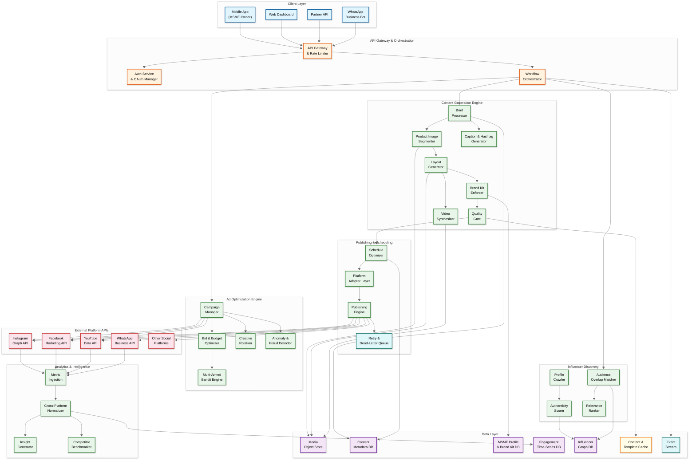
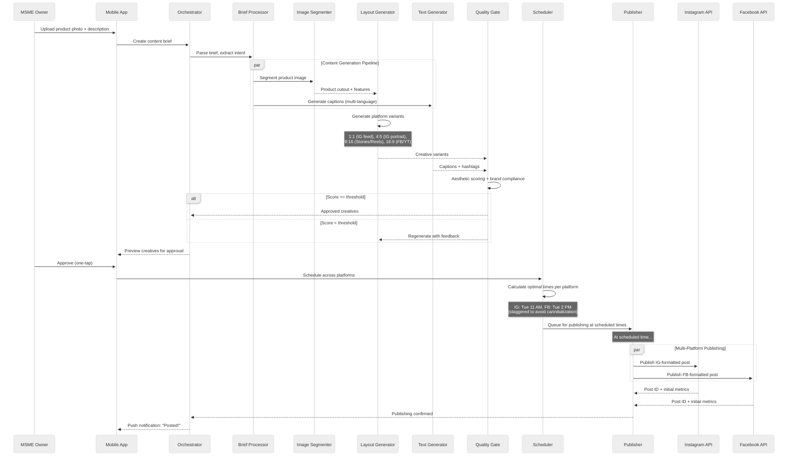

# 14.9 AI-Native MSME Marketing & Social Commerce Platform — High-Level Design

## Architecture Overview

The platform follows an event-driven microservices architecture organized into four processing tiers: (1) a **real-time tier** for interactive content generation, post approval, and ad bid adjustments requiring sub-second to sub-minute responses, (2) a **near-real-time tier** for scheduled publishing, platform API synchronization, and engagement metric ingestion with 1–15 minute SLOs, (3) a **batch tier** for influencer re-scoring, model retraining, cross-MSME analytics aggregation, and content performance analysis running on daily/weekly cycles, and (4) a **GPU inference tier** that serves the content generation pipeline with auto-scaling GPU pools partitioned by workload type (image generation, video synthesis, text generation, embedding computation).

---

## Data Flow: Content Generation to Publishing

---

## Key Architectural Decisions

### Decision 1: Separate GPU Pools for Image vs. Video vs. Text Generation

**Context:** Content generation involves three fundamentally different GPU workloads: image generation (diffusion models, high VRAM, bursty), video synthesis (sequential frame generation, sustained GPU utilization, very high VRAM), and text generation (LLM inference, memory-bandwidth bound, lower VRAM). Mixing these on the same GPU pool leads to resource contention and unpredictable latency.

**Decision:** Maintain three separate auto-scaling GPU pools with independent scaling policies:

| Pool | GPU Type | Scaling Trigger | Min/Max |
|---|---|---|---|
| Image generation | Mid-tier GPU (24 GB VRAM) | Queue depth > 50 | 40 / 200 |
| Video synthesis | High-end GPU (80 GB VRAM) | Queue depth > 20 | 20 / 100 |
| Text generation | Inference-optimized GPU (16 GB VRAM) | Request rate > 100/s | 30 / 150 |

**Trade-off:** Higher operational complexity (three pools to manage) vs. workload isolation (image bursts don't starve text generation), better cost efficiency (text generation uses cheaper GPUs), and independent scaling (video pool scales separately during "reel trend" spikes).

### Decision 2: Platform Adapter Pattern with Circuit Breakers

**Context:** Each social platform has different API contracts, rate limits, error semantics, and deprecation cycles. A direct integration approach couples the publishing engine tightly to each platform, making API changes cascade through the system.

**Decision:** Implement a platform adapter layer where each adapter encapsulates platform-specific logic behind a uniform interface. Each adapter includes:

- **Rate limiter**: Respects per-platform, per-user API rate limits
- **Circuit breaker**: Opens after 5 consecutive failures, half-opens after 60 seconds
- **Retry policy**: Platform-specific retry semantics (idempotent operations retry 3x; non-idempotent operations check-before-retry)
- **Format transformer**: Converts canonical content format to platform-specific payload
- **Token manager**: Handles OAuth token refresh, scope validation, and revocation

**Trade-off:** More code per platform (adapter maintenance burden) vs. platform isolation (Instagram API outage doesn't affect Facebook publishing), testability (mock adapters for integration testing), and graceful degradation (circuit breaker prevents cascading failures).

### Decision 3: Bayesian Hierarchical Model for Cold-Start Ad Optimization

**Context:** New MSMEs have zero historical ad performance data. Traditional A/B testing requires weeks of data at $10/day budgets to reach statistical significance. The platform must make reasonable budget allocation decisions from day one.

**Decision:** Use a Bayesian hierarchical model where:

- **Level 1 (population)**: Global prior from all MSMEs' ad performance data
- **Level 2 (category)**: Category-specific prior (e.g., "food delivery MSMEs in tier-2 cities")
- **Level 3 (individual)**: Per-MSME posterior updated with each impression/conversion

New MSMEs start with the category-level prior and rapidly personalize as their own data accumulates. The model estimates per-channel ROAS with credible intervals, allowing the budget optimizer to account for uncertainty (wider intervals → more exploration).

**Trade-off:** Higher model complexity and training cost vs. dramatically faster convergence for new MSMEs (useful recommendations within 3 days instead of 3 weeks), and continuous improvement as the platform scales (more MSMEs → stronger priors → better cold-start performance for all).

### Decision 4: Content-First Architecture with Lazy Platform Adaptation

**Context:** Generating all platform variants upfront (1 creative × 5 platforms × 3 aspect ratios = 15 variants) wastes GPU compute when the MSME only publishes to 2 platforms. But generating variants on-demand at publish time adds latency to the time-sensitive publishing window.

**Decision:** Generate content in a canonical high-resolution format with a semantic layout graph (not a flat image). Platform-specific variants are generated lazily:

1. **At creation time**: Generate the canonical creative + text content (the expensive part)
2. **At approval time**: Generate variants only for the MSME's connected platforms (typically 2–3)
3. **At publish time**: Apply final platform-specific adjustments (text truncation, hashtag limits)

The semantic layout graph enables cheap re-rendering at different aspect ratios without re-running the generative model—the layout engine repositions and scales elements within the graph rather than regenerating the entire image.

**Trade-off:** Additional layout graph complexity vs. 70% reduction in GPU compute (generating 2–3 variants instead of 15), faster approval flow (only relevant variants shown), and future-proof (adding a new platform doesn't require re-generating existing content).

### Decision 5: Event-Sourced Content Lifecycle

**Context:** Content passes through many states (drafted, generated, quality-checked, approved, scheduled, published, boosted, archived) with branching paths (rejected → regenerated, published → promoted to ad, archived → republished). Traditional CRUD state machines lose the history of transitions, making it impossible to analyze the full content lifecycle for optimization.

**Decision:** Event-source the content lifecycle: every state transition is an immutable event (ContentGenerated, QualityPassed, OwnerApproved, ScheduledForPublishing, PublishedToInstagram, EngagementMetricReceived, PromotedToAd, etc.). Current state is a projection from the event log.

**Trade-off:** Higher storage (event log grows monotonically) and query complexity (must project current state from events) vs. complete audit trail, temporal queries ("what was the average time between generation and approval last month?"), and the ability to replay events for debugging and model training data extraction.

---

## Component Responsibilities

| Component | Responsibility | Key Design Consideration |
|---|---|---|
| **Brief Processor** | Parses MSME input (photo + text), extracts product features, determines content type and target platforms | Must handle low-quality smartphone photos; auto-detect product category for template selection |
| **Image Segmenter** | Removes background, isolates product, extracts dominant colors and visual features | Edge cases: transparent products, reflective surfaces, multiple products in one photo |
| **Layout Generator** | Creates visually balanced compositions combining product image, text, brand elements, and decorative graphics | Constrained by brand kit; must produce semantically structured output (layout graph, not flat image) |
| **Text Generator** | Produces captions, hashtags, CTAs in target language with platform-appropriate tone and length | Language-specific models with cultural context; hashtag trending integration per language per platform |
| **Video Synthesizer** | Creates short-form video from static assets using motion graphics, transitions, and optional background music | Ken Burns effect, parallax scrolling, text animation; music licensing compliance |
| **Brand Kit Enforcer** | Validates all generated content against MSME's brand guidelines; rejects non-compliant outputs | Must handle incomplete brand kits (many MSMEs only have a logo and no defined color palette) |
| **Quality Gate** | Automated aesthetic and safety scoring; filters low-quality or unsafe content | Aesthetic model trained on high-engagement marketing content; safety filters for each target language |
| **Schedule Optimizer** | Determines optimal posting time per platform per MSME based on audience engagement patterns | Cold-start handling via category-level priors; cross-platform coordination to avoid self-cannibalization |
| **Platform Adapter Layer** | Translates canonical content format to platform-specific API calls; handles rate limits, errors, tokens | One adapter per platform; must track API version changes and deprecation notices |
| **Publishing Engine** | Executes scheduled publications; handles retries, failures, and confirmation tracking | At-least-once delivery with idempotency keys; dead-letter queue for persistent failures |
| **Campaign Manager** | Creates and manages ad campaigns; coordinates with platform advertising APIs | Translates MSME's simple intent ("promote this post for $10") into platform-specific campaign structure |
| **Bid & Budget Optimizer** | Allocates daily budget across platforms and time-of-day; adjusts bids based on performance | Pacing algorithm prevents budget exhaustion before peak hours; minimum spend per platform enforced |
| **Multi-Armed Bandit Engine** | Selects optimal channel-audience-creative combinations using Thompson sampling | Bayesian hierarchical model for cold-start; per-MSME posterior updated with each conversion event |
| **Influencer Matcher** | Computes audience overlap between MSME and candidate influencers; ranks by composite relevance score | MinHash for probabilistic set intersection on follower lists; embedding similarity for content alignment |
| **Metric Ingestion** | Polls platform APIs for engagement metrics; processes webhook events for real-time updates | Handles platform API rate limits; normalizes metric definitions across platforms |
| **Insight Generator** | Analyzes engagement patterns; generates plain-language recommendations | Must explain "why" not just "what" — "Your Tuesday posts get 2.3x more engagement because your audience is most active 10-11 AM IST" |
