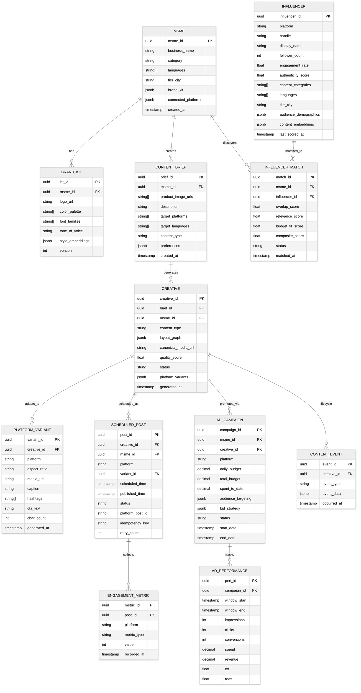

# 14.9 AI-Native MSME Marketing & Social Commerce Platform — Low-Level Design

## Data Model



---

## API Design

### Content Generation API

```
POST /api/v1/content/generate
```

**Request:**
```
{
  "msme_id": "uuid",
  "product_images": ["url1", "url2"],
  "description": "Handmade cotton kurta with block print, available in 5 colors",
  "content_types": ["static_image", "carousel", "short_video"],
  "target_platforms": ["instagram", "facebook", "whatsapp"],
  "target_languages": ["hindi", "english", "tamil"],
  "preferences": {
    "tone": "festive",           // optional
    "occasion": "diwali_sale",    // optional
    "discount_info": "20% off"    // optional
  }
}
```

**Response (async — returns job ID):**
```
{
  "job_id": "uuid",
  "status": "processing",
  "estimated_completion_seconds": 25,
  "polling_url": "/api/v1/content/jobs/{job_id}",
  "webhook_configured": true
}
```

**Job completion payload (via webhook or poll):**
```
{
  "job_id": "uuid",
  "status": "completed",
  "creatives": [
    {
      "creative_id": "uuid",
      "content_type": "static_image",
      "quality_score": 8.2,
      "preview_urls": {
        "instagram_feed": "url",
        "instagram_story": "url",
        "facebook_feed": "url"
      },
      "captions": {
        "hindi": {
          "text": "...",
          "hashtags": ["#दिवाली", "#कुर्ता", "#हैंडमेड"],
          "cta": "अभी खरीदें - 20% छूट!"
        },
        "english": { ... },
        "tamil": { ... }
      }
    }
  ]
}
```

### Scheduling API

```
POST /api/v1/schedule
```

**Request:**
```
{
  "creative_id": "uuid",
  "platforms": [
    {
      "platform": "instagram",
      "variant_id": "uuid",
      "language": "hindi",
      "scheduled_time": "auto"    // "auto" = optimizer picks optimal time
    },
    {
      "platform": "facebook",
      "variant_id": "uuid",
      "language": "english",
      "scheduled_time": "2026-03-15T14:00:00+05:30"  // manual override
    }
  ],
  "auto_boost": {
    "enabled": true,
    "daily_budget": 10.00,
    "currency": "INR",
    "duration_days": 3
  }
}
```

### Ad Campaign API

```
POST /api/v1/campaigns
```

**Request:**
```
{
  "msme_id": "uuid",
  "creative_ids": ["uuid1", "uuid2"],
  "objective": "website_traffic",    // traffic | engagement | conversions | reach
  "daily_budget": 500,               // INR
  "duration_days": 7,
  "platforms": ["instagram", "facebook"],
  "audience": {
    "age_range": [18, 45],
    "location_radius_km": 25,
    "interests": "auto"              // "auto" = AI determines from MSME category
  },
  "optimization_mode": "auto"        // "auto" | "conservative" | "aggressive"
}
```

### Influencer Discovery API

```
POST /api/v1/influencers/search
```

**Request:**
```
{
  "msme_id": "uuid",
  "platforms": ["instagram"],
  "budget_range": {
    "min": 500,
    "max": 5000,
    "currency": "INR"
  },
  "filters": {
    "min_followers": 1000,
    "max_followers": 100000,
    "min_engagement_rate": 3.0,
    "min_authenticity_score": 0.7,
    "languages": ["hindi", "english"],
    "location": "Mumbai",
    "categories": ["fashion", "lifestyle"]
  },
  "sort_by": "composite_score",
  "limit": 20
}
```

---

## Core Algorithms

### Algorithm 1: Optimal Posting Time Prediction

```
FUNCTION predict_optimal_time(msme_id, platform, day_of_week):
    // Fetch historical engagement data for this MSME on this platform
    history = fetch_engagement_timeseries(msme_id, platform, last_90_days)

    IF history.sample_size < 30:
        // Cold-start: use category-level prior
        category = get_msme_category(msme_id)
        city_tier = get_msme_city_tier(msme_id)
        prior = fetch_category_prior(category, city_tier, platform, day_of_week)
        RETURN prior.peak_hour WITH confidence = "low"

    // Decompose engagement signal into components
    hourly_engagement = aggregate_by_hour(history, day_of_week)

    // Apply Bayesian smoothing to handle sparse data
    // Prior: category-level hourly distribution
    // Likelihood: this MSME's observed engagement per hour
    prior_alpha = fetch_category_prior(category, city_tier, platform, day_of_week)
    posterior = bayesian_update(prior_alpha, hourly_engagement)

    // Find peak engagement window (top 2-hour window)
    peak_window = find_peak_window(posterior, window_size=2_hours)

    // Adjust for platform algorithm preferences
    // Instagram favors posts 30 min before peak (to build momentum)
    // Facebook favors posts during peak (immediate engagement)
    platform_offset = get_platform_offset(platform)
    optimal_time = peak_window.start - platform_offset

    // Check for conflicts with other scheduled posts on other platforms
    existing_schedule = fetch_schedule(msme_id, day_of_week)
    IF has_audience_overlap_conflict(optimal_time, existing_schedule):
        // Stagger by minimum 2 hours from same-audience platform posts
        optimal_time = find_next_available_slot(optimal_time, existing_schedule, min_gap=2_hours)

    // Check against platform rate limits (posts per day per account)
    IF exceeds_daily_post_limit(msme_id, platform, day_of_week):
        RETURN null WITH reason = "daily_limit_exceeded"

    RETURN optimal_time WITH confidence = posterior.confidence
```

### Algorithm 2: Multi-Armed Bandit for Ad Budget Allocation

```
FUNCTION allocate_budget(campaign_id, daily_budget, platforms):
    // Each arm = (platform, audience_segment, creative) combination
    arms = generate_arm_combinations(campaign_id)

    // Fetch or initialize posterior distributions
    FOR EACH arm IN arms:
        IF arm.has_history:
            // Posterior from observed conversions
            // Beta distribution: Beta(alpha = successes + prior_alpha, beta = failures + prior_beta)
            arm.posterior = Beta(
                alpha = arm.conversions + arm.prior_alpha,
                beta = arm.impressions - arm.conversions + arm.prior_beta
            )
        ELSE:
            // Cold-start: use hierarchical prior from similar MSMEs
            category_prior = fetch_category_prior(arm.msme_category, arm.platform)
            arm.posterior = category_prior

    // Thompson Sampling allocation
    budget_allocation = {}
    remaining_budget = daily_budget

    // Sample from each arm's posterior
    samples = {}
    FOR EACH arm IN arms:
        samples[arm] = arm.posterior.sample() * arm.estimated_conversion_value

    // Allocate proportionally to sampled values (with minimum spend per arm)
    total_sample_value = SUM(samples.values())
    FOR EACH arm IN arms:
        raw_allocation = (samples[arm] / total_sample_value) * daily_budget
        allocation = MAX(raw_allocation, minimum_spend_per_arm)
        budget_allocation[arm] = allocation

    // Apply pacing: distribute budget across time-of-day
    paced_allocation = apply_pacing(budget_allocation, get_audience_activity_curve(campaign_id))

    // Safety checks
    FOR EACH arm IN budget_allocation:
        IF arm.recent_ctr < fraud_threshold:
            flag_for_review(arm)
            budget_allocation[arm] = 0
            redistribute(budget_allocation, arm.budget)

    RETURN budget_allocation, paced_allocation

FUNCTION apply_pacing(allocation, activity_curve):
    // Distribute hourly budget proportionally to audience activity
    hourly_pacing = {}
    FOR EACH hour IN 0..23:
        hourly_weight = activity_curve[hour] / SUM(activity_curve)
        FOR EACH arm IN allocation:
            hourly_pacing[arm][hour] = allocation[arm] * hourly_weight

    // Enforce minimum hourly spend to maintain ad rank
    FOR EACH arm, hours IN hourly_pacing:
        FOR EACH hour IN hours:
            IF hourly_pacing[arm][hour] < min_hourly_spend AND activity_curve[hour] > low_activity_threshold:
                hourly_pacing[arm][hour] = min_hourly_spend

    RETURN hourly_pacing
```

### Algorithm 3: Influencer Authenticity Scoring

```
FUNCTION score_authenticity(influencer_id):
    profile = fetch_influencer_profile(influencer_id)
    recent_posts = fetch_recent_posts(influencer_id, count=50)

    // 1. Follower Growth Anomaly Detection
    growth_history = fetch_follower_growth(influencer_id, last_365_days)
    growth_velocity = compute_daily_growth_rate(growth_history)
    anomaly_score = detect_growth_spikes(growth_velocity)
    // Genuine growth is gradual; purchased followers show step-function jumps
    follower_growth_score = 1.0 - anomaly_score

    // 2. Engagement Timing Distribution
    FOR EACH post IN recent_posts:
        engagement_times = fetch_engagement_timestamps(post)
        // Genuine engagement follows a power-law decay: most engagement in first hour
        // Bot engagement clusters in tight time windows (engagement pods)
        time_distribution = compute_temporal_distribution(engagement_times)
        post.timing_score = power_law_fit(time_distribution)

    timing_score = MEDIAN(post.timing_score FOR post IN recent_posts)

    // 3. Engagement Rate Consistency
    engagement_rates = [post.engagement_rate FOR post IN recent_posts]
    // Genuine: moderate variance (some posts do better than others)
    // Fake: either suspiciously uniform (all posts get same engagement)
    //        or bimodal (boosted posts vs. organic posts)
    cv = coefficient_of_variation(engagement_rates)
    IF cv < 0.1:  // too uniform — suspicious
        consistency_score = 0.3
    ELSE IF cv > 1.5:  // too variable — likely selective boosting
        consistency_score = 0.5
    ELSE:
        consistency_score = 1.0

    // 4. Comment Quality Analysis
    comments = fetch_comments(recent_posts, sample_size=200)
    generic_ratio = count_generic_comments(comments) / len(comments)
    // Generic: "Nice!", "Great post!", emoji-only comments
    // Genuine: specific references to content, questions, conversations
    comment_quality_score = 1.0 - generic_ratio

    // 5. Follower-to-Following Ratio
    ratio = profile.follower_count / max(profile.following_count, 1)
    IF ratio < 0.5:  // follows more than followed — not an influencer
        ratio_score = 0.2
    ELSE IF ratio > 100:  // suspiciously high ratio — possible bot network
        ratio_score = 0.5
    ELSE:
        ratio_score = 1.0

    // Weighted composite score
    authenticity = (
        0.25 * follower_growth_score +
        0.25 * timing_score +
        0.20 * consistency_score +
        0.20 * comment_quality_score +
        0.10 * ratio_score
    )

    RETURN authenticity, {
        follower_growth: follower_growth_score,
        timing: timing_score,
        consistency: consistency_score,
        comment_quality: comment_quality_score,
        ratio: ratio_score
    }
```

### Algorithm 4: Audience Overlap Estimation Using MinHash

```
FUNCTION estimate_audience_overlap(msme_id, influencer_id):
    // Exact set intersection is infeasible for large follower sets
    // Use MinHash for probabilistic Jaccard similarity estimation

    msme_followers = fetch_follower_ids(msme_id)       // could be 500 - 50K
    influencer_followers = fetch_follower_ids(influencer_id)  // 1K - 100K

    NUM_HASH_FUNCTIONS = 256

    // Generate MinHash signatures
    msme_signature = compute_minhash(msme_followers, NUM_HASH_FUNCTIONS)
    influencer_signature = compute_minhash(influencer_followers, NUM_HASH_FUNCTIONS)

    // Estimate Jaccard similarity
    matches = 0
    FOR i IN 0..NUM_HASH_FUNCTIONS:
        IF msme_signature[i] == influencer_signature[i]:
            matches += 1

    jaccard_estimate = matches / NUM_HASH_FUNCTIONS

    // Convert Jaccard to overlap percentage relative to MSME's audience
    // |A ∩ B| / |A| = J(A,B) * (|A| + |B|) / (1 + J(A,B)) / |A|
    estimated_intersection = jaccard_estimate * (len(msme_followers) + len(influencer_followers)) / (1 + jaccard_estimate)
    overlap_percentage = estimated_intersection / len(msme_followers)

    // Confidence interval based on number of hash functions
    // Standard error of MinHash: sqrt(J*(1-J)/k) where k = NUM_HASH_FUNCTIONS
    se = sqrt(jaccard_estimate * (1 - jaccard_estimate) / NUM_HASH_FUNCTIONS)
    confidence_interval = (jaccard_estimate - 1.96 * se, jaccard_estimate + 1.96 * se)

    RETURN {
        jaccard_similarity: jaccard_estimate,
        overlap_percentage: overlap_percentage,
        estimated_shared_followers: round(estimated_intersection),
        confidence_interval: confidence_interval,
        confidence_level: "high" IF se < 0.05 ELSE "medium" IF se < 0.10 ELSE "low"
    }
```

### Algorithm 5: Creative Quality Scoring

```
FUNCTION score_creative_quality(creative, brand_kit, platform):
    scores = {}

    // 1. Visual Composition Score
    layout = creative.layout_graph
    scores.composition = evaluate_composition(
        rule_of_thirds_adherence = check_rule_of_thirds(layout.focal_points),
        whitespace_ratio = compute_whitespace(layout) / layout.total_area,
        visual_hierarchy = check_hierarchy(layout.elements),
        text_to_image_ratio = compute_text_area(layout) / layout.total_area
    )

    // 2. Brand Compliance Score
    scores.brand = evaluate_brand_compliance(
        color_match = palette_distance(creative.colors, brand_kit.color_palette),
        font_match = font_similarity(creative.fonts, brand_kit.font_families),
        logo_placement = check_logo_rules(creative.logo_position, brand_kit.logo_rules),
        tone_match = embedding_similarity(creative.caption_embedding, brand_kit.tone_embedding)
    )

    // 3. Platform Fitness Score
    platform_rules = get_platform_rules(platform)
    scores.platform = evaluate_platform_fitness(
        aspect_ratio = check_aspect_ratio(creative.dimensions, platform_rules.accepted_ratios),
        text_overlay_area = check_text_overlay(creative, platform_rules.max_text_percentage),
        caption_length = check_caption_length(creative.caption, platform_rules.max_chars),
        hashtag_count = check_hashtag_count(creative.hashtags, platform_rules.max_hashtags)
    )

    // 4. Predicted Engagement Score (ML model)
    engagement_features = extract_features(creative, platform)
    scores.predicted_engagement = engagement_prediction_model.predict(engagement_features)

    // 5. Safety Score
    scores.safety = content_safety_check(
        toxicity = toxicity_model.predict(creative.caption + creative.text_overlays),
        nsfw = nsfw_classifier.predict(creative.image),
        cultural_sensitivity = cultural_filter.check(creative, creative.target_language)
    )

    // Weighted composite
    total = (
        0.20 * scores.composition +
        0.20 * scores.brand +
        0.15 * scores.platform +
        0.25 * scores.predicted_engagement +
        0.20 * scores.safety
    )

    // Hard gates: safety must be above threshold regardless of other scores
    IF scores.safety < SAFETY_THRESHOLD:
        total = 0  // reject
        rejection_reason = "safety_violation"

    RETURN total, scores, rejection_reason
```

---

## Key Data Structures

### Layout Graph (Canonical Creative Representation)

```
LayoutGraph {
    canvas: {
        width: int,            // canonical width (e.g., 2048)
        height: int,           // canonical height (e.g., 2048)
        background: BackgroundSpec
    },
    elements: [
        {
            id: string,
            type: "product_image" | "text" | "logo" | "decorative" | "cta_button",
            bounds: { x, y, width, height },  // relative to canvas
            z_index: int,
            anchor: "center" | "top-left" | ...,
            resize_behavior: "scale" | "crop" | "reposition" | "hide",
            min_size: { width, height },       // below this, element is hidden
            content: ElementContent,
            style: ElementStyle
        }
    ],
    constraints: [
        { type: "min_margin", element: "logo", value: 20 },
        { type: "no_overlap", elements: ["text_main", "product_image"] },
        { type: "alignment", elements: ["cta", "text_main"], axis: "center_x" }
    ]
}
```

This graph structure allows re-rendering at arbitrary aspect ratios by running a constraint solver that repositions elements while maintaining visual relationships, avoiding the need to re-run the generative model for each platform variant.

### Brand Kit Schema

```
BrandKit {
    logo: {
        url: string,
        clear_space_px: int,     // minimum clear space around logo
        min_size_px: int,        // logo must be at least this size
        allowed_backgrounds: ["light", "dark", "transparent"],
        position_preference: "top-left" | "bottom-right" | "center"
    },
    colors: {
        primary: hex_color,
        secondary: hex_color,
        accent: hex_color,
        text_on_light: hex_color,
        text_on_dark: hex_color
    },
    typography: {
        heading_font: string,
        body_font: string,
        cta_font: string,
        max_font_count: int      // usually 2-3
    },
    tone: {
        formality: float,        // 0=casual, 1=formal
        enthusiasm: float,       // 0=subdued, 1=energetic
        emoji_usage: float,      // 0=none, 1=heavy
        voice_embedding: float[] // learned from existing content
    },
    style_embedding: float[]     // visual style vector learned from MSME's existing posts
}
```
