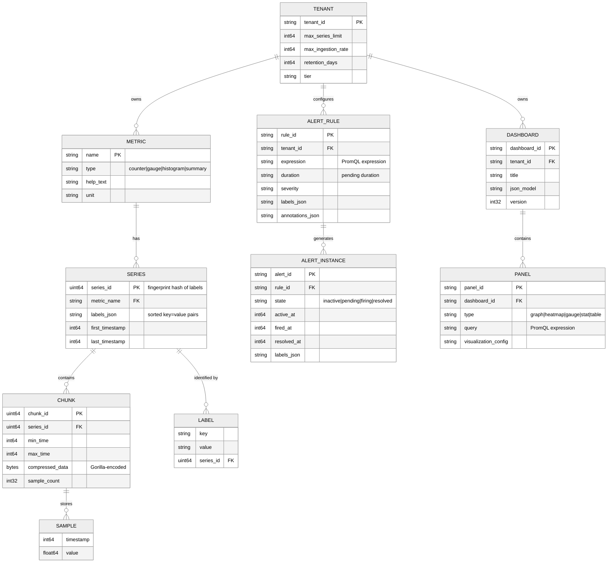

# Low-Level Design --- Metrics & Monitoring System

## Data Model

### Time-Series Data Model

A time series in a monitoring system is uniquely identified by its **metric name** and a sorted set of **label key-value pairs**. Each time series contains an ordered sequence of **(timestamp, value)** data points.

```
Series Identity:
  metric_name{label_1="value_1", label_2="value_2", ..., label_n="value_n"}

Example:
  http_requests_total{method="GET", endpoint="/api/users", status="200", region="us-east"}

Data Points:
  [(t1, v1), (t2, v2), (t3, v3), ...]
  where t = int64 Unix timestamp (milliseconds), v = float64 value
```

### Entity Relationship Model



### Series Fingerprinting

Each unique time series needs a stable identifier for indexing and storage. The series ID (fingerprint) is computed as a hash of the sorted label set:

```
FUNCTION compute_series_id(labels):
    sorted_labels = SORT labels BY key ASC
    fingerprint_input = ""
    FOR EACH (key, value) IN sorted_labels:
        fingerprint_input += key + SEP + value + SEP
    RETURN xxhash64(fingerprint_input)
```

**Why xxHash64**: Cryptographic hashes (SHA-256) are unnecessary---we need speed and good distribution, not collision resistance. xxHash64 produces well-distributed 64-bit hashes at >10 GB/s on modern CPUs. Collision probability for 100M series: ~5.4 x 10^-10 (negligible).

---

## Inverted Index Design

The inverted index is the most critical data structure for query performance. It maps label matchers to series IDs, enabling fast resolution of PromQL label selectors.

### Index Structure

```
Symbol Table:
  Maps strings (label names, label values) to integer IDs for compact storage.
  "method" → 1, "GET" → 2, "POST" → 3, "status" → 4, "200" → 5, ...

Posting Lists:
  Maps each (label_name, label_value) pair to a sorted list of series IDs.
  (method, GET)  → [101, 204, 307, 412, ...]
  (method, POST) → [102, 205, 308, ...]
  (status, 200)  → [101, 102, 204, 205, ...]
  (status, 500)  → [307, 308, 412, ...]

Special Posting List:
  __name__="http_requests_total" → [101, 102, 204, 205, 307, 308, 412, ...]
```

### Query Resolution via Posting List Intersection

```
QUERY: http_requests_total{method="GET", status="500"}

STEP 1: Lookup posting lists
  P1 = postings[(__name__, "http_requests_total")]  → [101, 102, 204, 205, 307, 308, 412]
  P2 = postings[(method, "GET")]                    → [101, 204, 307, 412]
  P3 = postings[(status, "500")]                    → [307, 308, 412]

STEP 2: Intersect sorted lists (merge-join)
  result = INTERSECT(P1, P2, P3)
         = [307, 412]

STEP 3: Fetch chunks for series 307 and 412 within query time range

Time complexity: O(min(|P1|, |P2|, |P3|)) for sorted list intersection
```

### Regex Matcher Optimization

For regex matchers like `status=~"5.."`, the index cannot directly lookup a single posting list. Instead:

```
FUNCTION resolve_regex_matcher(label_name, regex):
    matching_values = []
    FOR EACH value IN symbol_table WHERE label_name has value:
        IF regex.matches(value):
            matching_values.append(value)

    result = EMPTY_POSTING_LIST
    FOR EACH value IN matching_values:
        result = UNION(result, postings[(label_name, value)])

    RETURN result
```

**Optimization**: Pre-compute and cache regex results for common patterns. For small value sets (e.g., `status` has only 5 values), regex matching is fast. For high-cardinality labels, regex matching scans many values and is a known performance bottleneck.

---

## Gorilla Compression Algorithm

The compression algorithm is the foundation of TSDB storage efficiency. It exploits two properties of metric data: regular timestamps and slowly-changing values.

### Delta-of-Delta Encoding (Timestamps)

```
FUNCTION encode_timestamp(t_current, t_previous, delta_previous):
    delta = t_current - t_previous
    delta_of_delta = delta - delta_previous

    IF delta_of_delta == 0:
        WRITE 1 bit: '0'                           // 96% of cases
    ELSE IF delta_of_delta IN [-63, 64]:
        WRITE bits: '10' + 7-bit value              // ~3% of cases
    ELSE IF delta_of_delta IN [-255, 256]:
        WRITE bits: '110' + 9-bit value
    ELSE IF delta_of_delta IN [-2047, 2048]:
        WRITE bits: '1110' + 12-bit value
    ELSE:
        WRITE bits: '1111' + 32-bit value            // <0.01% of cases

    RETURN delta  // becomes delta_previous for next call

// Example: scrape interval = 15000ms (15 seconds)
// Timestamps: 1000, 16000, 31000, 46000, 61000
// Deltas:     -,    15000, 15000, 15000, 15000
// DoD:        -,    -,     0,     0,     0
// Encoding:   header, header, '0',  '0',  '0'  ← 1 bit per sample!
```

### XOR-based Float Compression (Values)

```
FUNCTION encode_value(v_current, v_previous):
    xor = FLOAT64_TO_BITS(v_current) XOR FLOAT64_TO_BITS(v_previous)

    IF xor == 0:
        WRITE 1 bit: '0'                            // 51% of cases (identical values)
    ELSE:
        leading_zeros = COUNT_LEADING_ZEROS(xor)
        trailing_zeros = COUNT_TRAILING_ZEROS(xor)
        significant_bits = 64 - leading_zeros - trailing_zeros

        prev_leading = previous_xor_leading_zeros
        prev_trailing = previous_xor_trailing_zeros

        IF leading_zeros >= prev_leading AND trailing_zeros >= prev_trailing:
            // Fits within previous meaningful bit window
            meaningful_bits = 64 - prev_leading - prev_trailing
            WRITE bits: '10' + meaningful_bits of xor  // ~30% of cases, avg 26.6 bits
        ELSE:
            // New bit window
            WRITE bits: '11' + 5-bit leading_zeros + 6-bit significant_length + significant_bits
            // ~19% of cases, avg 36.9 bits

    RETURN (leading_zeros, trailing_zeros)

// Compression result: average 1.37 bytes per (timestamp, value) pair
// vs. 16 bytes uncompressed = 11.7x compression ratio
```

### Chunk Structure

```
CHUNK FORMAT:
┌──────────────────────────────────────────────────┐
│ Header (8 bytes)                                 │
│   - encoding_type (1 byte): XOR=1, Histogram=2  │
│   - sample_count (2 bytes)                       │
│   - min_timestamp (4 bytes, relative)            │
│   - reserved (1 byte)                            │
├──────────────────────────────────────────────────┤
│ First Sample (16 bytes, uncompressed)            │
│   - timestamp: int64                             │
│   - value: float64                               │
├──────────────────────────────────────────────────┤
│ Compressed Samples (variable length)             │
│   - delta-of-delta encoded timestamps            │
│   - XOR encoded values                           │
│   - bit-packed, no byte alignment required       │
├──────────────────────────────────────────────────┤
│ Padding to byte boundary                         │
└──────────────────────────────────────────────────┘

Typical chunk: 120 samples (2 hours at 60s interval) ≈ 200 bytes
                480 samples (2 hours at 15s interval) ≈ 700 bytes
```

---

## DDSketch: Distributed Percentile Aggregation

Traditional histograms with fixed bucket boundaries cannot be meaningfully aggregated across distributed instances. DDSketch solves this with a **logarithmic bucketing** scheme that provides **relative-error guarantees** and is **fully mergeable**.

### Algorithm

```
FUNCTION ddsketch_add(sketch, value):
    // Map value to bucket index using logarithmic mapping
    IF value > 0:
        index = CEIL(LOG(value) / LOG(gamma))
    ELSE IF value == 0:
        index = 0  // special zero bucket
    ELSE:
        index = -CEIL(LOG(-value) / LOG(gamma))  // negative bucket

    sketch.buckets[index] += 1
    sketch.count += 1
    sketch.min = MIN(sketch.min, value)
    sketch.max = MAX(sketch.max, value)

FUNCTION ddsketch_quantile(sketch, q):
    target_rank = CEIL(q * sketch.count)
    cumulative = 0
    FOR index IN SORTED(sketch.buckets.keys()):
        cumulative += sketch.buckets[index]
        IF cumulative >= target_rank:
            // Return representative value for this bucket
            RETURN gamma^index * (2 / (1 + gamma))  // bucket midpoint
    RETURN sketch.max

FUNCTION ddsketch_merge(sketch_a, sketch_b):
    merged = NEW DDSketch(gamma = sketch_a.gamma)
    FOR EACH (index, count) IN sketch_a.buckets:
        merged.buckets[index] += count
    FOR EACH (index, count) IN sketch_b.buckets:
        merged.buckets[index] += count
    merged.count = sketch_a.count + sketch_b.count
    merged.min = MIN(sketch_a.min, sketch_b.min)
    merged.max = MAX(sketch_a.max, sketch_b.max)
    RETURN merged

// Key property: merge(sketch_a, sketch_b) produces the SAME result
// as if all values had been added to a single sketch.
// Relative error guarantee: if true p99 = 1.0s, sketch returns [0.98s, 1.02s] (2% error)
// Memory: ~275 buckets to cover 1ms-1min range at 2% error ≈ 2 KB per sketch
```

---

## API Design

### Ingestion API (Push Model)

```
POST /api/v1/push
Content-Type: application/x-protobuf
X-Tenant-ID: {tenant_id}
Authorization: Bearer {api_key}

Request Body (Protocol Buffers):
  WriteRequest {
    repeated TimeSeries timeseries = 1
  }

  TimeSeries {
    repeated Label labels = 1     // [{name: "method", value: "GET"}, ...]
    repeated Sample samples = 2   // [{timestamp_ms: 1709913600000, value: 42.5}, ...]
  }

Response:
  200 OK              - All samples accepted
  400 Bad Request     - Invalid payload (malformed labels, future timestamps)
  429 Too Many Requests - Tenant rate limit exceeded
    Retry-After: {seconds}
    X-RateLimit-Limit: {max_samples_per_second}
    X-RateLimit-Remaining: {remaining}
  503 Service Unavailable - Ingestion pipeline overloaded (backpressure)
```

### Scrape Configuration API (Pull Model)

```
GET /api/v1/targets
Authorization: Bearer {api_key}

Response:
  {
    "activeTargets": [
      {
        "scrapeUrl": "http://app-server-1:9090/metrics",
        "state": "up",
        "labels": {"job": "api-server", "instance": "10.0.1.5:9090"},
        "lastScrape": "2026-03-10T10:00:15Z",
        "lastScrapeDuration": "0.023s",
        "health": "up"
      }
    ]
  }
```

### Query API (PromQL)

```
// Instant Query (single timestamp)
GET /api/v1/query?query={promql_expr}&time={timestamp}

// Range Query (time series over interval)
GET /api/v1/query_range?query={promql_expr}&start={start}&end={end}&step={step}

Example:
  GET /api/v1/query_range
    ?query=rate(http_requests_total{status="500"}[5m])
    &start=2026-03-10T09:00:00Z
    &end=2026-03-10T10:00:00Z
    &step=15s

Response:
  {
    "status": "success",
    "data": {
      "resultType": "matrix",
      "result": [
        {
          "metric": {"method": "GET", "endpoint": "/api/users"},
          "values": [
            [1709913600, "0.5"],    // timestamp, value as string
            [1709913615, "0.7"],
            [1709913630, "0.3"]
          ]
        }
      ]
    }
  }
```

### Alert Rule API

```
// Create/Update alert rule
POST /api/v1/rules
Content-Type: application/json
Authorization: Bearer {api_key}

Request:
  {
    "name": "HighErrorRate",
    "expression": "rate(http_requests_total{status=~\"5..\"}[5m]) / rate(http_requests_total[5m]) > 0.05",
    "for": "5m",
    "labels": {
      "severity": "critical",
      "team": "platform"
    },
    "annotations": {
      "summary": "Error rate above 5% for {{ $labels.service }}",
      "runbook": "https://runbooks.internal/high-error-rate"
    }
  }

Response:
  201 Created
  {
    "rule_id": "rule-abc123",
    "status": "active",
    "next_evaluation": "2026-03-10T10:01:00Z"
  }
```

### Rate Limiting Strategy

| Endpoint | Rate Limit | Scope | Enforcement |
|---|---|---|---|
| `/api/v1/push` | Configurable per tenant (default: 100K samples/s) | Per tenant | Token bucket; 429 with Retry-After header |
| `/api/v1/query` | 100 req/s | Per tenant | Sliding window; queued requests up to 10x limit |
| `/api/v1/query_range` | 50 req/s | Per tenant | Sliding window; concurrent query limit of 20 |
| `/api/v1/rules` | 10 req/s | Per tenant | Fixed window; administrative endpoint |

---

## Partitioning & Sharding Strategy

### Series-Based Sharding

Series are distributed across ingesters using consistent hashing on the series fingerprint:

```
FUNCTION assign_ingester(series_labels, ring):
    fingerprint = compute_series_id(series_labels)

    // Find the ingester responsible for this hash range
    primary = ring.get_node(fingerprint)

    // Replication: write to N nodes for durability
    replicas = ring.get_next_n_nodes(fingerprint, REPLICATION_FACTOR - 1)

    RETURN [primary] + replicas

// Ring implementation: consistent hashing with virtual nodes
// Each ingester gets 128 virtual nodes (tokens) on the hash ring
// Rebalancing when nodes join/leave only affects 1/N of the series
```

### Time-Based Partitioning for Storage

```
Block partitioning:
  Level 0: 2-hour blocks (head block flush)
  Level 1: 6-hour blocks (3 x Level 0 merged)
  Level 2: 18-hour blocks (3 x Level 1 merged)
  Level 3: 54-hour blocks (3 x Level 2 merged)

Each block is self-contained:
  block-{ulid}/
  ├── chunks/        # compressed sample data
  │   └── 000001     # chunk files
  ├── index          # inverted index for this block
  ├── meta.json      # time range, series count, compaction level
  └── tombstones     # deletion markers (if any)
```

### Data Retention Policy

```
FUNCTION apply_retention(block, retention_config):
    IF block.max_time < NOW() - retention_config.raw_retention:
        IF NOT EXISTS downsampled_block(block, "5m"):
            CREATE downsample(block, "5m")  // 5-minute resolution
        DELETE block

    IF block.max_time < NOW() - retention_config.medium_retention:
        IF NOT EXISTS downsampled_block(block, "1h"):
            CREATE downsample(block, "1h")  // 1-hour resolution
        DELETE 5m_downsampled_block

    IF block.max_time < NOW() - retention_config.long_retention:
        DELETE 1h_downsampled_block  // data gone

// Default retention tiers:
//   Raw: 15 days       (full 15s resolution)
//   Medium: 90 days    (5-minute aggregated)
//   Long: 13 months    (1-hour aggregated)
```

---

## PromQL Query Execution Engine

### Query Execution Pipeline

```
FUNCTION execute_range_query(expr, start, end, step):
    // Phase 1: Parse PromQL expression into AST
    ast = parse(expr)

    // Phase 2: Optimize AST
    ast = push_down_label_matchers(ast)     // push filters close to data
    ast = detect_recording_rule_hits(ast)    // substitute pre-computed series

    // Phase 3: Resolve series
    series_sets = resolve_series(ast, start, end)

    // Phase 4: Fetch data
    FOR EACH series_set IN series_sets:
        chunks = fetch_chunks(series_set.series_ids, start, end)
        series_set.data = decompress_and_merge(chunks)

    // Phase 5: Evaluate expression at each step
    results = []
    FOR t = start TO end STEP step:
        value = evaluate_ast(ast, series_sets, t)
        results.append((t, value))

    RETURN results

FUNCTION evaluate_ast(node, data, timestamp):
    MATCH node.type:
        CASE "vector_selector":
            RETURN lookup_samples(data, node.matchers, timestamp, node.range)
        CASE "aggregation":    // sum, avg, max, min, count, quantile
            child_values = evaluate_ast(node.child, data, timestamp)
            RETURN aggregate(node.op, child_values, node.by_labels)
        CASE "function":       // rate, irate, increase, histogram_quantile
            child_values = evaluate_ast(node.child, data, timestamp)
            RETURN apply_function(node.func, child_values)
        CASE "binary_op":      // +, -, *, /, >, <, ==, and, or, unless
            left = evaluate_ast(node.left, data, timestamp)
            right = evaluate_ast(node.right, data, timestamp)
            RETURN vector_binary_op(node.op, left, right, node.matching)
```

### Rate Function (Counter-Specific)

The `rate()` function is the most commonly used PromQL function and must handle counter resets:

```
FUNCTION rate(samples, range_seconds):
    IF len(samples) < 2:
        RETURN NaN

    // Handle counter resets: if value decreases, a reset occurred
    adjusted_samples = [samples[0]]
    cumulative_reset = 0
    FOR i = 1 TO len(samples) - 1:
        IF samples[i].value < samples[i-1].value:
            // Counter reset detected
            cumulative_reset += samples[i-1].value
        adjusted_samples.append(
            Sample(samples[i].timestamp, samples[i].value + cumulative_reset)
        )

    first = adjusted_samples[0]
    last = adjusted_samples[len(adjusted_samples) - 1]

    value_change = last.value - first.value
    time_change = (last.timestamp - first.timestamp) / 1000.0  // ms to seconds

    // Extrapolate to cover the full range window
    extrapolation_factor = range_seconds / time_change

    RETURN (value_change * extrapolation_factor) / range_seconds
```
