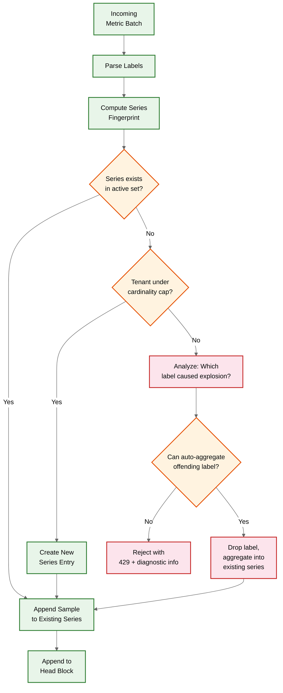

# Deep Dives & Bottlenecks --- Metrics & Monitoring System

## Critical Component 1: Cardinality Management

### Why This Is Critical

Cardinality---the number of unique time series---is the single most dangerous scaling dimension in a metrics system. Unlike data volume (which grows linearly and predictably), cardinality can explode combinatorially from a single instrumentation change. A developer adding `user_id` as a label to a metric serving 10 million users instantly creates 10 million new time series, each consuming memory in the head block, entries in the inverted index, and chunks on disk. This is not a hypothetical risk---it is the most common production incident in large-scale monitoring systems.

### How Cardinality Explosion Works

```
Metric: http_request_duration_seconds (histogram with 20 buckets)
Labels: method (5 values) x endpoint (100 values) x status (5 values) x region (4 values)

Series count = 22 buckets x 5 x 100 x 5 x 4 = 220,000 series ← manageable

Now add: pod_name (500 values, dynamic with deployments)
Series count = 22 x 5 x 100 x 5 x 4 x 500 = 110,000,000 series ← system crash

The problem is multiplicative: each new label dimension multiplies total cardinality
by the number of distinct values in that dimension.
```

### Internal Mechanism: Cardinality Enforcement Pipeline



### Mitigation Strategies

| Strategy | How It Works | Trade-off |
|---|---|---|
| **Per-tenant cardinality cap** | Hard limit on active series per tenant (e.g., 1M); reject new series beyond cap | Prevents explosion but may drop legitimate series during spikes; needs alerting on cap proximity |
| **Per-metric cardinality limit** | Limit unique series per metric name (e.g., 50K); catches individual metric explosions before tenant cap | More granular than tenant cap; requires per-metric tracking overhead |
| **Label value allow-listing** | Only accept known values for specified labels; reject unknown values | Prevents unbounded labels (user_id, trace_id); requires upfront configuration |
| **Automatic label dropping** | When a label exceeds a cardinality threshold, automatically drop it and aggregate | Preserves data at reduced dimensionality; may break downstream dashboards |
| **Cardinality analysis API** | Expose top-N metrics by cardinality, top-N labels by value count, growth rate | Enables operators to identify problems before they cause incidents |
| **Admission control scoring** | Score each new series creation based on label entropy and growth rate; soft-reject high-entropy series | Proactive prevention; may false-positive on legitimate high-cardinality use cases |

### Failure Modes

| Failure | Impact | Detection | Recovery |
|---|---|---|---|
| Unbounded label on popular metric | OOM on ingesters; index grows beyond memory; queries timeout | Cardinality growth rate alert; ingester memory alerts | Drop the offending label via relabeling; restart ingesters with cardinality cap enabled |
| Histogram with too many buckets | 22 series per label combination per histogram; multiplier effect | Per-metric cardinality tracking; histogram bucket count alert | Reduce bucket count; use DDSketch instead of fixed-bucket histograms |
| Pod churn in Kubernetes | Continuous creation of new series for new pods; old series become stale but still indexed | Stale series ratio alert (active vs. total indexed) | Aggressive staleness marking (series stale after 5 minutes of no samples); compact stale series earlier |

---

## Critical Component 2: TSDB Compaction Engine

### Why This Is Critical

Without compaction, the TSDB would accumulate thousands of small, 2-hour blocks that degrade query performance (each query must open and scan every block), waste storage (redundant index copies), and leak space from tombstoned data. The compactor is a background process that merges blocks, but it must do so without disrupting concurrent ingestion and queries---a non-trivial constraint.

### Compaction Algorithm

```
FUNCTION compact(blocks, retention_config):
    // Phase 1: Plan compaction
    // Group blocks into compaction candidates using exponential sizing
    plan = []
    level_0_blocks = blocks WHERE block.level == 0 AND block.age > 2h
    IF len(level_0_blocks) >= 3:
        plan.append(CompactionPlan(
            sources = level_0_blocks[0:3],   // merge 3 x 2h = 6h block
            target_level = 1
        ))

    level_1_blocks = blocks WHERE block.level == 1 AND block.age > 6h
    IF len(level_1_blocks) >= 3:
        plan.append(CompactionPlan(
            sources = level_1_blocks[0:3],   // merge 3 x 6h = 18h block
            target_level = 2
        ))

    // Continue for level 2 → 3, etc.

    // Phase 2: Execute compaction
    FOR EACH plan_item IN plan:
        new_block = merge_blocks(plan_item.sources)
        upload_block(new_block, object_storage)
        // Atomic swap: register new block, then delete source blocks
        register_block(new_block)
        FOR EACH source IN plan_item.sources:
            mark_for_deletion(source)

FUNCTION merge_blocks(source_blocks):
    // Create a unified index across all source blocks
    merged_index = new_inverted_index()
    merged_chunks = {}

    // Iterate all series across source blocks
    all_series_ids = UNION(block.series_ids FOR block IN source_blocks)
    FOR EACH series_id IN all_series_ids:
        // Merge chunks from all source blocks for this series
        chunks = []
        FOR EACH block IN source_blocks:
            IF block.has_series(series_id):
                chunks.extend(block.get_chunks(series_id))

        // Re-encode merged chunks (may improve compression)
        merged_chunk = reencode_chunks(sort_by_time(chunks))

        // Skip tombstoned samples
        merged_chunk = apply_tombstones(merged_chunk)

        merged_chunks[series_id] = merged_chunk
        merged_index.add(series_id, block.get_labels(series_id))

    RETURN Block(
        chunks = merged_chunks,
        index = merged_index,
        level = max(source.level for source in source_blocks) + 1,
        min_time = min(source.min_time for source in source_blocks),
        max_time = max(source.max_time for source in source_blocks)
    )
```

### Compaction Failure Modes

| Failure | Impact | Handling |
|---|---|---|
| Compaction falls behind ingestion | Block count grows indefinitely; query performance degrades (more blocks to scan); disk usage increases | Monitor compaction lag (blocks pending compaction); auto-scale compactor resources; alert when lag exceeds 2 hours |
| Compaction runs out of disk/memory | Merging large blocks requires temporary disk space ~2x the source blocks; OOM if index doesn't fit in memory | Reserve 2x headroom in compactor disk; stream-merge for chunks (don't load all into memory); fail gracefully and retry with smaller batch |
| Concurrent read during compaction | Query reads from block being deleted after compaction | Block lifecycle protocol: register new block before deleting old; readers hold reference counts on blocks; old blocks deleted only when reference count drops to zero |
| Power failure mid-compaction | Source blocks may be partially deleted; new block may be incomplete | Compaction is idempotent: if new block upload didn't succeed, retry from source blocks; source blocks only deleted after new block is successfully registered; WAL checkpoint ensures no data loss |

---

## Critical Component 3: Alert Evaluation Engine

### Why This Is Critical

The alerting engine is the highest-priority consumer of the TSDB. A delayed or missed alert evaluation can mean an outage goes undetected for minutes or hours. The engine must evaluate thousands of rules at configurable intervals (15s-60s), each rule being a PromQL query against live data, while competing for query resources with dashboard users and API consumers.

### Evaluation Loop

```
FUNCTION alert_evaluation_loop(rule_group):
    WHILE running:
        evaluation_time = ALIGN_TO_INTERVAL(NOW(), rule_group.interval)

        start = MONOTONIC_CLOCK()
        FOR EACH rule IN rule_group.rules:
            TRY:
                // Execute the alert query
                result = execute_query(rule.expression, evaluation_time)

                // Process results through state machine
                FOR EACH sample IN result:
                    alert_labels = MERGE(rule.labels, sample.labels)
                    alert_key = fingerprint(alert_labels)
                    update_alert_state(rule, alert_key, sample.value, evaluation_time)

                // Handle alerts that were previously active but no longer in results
                stale_alerts = rule.active_alerts WHERE alert_key NOT IN result
                FOR EACH stale IN stale_alerts:
                    transition_to_resolved(stale, evaluation_time)

            CATCH QueryTimeout:
                record_metric("alert_evaluation_failures_total", rule.name)
                // Do NOT transition alerts to resolved on timeout;
                // keep previous state to avoid false resolution
            CATCH error:
                record_metric("alert_evaluation_errors_total", rule.name)

        evaluation_duration = MONOTONIC_CLOCK() - start
        record_metric("alert_evaluation_duration_seconds", evaluation_duration)

        IF evaluation_duration > rule_group.interval * 0.9:
            ALERT("AlertEvaluationSlow", "Rule group taking >90% of interval")

        SLEEP_UNTIL(evaluation_time + rule_group.interval)

FUNCTION update_alert_state(rule, alert_key, value, timestamp):
    alert = rule.active_alerts.get_or_create(alert_key)

    MATCH alert.state:
        CASE INACTIVE:
            alert.state = PENDING
            alert.pending_since = timestamp
        CASE PENDING:
            IF timestamp - alert.pending_since >= rule.for_duration:
                alert.state = FIRING
                alert.fired_at = timestamp
                send_to_alert_manager(alert, "firing")
            // Else: remain PENDING, keep waiting
        CASE FIRING:
            // Already firing; alert manager handles notification dedup
            // Resend periodically for liveness (resend_delay)
            IF timestamp - alert.last_sent >= RESEND_DELAY:
                send_to_alert_manager(alert, "firing")
                alert.last_sent = timestamp
        CASE RESOLVED:
            // Was resolved but condition returned
            alert.state = PENDING
            alert.pending_since = timestamp
```

### Alert Evaluation vs. Dashboard Query Priority

```
FUNCTION schedule_query(query, source):
    priority = MATCH source:
        CASE "alert_evaluation":  RETURN PRIORITY_CRITICAL   // highest
        CASE "recording_rule":    RETURN PRIORITY_HIGH
        CASE "dashboard_refresh": RETURN PRIORITY_NORMAL
        CASE "ad_hoc_query":      RETURN PRIORITY_LOW

    // Priority queue ensures alert evaluations are never starved
    // by dashboard queries, even during incident-driven query spikes
    query_queue.enqueue(query, priority)

    // Per-priority concurrency limits
    concurrency_limit = MATCH priority:
        CASE PRIORITY_CRITICAL: RETURN max_concurrency * 0.4  // reserved
        CASE PRIORITY_HIGH:     RETURN max_concurrency * 0.2
        CASE PRIORITY_NORMAL:   RETURN max_concurrency * 0.3
        CASE PRIORITY_LOW:      RETURN max_concurrency * 0.1
```

### Alert Evaluation Failure Modes

| Failure | Impact | Handling |
|---|---|---|
| Evaluation takes longer than interval | Rules pile up; evaluations skip intervals; alert state becomes stale | Monitor evaluation duration vs. interval ratio; split large rule groups; increase evaluation interval for non-critical rules |
| TSDB query returns stale data | Alert evaluates against outdated metrics; may miss condition or false-fire | Check ingestion freshness before evaluation; annotate alerts with data staleness; separate alert for ingestion lag |
| Alert manager unavailable | FIRING alerts cannot be notified; incidents go undetected | Queue FIRING notifications locally with retry; alert on alert manager health via the meta-monitoring system; multi-instance alert manager with gossip for HA |

---

## Concurrency & Race Conditions

### Race Condition 1: Head Block Cut During Query

**Scenario**: A query is reading from the head block's in-memory chunks while the head block is being "cut" (flushed to a persistent block).

```
PROBLEM:
  Thread A (Query): reads series X from head block at time T1
  Thread B (Compaction): cuts head block, creates persistent block at time T2
  Thread A continues reading, but some chunks have moved to the new persistent block

SOLUTION:
  Copy-on-write semantics for head block cut:
  1. The head block maintains a "frozen" snapshot for active queries
  2. New writes go to a new head block
  3. Queries that started before the cut continue reading from the frozen snapshot
  4. Frozen snapshot is freed when all referencing queries complete

  Implementation: epoch-based reclamation
  - Each query increments an epoch counter on entry
  - Head block cut waits for all queries with epoch < cut_epoch to complete
  - Bounded wait time: queries have a max duration; forced termination after timeout
```

### Race Condition 2: Concurrent Series Creation

**Scenario**: Two ingestion requests simultaneously attempt to create the same series (same label set) on the same ingester.

```
PROBLEM:
  Thread A: receives sample for new series {method="GET", status="200"}
  Thread B: receives sample for same series {method="GET", status="200"}
  Both compute the same fingerprint, both attempt to create a new series entry

SOLUTION:
  Stripe-locked series creation:
  1. Divide the series ID space into N stripes (e.g., 1024)
  2. Each stripe has its own mutex
  3. Lock only the stripe for the given series fingerprint
  4. Double-check: after acquiring lock, check if series was already created

  stripe_index = series_fingerprint % NUM_STRIPES
  LOCK(stripes[stripe_index]):
      IF series_map.contains(series_fingerprint):
          RETURN series_map[series_fingerprint]  // already created by other thread
      ELSE:
          new_series = create_series(labels)
          series_map[series_fingerprint] = new_series
          RETURN new_series
```

### Race Condition 3: Alert State Machine Concurrent Updates

**Scenario**: Two evaluation goroutines process the same alert rule at overlapping times due to slow evaluation.

```
PROBLEM:
  Evaluation at T1 (slow): alert is PENDING, about to transition to FIRING
  Evaluation at T2 (next interval): starts before T1 completes, sees PENDING
  T1 transitions to FIRING and sends notification
  T2 also transitions to FIRING and sends duplicate notification

SOLUTION:
  Linearized alert state updates with evaluation timestamps:
  1. Each state transition includes the evaluation timestamp
  2. Alert state updates are conditional: only apply if evaluation_time > last_evaluation_time
  3. Alert manager deduplicates by (alert_fingerprint, evaluation_time)

  FUNCTION update_alert_state_safe(alert, new_state, eval_time):
      ATOMIC:
          IF eval_time <= alert.last_evaluation_time:
              RETURN  // stale evaluation, discard
          alert.state = new_state
          alert.last_evaluation_time = eval_time
```

---

## Bottleneck Analysis

### Bottleneck 1: Inverted Index Memory Pressure

**Problem**: The inverted index must fit in memory for fast query resolution. At 10M active series with an average of 8 labels each, the index consumes ~8 GB of RAM. At 100M series, it requires ~80 GB, which exceeds typical node memory.

**Mitigation**:
1. **Symbol table deduplication**: Label names and values are stored once in a symbol table; posting lists reference integer IDs instead of strings. Reduces memory by 60-70%.
2. **Posting list compression**: Roaring bitmaps for posting lists instead of sorted integer arrays. Reduces posting list memory by 3-5x for dense sets.
3. **Index sharding**: Distribute the index across multiple nodes using consistent hashing on label fingerprints. Each node holds a partition of the full index.
4. **Two-level index**: Hot index in memory for recent data; cold index on disk (memory-mapped) for historical blocks. Queries against historical data accept higher latency.

### Bottleneck 2: Query Fanout During Incidents

**Problem**: During incidents, engineers simultaneously open dashboards, run ad-hoc queries, and drill into metrics. Query load spikes 10-50x, overwhelming the query engine while alert evaluations compete for the same resources.

**Mitigation**:
1. **Query priority queue**: Alert evaluations get reserved capacity (40% of query concurrency) that cannot be preempted by dashboard queries.
2. **Query result caching**: Dashboard panels that share the same query and time range hit the cache. Step-aligned queries maximize cache hit rate.
3. **Query shedding**: When query queue depth exceeds threshold, reject low-priority queries with 503 and a "retry after" header. Never shed alert evaluation queries.
4. **Tenant-level query quotas**: Per-tenant concurrency limits prevent one team's incident response from starving other tenants.

### Bottleneck 3: WAL Replay on Ingester Restart

**Problem**: When an ingester restarts (crash, upgrade, or rebalance), it must replay the WAL to reconstruct the in-memory head block. For a busy ingester with 2M active series and a 2-hour head block window, the WAL may contain 500+ MB of data. Replay takes 30-60 seconds during which the ingester cannot accept new writes.

**Mitigation**:
1. **WAL checkpointing**: Periodically write a checkpoint that captures the current head block state. On restart, replay only WAL segments after the last checkpoint. Reduces replay data by 80-90%.
2. **Parallel WAL replay**: Partition WAL segments by series stripe and replay in parallel across CPU cores. Achieves 3-5x speedup on multi-core machines.
3. **Replication-based availability**: With replication factor 3, two healthy replicas continue serving while one replays. The ring redistributes writes to healthy ingesters during replay.
4. **Lazy head block reconstruction**: Accept writes immediately into a new head block; replay old WAL in the background. Queries against the replay window return partial results with a staleness indicator until replay completes.
