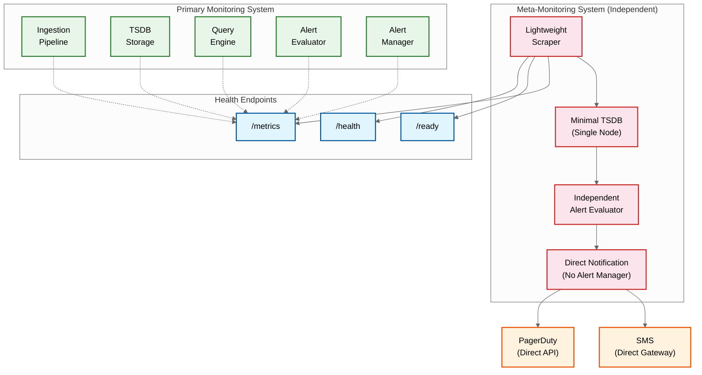

# Observability --- Metrics & Monitoring System

## The Meta-Monitoring Challenge

Monitoring a monitoring system creates a unique circular dependency: the system you use to detect failures is itself the system that can fail. If the TSDB's ingestion pipeline is overloaded, the metrics that would tell you about the overload are the very metrics being dropped. This section addresses how to break this circularity through architectural separation.

### Meta-Monitoring Architecture



### Meta-Monitoring Design Principles

1. **Complete independence**: Meta-monitoring system shares no infrastructure with the primary system---different nodes, different storage, different network path to notification channels
2. **Radical simplicity**: Single-node deployment (no distributed complexity); monitors only internal health metrics (no tenant data)
3. **Fixed cardinality**: Monitors a static, known set of ~100 internal health metrics; no dynamic label expansion; no cardinality risk
4. **Direct notification**: Bypasses the primary alert manager entirely; sends notifications directly to PagerDuty/SMS API; no dependency on primary system availability
5. **Minimal surface area**: No dashboard UI, no query API, no multi-tenancy; exists solely to detect primary system failures and page on-call engineers

---

## Metrics (USE/RED Method)

### Ingestion Pipeline Metrics

| Metric | Type | Labels | Alert Threshold | Description |
|---|---|---|---|---|
| `ingester_samples_received_total` | Counter | tenant_id, ingester_id | rate < 50% of expected | Total samples received per ingester |
| `ingester_samples_appended_total` | Counter | tenant_id | rate diverges from received by >5% | Samples successfully appended (received - rejected) |
| `ingester_active_series` | Gauge | tenant_id, ingester_id | >80% of per-ingester limit | Current active time series count |
| `distributor_received_requests_total` | Counter | tenant_id, status_code | 4xx rate > 5% or 5xx rate > 1% | Ingestion requests by response status |
| `ingester_wal_fsync_duration_seconds` | Histogram | ingester_id | p99 > 100ms | WAL flush latency (durability bottleneck) |
| `ingester_head_chunks_created_total` | Counter | ingester_id | sudden spike = cardinality explosion | New chunk creation rate |
| `ingester_memory_series` | Gauge | ingester_id | >2M per ingester | Series held in memory per ingester |
| `distributor_inflight_push_requests` | Gauge | | >80% of max concurrency | Concurrent ingestion requests |

### Query Engine Metrics

| Metric | Type | Labels | Alert Threshold | Description |
|---|---|---|---|---|
| `query_requests_total` | Counter | tenant_id, status, priority | error rate > 1% | Total queries by status and priority |
| `query_duration_seconds` | Histogram | tenant_id, priority | p99 > 10s for alert queries | Query execution duration |
| `query_samples_scanned_total` | Counter | tenant_id | >100M per query | Samples scanned (efficiency indicator) |
| `query_series_matched_total` | Counter | tenant_id | >100K per query | Series matched by label selectors |
| `query_frontend_cache_hit_ratio` | Gauge | | <50% | Query result cache effectiveness |
| `query_queue_depth` | Gauge | priority | >100 for critical priority | Pending queries in execution queue |
| `query_active_queries` | Gauge | tenant_id, priority | >90% of concurrency limit | Currently executing queries |

### Alerting Pipeline Metrics

| Metric | Type | Labels | Alert Threshold | Description |
|---|---|---|---|---|
| `alert_rule_evaluation_duration_seconds` | Histogram | rule_group | p99 > 90% of eval interval | Time to evaluate all rules in a group |
| `alert_rule_evaluation_failures_total` | Counter | rule_group, reason | any failure | Failed rule evaluations (missed alerts risk) |
| `alert_notifications_sent_total` | Counter | channel, status | failure rate > 5% | Notification delivery status |
| `alert_notifications_queue_depth` | Gauge | channel | >100 | Pending notifications |
| `alertmanager_silences_active` | Gauge | tenant_id | unusual increase | Active silence count (security signal) |
| `alert_evaluation_lag_seconds` | Gauge | rule_group | >2x evaluation interval | Delay between scheduled and actual eval |

### Storage Metrics

| Metric | Type | Labels | Alert Threshold | Description |
|---|---|---|---|---|
| `compactor_blocks_pending` | Gauge | | >50 blocks | Blocks waiting for compaction |
| `compactor_compaction_duration_seconds` | Histogram | level | p99 > 30 min | Compaction execution time |
| `tsdb_blocks_total` | Gauge | level | >200 level-0 blocks | Total blocks by compaction level |
| `tsdb_storage_size_bytes` | Gauge | tenant_id | >90% of quota | Storage consumption per tenant |
| `object_storage_request_duration_seconds` | Histogram | operation | p99 > 500ms | Object storage latency |
| `tsdb_wal_size_bytes` | Gauge | ingester_id | >1 GB | WAL size (recovery time indicator) |

---

## Logging Strategy

### What to Log

| Component | Log Events | Level | Structured Fields |
|---|---|---|---|
| **Ingestion Gateway** | Authentication failure, rate limit hit, malformed payload | WARN/ERROR | tenant_id, source_ip, error_code, sample_count |
| **Distributor** | Ring rebalance, ingester health change, cardinality cap hit | INFO/WARN | tenant_id, ingester_id, series_count, action_taken |
| **Ingester** | WAL rotation, head block cut, OOM risk, series creation rate spike | INFO/WARN | ingester_id, wal_segment, series_count, memory_usage |
| **Query Engine** | Slow query (>5s), query timeout, query rejection, recording rule failure | WARN/ERROR | tenant_id, query_hash, duration, series_count, rejection_reason |
| **Compactor** | Compaction start/complete, block upload, retention deletion | INFO | block_id, level, series_count, duration, bytes |
| **Alert Evaluator** | Evaluation failure, state transition (PENDING→FIRING), evaluation lag | WARN/INFO | rule_id, tenant_id, alert_fingerprint, old_state, new_state |
| **Alert Manager** | Notification sent/failed, silence created/expired, inhibition applied | INFO/WARN | alert_fingerprint, channel, status, silence_id |

### Log Level Strategy

| Level | Usage | Examples |
|---|---|---|
| **ERROR** | Unrecoverable failures requiring operator attention | WAL corruption, ingester OOM, object storage auth failure |
| **WARN** | Degraded operation or approaching limits | Query timeout, cardinality cap approaching (>80%), compaction lag |
| **INFO** | Normal operational events | Block compaction completed, ring rebalance, configuration reload |
| **DEBUG** | Detailed operational data for troubleshooting | Individual query execution plan, sample-level ingestion details |

### Structured Log Format

```
{
  "timestamp": "2026-03-10T10:05:23.456Z",
  "level": "WARN",
  "component": "query_engine",
  "message": "Query exceeded duration threshold",
  "tenant_id": "acme-corp",
  "query_hash": "a1b2c3d4",
  "duration_ms": 8432,
  "series_matched": 45000,
  "samples_scanned": 12500000,
  "priority": "dashboard",
  "trace_id": "4bf92f3577b34da6"
}
```

---

## Distributed Tracing

### Key Spans to Instrument

For a monitoring system, tracing is primarily used to debug slow queries and ingestion issues:

| Operation | Span Name | Key Attributes | Purpose |
|---|---|---|---|
| Ingestion batch processing | `ingest.process_batch` | tenant_id, sample_count, series_count, new_series_count | Identify ingestion bottlenecks |
| Series lookup / creation | `ingest.series_lookup` | series_fingerprint, is_new, stripe_lock_wait_ms | Debug series creation contention |
| WAL append | `ingest.wal_append` | segment_id, bytes_written, fsync_duration_ms | Identify WAL I/O bottlenecks |
| Query parsing | `query.parse` | query_length, ast_depth | Debug parser performance |
| Series resolution | `query.resolve_series` | matchers, series_matched, index_lookup_ms | Identify index lookup bottlenecks |
| Chunk fetch | `query.fetch_chunks` | block_count, chunks_fetched, bytes_read, cache_hit | Debug storage read performance |
| Query evaluation | `query.evaluate` | step_count, result_size, aggregation_type | Profile query computation |
| Alert evaluation | `alert.evaluate_group` | group_name, rule_count, total_duration_ms | Debug alert evaluation lag |
| Notification delivery | `alert.notify` | channel, attempts, final_status, duration_ms | Debug notification failures |

### Trace Propagation

```
INGESTION TRACE:
  Agent → Gateway → Distributor → Ingester → WAL
  Trace context passed in HTTP headers (W3C Trace Context / B3 format)
  Each component adds its span to the trace

QUERY TRACE:
  Dashboard → Query Frontend → Query Engine → [Index + Chunks] → Response
  Fan-out to multiple ingesters/blocks creates child spans for each

ALERT TRACE:
  Evaluator → Query Engine → State Machine → Alert Manager → Notification Channel
  Full trace from rule evaluation to notification delivery
```

---

## Alerting: Meta-Monitoring Alerts

These are the alerts that the **meta-monitoring system** evaluates. They monitor the primary monitoring system and must fire even when the primary system is degraded.

### Critical Alerts (Page-Worthy)

| Alert Name | Condition | Severity | Runbook |
|---|---|---|---|
| `MonitoringIngestionDown` | No samples received for >5 minutes | Critical | Check ingestion gateway health; verify agent connectivity; check distributor ring state |
| `MonitoringIngesterOOM` | Ingester memory >90% of limit | Critical | Check for cardinality explosion; identify top series growth; scale ingesters or enforce caps |
| `MonitoringAlertEvaluationStopped` | Alert evaluator has not completed an evaluation cycle in >3x eval interval | Critical | Check evaluator health; verify TSDB query availability; check for stuck queries |
| `MonitoringWALCorruption` | WAL checksum validation failures | Critical | Isolate affected ingester; replay from replicas; investigate disk health |
| `MonitoringObjectStorageUnreachable` | Object storage requests failing >50% for >5 minutes | Critical | Check cloud provider status; verify credentials; check network connectivity |

### Warning Alerts

| Alert Name | Condition | Severity | Runbook |
|---|---|---|---|
| `MonitoringCompactionLag` | Pending compaction blocks >50 for >30 min | Warning | Scale compactor; check for compaction failures; verify disk space |
| `MonitoringQueryLatencyHigh` | Query p99 >10s for >10 min | Warning | Check query concurrency; identify expensive queries; scale query nodes |
| `MonitoringCardinalityApproachingLimit` | Tenant at >80% of cardinality cap | Warning | Notify tenant; identify high-cardinality metrics; suggest label optimization |
| `MonitoringIngestionLag` | End-to-end ingestion delay >60s | Warning | Check distributor backpressure; verify ingester health; check WAL fsync latency |
| `MonitoringCacheHitRateLow` | Query cache hit rate <30% for >1 hour | Warning | Check cache size; verify cache invalidation logic; monitor for query pattern changes |
| `MonitoringReplicationLag` | Ingester replication lag >30s | Warning | Check network between ingesters; verify replication health; check for slow replicas |

---

## Dashboard Design for Operators

### Recommended Operator Dashboards

| Dashboard | Panels | Refresh Rate | Purpose |
|---|---|---|---|
| **Ingestion Health** | Samples/s (total, per-tenant), rejection rate, cardinality growth, WAL size, ingester memory | 15s | Real-time ingestion monitoring |
| **Query Performance** | Query latency (p50/p95/p99), query rate, cache hit ratio, active queries, queue depth | 15s | Query engine health |
| **Alert Pipeline** | Evaluation lag, rule count, active alerts, notification delivery rate, silence count | 30s | Alerting system health |
| **Storage Health** | Block count by level, compaction rate, object storage latency, storage per tenant | 60s | Storage subsystem health |
| **Tenant Overview** | Per-tenant series count, ingestion rate, query rate, cardinality trending, quota usage | 60s | Multi-tenant capacity management |
| **Meta-Monitoring** | Primary system component health, meta-alert status, notification channel health | 10s | Meta-monitoring system health |
