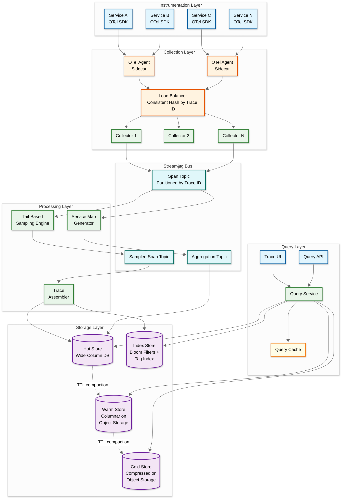
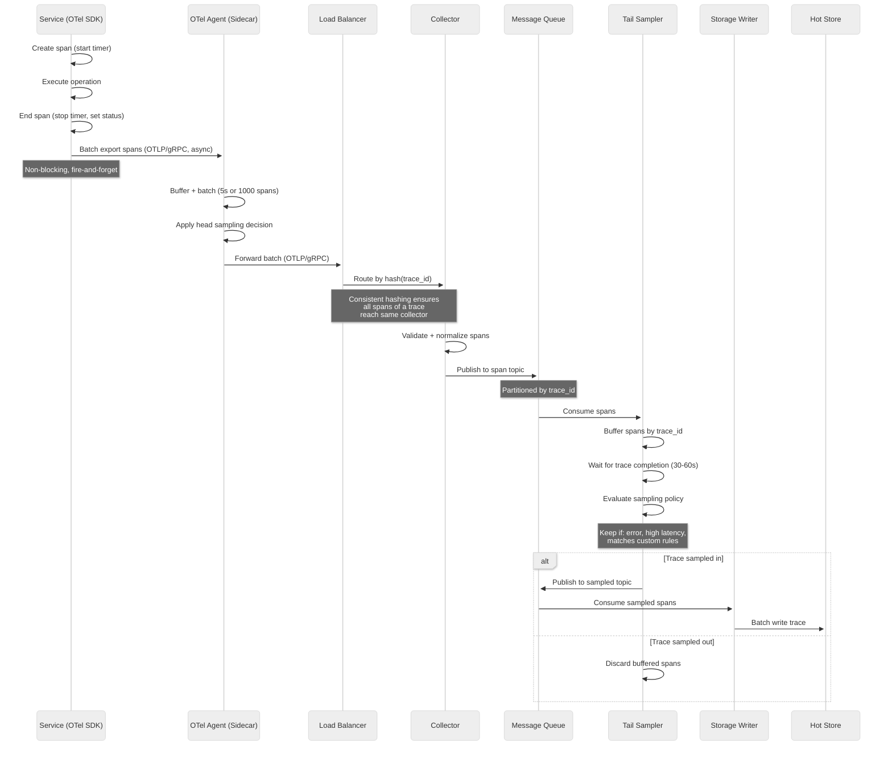
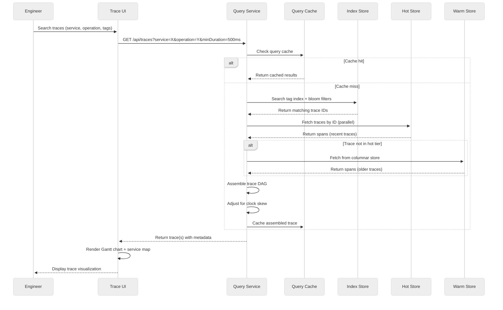

# 02 — High-Level Design

## System Architecture

---

## Data Flow: Write Path (Span Ingestion)

---

## Data Flow: Read Path (Trace Query)

---

## Key Architectural Decisions

### 1. Communication Model

| Decision | Choice | Justification |
|---|---|---|
| SDK → Agent | Async, fire-and-forget (OTLP/gRPC) | Tracing must never slow down the instrumented service; SDK batches spans in memory and flushes asynchronously; if the agent is unavailable, spans are dropped silently |
| Agent → Collector | Async batch (gRPC streaming) | Agents buffer and batch spans to amortize network overhead; gRPC streaming allows backpressure signaling without blocking the agent |
| Collector → Storage | Via message queue (async) | Decouples ingestion rate from storage write rate; allows tail-based sampling as an intermediate processing step; enables replay and reprocessing |

### 2. Architecture Pattern: Event-Driven Pipeline

The system uses an **event-driven, pipeline architecture** rather than a request-response model:

- **Why not request-response**: Span ingestion is a unidirectional data flow (write-only from the application's perspective); the application never reads back its own spans in the hot path
- **Why not synchronous writes**: Storage write latency would propagate back to application services; a 50ms storage hiccup would add 50ms to every instrumented request
- **Why event-driven**: Message queue between collection and storage provides buffering, backpressure, replay capability, and a natural insertion point for tail-based sampling

### 3. Database Choices

| Component | Technology Class | Rationale |
|---|---|---|
| **Hot Store** | Wide-column (e.g., Cassandra, ScyllaDB) | High write throughput; trace ID as partition key gives O(1) lookup; TTL-based automatic expiration; linear horizontal scaling |
| **Warm/Cold Store** | Columnar on Object Storage (e.g., Parquet files) | 10-100x cheaper than wide-column; columnar format enables efficient tag-based queries without full scan; object storage provides durability and near-infinite capacity |
| **Index Store** | Inverted index + bloom filters | Bloom filters: O(1) check for "does trace ID exist in this block?"; inverted index on (service, operation, tag) for search queries; small footprint relative to span data |
| **Query Cache** | In-memory cache (e.g., Redis) | Cache assembled traces for repeated access during debugging sessions; TTL of 5-10 minutes; reduces hot store read amplification |
| **Message Queue** | Distributed log (e.g., Kafka) | Partitioned by trace ID for locality; high throughput; replay capability for reprocessing; decouples producers from consumers |

### 4. Sampling Strategy: Hybrid Head + Tail

| Sampling Tier | Where | Decision Point | Trade-off |
|---|---|---|---|
| **Head-based probabilistic** | SDK / Agent | At span creation | Low overhead, uninformed (doesn't know if trace will be interesting) |
| **Rate-limiting** | Agent | Per service/operation | Prevents high-volume services from dominating storage budget |
| **Tail-based adaptive** | Collector / Stream processor | After trace completion | Informed (sees full trace), but requires buffering all spans until trace completes |

**Hybrid approach**: Head sampling reduces volume by 90% (keeping storage manageable), then tail-based sampling at the collector ensures 100% retention of error traces, latency outliers, and traces matching custom business rules.

### 5. Consistent Hashing for Trace Affinity

All spans belonging to the same trace must be routed to the same collector instance for tail-based sampling to work. The load balancer uses **consistent hashing on trace ID**:

- Ensures all spans of a trace arrive at the same collector
- Enables the collector to maintain an in-memory buffer of partial traces
- Hash ring handles collector additions/removals with minimal trace fragmentation
- Trade-off: temporary trace incompleteness during collector scaling events (mitigated by the assembly buffer's wait window)

---

## Architecture Pattern Checklist

- [x] **Sync vs Async**: Async throughout the write path; sync only for query API
- [x] **Event-driven vs Request-response**: Event-driven pipeline for ingestion; request-response for queries
- [x] **Push vs Pull**: Push from SDKs → agents → collectors; pull from storage for queries
- [x] **Stateless vs Stateful**: Collectors are stateful during tail-sampling (buffer partial traces); query services are stateless
- [x] **Write-heavy vs Read-heavy**: Write-heavy (millions of spans/sec ingested; hundreds of queries/sec)
- [x] **Real-time vs Batch**: Real-time ingestion pipeline; batch compaction for warm/cold tiers
- [x] **Edge vs Origin**: Agents run as sidecars at the edge (on every host); collectors and storage are centralized

---

## Component Responsibilities

| Component | Responsibility | Scaling Unit |
|---|---|---|
| **OTel SDK** | Instrument code, create spans, propagate context, batch export | Per-service (embedded library) |
| **OTel Agent** | Receive spans from local services, apply head sampling, forward to collectors | Per-host (sidecar) |
| **Load Balancer** | Route span batches to collectors using consistent hashing by trace ID | Shared infrastructure |
| **Collector** | Validate, normalize, and buffer spans; publish to message queue | Horizontal: scale with ingestion rate |
| **Message Queue** | Decouple ingestion from processing; partition by trace ID | Horizontal: add partitions |
| **Tail Sampler** | Buffer complete traces, apply sampling policies, emit retained traces | Horizontal: partition by trace ID range |
| **Trace Assembler** | Build trace DAG from spans, detect missing spans, write to storage | Horizontal: scale with sampled throughput |
| **Service Map Generator** | Aggregate span relationships into service dependency graph | Single logical instance with sharded aggregation |
| **Hot Store** | Low-latency trace storage for recent data (7 days) | Horizontal: shard by trace ID |
| **Warm/Cold Store** | Cost-efficient long-term storage in columnar format | Object storage: virtually unlimited |
| **Index Store** | Bloom filters + tag indices for trace discovery | Scale with unique tag cardinality |
| **Query Service** | Serve trace lookups, search queries, and service map queries | Horizontal: scale with query QPS |
| **Query Cache** | Cache assembled traces and search results | Scale with active debugging sessions |
| **Trace UI** | Visualize traces as Gantt charts, render service maps | Static frontend; CDN-served |
