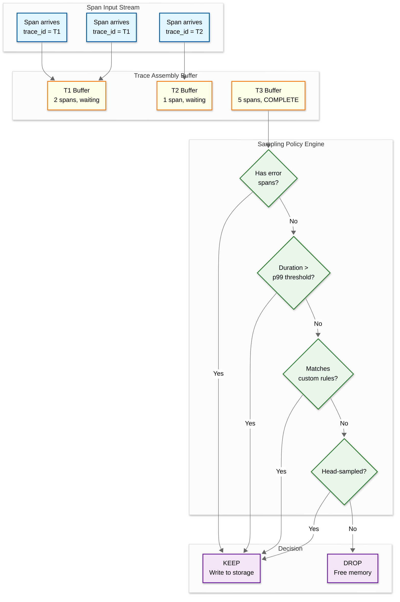
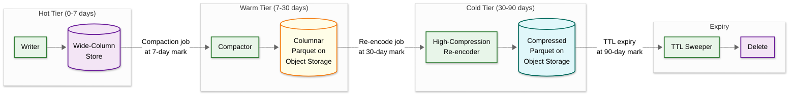

# 04 — Deep Dives & Bottlenecks

## Critical Component 1: Tail-Based Sampling Engine

### Why Is This Critical?

Tail-based sampling is the architecturally decisive component of a production tracing system. It resolves the fundamental sampling paradox: head-based sampling (deciding at trace start) is fast but uninformed—it cannot know whether a trace will contain errors, high latency, or rare code paths. Tail-based sampling waits to observe the complete trace before deciding, ensuring 100% retention of diagnostically valuable traces. However, this requires buffering every span in memory until the trace completes, creating the system's most resource-intensive and failure-prone component.

### How It Works Internally



**Trace completion detection** is non-trivial. Unlike a request-response protocol where the server knows when the response is sent, a distributed trace has no single point that knows "all spans have been emitted." The sampler uses heuristics:

1. **Timeout-based**: If no new spans for trace T arrive within a configurable window (default: 30 seconds), consider the trace complete
2. **Root span closure**: If the root span (no parent) has ended and no new child spans arrive within a shorter window (5 seconds), the trace is likely complete
3. **Span count hint**: SDKs can embed an expected span count in the root span's metadata; if reached, the trace is complete early

```
FUNCTION traceCompletionCheck(traceId):
    trace = buffer.get(traceId)
    now = currentTime()

    # Fast path: root span closed + short quiet period
    IF trace.rootSpan IS NOT NULL AND trace.rootSpan.isEnded():
        IF now - trace.lastSpanArrival > ROOT_CLOSED_WAIT (5 sec):
            RETURN COMPLETE

    # Standard path: no new spans within wait window
    IF now - trace.lastSpanArrival > TRACE_WAIT_WINDOW (30 sec):
        RETURN COMPLETE

    # Hint-based: expected span count reached
    IF trace.expectedSpanCount IS NOT NULL:
        IF trace.spanCount >= trace.expectedSpanCount:
            RETURN COMPLETE

    RETURN PENDING
```

### Failure Modes

| Failure | Impact | Mitigation |
|---|---|---|
| **Buffer memory exhaustion** | Sampler starts dropping buffered traces; diagnostically valuable traces may be lost | Implement tiered eviction: first evict traces that are already head-sampled (they have a backup path); monitor buffer memory and trigger aggressive sampling reduction at 80% capacity |
| **Sampler instance crash** | All buffered traces on that instance are lost; traces become incomplete | Checkpoint buffer state to a local write-ahead log (WAL); on restart, replay WAL to reconstruct buffer; accept that traces mid-flight during crash are lost (eventual consistency) |
| **Trace never completes** | Spans accumulate in the buffer indefinitely, consuming memory | Hard timeout (60 seconds): force a sampling decision on partial trace data; log the incompleteness for debugging |
| **Clock skew causes late arrivals** | Spans arrive after the trace was already marked complete and either dropped or stored | Implement a "late span" grace period: if a span arrives for a recently-finalized trace that was KEPT, append it to storage; if the trace was DROPPED, the span is lost |
| **Consistent hashing rebalance** | During collector scaling, some spans route to a new instance while others are still buffered on the old one | Use a "drain" period during rebalancing: old instance continues accepting spans for its assigned trace IDs for a configurable overlap window before handing off |

### Memory Budget Calculation

```
Given:
    incoming_rate = 600,000 spans/sec (after head sampling)
    avg_span_size = 2 KB (uncompressed in memory)
    wait_window = 30 seconds
    num_sampler_instances = 10

Per-instance buffer:
    spans_per_instance = 600,000 / 10 = 60,000 spans/sec
    buffer_size = 60,000 × 30 × 2 KB = 3.6 GB per instance

With safety margin (2x for burst + overhead):
    target_memory = 3.6 GB × 2 = 7.2 GB per instance

This is feasible on modern servers (32-64 GB RAM),
but requires careful monitoring and backpressure.
```

---

## Critical Component 2: Trace Assembly and Clock Skew Correction

### Why Is This Critical?

Spans arrive out of order from different services running on different machines with different clock offsets. The trace assembler must reconstruct the causal DAG (directed acyclic graph) from these disordered fragments, handle missing spans (from services that don't propagate context or were sampled differently), and correct clock skew that can make child spans appear to start before their parents or end after their parents—which would render the trace timeline visualization nonsensical.

### How It Works Internally

**Phase 1: DAG Construction**

The assembler builds a span graph using parent_span_id references:

```
Input spans (arrival order ≠ causal order):
    Span D: parent=C, service=payment, start=T+150ms, dur=30ms
    Span A: parent=null, service=gateway, start=T+0ms, dur=200ms (root)
    Span C: parent=B, service=order, start=T+100ms, dur=80ms
    Span B: parent=A, service=auth, start=T+50ms, dur=40ms

Step 1: Index by span_id
    map = {A: SpanA, B: SpanB, C: SpanC, D: SpanD}

Step 2: Build tree via parent_span_id
    A (root) → B → C → D

Step 3: Validate temporal consistency
    A starts at T+0, ends at T+200  ✓ (root)
    B starts at T+50, ends at T+90  ✓ (within parent A)
    C starts at T+100, ends at T+180  ✓ (within parent A, after B)
    D starts at T+150, ends at T+180  ✓ (within parent C)
```

**Phase 2: Clock Skew Detection**

```
CLIENT-SERVER span pair for a single RPC:

                Client Span (Service A)
    |=======================================|
    cs                                      cr
         |  network  |              |  network  |
              SERVER Span (Service B)
              |=======================|
              sr                      ss

Expected: sr >= cs AND ss <= cr
If sr < cs: server clock is behind client (negative skew)
If ss > cr: server clock is ahead of client (positive skew)

Detection heuristic:
    skew = 0
    IF child.start < parent.start:
        skew = parent.start - child.start + 1μs
    ELIF child.end > parent.end:
        skew = parent.end - child.end - 1μs
```

**Phase 3: Missing Span Handling**

When a span references a parent_span_id that doesn't exist in the trace:

1. Create a **synthetic placeholder span** with the missing span_id, operation "[missing]", and an estimated time range derived from its children
2. Mark the trace as **incomplete** in metadata
3. Attach the orphaned subtree to the synthetic span
4. This preserves the causal structure even when a service failed to propagate context

### Failure Modes

| Failure | Impact | Mitigation |
|---|---|---|
| **Circular references** | Infinite loop during tree traversal | Detect cycles during construction: track visited span_ids; break cycles by dropping the back-edge reference |
| **Multiple root spans** | Ambiguous trace structure; unclear which is the "real" entry point | Support multi-root traces (e.g., trace linking across async boundaries); display all roots in the UI with a "linked traces" indicator |
| **Extreme clock skew (>5 seconds)** | Skew correction distorts span durations to unrealistic values | Cap skew adjustment at a threshold (e.g., 5 seconds); if detected skew exceeds the cap, flag the trace with a warning rather than adjusting |
| **Massive fan-out traces** | A single trace with 10,000+ spans (e.g., batch job) overwhelms assembly and visualization | Implement progressive rendering: show the top N levels initially; paginate deeper levels; collapse repeated patterns |

---

## Critical Component 3: Storage Tiering and Compaction

### Why Is This Critical?

At 26 TB/day of trace data, a single storage tier would either be prohibitively expensive (fast storage) or unacceptably slow (cheap storage). The storage tier manager must migrate data across hot → warm → cold tiers, compact and re-encode data for efficiency, and maintain indices that span all tiers so that the query layer can transparently read from any tier.

### How It Works Internally



**Compaction process (hot → warm)**:

```
FUNCTION compactToWarm(dateBucket):
    # Read all traces for the date bucket from hot store
    traces = hotStore.scanByDateBucket(dateBucket)

    # Group spans by trace_id
    traceGroups = groupByTraceId(traces)

    # Convert to columnar format
    parquetWriter = ParquetWriter(
        schema = SPAN_SCHEMA,
        compression = SNAPPY,
        rowGroupSize = 128 MB
    )

    FOR traceId, spans IN traceGroups:
        FOR span IN spans:
            parquetWriter.writeRow(span.toColumnarRow())

    # Generate bloom filter for trace_id lookup
    bloomFilter = BloomFilter(
        expectedInsertions = traceGroups.size(),
        falsePositiveRate = 0.01
    )
    FOR traceId IN traceGroups.keys():
        bloomFilter.add(traceId)

    # Write to object storage
    blockId = generateBlockId()
    objectStorage.write(
        path = "/{tenantId}/{dateBucket}/{blockId}/data.parquet",
        data = parquetWriter.close()
    )
    objectStorage.write(
        path = "/{tenantId}/{dateBucket}/{blockId}/bloom-trace-id",
        data = bloomFilter.serialize()
    )
    objectStorage.write(
        path = "/{tenantId}/{dateBucket}/{blockId}/meta.json",
        data = blockMetadata(dateBucket, traceGroups.size(), bloomFilter.size())
    )

    # Delete from hot store (after verification)
    hotStore.deleteByDateBucket(dateBucket)
```

### Failure Modes

| Failure | Impact | Mitigation |
|---|---|---|
| **Compaction lag** | Hot store fills up faster than compaction can drain it; increased storage costs | Monitor compaction throughput vs. ingestion rate; auto-scale compaction workers; alert if lag exceeds 1 hour |
| **Corrupt Parquet block** | Queries for traces in that block fail; data may be lost | Write checksum in meta.json; verify on read; keep hot store data for an extra day as a safety buffer before deletion |
| **Object storage write failure** | Compaction job fails mid-write; partial blocks on object storage | Use atomic write pattern: write to a temp path, then rename; retry failed blocks in the next compaction cycle |
| **Bloom filter false positive** | Query reads a Parquet block that doesn't actually contain the target trace; wasted I/O | Acceptable at 1% false positive rate; reduces full scans from N blocks to ~1% × N; adjust filter size if query latency degrades |

---

## Concurrency & Race Conditions

### Race 1: Span Deduplication During Retry

**Scenario**: An SDK retries a span export due to a transient network error. The collector receives the same span twice.

**Resolution**: Upsert semantics on `(trace_id, span_id)`. Since span data is identical for retries, the second write overwrites with the same data. No locks needed.

### Race 2: Tail Sampling Decision on Split Trace

**Scenario**: During a collector rebalance, spans for the same trace arrive at two different collector instances. Each instance makes an independent tail-sampling decision on a partial view of the trace.

**Resolution**:
1. **Consistent hashing with overlap**: During rebalancing, both the old and new owner accept spans for the transitioning trace IDs for a configurable window
2. **Tie-breaking**: If both instances make a decision, the "KEEP" decision wins (union semantics)—it's better to occasionally double-store a trace than to lose one
3. **Deduplication at storage**: The storage writer deduplicates by `(trace_id, span_id)` so double-writes are harmless

### Race 3: Compaction vs. Query

**Scenario**: A query arrives for a trace that is mid-compaction: being moved from hot store to warm store. The trace is being deleted from hot store but the Parquet block hasn't been fully written yet.

**Resolution**:
1. Write the Parquet block to warm store first (including bloom filter and index)
2. Register the block in the block registry (atomically)
3. Only then delete from hot store
4. Query service checks both hot and warm stores and deduplicates results
5. A brief overlap period where the trace exists in both tiers is acceptable (increases storage cost by ~1 day, simplifies correctness)

### Race 4: Service Map Update Conflict

**Scenario**: Two aggregation workers process span batches that both update the same service-to-service edge metric.

**Resolution**: Use **commutative aggregation**: each worker computes increments (delta call counts, delta error counts, new latency observations) and applies them with atomic increment operations. The final aggregate is order-independent.

---

## Bottleneck Analysis

### Bottleneck 1: Tail Sampler Memory Pressure

**Problem**: The tail sampler buffers all incoming spans for a 30-60 second window. At 600K spans/sec across 10 instances, each instance holds ~3.6 GB in buffer. Traffic spikes or a downstream slowdown can double this.

**Mitigation**:
1. **Adaptive wait window**: Reduce the trace completion wait window under memory pressure (30s → 15s → 5s); accept lower trace completeness for reduced memory
2. **Tiered eviction**: Under pressure, first evict head-sampled traces (they're already captured by the head sampling path); then evict traces without error spans
3. **Spillover to disk**: Buffer overflow spans to a local SSD-backed ring buffer; slower but prevents data loss
4. **Horizontal scaling**: Add more sampler instances; consistent hashing redistributes load

### Bottleneck 2: Hot Store Write Amplification

**Problem**: Writing every sampled span individually to a wide-column store creates high write amplification (each span triggers multiple SSTable writes, index updates, and replication).

**Mitigation**:
1. **Batch writes**: The storage writer batches spans by trace ID and writes all spans of a trace in a single batch mutation
2. **Write-optimized tables**: Use LSM-tree based storage (Cassandra, ScyllaDB) which is optimized for write-heavy workloads
3. **Separate index writes**: Tag index writes are batched and written asynchronously from span data; a brief delay in tag searchability is acceptable

### Bottleneck 3: Tag-Based Search Over Large Time Ranges

**Problem**: Searching for traces by tag values (e.g., `user_id=12345` over the last 7 days) requires scanning the tag index across many time buckets and then fetching matching traces from storage.

**Mitigation**:
1. **Time-bounded queries**: Require all search queries to specify a time range; reject queries spanning more than 24 hours without a specific trace ID
2. **Dedicated columns**: Promote frequently-searched tags (service_name, http_method, http_status_code, error) to dedicated Parquet columns for predicate pushdown
3. **Bloom filter pre-check**: Before scanning a Parquet block, check the tag bloom filter; skip blocks that definitely don't contain the target tag value
4. **Query result limit**: Cap search results at 100 traces; encourage refinement via additional filters rather than exhaustive scanning
