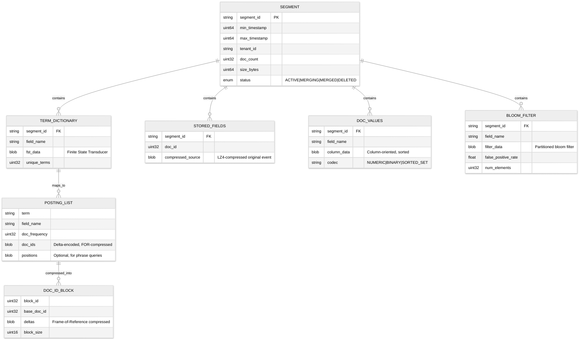

# 15.3 Low-Level Design

## Data Model

### Log Event Schema

```
LogEvent {
    // --- Identity & Timing ---
    event_id:           UUID            // Globally unique, generated at collection
    timestamp:          uint64          // Nanoseconds since epoch (event time)
    observed_timestamp: uint64          // Nanoseconds since epoch (collection time)
    ingest_timestamp:   uint64          // Nanoseconds since epoch (indexing time)

    // --- Classification ---
    severity_number:    uint8           // OTel standard: 1-24 (TRACE=1-4, DEBUG=5-8, INFO=9-12, WARN=13-16, ERROR=17-20, FATAL=21-24)
    severity_text:      string          // Original severity label ("ERROR", "Warning", "CRITICAL")

    // --- Content ---
    body:               string          // The log message (free text, JSON, or structured)
    attributes:         map<string, any> // Structured key-value fields extracted from the log

    // --- Source Identity ---
    resource: {
        service_name:   string          // "payment-service"
        service_version: string         // "v2.3.1"
        host_name:      string          // "prod-us-east-1-node-042"
        container_id:   string          // "abc123def456"
        pod_name:       string          // "payment-service-7b9c4d-xj2k9"
        namespace:      string          // "production"
        cluster:        string          // "us-east-1-primary"
        region:         string          // "us-east-1"
    }

    // --- Correlation ---
    trace_id:           bytes[16]       // W3C Trace ID (128-bit)
    span_id:            bytes[8]        // W3C Span ID (64-bit)
    trace_flags:        uint8           // Sampling flags

    // --- Tenancy ---
    tenant_id:          string          // Organizational tenant
    data_stream:        string          // Logical grouping ("prod-payment-app-logs")

    // --- Instrumentation ---
    scope_name:         string          // Library/module ("com.acme.payment.processor")
    scope_version:      string          // Library version
}
```

### Index Data Model



### Storage Layout

```
/data/hot/{tenant_id}/{data_stream}/
    index-{YYYYMMDD}-{shard_id}/
        segment-{id}/
            _terms.fst           # Finite State Transducer (term dictionary)
            _postings.blk        # Posting lists (FOR-compressed)
            _stored.lz4          # Original events (LZ4-compressed blocks)
            _docvalues.col       # Column-oriented field values
            _bloom.bf            # Per-field bloom filters
            _meta.json           # Segment metadata (doc count, time range)
        translog/
            translog-{seq}.tlog  # Write-ahead log entries
            translog.ckp         # Checkpoint file
    wal/
        wal-{seq}.wal            # Write-ahead log for crash recovery

/data/warm/{tenant_id}/{data_stream}/
    index-{YYYYMMDD}-{shard_id}/
        segment-merged-{id}/     # Force-merged (fewer, larger segments)
            ... (same structure, read-only)

/objectstore/{tenant_id}/{data_stream}/cold/
    snapshots/
        snap-{YYYYMMDD}-{shard_id}/
            segment-{id}.tar.zst     # ZSTD-compressed segment bundle
            _snapshot_metadata.json   # Manifest for searchable snapshot

/objectstore/{tenant_id}/{data_stream}/frozen/
    archive/
        archive-{YYYYMMDD}.tar.zst   # Highly compressed archive bundle
```

---

## Indexing Strategy Details

### Inverted Index Construction

```
FUNCTION build_inverted_index(events: List<LogEvent>) -> Segment:
    term_postings = HashMap<(field, term), List<DocID>>()
    doc_values = HashMap<field, List<Value>>()
    stored_docs = List<CompressedBytes>()

    FOR doc_id, event IN enumerate(events):
        // Store original event (compressed)
        stored_docs.append(lz4_compress(serialize(event)))

        // Index each field
        FOR field, value IN event.indexed_fields():
            IF field.index_type == FULL_TEXT:
                tokens = tokenize(value)  // lowercase, split on whitespace/punctuation
                FOR token IN tokens:
                    term_postings[(field, token)].append(doc_id)

            ELSE IF field.index_type == KEYWORD:
                term_postings[(field, value)].append(doc_id)

            // Always build doc values for sortable/aggregatable fields
            IF field.is_sortable OR field.is_aggregatable:
                doc_values[field].append(value)

    // Compress posting lists using Frame-of-Reference
    compressed_postings = HashMap()
    FOR (field, term), doc_ids IN term_postings:
        sorted_ids = sort(doc_ids)
        deltas = compute_deltas(sorted_ids)
        compressed_postings[(field, term)] = for_compress(deltas)

    // Build FST (Finite State Transducer) for term dictionary
    FOR field IN unique_fields(term_postings):
        terms = sorted(unique_terms_for_field(term_postings, field))
        fst = build_fst(terms)  // O(n) construction, O(term_length) lookup

    // Build bloom filters for high-cardinality fields
    FOR field IN bloom_filter_fields:
        bf = BloomFilter(expected_elements=len(events), fpp=0.01)
        FOR doc_id, event IN enumerate(events):
            bf.add(event.get_field(field))

    RETURN Segment(
        term_dict=fst,
        postings=compressed_postings,
        stored_fields=stored_docs,
        doc_values=doc_values,
        bloom_filters=bloom_filters,
        metadata=SegmentMetadata(
            doc_count=len(events),
            min_timestamp=min(e.timestamp for e in events),
            max_timestamp=max(e.timestamp for e in events)
        )
    )
```

**Complexity**: O(N * F * T) where N = events, F = fields per event, T = tokens per field. Typically N=10K-100K per segment flush, F=10-50, T=5-20 for message bodies.

### Segment Merge Strategy

```
FUNCTION tiered_merge_policy(segments: List<Segment>) -> List<MergePlan>:
    // Group segments by size tier
    // Tier boundaries: 10MB, 100MB, 500MB, 1GB, 5GB
    tiers = bucket_by_size(segments, [10MB, 100MB, 500MB, 1GB, 5GB])

    merge_plans = []
    FOR tier IN tiers:
        // Merge when a tier has too many segments (default: 10)
        IF len(tier.segments) > MAX_SEGMENTS_PER_TIER:
            // Pick segments with highest delete ratio first (most compaction benefit)
            candidates = sort_by_delete_ratio(tier.segments, descending=True)
            to_merge = candidates[:MAX_MERGE_AT_ONCE]  // default: 10

            IF sum(s.size for s in to_merge) < MAX_MERGED_SEGMENT_SIZE:
                merge_plans.append(MergePlan(
                    source_segments=to_merge,
                    target_tier=tier,
                    priority=calculate_priority(to_merge)
                ))

    RETURN sort_by_priority(merge_plans)

FUNCTION execute_merge(plan: MergePlan) -> Segment:
    // Open all source segments
    readers = [SegmentReader(s) for s in plan.source_segments]

    // Merge term dictionaries (union of all terms)
    merged_terms = merge_fsts([r.term_dict for r in readers])

    // Merge posting lists (concatenate and re-delta-encode)
    merged_postings = {}
    FOR term IN merged_terms:
        all_doc_ids = []
        FOR reader IN readers:
            doc_ids = reader.get_postings(term)
            // Remap doc IDs to new merged segment's ID space
            remapped = remap_doc_ids(doc_ids, reader.base_doc_id)
            all_doc_ids.extend(remapped)
        // Skip deleted documents
        all_doc_ids = filter_out_deleted(all_doc_ids)
        merged_postings[term] = for_compress(compute_deltas(sort(all_doc_ids)))

    // Merge stored fields (copy, skipping deleted docs)
    merged_stored = merge_stored_fields(readers, skip_deleted=True)

    RETURN new_segment(merged_terms, merged_postings, merged_stored)
```

### Bloom Filter Search Acceleration

```
FUNCTION bloom_accelerated_search(query_term: string, segments: List<Segment>) -> List<LogEvent>:
    results = []
    segments_scanned = 0
    segments_skipped = 0

    FOR segment IN segments:
        // Check bloom filter first (O(k) where k = hash functions, typically 7)
        IF NOT segment.bloom_filter.might_contain(query_term):
            segments_skipped += 1
            CONTINUE    // Definitely not in this segment

        // Bloom says "maybe" -- must verify with full scan
        segments_scanned += 1
        matches = segment.search(query_term)
        results.extend(matches)

    // Typical skip rate: 90-99% of segments for rare terms (e.g., trace IDs)
    RETURN results
```

---

## API Design

### Ingestion API

```
// --- Push logs (OTLP-compatible) ---
POST /v1/logs
Headers:
    Content-Type: application/x-protobuf | application/json
    Authorization: Bearer {api_key}
    X-Tenant-ID: {tenant_id}
    Content-Encoding: gzip | zstd        // Optional compression
Body: ResourceLogs[]                      // OTel log data model
Response:
    200 OK                                // All events accepted
    207 Multi-Status                      // Partial acceptance (some events rejected)
        { accepted: 950, rejected: 50, errors: [...] }
    429 Too Many Requests                 // Rate limited
        { retry_after_ms: 5000, quota_remaining: 0 }
    503 Service Unavailable               // Backpressure (queue full)
        { retry_after_ms: 30000 }

// --- Bulk ingestion (high-throughput) ---
POST /v1/logs/bulk
Headers:
    Content-Type: application/x-ndjson    // Newline-delimited JSON
    Authorization: Bearer {api_key}
Body:
    {"timestamp":"2026-03-10T14:23:01Z","severity":"ERROR","body":"Connection timeout",...}
    {"timestamp":"2026-03-10T14:23:02Z","severity":"INFO","body":"Request completed",...}
Response:
    200 OK { ingested: 1000, errors: 0 }
```

### Search API

```
// --- Log search ---
POST /v1/search
Headers:
    Authorization: Bearer {user_token}
    X-Tenant-ID: {tenant_id}
Body: {
    "query": '{service="payment-api", env="prod"} |= "timeout" | json | status >= 500',
    "time_range": {
        "start": "2026-03-10T13:00:00Z",
        "end":   "2026-03-10T14:00:00Z"
    },
    "limit": 100,
    "offset": 0,
    "sort": "timestamp:desc",
    "highlight": true                     // Highlight matching terms in results
}
Response: {
    "results": [
        {
            "timestamp": "2026-03-10T13:45:23.456Z",
            "severity": "ERROR",
            "body": "Connection <em>timeout</em> after 30s to upstream payment-gateway:8080",
            "attributes": { "service": "payment-api", "status": 504, "trace_id": "abc123..." },
            "resource": { "host": "prod-node-042", "pod": "payment-api-7b9c4d-xj2k9" }
        }
    ],
    "metadata": {
        "total_hits": 1847,
        "scanned_bytes": 524288000,
        "execution_time_ms": 342,
        "tiers_queried": ["hot", "warm"],
        "shards_total": 24,
        "shards_successful": 24
    },
    "pagination": { "next_offset": 100, "has_more": true }
}

// --- Aggregation query ---
POST /v1/search/aggregate
Body: {
    "query": '{env="prod"} | json | severity >= 17',
    "time_range": { "start": "-1h", "end": "now" },
    "aggregation": {
        "type": "time_series",
        "interval": "1m",
        "group_by": ["service_name"],
        "metric": "count"
    }
}
Response: {
    "series": [
        {
            "labels": { "service_name": "payment-api" },
            "datapoints": [
                { "timestamp": "2026-03-10T13:00:00Z", "value": 42 },
                { "timestamp": "2026-03-10T13:01:00Z", "value": 156 },
                ...
            ]
        }
    ]
}

// --- Live tail (WebSocket) ---
WS /v1/tail
Message (client -> server): {
    "query": '{service="payment-api", env="prod"} |= "error"',
    "max_rate": 100    // Max events/second to stream
}
Message (server -> client): {
    "event": { "timestamp": "...", "body": "...", ... }
}
```

### Management API

```
// --- Data stream lifecycle ---
PUT /v1/streams/{stream_name}
Body: {
    "retention": {
        "hot_days": 7,
        "warm_days": 30,
        "cold_days": 90,
        "frozen_days": 365
    },
    "indexing": {
        "strategy": "full_text",          // "full_text" | "label_only" | "bloom_filter"
        "full_text_fields": ["body", "attributes.error.message"],
        "keyword_fields": ["service_name", "severity", "trace_id"],
        "bloom_fields": ["trace_id", "request_id", "user_id"]
    },
    "ingestion": {
        "max_events_per_second": 100000,
        "max_bytes_per_day": "500GB",
        "sampling_rules": [
            { "severity": "DEBUG", "sample_rate": 0.1 },
            { "severity": "INFO", "sample_rate": 0.5 }
        ]
    },
    "pii": {
        "redaction_enabled": true,
        "patterns": ["email", "phone", "ssn", "credit_card"],
        "strategy": "mask"                // "mask" | "hash" | "remove"
    }
}

// --- Query data stream status ---
GET /v1/streams/{stream_name}/stats
Response: {
    "ingestion_rate_eps": 45230,
    "storage_bytes": { "hot": 1073741824, "warm": 5368709120, "cold": 21474836480 },
    "doc_count": { "hot": 156000000, "warm": 780000000, "cold": 3120000000 },
    "oldest_event": "2025-12-10T00:00:00Z",
    "newest_event": "2026-03-10T14:23:45Z"
}
```

---

## Query Language Design

### Grammar (LogQL-Inspired)

```
query           = stream_selector pipeline* [aggregation]
stream_selector = "{" label_matcher ("," label_matcher)* "}"
label_matcher   = label_name operator label_value
operator        = "=" | "!=" | "=~" | "!~"      // exact, not-exact, regex, not-regex

pipeline        = "|" stage
stage           = line_filter | parser | label_filter | format | dedup

line_filter     = ("=" | "!=" | "~" | "!~") quoted_string
                  // |= "error"        (line contains "error")
                  // |~ "timeout|5\\d{2}"  (line matches regex)

parser          = "json" | "logfmt" | "regexp" quoted_string | "pattern" quoted_string
                  // | json            (parse JSON fields)
                  // | logfmt          (parse key=value pairs)
                  // | regexp "(?P<ip>\\d+\\.\\d+\\.\\d+\\.\\d+)"

label_filter    = field_name comparison_op value
                  // | status >= 500
                  // | duration > 1000

format          = "line_format" template | "label_format" label "=" template

dedup           = "dedup" field_name ("," field_name)*
                  // | dedup service, message   (deduplicate by fields)

aggregation     = agg_function "(" [parameter] ")" ["by" "(" label_list ")"] ["over" duration]
agg_function    = "count" | "rate" | "sum" | "avg" | "min" | "max"
                  | "p50" | "p95" | "p99" | "topk" | "bottomk"
```

### Query Execution Plan

```
FUNCTION execute_query(query: ParsedQuery, time_range: TimeRange) -> QueryResult:
    // Phase 1: Plan
    shards = identify_shards(query.tenant_id, query.stream_selector, time_range)
    tiers = identify_tiers(time_range)  // hot, warm, cold based on time boundaries

    // Phase 2: Shard-level execution (parallel)
    shard_results = parallel_execute(shards, FUNCTION(shard):
        // Step 1: Label-based filtering (inverted index lookup)
        candidate_segments = shard.find_segments_by_labels(query.stream_selector)

        // Step 2: Time range pruning
        candidate_segments = filter(candidate_segments,
            s -> s.max_timestamp >= time_range.start AND s.min_timestamp <= time_range.end)

        // Step 3: Bloom filter pre-check (if line filter present)
        IF query.has_line_filter AND query.line_filter.is_exact_match:
            candidate_segments = filter(candidate_segments,
                s -> s.bloom_filter.might_contain(query.line_filter.term))

        // Step 4: Full scan of remaining segments
        matches = []
        FOR segment IN candidate_segments:
            // Use inverted index for term lookup
            doc_ids = segment.inverted_index.search(query.terms)

            // Fetch matching documents
            FOR doc_id IN doc_ids:
                event = segment.stored_fields.get(doc_id)

                // Apply pipeline stages (parse, filter, format)
                result = apply_pipeline(event, query.pipeline_stages)
                IF result != NULL:
                    matches.append(result)

        RETURN matches
    )

    // Phase 3: Merge and aggregate
    all_results = merge_sorted(shard_results, key="timestamp", order="desc")

    IF query.has_aggregation:
        RETURN compute_aggregation(all_results, query.aggregation)
    ELSE:
        RETURN paginate(all_results, query.limit, query.offset)
```

---

## Core Algorithms

### Timestamp Extraction

```
FUNCTION extract_timestamp(raw_line: string, source_config: SourceConfig) -> (uint64, string):
    // Priority order for timestamp extraction:
    // 1. Explicit timestamp field in structured data
    // 2. Common timestamp patterns in the log line
    // 3. File modification time (fallback)

    // Try structured extraction first
    IF is_json(raw_line):
        parsed = json_parse(raw_line)
        FOR field IN ["timestamp", "@timestamp", "time", "ts", "date", "datetime"]:
            IF field IN parsed:
                RETURN (parse_timestamp(parsed[field]), field)

    // Try common patterns
    patterns = [
        // ISO 8601
        ("\\d{4}-\\d{2}-\\d{2}T\\d{2}:\\d{2}:\\d{2}(\\.\\d+)?(Z|[+-]\\d{2}:?\\d{2})?", "iso8601"),
        // RFC 3339
        ("\\d{4}-\\d{2}-\\d{2} \\d{2}:\\d{2}:\\d{2}", "rfc3339_space"),
        // Syslog BSD
        ("[A-Z][a-z]{2}\\s+\\d{1,2} \\d{2}:\\d{2}:\\d{2}", "syslog_bsd"),
        // Epoch seconds/milliseconds/nanoseconds
        ("^(\\d{10}(\\.\\d+)?|\\d{13}|\\d{19})", "epoch"),
    ]

    FOR pattern, format IN patterns:
        match = regex_search(pattern, raw_line)
        IF match:
            RETURN (parse_timestamp_format(match, format), format)

    // Fallback: use observed timestamp (collection time)
    RETURN (current_time_nanos(), "observed")
```

### Backpressure Propagation

```
FUNCTION handle_backpressure(agent: Agent, queue: MessageQueue, indexer: IndexerPool):
    // Three-level backpressure chain:
    // Level 1: Indexer -> Queue (consumer lag)
    // Level 2: Queue -> Agent (queue depth)
    // Level 3: Agent -> Application (drop/sample)

    // Level 1: Indexer monitors its own capacity
    IF indexer.memory_usage > 80%:
        indexer.reduce_consumer_rate(factor=0.5)
        // Consumer group fetches fewer messages per poll

    // Level 2: Queue monitors partition lag
    queue_depth = queue.get_lag(consumer_group="indexer")
    IF queue_depth > HIGH_WATERMARK:        // e.g., 1M messages lag
        queue.signal_producers(action="slow_down", max_rate=50%)
        // Agents receive backpressure signal via response header

    IF queue_depth > CRITICAL_WATERMARK:    // e.g., 10M messages lag
        queue.signal_producers(action="shed_load")
        // Agents begin shedding low-priority traffic

    // Level 3: Agent applies load shedding
    FUNCTION agent_handle_backpressure(signal: BackpressureSignal):
        IF signal == "slow_down":
            // Increase batch size (fewer requests, same data)
            agent.batch_size = min(agent.batch_size * 2, MAX_BATCH_SIZE)
            // Increase batch timeout
            agent.batch_timeout = min(agent.batch_timeout * 2, 30s)

        ELSE IF signal == "shed_load":
            // Apply priority-based shedding
            agent.enable_priority_shedding([
                {severity: "DEBUG", action: "drop"},
                {severity: "INFO", action: "sample_10_percent"},
                {severity: "WARN", action: "keep"},
                {severity: "ERROR", action: "keep"},
                {severity: "FATAL", action: "keep"},
            ])
            // Buffer to local disk (limited)
            agent.enable_disk_buffer(max_size=500MB)
```

### Log Pattern Clustering (Drain Algorithm)

```
FUNCTION drain_cluster(log_messages: Stream<string>, similarity_threshold: float = 0.5):
    // Drain: a streaming log parser that extracts log templates
    // Key insight: group by message length first, then parse tree traversal

    parse_tree = {}     // Depth-limited tree: length -> first_token -> ... -> cluster
    clusters = []

    FOR message IN log_messages:
        tokens = tokenize(message)      // Split by whitespace/punctuation
        length = len(tokens)

        // Step 1: Navigate parse tree by length
        IF length NOT IN parse_tree:
            parse_tree[length] = {}

        node = parse_tree[length]

        // Step 2: Navigate by first N tokens (depth limit, typically 3-4)
        FOR i IN range(min(TREE_DEPTH, length)):
            token = tokens[i]
            IF is_variable(token):      // Contains digits, special chars -> likely variable
                token = "<*>"           // Wildcard placeholder
            IF token NOT IN node:
                node[token] = {} IF i < TREE_DEPTH - 1 ELSE []
            node = node[token]

        // Step 3: Find matching cluster in leaf node
        best_match = NULL
        best_similarity = 0
        FOR cluster IN node:            // node is a list of clusters at leaf
            sim = compute_similarity(tokens, cluster.template_tokens)
            IF sim > best_similarity AND sim >= similarity_threshold:
                best_match = cluster
                best_similarity = sim

        IF best_match != NULL:
            // Update existing cluster
            best_match.template_tokens = merge_templates(best_match.template_tokens, tokens)
            best_match.count += 1
        ELSE:
            // Create new cluster
            new_cluster = Cluster(template_tokens=tokens, count=1)
            node.append(new_cluster)
            clusters.append(new_cluster)

    RETURN clusters
    // Example output:
    // Template: "Connection to <*> timed out after <*> ms"  (count: 15,432)
    // Template: "Request <*> completed in <*> ms with status <*>"  (count: 892,341)

FUNCTION compute_similarity(tokens_a: List<string>, tokens_b: List<string>) -> float:
    IF len(tokens_a) != len(tokens_b):
        RETURN 0.0
    matching = sum(1 FOR a, b IN zip(tokens_a, tokens_b) IF a == b OR a == "<*>" OR b == "<*>")
    RETURN matching / len(tokens_a)
```

---

## Partitioning & Sharding

### Shard Key Design

```
Shard Key = hash(tenant_id) % NUM_TENANT_SHARDS
            + time_bucket(timestamp, BUCKET_INTERVAL)

// Example: tenant "acme", timestamp 2026-03-10T14:23:00Z, 24-hour buckets
// shard_key = hash("acme") % 16 = 7
// time_bucket = "2026-03-10"
// physical_shard = "shard-7-2026-03-10"
```

| Dimension | Strategy | Justification |
|---|---|---|
| Primary partition | Tenant ID (hash) | Data isolation, per-tenant retention, access control |
| Secondary partition | Time (daily buckets) | Efficient time-range pruning; entire day-shards become read-only and can be migrated to colder tiers |
| Within-shard | Data stream | Further isolation within a tenant (e.g., separate app logs from security audit logs) |

### Shard Sizing

| Tier | Target shard size | Justification |
|---|---|---|
| Hot | 30-50 GB per shard | Balanced between search parallelism and segment merge overhead |
| Warm | 50-100 GB per shard | Fewer, larger shards after force-merge (faster search, less metadata) |
| Cold | 100-500 GB per shard | Object storage snapshots benefit from larger bundles (fewer API calls) |

---

## Data Retention & Lifecycle

```
FUNCTION lifecycle_manager(data_streams: List<DataStream>):
    // Runs as a background daemon, once per hour
    FOR stream IN data_streams:
        policy = stream.retention_policy

        // Hot -> Warm transition
        hot_shards = get_shards(stream, tier="hot", older_than=policy.hot_days)
        FOR shard IN hot_shards:
            force_merge(shard, max_segments=1)  // Reduce segment count
            mark_read_only(shard)
            move_to_tier(shard, "warm")

        // Warm -> Cold transition
        warm_shards = get_shards(stream, tier="warm", older_than=policy.warm_days)
        FOR shard IN warm_shards:
            snapshot = create_searchable_snapshot(shard)
            upload_to_object_storage(snapshot)
            delete_local_copy(shard)
            register_cold_shard(snapshot.metadata)

        // Cold -> Frozen transition
        cold_snapshots = get_shards(stream, tier="cold", older_than=policy.cold_days)
        FOR snapshot IN cold_snapshots:
            archive = deep_compress(snapshot, codec="zstd_level_19")
            upload_to_archive_storage(archive)
            remove_searchable_index(snapshot)
            register_frozen_archive(archive.metadata)

        // Frozen -> Delete
        frozen_archives = get_shards(stream, tier="frozen", older_than=policy.frozen_days)
        FOR archive IN frozen_archives:
            // Compliance check before deletion
            IF compliance_hold_exists(archive):
                SKIP  // Legal hold prevents deletion
            delete_archive(archive)
            log_deletion_audit_event(archive)
```
