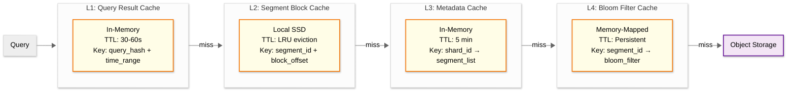

# 15.3 Scalability & Reliability

## Scaling Strategy

### Horizontal Scaling by Layer

Each layer of the log aggregation pipeline scales independently based on its specific bottleneck:

| Layer | Scaling Trigger | Scaling Unit | Scale Factor |
|---|---|---|---|
| **Collection** | Automatic (1 agent per host/pod) | Sidecar per workload | Scales with application fleet |
| **Buffer (Queue)** | Partition lag > threshold | Add partitions + brokers | 1 broker per ~200 MB/s throughput |
| **Processing** | Consumer lag > threshold | Stateless worker instances | 1 worker per ~50K events/s |
| **Indexing** | Shard count / memory pressure | Index writer instances | 1 writer per ~100K events/s |
| **Hot Storage** | Disk usage > 80% watermark | Storage nodes | 1 node per ~2 TB indexed data |
| **Query** | Query latency p99 > target | Stateless query executors | 1 executor per ~50 concurrent queries |

### Collection Layer Scaling

The collection layer scales inherently with the application fleet---every new pod or host gets an OTel Collector sidecar. The scaling concern is not instance count but per-instance efficiency:

- **Memory Limiter**: Each collector limits its memory to a configured ceiling (default 256MB). When the limit is approached, the collector applies backpressure (slower batching) rather than OOM.
- **Batch Optimization**: At high volume, increase batch size (5MB -> 20MB) and batch timeout (5s -> 15s) to reduce per-event overhead. Trade-off: higher latency per batch but lower CPU and network overhead.
- **Sampling at Source**: For extremely high-volume services (>10K events/s per pod), apply deterministic sampling at the collector level. Sample rate configurable per severity: 100% ERROR, 50% WARN, 10% INFO, 1% DEBUG.

### Buffer Layer Scaling

```
FUNCTION scale_queue_partitions(topic, current_partitions, metrics):
    // Scale based on per-partition throughput
    max_partition_throughput = 10 MB/s  // Conservative limit

    current_throughput = metrics.topic_throughput_bytes_per_sec
    IF current_throughput / current_partitions > max_partition_throughput * 0.8:
        new_partitions = ceil(current_throughput / (max_partition_throughput * 0.6))
        expand_partitions(topic, new_partitions)
        // Note: partition count can only increase, never decrease
        // Rebalance consumers to pick up new partitions

    // Scale brokers based on total cluster throughput
    cluster_throughput = metrics.cluster_throughput_bytes_per_sec
    broker_capacity = 200 MB/s  // Per broker
    IF cluster_throughput / num_brokers > broker_capacity * 0.7:
        add_broker()
        rebalance_partitions_across_brokers()
```

**Queue Tiered Storage**: For the 72-hour retention window, only the most recent 6 hours need SSD performance (active consumption). Older data uses HDD or object storage (replay-only access pattern). This reduces queue storage cost by ~80%.

### Indexing Layer Scaling

The indexing layer is the most complex to scale because index writers are stateful (they hold in-memory segments and WAL state):

**Shard Rebalancing Protocol**:
1. New indexer instance joins the pool
2. Controller identifies overloaded shards (by event rate or memory pressure)
3. Selected shards are "frozen" on the current owner (buffer flushed, WAL synced)
4. Shard ownership transferred to new instance (consumer offset committed, WAL replayed)
5. New instance begins accepting events for transferred shards
6. Old instance releases resources for transferred shards

**Time-Based Sharding for Natural Scale-Out**:
```
Day 1: index-2026-03-10-{shard_0..15}  -> Indexer Pool A (16 shards)
Day 2: index-2026-03-11-{shard_0..31}  -> Indexer Pool A+B (32 shards, doubled capacity)

// New day = new index = opportunity to increase shard count
// No rebalancing needed; old day's shards continue on existing writers (read-only)
```

### Query Layer Scaling

Query executors are stateless and scale trivially by adding instances. The key optimization is intelligent query routing:

- **Tier-Aware Routing**: Route hot-tier queries to executors co-located with hot storage nodes (data locality). Route cold-tier queries to executors with high-bandwidth network connections to object storage.
- **Query Concurrency Limits**: Per-tenant query concurrency cap (default: 20 concurrent queries). Prevents one tenant's heavy queries from starving others.
- **Query Queue with Priority**: During incidents, queries from on-call engineers get priority over dashboard background refreshes.

---

## Database Scaling Strategy

### Hot Tier: Sharded Index Cluster

```
Sharding dimensions:
  Primary:   tenant_id (hash-based, 16-256 shards per tenant based on volume)
  Secondary: time (daily index rotation)

Replication:
  Factor: 2 (1 primary + 1 replica)
  Strategy: Synchronous replication for durability
  Replica serves read queries (doubles search capacity)

Shard sizing:
  Target: 30-50 GB per shard
  Auto-rollover: new index when shard exceeds 50 GB or 24 hours

Node types:
  - Index Writer Nodes: High CPU, high memory, fast SSD (NVMe)
    Ratio: 1 per 100K events/s indexing throughput
  - Search Nodes: High memory (for caching segment files), moderate CPU
    Ratio: 1 per 50 concurrent search queries
```

### Warm Tier: Read-Optimized Storage

```
Transition from hot:
  1. Force-merge: reduce from N segments to 1 segment per shard
  2. Shrink: reduce replica count from 2 to 1 (less critical data)
  3. Mark read-only
  4. Move to warm-tier nodes (HDD, higher capacity, lower cost)

Optimization:
  - Force-merge eliminates deleted documents and reduces segment count
  - Single-segment shards have optimal search performance (no cross-segment merge)
  - Lower replica count acceptable because data exists in cold tier backup
```

### Cold Tier: Object Storage with Searchable Snapshots

```
Transition from warm:
  1. Create searchable snapshot (index metadata + segment files)
  2. Upload to object storage
  3. Delete local warm-tier copy
  4. Register snapshot metadata in cold-tier catalog

Search mechanism:
  - Snapshot metadata (segment list, bloom filters, min/max timestamps) cached locally
  - On query: check metadata to identify relevant segments
  - Fetch only required data blocks from object storage (block-level, not full segment)
  - Local SSD cache for recently accessed blocks (LRU, ~10% of cold tier size)

Cost comparison (per GB/month):
  Hot (NVMe SSD):     $0.30 - $0.50
  Warm (HDD):         $0.05 - $0.10
  Cold (Object):      $0.01 - $0.025
  Frozen (Archive):   $0.001 - $0.004
```

### Frozen Tier: Deep Archive

```
Transition from cold:
  1. Remove searchable snapshot (no indexed access)
  2. Re-compress with maximum compression (ZSTD level 19)
  3. Upload to archive-class object storage
  4. Retain only metadata: time range, tenant, data stream, event count

Access pattern:
  - Query requires explicit rehydration request
  - Rehydration: decompress and re-index into temporary cold-tier storage
  - Availability: 1-12 hours after request (batch rehydration)
  - Auto-cleanup: rehydrated data deleted after configurable TTL (default: 7 days)

Use cases:
  - Compliance audit (annual review)
  - Forensic investigation (security incident months later)
  - Legal discovery
```

---

## Caching Strategy

### Multi-Layer Cache Architecture



| Layer | Purpose | Size | Hit Rate |
|---|---|---|---|
| **L1: Query Result Cache** | Cache full query results for dashboard queries (repeated every 30-60s) | 1-5 GB per query node | 30-60% (dashboard traffic) |
| **L2: Segment Block Cache** | Cache hot segment data blocks fetched from warm/cold tiers | 50-200 GB SSD per query node | 40-70% (temporal locality) |
| **L3: Metadata Cache** | Cache shard-to-segment mappings, avoiding catalog lookups | 100 MB per query node | 95%+ (changes slowly) |
| **L4: Bloom Filter Cache** | Memory-map bloom filters for all hot/warm segments | 1-5 GB per query node | 99%+ (loaded at startup) |

---

## Reliability & Fault Tolerance

### Single Points of Failure (SPOF) Analysis

| Component | SPOF Risk | Mitigation |
|---|---|---|
| **Message Queue** | Queue cluster failure loses buffered data | Multi-broker deployment (minimum 3); replication factor 3; cross-availability-zone deployment; if entire cluster fails, agents buffer to local disk (500MB per agent, buys ~10-30 minutes) |
| **Index Writer** | Writer crash loses in-memory buffer | WAL provides durability; on crash, new writer replays WAL; consumer offset committed only after WAL sync; at-most 1 refresh interval of data re-indexed (deduped by event_id) |
| **Query Frontend** | Frontend crash blocks all queries | Multiple frontend instances behind load balancer; stateless (query state is per-request); health check based failover |
| **Storage Tier** | Hot-tier node failure loses one replica | Replication factor 2; replica promoted to primary within seconds; replacement node rebuilds replica from primary |
| **Lifecycle Manager** | Manager failure delays tier transitions | Leader-elected singleton with standby; delayed transitions are not data-threatening (just cost-suboptimal); can catch up when recovered |

### Failover Mechanisms

#### Index Writer Failover

```
FUNCTION handle_writer_failure(failed_writer):
    // Detect: heartbeat timeout (30 seconds)
    failed_shards = get_shards_owned_by(failed_writer)

    FOR shard IN failed_shards:
        // Step 1: Reassign consumer partition to healthy writer
        new_writer = select_least_loaded_writer()
        reassign_partition(shard.partition, new_writer)

        // Step 2: New writer replays WAL from last checkpoint
        wal_path = shard.wal_path  // Shared storage or replicated WAL
        last_checkpoint = shard.last_committed_offset
        new_writer.replay_wal(wal_path, from_offset=last_checkpoint)

        // Step 3: Resume consuming from queue
        new_writer.start_consuming(shard.partition, from_offset=last_checkpoint)

    // Total failover time: 30s (detection) + 5-30s (WAL replay) = 35-60s
    // During failover: events buffered in queue (no data loss)
```

#### Graceful Degradation During Overload

```
FUNCTION apply_degradation_level(system_load: LoadMetrics):
    IF system_load.indexer_lag > 5_MINUTES:
        // Level 1: Reduce search quality to free resources for indexing
        SET search_timeout = 10s (from 30s)
        SET max_concurrent_queries = 50% of normal
        ENABLE search_results_from_hot_tier_only

    IF system_load.indexer_lag > 15_MINUTES:
        // Level 2: Shed low-priority ingestion
        ENABLE sampling(severity="DEBUG", rate=0.01)   // 1% of debug logs
        ENABLE sampling(severity="INFO", rate=0.1)     // 10% of info logs
        INCREASE refresh_interval to 30s (from 5s)

    IF system_load.indexer_lag > 60_MINUTES:
        // Level 3: Emergency mode
        DROP severity="DEBUG" entirely
        ENABLE sampling(severity="INFO", rate=0.01)    // 1% of info logs
        KEEP all WARN, ERROR, FATAL
        ALERT on-call: "Log system in emergency degradation mode"

    IF system_load.indexer_lag < 2_MINUTES:
        // Recovery: gradually restore normal operation
        DISABLE sampling (reverse order of application)
        RESTORE refresh_interval to 5s
        RESTORE search limits to normal
```

### Retry Strategy

| Component | Retry Strategy | Max Retries | Backoff |
|---|---|---|---|
| Agent -> Queue | Exponential backoff with jitter | Unlimited (buffer to disk) | 100ms -> 200ms -> 400ms -> ... -> 30s cap |
| Queue -> Processor | Consumer poll retry (automatic) | Unlimited | Built into consumer group protocol |
| Processor -> Indexer | Retry with circuit breaker | 3 | 1s -> 2s -> 4s, then circuit opens for 30s |
| Query -> Storage | Retry on timeout/5xx | 2 | 500ms -> 1s |
| Tier Migration | Retry with exponential backoff | 5 | 1 min -> 5 min -> 15 min -> 1 hr -> 4 hr |

### Circuit Breaker Configuration

```
Processing -> Indexing circuit breaker:
  Closed (normal):
    - Requests pass through normally
    - Track failure rate over sliding 60-second window

  Open (tripped):
    - Trigger: failure rate > 50% over 60s window OR 5 consecutive failures
    - Action: all requests immediately fail (fast-fail)
    - Duration: 30 seconds
    - Effect: processor buffers events locally; queue absorbs backlog

  Half-Open (testing):
    - Allow 1 request through every 5 seconds
    - If succeeds: close circuit (resume normal)
    - If fails: reopen circuit for another 30 seconds
```

---

## Disaster Recovery

### RTO / RPO Targets

| Scenario | RTO | RPO | Strategy |
|---|---|---|---|
| Single node failure | < 1 minute | 0 (replicated) | Automatic failover to replica |
| Availability zone failure | < 5 minutes | < 1 minute | Cross-AZ replication; queue and storage span AZs |
| Region failure | < 30 minutes | < 5 minutes | Active-passive cross-region; queue mirroring; object storage cross-region replication |
| Data corruption (logical) | < 4 hours | Variable (queue replay) | Replay from message queue (72-hour window); restore from cold/frozen tier for older data |

### Backup Strategy

| Data Type | Backup Method | Frequency | Retention |
|---|---|---|---|
| **Hot/Warm index segments** | Replicated within cluster (RF=2) | Continuous | Matches tier retention |
| **Cold tier snapshots** | Object storage with cross-region replication | At tier transition | Matches tier retention |
| **Frozen archives** | Archive storage with cross-region replication | At tier transition | Matches compliance requirements |
| **Queue data** | Broker-level replication (RF=3) + cross-region mirroring | Continuous | 72 hours |
| **System configuration** | Git-versioned configuration; automated backup | Every change | Indefinite |
| **Index mapping/metadata** | Snapshot to object storage | Daily | 90 days |

### Multi-Region Architecture

```
Region A (Primary):
  - Full ingestion pipeline (collectors -> queue -> processors -> indexers)
  - Full query stack
  - Hot + warm tiers
  - Cross-region queue mirroring to Region B

Region B (Secondary):
  - Standby ingestion pipeline (receives mirrored queue data)
  - Standby query stack (can serve from local warm + shared cold tier)
  - Warm tier (populated from queue mirror, 5-minute lag)
  - Shared cold/frozen tier (object storage with cross-region replication)

Failover:
  1. DNS failover for ingestion endpoints (agents reconnect to Region B)
  2. Region B indexers begin consuming from local queue mirror
  3. Region B query stack activated (serves from warm + cold tiers)
  4. Gap: ~5 minutes of data may be unavailable until queue mirror catches up
```
