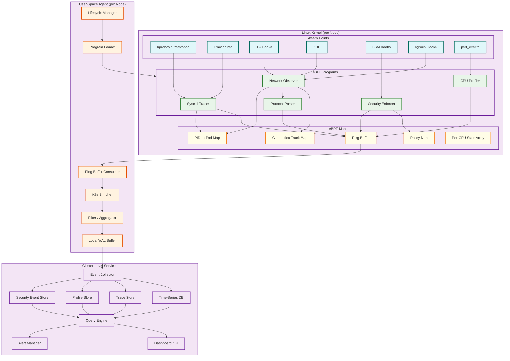
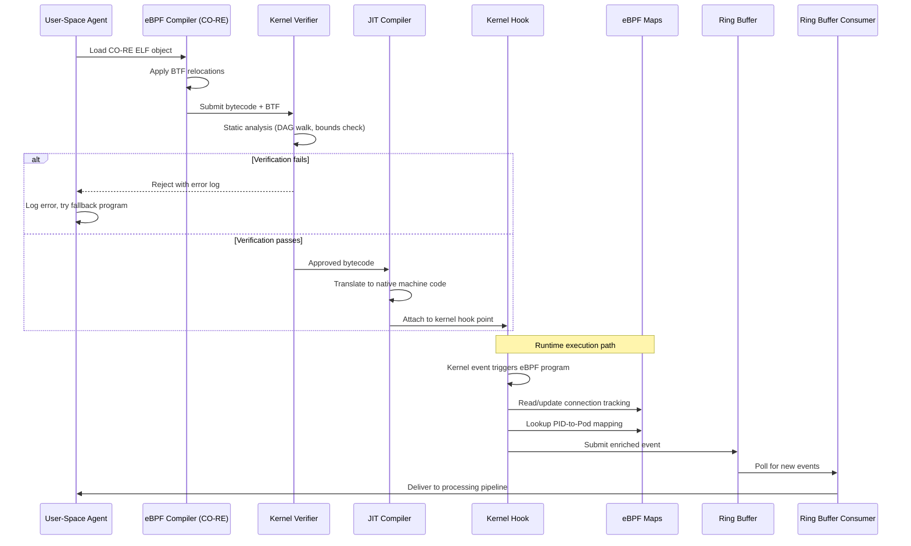
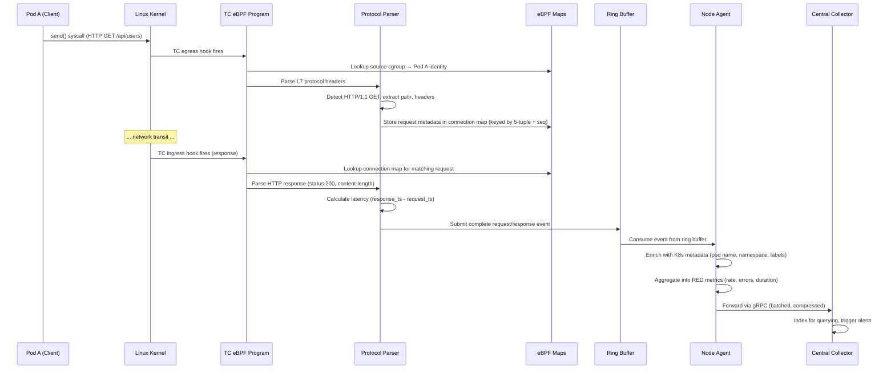

# High-Level Design — eBPF-based Observability Platform

## System Architecture

The platform follows a three-layer architecture: **kernel data plane** (eBPF programs attached to kernel hooks), **node-level control plane** (user-space agent managing eBPF lifecycle and event processing), and **cluster-level analytics plane** (central collectors, storage, and query engines).

---

## eBPF Program Lifecycle

---

## Data Flow: Network Request Observation

This sequence shows how a single HTTP request between two Kubernetes pods is captured, enriched, and delivered — all without any application instrumentation.

---

## Key Architectural Decisions

### 1. In-Kernel Filtering vs. User-Space Filtering

| Aspect | In-Kernel (Chosen) | User-Space |
|--------|-------------------|------------|
| **Volume reduction** | 10-100x before crossing kernel boundary | Full event volume crosses boundary |
| **CPU overhead** | Higher per-event eBPF cost, but far fewer events processed user-side | Lower per-event kernel cost, but massive user-space processing |
| **Flexibility** | Limited by verifier (no unbounded loops, 512B stack) | Arbitrary processing logic |
| **Latency** | Sub-microsecond filtering | Millisecond-scale (context switch + copy) |
| **Recommendation** | Filter aggressively in-kernel: drop uninteresting events, aggregate counters, pre-compute RED metrics | Only use for complex correlation that exceeds verifier limits |

### 2. Ring Buffer vs. Perf Buffer

| Aspect | Ring Buffer (Chosen) | Perf Buffer |
|--------|---------------------|-------------|
| **Memory efficiency** | Single shared buffer across all CPUs | Per-CPU buffers (N × buffer_size total) |
| **Event ordering** | Globally ordered (MPSC) | Per-CPU ordered; requires user-space merge |
| **Overhead (32-core node)** | ~7% CPU overhead | ~35% CPU overhead |
| **Kernel requirement** | Linux 5.8+ | Linux 4.x+ |
| **Back-pressure** | Atomic reserve/commit; events can be dropped with counter | Per-CPU watermarks; harder to detect global pressure |
| **Recommendation** | Use ring buffer for all event streaming; fall back to perf buffer only on pre-5.8 kernels |

### 3. CO-RE vs. Per-Kernel Compilation

| Aspect | CO-RE (Chosen) | Per-Kernel Compilation |
|--------|---------------|----------------------|
| **Portability** | Single binary runs across kernel versions (with BTF) | Must compile on each target kernel |
| **Build complexity** | Compile once with target-agnostic headers | Requires kernel headers on every node |
| **Runtime cost** | BTF relocation at load time (negligible) | Full compilation at load time (seconds) |
| **Kernel requirement** | BTF-enabled kernel (5.2+, most distros since 2020) | Any kernel with headers |
| **Recommendation** | CO-RE as primary path; ship pre-compiled fallbacks for known non-BTF kernels |

### 4. Push vs. Pull for Event Delivery

| Aspect | Push (Chosen) | Pull |
|--------|--------------|------|
| **Freshness** | Events delivered within seconds of capture | Bounded by poll interval |
| **Back-pressure** | Requires flow control (agent buffers when collector is slow) | Collector controls consumption rate |
| **Network efficiency** | Batching + compression over persistent gRPC streams | HTTP polling overhead |
| **Failure handling** | Agent buffers locally during collector outage | Collector simply stops pulling |
| **Recommendation** | Push with flow control: persistent gRPC streams, local WAL buffer, exponential backoff on failure |

### 5. Synchronous vs. Asynchronous Security Enforcement

| Aspect | Synchronous In-Kernel (Chosen for enforcement) | Async User-Space (for detection) |
|--------|-----------------------------------------------|----------------------------------|
| **Latency** | <10μs — decision made before syscall returns | Milliseconds — event reaches user space after syscall completes |
| **Blocking capability** | Can prevent the operation (kill process, deny syscall) | Can only alert; operation already completed |
| **Policy complexity** | Limited by eBPF constraints (no external lookups) | Arbitrary rule engines, ML models |
| **Use case** | Runtime enforcement: block unauthorized exec, file access | Behavioral detection: anomaly scoring, correlation |
| **Recommendation** | Layered approach: synchronous in-kernel enforcement for high-confidence policies, async user-space detection for complex behavioral analysis |

---

## Architecture Pattern Checklist

- [x] **Sync vs Async communication decided** — Synchronous in-kernel enforcement; async event streaming for observability
- [x] **Event-driven vs Request-response decided** — Event-driven: kernel events trigger eBPF programs; ring buffer delivers events asynchronously
- [x] **Push vs Pull model decided** — Push from agents to collectors via persistent gRPC streams
- [x] **Stateless vs Stateful services identified** — eBPF programs are stateless (maps provide shared state); agents are stateless (WAL provides durability); collectors are stateless behind a load balancer
- [x] **Read-heavy vs Write-heavy optimization applied** — Write-heavy: optimized for event ingestion throughput; read path is query-time aggregation
- [x] **Real-time vs Batch processing decided** — Real-time for event streaming and security; batch for profile aggregation and long-term analytics
- [x] **Edge vs Origin processing considered** — Heavy edge processing (in-kernel filtering, per-node aggregation) to minimize central load

---

## Component Interaction Summary

| Component | Inputs | Outputs | State |
|-----------|--------|---------|-------|
| eBPF Programs | Kernel events (syscalls, packets, scheduling) | Filtered events → ring buffer; map updates | Connection tracking maps, per-CPU counters |
| Node Agent | Ring buffer events, K8s API watch | Enriched events → collector; metrics → local Prometheus | K8s metadata cache, WAL buffer |
| Central Collector | gRPC event streams from all agents | Indexed events → storage backends | Deduplication state, routing rules |
| Time-Series DB | Aggregated metrics | Query results for dashboards | Metric time series with retention policies |
| Trace Store | Distributed trace spans | Trace queries, dependency graphs | Span storage with trace ID indexing |
| Profile Store | Compressed pprof profiles | Flame graph queries, diff profiles | Profile storage with time-range indexing |
| Security Event Store | Policy violation events | Security alerts, audit queries | Immutable audit log |
| Query Engine | User queries (PromQL, TraceQL, custom) | Aggregated results, visualizations | Query cache |
