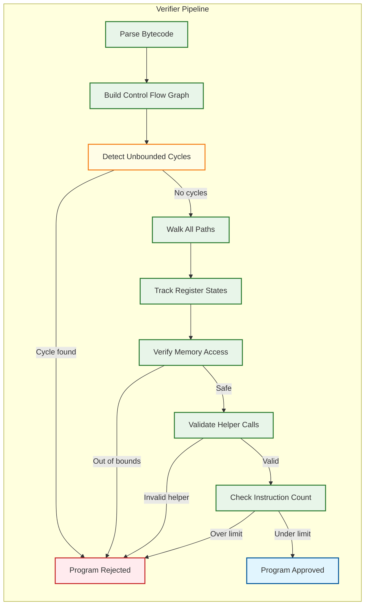

# Deep Dive & Bottlenecks — eBPF-based Observability Platform

## Critical Component 1: The eBPF Verifier — The Gatekeeper That Shapes Architecture

### Why It Is Critical

The eBPF verifier is the single most architecturally significant component in the entire platform. Every design decision — how protocol parsers are structured, how policies are evaluated, how data flows from kernel to user space — is constrained by what the verifier will accept. Unlike traditional software where you write code and handle errors at runtime, eBPF programs that fail verification simply do not load. The verifier is not a nice-to-have safety check; it is a hard compile-time gate that shapes the entire system architecture.

### How It Works Internally

The verifier performs a full static analysis of the eBPF bytecode before allowing it to execute in kernel context:

1. **DAG Construction:** The verifier builds a directed acyclic graph (DAG) of all possible execution paths. Any cycle that cannot be proven to terminate (unbounded loops) causes immediate rejection.

2. **State Tracking Per Path:** For each path through the program, the verifier tracks the state of all 10 registers (R0-R9) and the 512-byte stack. It knows whether each register holds a scalar value, a pointer to a map value, a pointer to the stack, a context pointer, or is uninitialized.

3. **Memory Safety Verification:** Every memory access is checked:
   - Pointer arithmetic must be within bounds
   - Map lookups return nullable pointers — the program must check for NULL before dereferencing
   - Stack accesses must be within the 512-byte limit
   - Context (ctx) access must be within the allowed range for the program type

4. **Helper Function Validation:** Each `bpf_helper_call` is validated against an allowlist for the program type. For example, `bpf_probe_read_kernel()` is allowed in kprobes but not in XDP programs.

5. **Instruction Limit Check:** The verifier counts the total number of instructions it must analyze across all paths. Prior to kernel 5.2, this limit was 4,096 instructions. Since kernel 5.2, it is 1 million verified instructions — but complex programs with many branches can cause exponential path explosion, hitting the limit even with modest source code.



### Failure Modes

| Failure | Cause | Impact |
|---------|-------|--------|
| **Instruction limit exceeded** | Complex protocol parser with many branches | Program cannot load; observability gap for that protocol |
| **Stack overflow** | Deep function nesting or large local variables | Program rejected; must refactor to use maps for large state |
| **Unbounded loop detected** | Loop without provable upper bound | Program rejected; must use `#pragma unroll` or bounded loop idiom |
| **Type mismatch** | Passing map value pointer where scalar expected | Program rejected; must add explicit casts or restructure |
| **Verifier OOM** | Extreme path explosion in complex programs | Verifier itself runs out of memory during analysis; program rejected |
| **Kernel version incompatibility** | Using helper not available in target kernel | Program fails to load on older kernels; must use CO-RE feature detection |

### How We Handle Failures

1. **Tail Call Decomposition:** Split complex programs into smaller programs chained via `bpf_tail_call()`. Each sub-program passes verification independently, and the chain provides the full logic. Maximum chain depth: 33 tail calls.

2. **Graduated Complexity:** Ship multiple variants of each eBPF program: a "full" version that uses advanced features, a "reduced" version with fewer protocol parsers, and a "minimal" version that captures only basic syscall events. The agent tries to load the full version; if verification fails, it falls back to reduced, then minimal.

3. **Verifier Log Analysis:** When verification fails, the verifier emits a detailed log explaining which instruction on which path failed. The agent captures this log and reports it as a structured error event, enabling operators to diagnose compatibility issues.

4. **Feature Probing:** Before loading programs, the agent probes for specific kernel features (BTF availability, ring buffer support, specific helper functions) by attempting to load minimal test programs. This builds a capability matrix that determines which program variants to load.

---

## Critical Component 2: Ring Buffer Back-Pressure and Event Ordering

### Why It Is Critical

The ring buffer is the sole conduit between the kernel data plane and user-space processing. Its behavior under load determines whether the platform degrades gracefully (sampling) or fails catastrophically (silent event loss). At 500K events/sec per node, the ring buffer must handle 4 GB/sec of event throughput with sub-microsecond per-event overhead.

### How It Works Internally

The BPF ring buffer (`BPF_MAP_TYPE_RINGBUF`, Linux 5.8+) is a multi-producer, single-consumer (MPSC) circular buffer:

1. **Reserve-Commit Protocol:**
   - Producer (eBPF program) calls `bpf_ringbuf_reserve(rb, size, 0)` to atomically reserve space
   - If space is available, returns a pointer to the reserved region
   - If buffer is full, returns NULL (event must be dropped)
   - Producer writes data to the reserved region
   - Producer calls `bpf_ringbuf_submit(data, 0)` to make the event visible to the consumer
   - Alternative: `bpf_ringbuf_discard(data, 0)` to release without submitting

2. **Atomic Ordering:** The reserve operation uses a compare-and-swap (CAS) on the producer position. Multiple CPUs can reserve concurrently. The consumer position advances only when all events up to that position have been committed (no holes).

3. **Memory Layout:** The buffer is backed by a contiguous memory region mapped as 2× the logical size (the second half is a mirror of the first) to avoid wrap-around checks during writes.

4. **Notification:** The consumer is notified via an epoll fd when new events are committed. The `BPF_RB_FORCE_WAKEUP` flag forces immediate notification; `BPF_RB_NO_WAKEUP` skips it (useful for batching).

### Failure Modes

| Failure | Cause | Symptom | Impact |
|---------|-------|---------|--------|
| **Buffer full** | Consumer too slow; burst of events exceeds capacity | `bpf_ringbuf_reserve()` returns NULL | Events silently dropped; drop counter increments |
| **Consumer stall** | Agent GC pause, CPU contention, or bug | Buffer fills, all new events dropped | Total observability blackout until consumer resumes |
| **Ordering anomaly** | Event reserved on CPU 0 but committed after CPU 1's event | Events appear out-of-order within the same ring buffer | Mild — user-space sort-merge within timestamp window fixes this |
| **Memory pressure** | Ring buffer mapped memory competes with application workloads | OOM killer may target the agent process | Ring buffer persists in kernel; agent restart recovers it |

### How We Handle Failures

1. **Adaptive Sampling (In-Kernel):** As described in Algorithm 4 (Low-Level Design), the eBPF programs monitor ring buffer fill level via a per-CPU stats map updated by the user-space agent. When fill exceeds 50%, non-critical events are sampled; above 90%, only security events pass.

2. **Prioritized Event Channels:** Critical events (security policy violations, enforcement actions) use a separate ring buffer with its own memory allocation. This ensures security observability is never sacrificed for high-volume network flow data.

3. **Consumer Parallelism:** The user-space agent runs multiple consumer threads — but the ring buffer is single-consumer. The solution is to use multiple ring buffers (one per event class) with a dedicated consumer thread per buffer.

4. **Ring Buffer Sizing:** Default ring buffer size is 64 MB per event class. For high-throughput nodes (>100K events/sec), auto-scale to 256 MB. The formula: `buffer_size = events_per_sec × avg_event_size × target_drain_interval × safety_factor` where target_drain_interval = 2 seconds and safety_factor = 4.

---

## Critical Component 3: Protocol Parsing Under Verifier Constraints

### Why It Is Critical

The zero-instrumentation promise depends on parsing application-layer protocols (HTTP, gRPC, DNS, Kafka, etc.) in kernel space. This is where the verifier's constraints are most acutely felt: protocol parsing inherently requires variable-length string processing, branching on dynamic content, and stateful tracking across packets — all things the verifier makes difficult.

### How It Works Internally

Protocol parsing in eBPF uses a combination of techniques:

1. **Signature-Based Detection:** Read the first few bytes of the TCP payload and match against known protocol signatures:
   - HTTP/1.x: `"GET "`, `"POST"`, `"PUT "`, `"HTTP"`
   - HTTP/2: Connection preface `"PRI * HTTP/2.0\r\n\r\nSM\r\n\r\n"`
   - gRPC: HTTP/2 with `content-type: application/grpc`
   - DNS: UDP port 53 with valid header structure
   - Kafka: API key in first 2 bytes with valid request structure

2. **Bounded Parsing:** All string/buffer operations use fixed upper bounds:
   ```
   // Verifier-safe bounded copy
   FOR i = 0 TO MAX_PATH_LENGTH - 1:
       IF offset + i >= payload_end:
           BREAK
       buf[i] = payload[offset + i]
       IF buf[i] == delimiter:
           BREAK
   ```

3. **Stateful Tracking via Maps:** Multi-packet protocols (HTTP/2 streams, gRPC calls) require state across packets. The connection tracking map stores per-connection state keyed by the 5-tuple, enabling correlation between request and response packets.

4. **TLS Inspection Without Decryption:** For encrypted traffic, the platform hooks into the kernel TLS layer (kTLS) or traces OpenSSL/BoringSSL library calls via uprobes to capture plaintext before encryption and after decryption — without breaking the TLS session.

### Key Challenges

| Challenge | Constraint | Solution |
|-----------|-----------|----------|
| **Variable-length headers** | Cannot use while loops to scan for `\r\n` | Unrolled fixed-bound loops (parse up to 128 bytes) |
| **Multi-packet requests** | eBPF sees individual packets, not streams | Connection map stores partial parse state; reassemble across packets |
| **HTTP/2 multiplexing** | Multiple streams in one connection; HPACK header compression | Track stream state per (connection, stream_id); limited HPACK decoding (static table only) |
| **gRPC framing** | Protobuf-encoded payloads require variable-length integer decoding | Only extract metadata (method, status); skip protobuf body parsing |
| **DNS compression** | DNS name compression uses backward pointers | Follow up to 4 pointer hops (bounded); reject deeper compression |

### Failure Modes

| Failure | Cause | Impact |
|---------|-------|--------|
| **Protocol misclassification** | Ambiguous payload signatures (binary protocol resembling HTTP bytes) | Garbled metrics for misclassified connections; mitigated by confidence scoring |
| **Partial parse** | Request split across packet boundary; first packet too small for detection | Connection shows as "unknown protocol" until enough data arrives |
| **Verifier rejection** | Parser too complex for a specific kernel version | Fallback to simpler parser that extracts fewer fields |
| **State map exhaustion** | Too many concurrent connections for the map size | Oldest entries evicted (LRU); partial request-response correlation loss |

---

## Concurrency & Race Conditions

### Race 1: PID-to-Pod Map Update Race

**Scenario:** A pod starts (container runtime assigns PIDs), the K8s informer notifies the agent, and the agent updates the PID-to-Pod map. But eBPF programs may capture events from the new PIDs before the map is updated.

**Impact:** Events from newly-started pods show as "unknown pod" for a brief window (typically 100-500ms).

**Mitigation:**
- The agent watches cgroup events via `BPF_PROG_TYPE_CGROUP_DEVICE` to detect new cgroups immediately (faster than K8s informer)
- Cgroup-to-pod mapping uses cgroup IDs (stable, assigned by kernel) rather than PIDs
- Events with unknown identity are buffered in user space and retroactively enriched when the mapping becomes available

### Race 2: Security Policy Update vs. Event Evaluation

**Scenario:** The operator updates a security policy (e.g., deny execution of `/bin/curl`). The agent updates the policy map. But between the map update and the next event, a process may have already started executing.

**Impact:** A window of 1-10ms where the old policy is still enforced.

**Mitigation:**
- Policy map updates are atomic (single `bpf_map_update_elem` call)
- For critical policies, the agent first adds the deny entry, then removes any allow entry (deny-before-allow ordering)
- Accept the inherent race: eBPF operates at syscall granularity, not at instruction granularity. A process that started before the policy update completes its current syscall under the old policy; the next syscall is caught.

### Race 3: Ring Buffer Producer-Consumer Race

**Scenario:** An eBPF program reserves space in the ring buffer, but is preempted before calling `bpf_ringbuf_submit()`. The consumer sees a "hole" in the buffer.

**Impact:** The consumer cannot advance past the uncommitted entry, potentially stalling event delivery.

**Mitigation:**
- The kernel's ring buffer implementation handles this: the consumer waits for all entries up to the current position to be committed. Preempted producers complete their commit when rescheduled.
- If a producer is preempted for an extended period (rare: would require the CPU to be entirely consumed by higher-priority work), the ring buffer may appear "stuck" to the consumer. The user-space agent monitors ring buffer drain rate and alerts on stalls.

---

## Bottleneck Analysis

### Bottleneck 1: Map Lookup Contention on Hot Maps

**Description:** The connection tracking map is accessed by every network eBPF program on every packet. On a 32-core node processing 1M packets/sec, this map receives 1M lookups/sec — all serialized through the hash map's per-bucket spinlock.

**Impact:** Under high contention, map lookup latency increases from ~100ns to ~500ns-1μs, adding measurable overhead to packet processing.

**Mitigation Strategies:**
- **Per-CPU hash maps (`BPF_MAP_TYPE_PERCPU_HASH`):** Each CPU has its own copy of the map. Eliminates cross-CPU contention but increases memory by Nx and complicates cross-CPU connection tracking.
- **Lock-free LRU maps (`BPF_MAP_TYPE_LRU_HASH`):** Built-in LRU eviction with per-bucket locks. Better for connection tracking where old entries should be evicted.
- **Map sharding:** Use multiple smaller maps with a hash-based routing function to distribute load. E.g., 4 maps of 64K entries each instead of 1 map of 256K entries.
- **Chosen approach:** LRU hash map with map sharding (4 shards), reducing per-shard contention by 4x while maintaining bounded memory.

### Bottleneck 2: User-Space Event Processing Throughput

**Description:** The ring buffer consumer must deserialize, enrich (K8s metadata lookup), aggregate, and buffer events for forwarding. At 50K events/sec per node, the consumer has a budget of 20μs per event.

**Impact:** If processing exceeds 20μs/event average, the ring buffer fills and events are dropped.

**Mitigation Strategies:**
- **Batch processing:** Read events from the ring buffer in batches of 256-1024 using `ring_buffer__consume()`. Amortizes epoll/syscall overhead.
- **Zero-copy processing:** The ring buffer consumer receives a pointer to the kernel-mapped memory. Process events in-place without copying to a separate buffer.
- **Pre-computed enrichment:** The K8s metadata cache is a simple hash map (cgroup_id → pod_identity) kept in agent memory. Lookup is O(1) with no serialization.
- **Parallel aggregation:** Use lock-free concurrent data structures for metric aggregation. Multiple consumer threads for different ring buffers aggregate into per-thread accumulators that merge every flush interval.

### Bottleneck 3: Collector Ingestion Fan-In

**Description:** 1,000 nodes each pushing 5-50 MB/s of events to the central collector creates a fan-in of 5-50 GB/s aggregate bandwidth.

**Impact:** Collector becomes a bottleneck if not horizontally scaled; network bandwidth between nodes and collector may saturate.

**Mitigation Strategies:**
- **Hierarchical collection:** Deploy regional collectors (1 per rack or availability zone) that aggregate and pre-process events before forwarding to the central collector. Reduces fan-in by 10-50x.
- **Edge aggregation:** Agents compute aggregated metrics (RED metrics per service pair, per minute) locally and send only aggregated counters, not raw events. Raw events are sent only for sampled traces and security events.
- **Protocol compression:** ZSTD compression on the gRPC stream reduces bandwidth by 5-10x for structured event data.
- **Flow control:** The collector's `StreamAck` includes a `back_pressure_signal`. When the collector is overloaded, agents reduce their sending rate and buffer locally (WAL-backed, up to 1 hour of events).
