# Scalability & Reliability — eBPF-based Observability Platform

## Scalability

### Horizontal vs. Vertical Scaling

| Component | Scaling Strategy | Rationale |
|-----------|-----------------|-----------|
| eBPF data plane (per-node) | **Vertical (per-node capacity)** | eBPF programs run on every node; more powerful nodes generate more events but also have more CPU for eBPF overhead |
| Node agent | **Vertical** | One agent per node; scale by increasing ring buffer size and consumer thread count |
| Regional collector | **Horizontal** | Stateless; add more collector instances behind a load balancer per region |
| Central collector | **Horizontal** | Partition by event type (metrics/traces/profiles/security) for independent scaling |
| Time-series DB | **Horizontal (sharding)** | Shard by metric name hash; each shard handles a subset of time series |
| Trace store | **Horizontal (sharding)** | Shard by trace_id; all spans of a trace land on the same shard |
| Profile store | **Horizontal (time-partitioned)** | Partition by time window; each partition is independently queryable |
| Query engine | **Horizontal** | Stateless query workers; auto-scale based on query QPS |

### Auto-Scaling Triggers

| Component | Metric | Scale-Up Threshold | Scale-Down Threshold | Cooldown |
|-----------|--------|-------------------|----------------------|----------|
| Regional collector | CPU utilization | >70% for 3 min | <30% for 10 min | 5 min |
| Regional collector | gRPC queue depth | >10K pending | <1K pending | 5 min |
| Central collector | Ingestion lag (newest event age) | >30s | <5s | 5 min |
| Query engine | Query latency p99 | >5s | <1s | 3 min |
| Profile store | Write throughput | >80% capacity | <40% capacity | 10 min |

### Database Scaling Strategy

#### Time-Series Data (Metrics)

- **Write path:** Events are pre-aggregated by the node agent into 1-minute windows. Each agent emits ~1,000 unique time series (service pairs × metric types). Across 1,000 nodes: 1M active time series.
- **Sharding:** Hash-based sharding on `metric_name + label_set_hash`. 16 shards provide even distribution.
- **Read replicas:** 2 read replicas per shard for dashboard queries. Dashboard queries are read-heavy (100:1 read:write ratio on the query path).
- **Compaction:** Time-series data is compacted from per-second resolution to 1-minute after 3 days, 5-minute after 30 days.

#### Trace Data

- **Write path:** Sampled traces (1-10% of traffic depending on configuration) are written as spans indexed by `trace_id`.
- **Sharding:** Hash on `trace_id` ensures all spans of a trace are co-located.
- **TTL-based eviction:** Trace data expires after 7 days (hot tier) + 30 days (warm tier, compressed).

#### Profile Data

- **Write path:** Aggregated profiles (one per 10-second window per node per profile type) are written as compressed pprof-format blobs.
- **Time-partitioned:** Each hour is a separate partition. Queries specify a time range, and only relevant partitions are scanned.
- **Stack trace deduplication:** Unique stack traces are stored in a content-addressed store (keyed by hash). Profile samples reference stack hashes, reducing storage by 10-100x.

### Caching Layers

| Layer | What Is Cached | Size | TTL | Invalidation |
|-------|---------------|------|-----|-------------|
| L1: Node agent | K8s pod metadata (cgroup_id → pod_identity) | 10-50 MB | Until pod deletion event | K8s API watch stream |
| L1: Node agent | Recently seen connection states | 50-200 MB | 30 seconds (LRU) | Auto-eviction |
| L2: Query engine | Frequently queried metric aggregations | 1-10 GB | 60 seconds | Time-based; cache-aside |
| L2: Query engine | Profile flame graph renders (pre-computed) | 500 MB | 10 minutes | Time-based |
| L3: Dashboard | Pre-rendered dashboard panels | Per-user browser cache | 15 seconds (auto-refresh) | Polling |

### Hot Spot Mitigation

| Hot Spot | Description | Mitigation |
|----------|-------------|------------|
| **Noisy neighbor pod** | One pod generates 10x more events than others, dominating ring buffer | Per-pod rate limiting in eBPF: a per-cgroup counter map limits events/sec per pod |
| **High-cardinality labels** | Service emitting unique request IDs as metric labels → cardinality explosion | Agent-side label sanitization: drop labels with >1000 unique values per minute |
| **Query of death** | Unbounded query scanning all time series across all shards | Query complexity analysis: reject queries with estimated cost >10M data points; require time range <24h for high-cardinality queries |
| **Profile sampling storm** | Runaway process consuming 100% CPU → every sample hits the same stack | In-kernel deduplication: the profile aggregation map counts occurrences per (pid, stack_hash), so 100% single-stack CPU still produces one map entry |

---

## Reliability & Fault Tolerance

### Single Points of Failure (SPOF) Identification

| Component | SPOF? | Mitigation |
|-----------|-------|------------|
| eBPF data plane | No — runs in each node's kernel independently | Self-healing: programs persist across agent restarts |
| Node agent | **Partial** — agent crash stops event forwarding | eBPF programs and maps persist in kernel; agent restart (<10s) resumes collection. WAL buffer on disk survives crashes |
| Regional collector | No — multiple stateless instances behind LB | Health-check-based failover; agents retry on next collector |
| Central collector | No — horizontally scaled and sharded | Per-shard failover; cross-region replication for DR |
| K8s API server (for metadata) | No — standard K8s HA setup | Agent caches metadata locally; operates with stale cache during API server outage |

### Redundancy Strategy

#### Data Plane Redundancy

- **eBPF program pinning:** Programs and maps are pinned to the BPF filesystem (`/sys/fs/bpf/`). If the agent crashes, the eBPF programs continue running in the kernel, writing events to the ring buffer. When the agent restarts, it re-attaches to the pinned programs and ring buffers, resuming event consumption from where it left off (events accumulated during the restart window are consumed in a burst).

- **Dual ring buffers:** For security events, maintain a primary and a secondary ring buffer. The primary feeds the normal event pipeline; the secondary is consumed only when the primary's consumer is down. This provides defense-in-depth against consumer stalls.

#### Control Plane Redundancy

- **Policy replication:** Security policy maps are written to the BPF filesystem. If the agent crashes, the in-kernel policies remain active — no enforcement gap during restart.

- **Configuration checkpointing:** The agent persists its configuration (which programs to load, map sizes, sampling rates) to local disk. On restart, it replays the configuration without needing to contact the central management server.

### Failover Mechanisms

```mermaid
flowchart TB
    subgraph Normal["Normal Operation"]
        AGENT[Node Agent] -->|gRPC stream| RC[Regional Collector]
        RC --> CC[Central Collector]
    end

    subgraph AgentFailure["Agent Crash Recovery"]
        KERNEL[eBPF Programs<br>Continue Running] --> RB[Ring Buffer<br>Accumulates Events]
        RB --> RESTART[Agent Restarts<br>in less than 10s]
        RESTART --> DRAIN[Drain Accumulated<br>Ring Buffer Events]
        DRAIN --> RC2[Resume Streaming<br>to Collector]
    end

    subgraph CollectorFailure["Collector Unavailable"]
        AGENT2[Node Agent] -->|Connection fails| WAL[Write to Local<br>WAL Buffer]
        WAL -->|Retry with backoff| RC3[Regional Collector<br>Recovers]
        WAL -->|Buffer full after 1h| SAMPLE[Switch to<br>Sampling Mode]
    end

    classDef normal fill:#e8f5e9,stroke:#2e7d32,stroke-width:2px
    classDef failure fill:#fff3e0,stroke:#e65100,stroke-width:2px
    classDef recovery fill:#e1f5fe,stroke:#01579b,stroke-width:2px

    class AGENT,RC,CC normal
    class KERNEL,RB,AGENT2,WAL failure
    class RESTART,DRAIN,RC2,RC3,SAMPLE recovery
```



### Circuit Breaker Patterns

| Circuit | Trigger (Open) | Recovery (Half-Open) | Close |
|---------|---------------|---------------------|-------|
| Agent → Collector | 3 consecutive connection failures or p99 latency >5s | Try 1 request every 30s | 3 consecutive successes |
| Agent → K8s API | 5 failures in 60s | Try 1 list/watch every 60s | Successful re-watch |
| Collector → Storage | Write latency >2s for 30s | Reduced write rate (50%) for 60s | Latency <500ms for 60s |

### Retry Strategies

| Operation | Strategy | Max Retries | Backoff |
|-----------|----------|-------------|---------|
| Agent → Collector (event batch) | Exponential backoff with jitter | Unlimited (WAL-backed) | 1s, 2s, 4s, 8s, 16s, max 60s |
| Agent → K8s API (watch reconnect) | Exponential backoff | 10, then full re-list | 1s, 2s, 4s, 8s, max 30s |
| eBPF program load (after verification failure) | Graduated fallback | 3 (full → reduced → minimal) | Immediate (different program, not retry) |
| Profile upload | Fixed interval retry | 5 | 10s fixed |

### Graceful Degradation

| Condition | Degradation Mode | User Impact |
|-----------|-----------------|-------------|
| Collector unavailable | Agent buffers locally (WAL, up to 1 hour) | Dashboard shows stale data; no data loss |
| WAL buffer full | Switch to sampling (10% of non-security events) | Reduced metric accuracy; security events preserved |
| Kernel lacks BTF | Load pre-compiled fallback programs (no CO-RE) | Reduced protocol parsing; basic syscall tracing only |
| Ring buffer contention | Adaptive sampling kicks in | Lower event volume; counters track sampling ratio |
| K8s API unavailable | Use cached metadata (stale) | Pod names may be stale for recently-changed pods |

### Bulkhead Pattern

- **Event type isolation:** Separate ring buffers, consumer threads, and collector channels for: (1) network flows, (2) syscall traces, (3) security events, (4) profiles. A burst in network flow events cannot starve security event processing.
- **Per-node resource isolation:** Each agent is deployed as a DaemonSet with resource limits (CPU: 500m, memory: 512 MB). The agent cannot consume more than its allocated share, preventing it from impacting application workloads.
- **Per-pod event budgets:** eBPF programs enforce per-cgroup event rate limits. A runaway pod generating millions of events/sec cannot fill the ring buffer and cause observability loss for other pods on the same node.

---

## Disaster Recovery

### RTO / RPO

| Data Type | RTO (Recovery Time Objective) | RPO (Recovery Point Objective) |
|-----------|-------------------------------|-------------------------------|
| Real-time event streaming | 10 seconds (agent restart) | 0 (eBPF programs persist; ring buffer retains events during restart) |
| Historical metrics | 30 minutes (restore from replica) | 1 minute (replication lag) |
| Trace data | 1 hour (restore from backup) | 5 minutes (batch backup interval) |
| Security audit events | 15 minutes (restore from replica) | 0 (synchronous replication for audit events) |
| Profile data | 2 hours (restore from backup) | 10 minutes (batch backup interval) |

### Backup Strategy

- **Metrics:** Continuous replication to a standby time-series cluster in a secondary region. Daily snapshots to object storage.
- **Traces:** Hourly batch export to object storage (compressed). Recent traces (last 24h) are replicated synchronously.
- **Profiles:** Daily batch export to object storage. No real-time replication (profiles are regenerable from raw data).
- **Security events:** Synchronous replication to secondary region (guaranteed delivery). Immutable append-only log with cryptographic chaining for tamper evidence.

### Multi-Region Considerations

- **eBPF data plane and agents:** Run independently in each region. No cross-region dependency for event capture.
- **Collector:** Each region has its own collector cluster. Cross-region query federation allows querying metrics/traces across regions from a single dashboard.
- **Storage:** Active-active for metrics (each region writes independently). Active-passive for security audit logs (single source of truth with synchronous replication).
- **Kernel compatibility:** Different regions may run different kernel versions. CO-RE ensures the same eBPF programs work across kernel versions, but the agent's feature probe results may differ per region.

---

## Kernel Compatibility Management

### Version Matrix Management

The platform maintains a kernel compatibility matrix that maps kernel versions to available eBPF features:

| Feature | Kernel 4.15-4.x | Kernel 5.0-5.7 | Kernel 5.8-5.15 | Kernel 5.16-6.x | Kernel 6.1+ |
|---------|-----------------|----------------|-----------------|-----------------|-------------|
| kprobes/tracepoints | Yes | Yes | Yes | Yes | Yes |
| BTF/CO-RE | No | Partial (5.2+) | Yes | Yes | Yes |
| Ring buffer | No | No | Yes | Yes | Yes |
| LSM hooks | No | No (5.7 partial) | Yes | Yes | Yes |
| Bloom filter map | No | No | No | Yes (5.16+) | Yes |
| User ring buffer | No | No | No | No | Yes |
| BPF arena | No | No | No | No | Partial (6.9+) |

### Graduated Feature Deployment

```
FUNCTION determine_program_suite(kernel_version, btf_available, features):
    IF btf_available AND kernel_version >= 5.8:
        // Full suite: CO-RE programs with ring buffer
        RETURN FULL_SUITE

    IF btf_available AND kernel_version >= 5.2:
        // Reduced: CO-RE programs with perf buffer fallback
        RETURN REDUCED_SUITE

    IF kernel_version >= 4.15:
        // Minimal: Pre-compiled programs, basic tracing only
        RETURN MINIMAL_SUITE

    // Too old: agent runs in passive mode (no eBPF)
    RETURN PASSIVE_MODE
```
