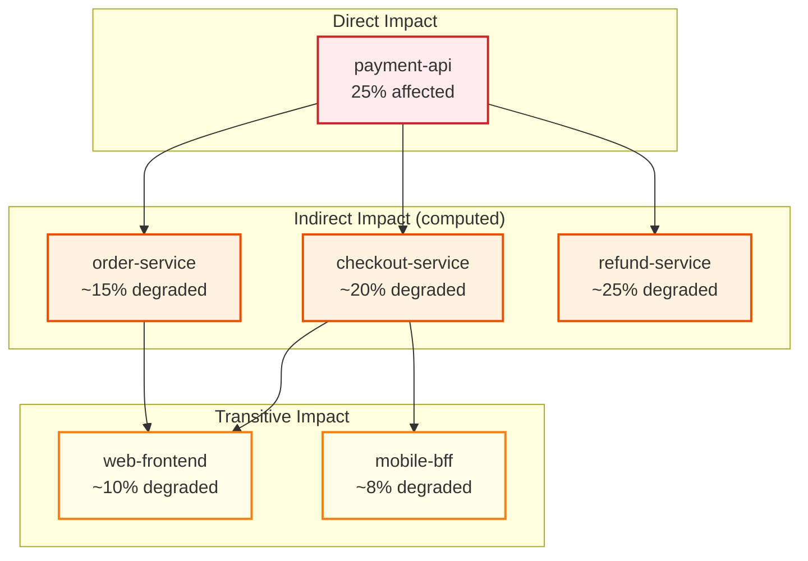
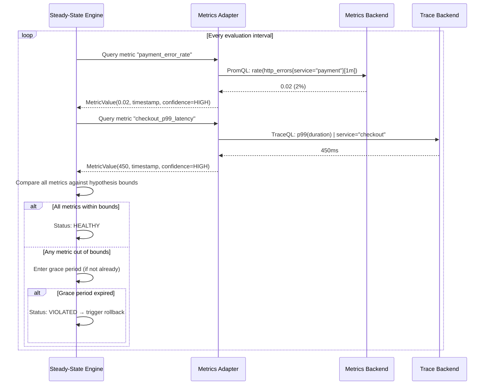
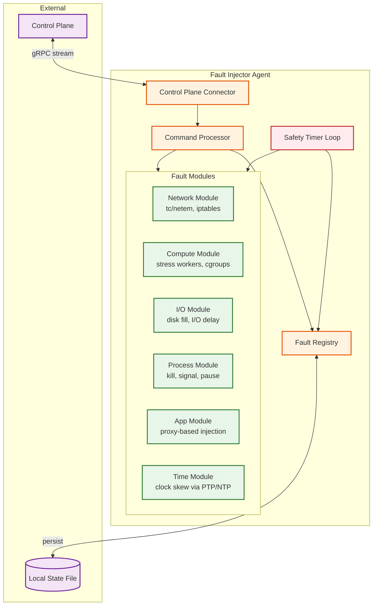

# Deep Dive & Bottlenecks — Chaos Engineering Platform

## Critical Component 1: Blast Radius Controller — The Safety Gate

### Why It Is Critical

The Blast Radius Controller (BRC) is the single most safety-critical component in the platform. Every experiment must pass through it before any fault is injected. A bug in the BRC — allowing an experiment that affects 100% of a service's instances when the limit is 10% — directly causes a production outage. Unlike most system design components where bugs cause degraded performance or data inconsistency, a BRC bug causes the exact harm the platform exists to prevent.

### How It Works Internally

The BRC operates in three phases:

**Phase 1: Target Resolution**

The experiment definition specifies targets using selectors (label queries, service names, host groups), not individual hosts. The BRC resolves these selectors against the current infrastructure state:

```
Selector: service = "payment-api", region = "us-east-1"
Resolved: [host-101, host-102, host-103, ..., host-120]  (20 instances)

target_percentage = 25%
Selected targets: [host-103, host-107, host-112, host-119]  (5 instances)
```

**Phase 2: Dependency Graph Traversal**

A fault on the payment-api doesn't just affect payment-api. Every service that calls payment-api will experience elevated error rates or latency. The BRC traverses the service dependency graph (maintained by the observability platform or a service mesh) to compute the indirect blast radius:



**Phase 3: Constraint Validation**

The computed blast radius (direct + indirect) is checked against all active guardrails and against all currently-running experiments. This check must be atomic — two experiments submitted simultaneously must not both pass validation if their combined blast radius exceeds limits.

### Concurrency Hazard: The TOCTOU Problem

The BRC faces a classic Time-of-Check-Time-of-Use (TOCTOU) race:

1. Experiment A checks: "Is payment-api available for chaos?" → Yes (no active experiments)
2. Experiment B checks: "Is payment-api available for chaos?" → Yes (A hasn't started yet)
3. Both A and B start injecting faults on payment-api → combined blast radius exceeds limits

**Solution:** The BRC uses a "reserve-then-inject" protocol with a distributed lock:

```
FUNCTION reserve_blast_radius(experiment):
    ACQUIRE LOCK("blast_radius_global")
    TRY:
        active = load_all_active_reservations()
        combined = merge(active, experiment.blast_radius)
        IF combined violates any guardrail:
            RETURN REJECTED
        store_reservation(experiment.id, experiment.blast_radius, ttl = experiment.duration + buffer)
        RETURN APPROVED
    FINALLY:
        RELEASE LOCK("blast_radius_global")
```

The reservation has a TTL: if the experiment doesn't start within the TTL or finishes early, the reservation is automatically released. This prevents abandoned reservations from permanently blocking targets.

### Bottleneck: Dependency Graph Freshness

The service dependency graph changes as services are deployed, scaled, or decommissioned. A stale dependency graph means the BRC may underestimate the blast radius (dangerous) or overestimate it (overly conservative). The BRC must balance between:

- **Real-time graph:** Query the service mesh/observability system for the current graph at each BRC call. Accurate but adds 100-500ms latency to every experiment submission.
- **Cached graph:** Refresh every N minutes. Fast but may miss recent topology changes.
- **Chosen approach:** Cache with event-driven invalidation. The dependency graph is cached but invalidated on deployment events (new service version, scaling event, service registration change). Staleness window: typically <60 seconds.

---

## Critical Component 2: Steady-State Hypothesis Engine — The Decision Maker

### Why It Is Critical

The Steady-State Hypothesis Engine (SSHE) determines whether the system is tolerating the injected fault or falling apart. A false negative (system is failing but SSHE says "healthy") means the experiment continues when it should abort, potentially causing customer impact. A false positive (system is fine but SSHE says "violated") means the experiment aborts prematurely, wasting engineering time and reducing chaos coverage.

### The Metric Query Pipeline

The SSHE doesn't collect its own metrics — it queries existing observability systems (metrics backends, trace backends). This creates a critical dependency chain:



### The Grace Period Problem

Distributed systems exhibit transient metric spikes that don't represent real problems. A garbage collection pause, a single slow request, or a metrics pipeline hiccup can briefly push a metric outside hypothesis bounds. Without a grace period, the SSHE would trigger false rollbacks constantly.

But the grace period introduces a new risk: if the grace period is too long, a real problem persists for the full grace period before rollback begins. The system is experiencing real customer impact during this window.

**Tuning the grace period is a safety vs. noise trade-off:**

| Grace Period | False Rollbacks | Impact During Real Violations |
|-------------|-----------------|------------------------------|
| 0 seconds | Very high (every transient spike) | Zero (immediate rollback) |
| 10 seconds | Low | 10 seconds of customer impact |
| 30 seconds | Very low | 30 seconds of customer impact |
| 60 seconds | Near zero | 60 seconds — unacceptable for many services |

**Recommended approach:** Adaptive grace period based on metric volatility. Measure the metric's standard deviation during the baseline phase. If the metric is normally volatile (high σ), use a longer grace period. If the metric is normally stable (low σ), use a shorter grace period.

### Bottleneck: Observability System Under Chaos

A subtle but devastating failure mode: what happens when the chaos experiment targets an observability system component? If the experiment injects latency into the metrics database, the SSHE's metric queries slow down or fail. The SSHE cannot evaluate the hypothesis. Without hypothesis evaluation, the platform cannot determine whether to continue or abort.

**Defense:** The SSHE tracks query failures independently from hypothesis violations. After N consecutive query failures (configurable, default: 3), the SSHE triggers an automatic abort — not because the hypothesis was violated, but because it cannot be evaluated. This is the "fail-safe" principle: when the safety mechanism cannot function, halt the operation.

---

## Critical Component 3: Fault Injector Agent — The Executor

### Why It Is Critical

The agent runs on every target host and is the only component that physically injects and reverts faults. An agent that fails to revert a fault leaves the target in a degraded state. An agent that applies the wrong fault (or applies a fault to the wrong target) causes unintended damage. The agent must be among the most reliable components in the entire infrastructure.

### Agent Architecture



### The Revert-Before-Inject Pattern

The most critical safety pattern in the agent: **store the revert command before applying the fault.** If the agent crashes after injecting a fault but before recording how to revert it, the fault becomes permanent (orphaned).

```
// WRONG: inject first, then record
inject_fault(params)           // Agent crashes here
store_revert(params.fault_id)  // Never executed — fault is orphaned

// CORRECT: record first, then inject
store_revert(params.fault_id, revert_command)  // Persisted to disk
inject_fault(params)                            // If crash here, restart will revert
```

On agent startup, the first action is to check the local fault registry (persisted to disk). Any registered faults that should have expired (based on their safety timeout) are immediately reverted. This ensures that an agent crash-restart cycle always recovers to a clean state.

### Bottleneck: Concurrent Fault Application

When multiple experiments target the same host, the agent must apply faults without interference. Two network latency faults targeting different ports can coexist (separate tc rules). But two network latency faults targeting the same port will conflict. The agent must:

1. Detect conflicting fault requests
2. Reject the conflicting request (push the decision back to the BRC)
3. Never silently merge faults (e.g., applying 100ms + 200ms as 300ms)

---

## Race Conditions in Concurrent Experiments

### Race 1: Simultaneous Blast Radius Checks

**Described above** in the BRC section. Solved with distributed locking + reservation TTL.

### Race 2: Rollback During Escalation

A multi-step scenario is escalating (Step 2 starting) while the SSHE triggers rollback (Step 1 metrics violated). The orchestrator receives two conflicting signals:
- "Proceed to Step 2" (from the scenario scheduler)
- "Abort and rollback" (from the SSHE)

**Solution:** The SSHE's abort signal has absolute priority. The orchestrator uses a compare-and-swap on the experiment state: it only transitions to the next step if the current state is still "running." If the SSHE has already transitioned it to "rolling_back," the escalation attempt is a no-op.

### Race 3: Agent Autonomous Revert vs. Orchestrator Revert

The agent's safety timer triggers a local revert at the same moment the orchestrator sends a revert command. Both attempt to revert the same fault.

**Solution:** Fault reversion is idempotent. The network latency rule is removed regardless of how many times the revert is called. The agent sends an acknowledgment for whichever revert source triggered first, and subsequent revert commands are acknowledged as "already reverted."

### Race 4: Experiment Completion vs. New Experiment on Same Target

Experiment A is completing (reverting faults), and Experiment B starts (injecting faults on the same target). If A's revert runs after B's inject, B's fault is inadvertently removed.

**Solution:** Fault rules are tagged with experiment IDs. The revert command specifies "revert faults for experiment A" — it does not blindly clear all network rules. Each tc rule, iptables entry, or cgroup constraint is labeled with the experiment that created it.

---

## Bottleneck Analysis

| Bottleneck | Symptom | Root Cause | Mitigation |
|-----------|---------|------------|------------|
| Blast radius lock contention | High-concurrency experiment submissions slow down | Global lock for blast radius validation | Partition lock by service group; most experiments don't overlap |
| Observability query latency | SSHE evaluation interval exceeds target | Metrics backend under load or under chaos | Dedicated metrics endpoint for SSHE with priority queuing; circuit breaker on query timeout |
| Agent heartbeat storm | Control plane overwhelmed during large-scale experiments | Thousands of agents heartbeating simultaneously | Jittered heartbeat intervals; agent-side batching |
| Dependency graph staleness | BRC underestimates blast radius | Service topology changed since last graph refresh | Event-driven invalidation on deployment events; pessimistic estimation for unknown edges |
| Command queue backlog | Fault injection delayed | Many experiments starting simultaneously | Priority queue (rollback > inject); horizontal scaling of queue consumers |
| Audit log write amplification | Database write pressure during GameDays | Every state transition, every agent ACK generates an audit event | Batch audit writes; async audit log with WAL |
