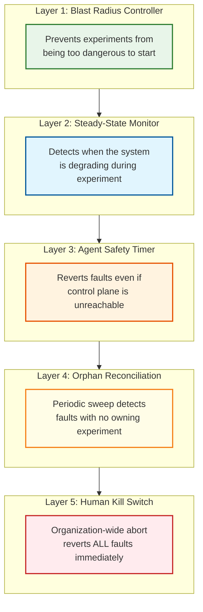

# Scalability & Reliability — Chaos Engineering Platform

## Scalability

### Horizontal vs. Vertical Scaling

| Component | Scaling Strategy | Rationale |
|-----------|-----------------|-----------|
| Experiment API | **Horizontal** | Stateless HTTP servers behind a load balancer; add instances for more concurrent users/CI pipelines |
| Experiment Orchestrator | **Vertical (leader)** | Single-leader with standby replicas; leader handles all state transitions for consistency |
| Blast Radius Controller | **Vertical (leader)** | Must maintain global view of active experiments; single authority for blast radius decisions |
| Steady-State Monitor | **Horizontal (partitioned)** | Partition by experiment — each SSM instance monitors a subset of experiments |
| Command Queue | **Horizontal** | Partitioned by agent group or region; independent scaling per partition |
| Fault Injector Agents | **Scale with infrastructure** | One agent per host; agents scale linearly with infrastructure size |
| Dashboard & Reporting | **Horizontal** | Stateless; scale based on user traffic |
| Audit Log | **Horizontal (append-only)** | Partitioned by time; write-optimized append-only stores |

### Auto-Scaling Triggers

| Component | Metric | Scale-Up Threshold | Scale-Down Threshold | Cooldown |
|-----------|--------|-------------------|----------------------|----------|
| Experiment API | Request latency p99 | >1s for 3 min | <200ms for 10 min | 5 min |
| SSM instances | Experiments per SSM | >20 concurrent | <5 concurrent | 10 min |
| Command queue consumers | Queue depth | >1,000 pending | <100 pending | 5 min |
| Dashboard | CPU utilization | >70% for 3 min | <30% for 10 min | 5 min |

### Scaling the Agent Fleet

The agent fleet scales linearly with infrastructure. Key design decisions for operating at scale:

**Agent Registration:** Agents self-register with the control plane on startup. Registration is idempotent (re-registering an existing agent updates its metadata). The control plane does not maintain a pre-configured list of agents — it discovers agents dynamically.

**Heartbeat Optimization:** With 5,000 agents heartbeating every 60 seconds, the control plane receives ~83 heartbeats/second — trivial. But during a GameDay with 50,000 agents across multiple environments, this becomes ~833/second. Optimizations:

| Strategy | Description | Benefit |
|----------|-------------|---------|
| Jittered intervals | Each agent heartbeats at 60s ± random(0-15s) | Prevents thundering herd |
| Regional aggregation | Regional proxies aggregate heartbeats before forwarding | Reduces cross-region traffic |
| Conditional heartbeat | Agent sends heartbeat only if state changed or interval elapsed | Reduces volume by ~50% during quiet periods |
| Batch health reporting | Control plane processes heartbeats in batches of 100 | Amortizes DB write overhead |

**Agent Upgrade:** Rolling upgrades across thousands of agents must not disrupt active experiments. The upgrade process:

1. Drain: agent stops accepting new experiments (existing faults continue)
2. Quiesce: wait for active experiments on this agent to complete or be migrated
3. Upgrade: replace binary, restart agent
4. Verify: agent re-registers, confirms no orphaned faults
5. Re-enable: agent accepts new experiments

### Scaling Experiments

| Scale Level | Concurrent Experiments | Agents Involved | Design Consideration |
|-------------|----------------------|-----------------|---------------------|
| Small (startup) | 1-5 | 10-50 | Single orchestrator, in-memory state, embedded SSM |
| Medium (enterprise) | 10-50 | 100-5,000 | Leader-elected orchestrator, DB-backed state, partitioned SSM |
| Large (hyperscale) | 50-200 | 5,000-50,000 | Regional orchestrators with global coordination, federated blast radius, hierarchical agent management |
| GameDay (burst) | 20-100 simultaneous | 1,000-10,000 | Pre-allocated capacity, pre-validated blast radius, dedicated SSM pool |

### Caching Layers

| Layer | What Is Cached | Size | TTL | Invalidation |
|-------|---------------|------|-----|-------------|
| BRC: dependency graph | Service dependency edges | 10-50 MB | 5 min | Event-driven (deployment, scaling) |
| BRC: active experiments | Current blast radius reservations | 1-10 MB | Real-time | Immediately on experiment state change |
| SSM: metric baselines | Pre-experiment metric values | 1-5 MB | Duration of experiment | Cleared on experiment completion |
| SSM: query results | Recent metric query results | 10-50 MB | 5-10 seconds | Time-based (stale data is dangerous) |
| API: experiment templates | Library of pre-built experiments | 5-20 MB | 1 hour | On template update |
| Agent: control plane state | Expected fault state from CP | 1-5 MB | Heartbeat cycle | On each heartbeat ACK |

---

## Reliability

### The Meta-Reliability Problem

The chaos engineering platform faces a unique reliability challenge: **it must be more reliable than the systems it tests.** If the platform fails during an experiment, injected faults may persist without monitoring or rollback capability. This means the chaos platform is arguably the most reliability-critical system in the entire infrastructure — which is ironic for a tool designed to test reliability.

### Failure Mode Analysis

| Failure | Impact | Mitigation |
|---------|--------|------------|
| **Orchestrator crash** | Active experiments lose coordination; no new experiments can start | Leader election promotes standby; new leader loads active experiments from DB and reconciles with agent states |
| **SSM crash** | Hypothesis monitoring stops; system may be degrading without detection | Redundant SSM with automatic failover; agents carry local safety timeouts as independent safety net |
| **BRC crash** | No new experiments can start (safe); active experiments continue normally | BRC restarts quickly; active experiment reservations are DB-persisted and survive crash |
| **Command queue failure** | Fault commands and rollback commands cannot be delivered | Agents detect lost connection and start partition timer; autonomous revert after timeout |
| **Agent crash** | Faults on that host may or may not persist depending on fault type | Agent startup reconciliation: check local fault registry, revert expired faults |
| **Database failure** | Experiment state is unavailable; new experiments rejected | Multi-AZ replication; read-only standby for critical reads (active experiment list) |
| **Observability system failure** | SSHE cannot evaluate hypotheses | SSHE aborts experiments after N consecutive query failures; agents have independent local health checks |
| **Network partition (CP ↔ agent)** | Agent cannot receive rollback commands | Agent-side partition timeout: autonomous revert after configurable duration |
| **Network partition (CP ↔ DB)** | Orchestrator cannot persist state changes | Orchestrator writes to local WAL; reconciles with DB on partition heal; rejects new experiments during partition |

### Defense-in-Depth: The Five Layers of Safety

**Layer 1 (Prevention):** The BRC prevents experiments from starting if they exceed safety limits. This is the cheapest safety mechanism — no fault is ever injected.

**Layer 2 (Detection):** The SSHE continuously monitors the system during experiments. If the system degrades beyond acceptable bounds, it triggers rollback. Time to detect: 5-30 seconds.

**Layer 3 (Autonomous Recovery):** Each agent carries a safety timer. If the control plane becomes unreachable or the experiment exceeds its maximum duration, the agent autonomously reverts all faults. No central coordination required.

**Layer 4 (Reconciliation):** A background reconciliation process periodically scans all agents for faults that have no corresponding active experiment in the database. These "orphaned faults" are reverted and logged. This catches edge cases that Layers 1-3 miss.

**Layer 5 (Human Override):** A "big red button" that sends a revert-all command to every agent in the fleet. This is the last resort, used during incidents when automated safety mechanisms are insufficient or untrustworthy.

### Disaster Recovery

| Scenario | RTO | RPO | Recovery Procedure |
|----------|-----|-----|--------------------|
| Control plane failure (single node) | <30s | 0 | Leader election promotes standby; active experiments continue |
| Control plane failure (total) | <5 min | 0 | Agent safety timers revert all faults; experiments are effectively aborted |
| Database corruption | <15 min | ~1 min | Restore from replica; reconcile with agent states |
| Agent fleet upgrade failure (partial) | <10 min | 0 | Roll back agent binary; new agents self-register |
| Chaos platform causes cascading failure | Immediate | N/A | All-agents revert (Layer 5); post-mortem to improve guardrails |

### Chaos-Testing the Chaos Platform

The platform should undergo its own chaos testing (recursive chaos). Key experiments:

| Test | Fault Injected | Expected Behavior |
|------|---------------|-------------------|
| Orchestrator crash during experiment | Kill orchestrator process | Standby takes over; experiment continues or safely aborts |
| Agent network partition | Block agent ↔ control plane traffic | Agent reverts faults after partition timeout |
| SSM metric query failure | Block SSM ↔ metrics backend traffic | SSHE aborts experiments after N failures |
| Database failover | Trigger DB failover during experiment creation | API retries; no duplicate experiments created |
| Simultaneous GameDay + unplanned incident | Real incident during GameDay | GameDay abort triggered; all GameDay faults reverted within 30s |
