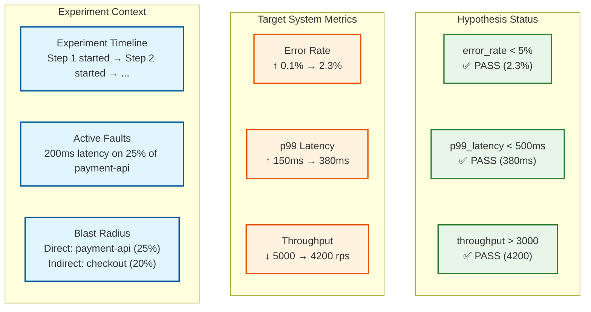

# Observability — Chaos Engineering Platform

## The Dual Observability Challenge

A chaos engineering platform has two distinct observability concerns:

1. **Observing the platform itself:** Is the orchestrator healthy? Are agents connected? Is the command queue flowing? This is standard platform observability.
2. **Observing experiments in progress:** Is the target system tolerating the fault? How do the experiment's metrics correlate with the target system's observability data? This is experiment-specific observability that must integrate with the organization's existing monitoring stack.

The second concern is unique to chaos engineering: the platform must provide a "lens" that overlays experiment context onto the target system's observability data, so engineers can distinguish "this latency spike is caused by our chaos experiment" from "this latency spike is a real problem."

---

## Platform Observability (Observing the Observer)

### Control Plane Metrics (USE/RED)

| Category | Metric | Type | Description | Alert Threshold |
|----------|--------|------|-------------|-----------------|
| **Utilization** | `orchestrator_active_experiments` | Gauge | Currently running experiments | >80% of configured max |
| **Utilization** | `orchestrator_cpu_seconds_total` | Counter | CPU consumed by orchestrator | >70% of limit sustained |
| **Utilization** | `orchestrator_memory_bytes` | Gauge | Memory usage | >80% of limit |
| **Saturation** | `command_queue_depth` | Gauge | Pending commands in queue | >500 pending |
| **Saturation** | `command_queue_oldest_age_seconds` | Gauge | Age of oldest unprocessed command | >30s (rollback may be delayed) |
| **Errors** | `orchestrator_state_transition_errors` | Counter | Failed experiment state transitions | >0 per 5 minutes |
| **Errors** | `blast_radius_check_failures` | Counter | BRC errors (not rejections — errors) | >0 per 5 minutes |
| **Rate** | `experiments_started_total` | Counter | Experiments started | N/A (informational) |
| **Rate** | `experiments_completed_total` | Counter (by outcome) | Experiments completed (pass/fail/abort) | N/A (informational) |
| **Duration** | `experiment_duration_seconds` | Histogram | End-to-end experiment duration | p99 >2× configured max_duration |

### Steady-State Monitor Metrics

| Metric | Type | Description | Alert Threshold |
|--------|------|-------------|-----------------|
| `ssm_evaluations_total` | Counter | Hypothesis evaluations performed | Rate drop >50% indicates SSM issue |
| `ssm_evaluation_latency_seconds` | Histogram | Time to evaluate one hypothesis | p99 >5s (evaluation lag) |
| `ssm_query_failures_total` | Counter | Failed metric queries to observability backend | >3 consecutive failures triggers experiment abort |
| `ssm_hypothesis_violations_total` | Counter | Number of hypothesis violations detected | N/A (expected during experiments) |
| `ssm_grace_period_entries_total` | Counter | Number of times a metric entered grace period | High rate indicates noisy hypothesis thresholds |
| `ssm_false_rollbacks_total` | Counter | Rollbacks triggered that were determined to be false positives (post-hoc) | Requires manual classification |

### Agent Fleet Metrics

| Metric | Type | Description | Alert Threshold |
|--------|------|-------------|-----------------|
| `agent_connected_total` | Gauge | Currently connected agents | Drop >5% of fleet in 5 minutes |
| `agent_heartbeat_age_seconds` | Gauge (per agent) | Time since last heartbeat | >120s (agent may be unreachable) |
| `agent_active_faults_total` | Gauge | Total faults currently injected across all agents | N/A (informational, useful for dashboards) |
| `agent_autonomous_reverts_total` | Counter | Faults reverted by agent safety timer (not by orchestrator) | >0 indicates control plane communication issue |
| `agent_fault_apply_latency_seconds` | Histogram | Time from command receipt to fault applied | p99 >10s |
| `agent_fault_revert_latency_seconds` | Histogram | Time from revert command to fault reverted | p99 >15s (critical — affects rollback SLO) |
| `agent_version_distribution` | Gauge (per version) | Number of agents per software version | >2 versions in production (upgrade stalled) |

### Rollback Metrics (Critical)

| Metric | Type | Description | Alert Threshold |
|--------|------|-------------|-----------------|
| `rollback_triggered_total` | Counter (by trigger) | Rollbacks by trigger type (hypothesis, timeout, manual, partition) | N/A (informational) |
| `rollback_completion_seconds` | Histogram | Time from rollback trigger to all faults reverted | p99 >30s (SLO violation) |
| `rollback_failures_total` | Counter | Rollbacks that did not complete successfully | >0 (critical — faults may be orphaned) |
| `orphaned_faults_total` | Gauge | Faults detected by reconciliation with no owning experiment | >0 (critical — investigate immediately) |

---

## Experiment Observability (Observing the Experiment)

### Experiment Dashboard: The Chaos Lens

During an active experiment, the platform provides a "chaos lens" dashboard that correlates three data streams:



### Experiment Annotations

The platform publishes time-stamped annotations to the organization's dashboarding system so that any engineer viewing system dashboards during a chaos experiment sees clear markers:

```
Annotation Events Published:
  - "Chaos experiment EXP-1234 started: 200ms latency on payment-api (25%)"
    → Published to: Grafana, Datadog, PagerDuty (suppression)
    → Timestamp: experiment start time
    → Tags: experiment_id, team, environment, fault_type

  - "Chaos experiment EXP-1234 Step 2: escalated to 50% of payment-api"
    → Same channels

  - "Chaos experiment EXP-1234 completed: PASS"
    → Same channels
    → Includes link to results report
```

This annotation system serves two critical purposes:
1. **Context for on-call engineers:** An on-call engineer paged for elevated latency can immediately see that a chaos experiment is running and is the likely cause.
2. **Alert suppression:** The platform can suppress non-critical alerts for target services during experiments to prevent alert fatigue. Critical alerts (SLO-violating) are never suppressed.

### Correlation Engine

Post-experiment, the platform correlates the experiment timeline with all available observability data to produce an impact report:

| Correlation | Source | Purpose |
|-------------|--------|---------|
| Experiment events ↔ Metric time series | Metrics backend | Show exactly when metrics shifted relative to fault injection/reversion |
| Experiment events ↔ Distributed traces | Trace backend | Identify specific request traces that were impacted by the fault |
| Experiment events ↔ Error logs | Log backend | Surface error messages that appeared during the experiment |
| Experiment events ↔ Deployment events | Deployment pipeline | Ensure metric changes are from the experiment, not a coincident deployment |
| Experiment events ↔ Auto-scaling events | Orchestration platform | Show if the system auto-scaled in response to the fault |

---

## Alerting

### Platform Safety Alerts (Never Suppress)

| Alert | Severity | Condition | Action |
|-------|----------|-----------|--------|
| **Orphaned fault detected** | Critical | `orphaned_faults_total > 0` | Page platform admin; investigate and manually revert |
| **Rollback timeout** | Critical | `rollback_completion_seconds > 60s` | Page platform admin; check agent connectivity |
| **Agent fleet disconnect** | Critical | `agent_connected_total` drops >10% in 5 min | Page platform admin; pause all experiments |
| **SSM evaluation failure** | High | `ssm_query_failures_total > 3` for any experiment | Auto-abort experiment; alert experiment owner |
| **Autonomous agent revert** | High | `agent_autonomous_reverts_total > 0` | Investigate control plane connectivity |
| **Command queue stall** | High | `command_queue_oldest_age_seconds > 30s` | Scale queue consumers; check for deadlock |

### Experiment-Specific Alerts (Experiment Owner)

| Alert | Severity | Condition | Action |
|-------|----------|-----------|--------|
| **Hypothesis violated** | High | Steady-state metric exceeded threshold after grace period | Auto-rollback triggered; notify experiment owner |
| **Experiment duration warning** | Medium | Experiment at 80% of max duration | Notify owner; experiment will auto-complete at 100% |
| **Blast radius approaching limit** | Medium | Progressive experiment reaching blast radius ceiling | Notify owner; next escalation step will be blocked |

### Alert Suppression During Experiments

```
Suppression Rules:
  1. When experiment starts:
     - Suppress INFO and WARNING alerts for directly targeted services
     - Never suppress ERROR or CRITICAL alerts
     - Add "chaos_experiment_active" label to all alerts from target services

  2. When experiment ends:
     - Remove all suppressions within 5 minutes
     - Any alerts that were suppressed are logged (not lost)
     - Alert "Chaos suppression lifted for {services}" sent to on-call

  3. Override:
     - If an alert matches the experiment's abort conditions, it is
       NOT suppressed — it triggers rollback instead
     - Manual override: on-call can re-enable all alerts at any time
```

---

## Dashboards

### Platform Health Dashboard

| Panel | Visualization | Data Source |
|-------|--------------|-------------|
| Active Experiments | Status cards (green/yellow/red) | Orchestrator API |
| Agent Fleet Health | Heatmap (connected/disconnected/degraded by region) | Agent heartbeats |
| Experiment Timeline | Gantt chart (running experiments with fault types) | Experiment DB |
| Rollback SLO | Time series (p50/p95/p99 rollback duration) | Rollback metrics |
| Command Queue | Time series (depth + processing rate) | Queue metrics |
| Orphaned Faults | Counter (should always be 0) | Reconciliation sweep |

### Experiment Deep-Dive Dashboard

| Panel | Visualization | Data Source |
|-------|--------------|-------------|
| Experiment Status | State indicator + timeline | Orchestrator |
| Hypothesis Status | Per-metric gauges with threshold bands | SSHE |
| Blast Radius | Dependency graph with heat overlay | BRC + observability |
| Target Metrics (RED) | Time series with experiment annotations | Metrics backend |
| Impacted Traces | Exemplar traces from fault window | Trace backend |
| Error Logs | Log stream filtered by target services + time window | Log backend |
