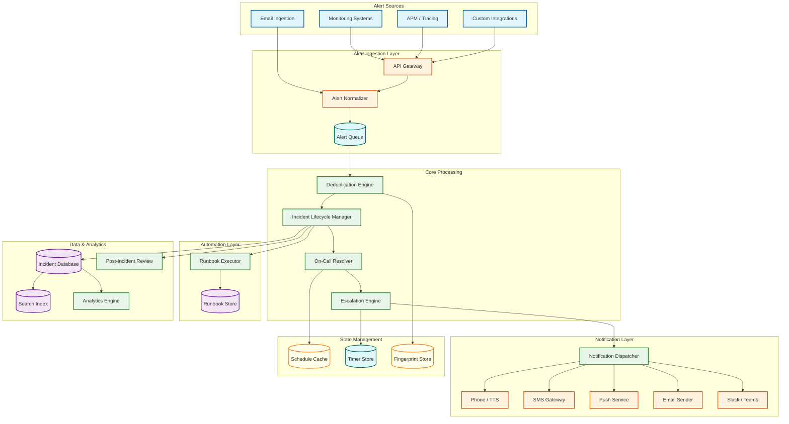
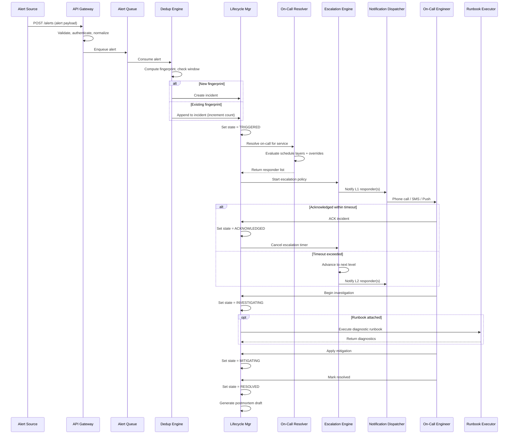
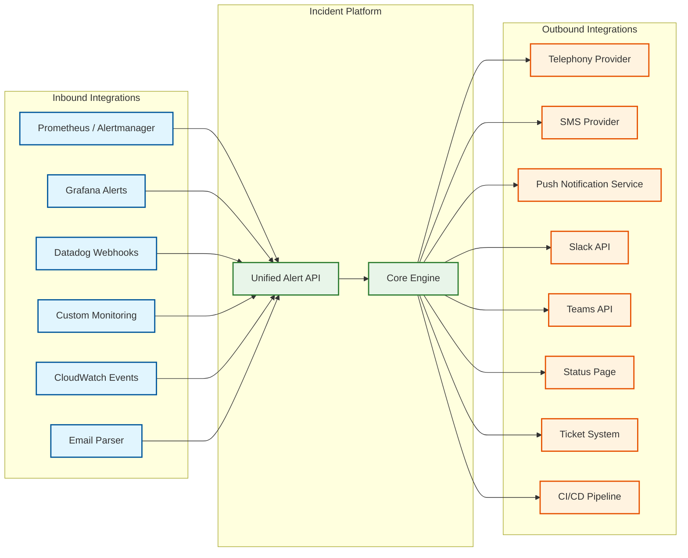

# High-Level Design — Incident Management System

## 1. Architecture Overview

---

## 2. Component Responsibilities

### 2.1 Alert Ingestion Layer

| Component | Responsibility |
|-----------|---------------|
| **API Gateway** | Rate limiting, authentication (API keys per integration), request validation, TLS termination |
| **Alert Normalizer** | Transforms heterogeneous alert formats into a canonical internal schema (source, severity, service, dedup_key, payload) |
| **Alert Queue** | Durable message queue that decouples ingestion from processing; survives processing-layer restarts without alert loss |

### 2.2 Core Processing

| Component | Responsibility |
|-----------|---------------|
| **Deduplication Engine** | Groups alerts by fingerprint (hash of dedup_key); maintains sliding window of active fingerprints; creates new incidents or appends to existing ones |
| **On-Call Resolver** | Evaluates the on-call schedule graph at the current timestamp to determine who to notify; handles schedule layers, overrides, and follow-the-sun |
| **Escalation Engine** | Manages escalation timers; fires next-level notifications when acknowledgment deadlines expire; implements the escalation state machine |
| **Incident Lifecycle Manager** | Central orchestrator for incident state transitions; enforces the state machine; coordinates with all other components |

### 2.3 Notification Layer

| Component | Responsibility |
|-----------|---------------|
| **Notification Dispatcher** | Routes notifications to the appropriate channel based on user preferences and incident severity; handles retry and failover logic |
| **Channel Adapters** (Phone, SMS, Push, Email, Chat) | Each adapter speaks the protocol of one external delivery system; manages rate limits, retries, and delivery confirmation |

### 2.4 Automation Layer

| Component | Responsibility |
|-----------|---------------|
| **Runbook Executor** | Sandboxed execution environment for diagnostic and remediation runbooks; captures output as incident context |
| **Runbook Store** | Version-controlled repository of runbook definitions with service-to-runbook mappings |

### 2.5 Data & Analytics

| Component | Responsibility |
|-----------|---------------|
| **Incident Database** | Durable storage for incidents, alerts, notifications, audit log; source of truth for incident state |
| **Search Index** | Full-text search over incidents, alerts, and postmortems for pattern discovery |
| **Analytics Engine** | Computes MTTA, MTTR, incident trends, on-call burden, SLA compliance |
| **Post-Incident Review** | Generates draft postmortems from timeline data; tracks action items to completion |

---

## 3. Data Flow: Alert-to-Resolution Lifecycle

---

## 4. Key Architectural Decisions

### Decision 1: Durable Queue Between Ingestion and Processing

**Choice:** All alerts pass through a durable message queue before processing.

**Rationale:** During an alert storm, the processing layer may be overwhelmed. The queue absorbs the burst, ensuring zero alert loss. If the deduplication engine restarts, unprocessed alerts are redelivered. This decoupling is critical because the ingestion layer must never reject an alert — every rejected alert is a potentially missed incident.

**Trade-off:** Adds 10-50ms latency per alert. Acceptable given the 30-second SLO.

### Decision 2: Fingerprint-Based Deduplication with Sliding Window

**Choice:** Deduplication uses a configurable fingerprint (hash of source + alert_class + service + custom fields) with a time-bounded sliding window (default 24 hours).

**Rationale:** Content-hash deduplication is deterministic, explainable, and fast. ML-based semantic grouping is more flexible but harder to debug when it over-groups (hiding a real incident) or under-groups (creating noise). The fingerprint approach provides a reliable baseline; semantic grouping can be layered on top.

**Trade-off:** Fingerprint-only dedup cannot group "related but different" alerts (e.g., "CPU high" and "memory exhausted" on the same host). This is handled by a separate correlation layer.

### Decision 3: Escalation as a Separate State Machine

**Choice:** The escalation engine is a dedicated component with its own persistent timer store, rather than being embedded in the incident lifecycle manager.

**Rationale:** Escalation timers are the most latency-sensitive component — a timer that fires 1 minute late can mean 1 minute of extended downtime. Isolating the escalation engine allows it to have its own scaling, its own persistence, and its own failure domain. If the lifecycle manager restarts, escalation timers continue firing.

**Trade-off:** Requires distributed coordination between ILM and escalation engine; adds complexity for consistency.

### Decision 4: Multi-Channel Notification with Per-User Preferences

**Choice:** The notification dispatcher consults user preference rules (severity × time-of-day → channel priority list) rather than using a single global channel.

**Rationale:** A phone call at 3 AM is appropriate for P1; an email is appropriate for P3. A single-channel approach either over-pages (alert fatigue) or under-pages (missed incidents). Per-user preferences also accommodate individual device availability and regional telecom constraints.

**Trade-off:** Complex preference evaluation at notification time; requires fallback chains when preferred channel fails.

### Decision 5: Active-Active Multi-Region for the Platform Itself

**Choice:** The incident management platform runs active-active across at least two geographic regions.

**Rationale:** This is the meta-reliability requirement. If the incident platform runs in a single region and that region goes down, the organization loses its ability to detect and respond to the very outage affecting them. Active-active ensures that a region-level failure affects at most 50% of alert processing capacity (with the other region absorbing the load), rather than causing complete blindness.

**Trade-off:** Requires conflict resolution for concurrent incident updates across regions; increases infrastructure cost by 2-3x.

---

## 5. Integration Architecture

The platform acts as a central hub with a normalized inbound API that accepts alerts from any monitoring system, and a fanout outbound layer that pushes notifications and status updates to all relevant channels. Each integration is an adapter that maps between the platform's canonical data model and the external system's protocol.
