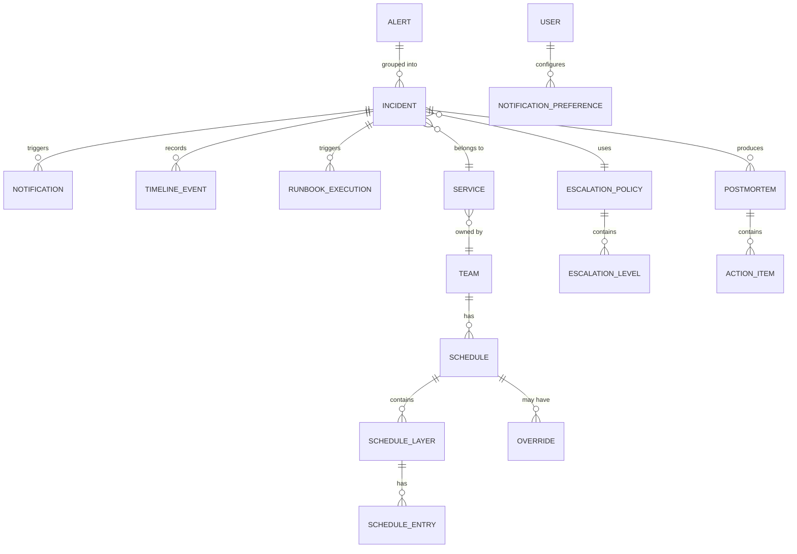

# Low-Level Design — Incident Management System

## 1. Data Model

### 1.1 Core Entities



### 1.2 Alert Schema

```
Alert:
  id              : UUID (generated on ingestion)
  integration_id  : UUID (which inbound integration sent this)
  dedup_key       : STRING (caller-provided or auto-generated)
  fingerprint     : STRING (SHA-256 of normalized dedup_key)
  severity        : ENUM [critical, high, medium, low, info]
  source          : STRING (e.g., "prometheus", "datadog")
  service_key     : STRING (maps to a service in the platform)
  summary         : STRING (human-readable, max 1024 chars)
  details         : JSON (full alert payload, max 64 KB)
  created_at      : TIMESTAMP
  incident_id     : UUID (null until grouped; FK → Incident)
  status          : ENUM [triggered, suppressed, deduplicated]
```

### 1.3 Incident Schema

```
Incident:
  id              : UUID
  incident_number : BIGINT (human-friendly, monotonically increasing)
  title           : STRING (auto-generated from first alert summary)
  severity        : ENUM [P1, P2, P3, P4, P5]
  status          : ENUM [triggered, acknowledged, investigating, mitigating, resolved]
  service_id      : UUID (FK → Service)
  escalation_policy_id : UUID (FK → EscalationPolicy)
  assigned_to     : UUID (FK → User, current assignee)
  acknowledged_by : UUID (FK → User, nullable)
  acknowledged_at : TIMESTAMP (nullable)
  resolved_by     : UUID (FK → User, nullable)
  resolved_at     : TIMESTAMP (nullable)
  created_at      : TIMESTAMP
  updated_at      : TIMESTAMP
  alert_count     : INT (number of deduplicated alerts)
  last_alert_at   : TIMESTAMP
  urgency         : ENUM [high, low] (derived from severity + time-of-day rules)
  conference_url  : STRING (auto-created war room link, nullable)
  postmortem_id   : UUID (nullable, FK → Postmortem)
  metadata        : JSON (custom fields, tags)

  INDEXES:
    - (service_id, status, created_at) — active incidents per service
    - (assigned_to, status) — my open incidents
    - (fingerprint_window) — dedup lookups (covered by Fingerprint Store)
    - (created_at) — time-range queries for analytics
```

### 1.4 On-Call Schedule Schema

```
Schedule:
  id              : UUID
  name            : STRING
  team_id         : UUID (FK → Team)
  timezone        : STRING (IANA timezone, e.g., "America/New_York")
  layers          : [ScheduleLayer]

ScheduleLayer:
  id              : UUID
  schedule_id     : UUID (FK → Schedule)
  name            : STRING (e.g., "Primary", "Secondary")
  priority        : INT (higher priority layers override lower)
  rotation_type   : ENUM [daily, weekly, custom]
  rotation_length : INT (e.g., 7 for weekly)
  rotation_unit   : ENUM [hours, days]
  start_time      : TIMESTAMP (rotation epoch)
  users           : [UUID] (ordered list of users in rotation)
  restrictions    : [TimeRestriction] (e.g., weekdays only 09:00-17:00)

TimeRestriction:
  type            : ENUM [weekly]
  start_day       : ENUM [mon, tue, ..., sun]
  start_time      : TIME
  end_day         : ENUM [mon, tue, ..., sun]
  end_time        : TIME

Override:
  id              : UUID
  schedule_id     : UUID (FK → Schedule)
  user_id         : UUID (the user taking over)
  start_time      : TIMESTAMP
  end_time        : TIMESTAMP
  created_by      : UUID
  reason          : STRING
```

### 1.5 Escalation Policy Schema

```
EscalationPolicy:
  id              : UUID
  name            : STRING
  team_id         : UUID (FK → Team)
  repeat_count    : INT (how many times to cycle through all levels before giving up)
  levels          : [EscalationLevel]

EscalationLevel:
  id              : UUID
  policy_id       : UUID (FK → EscalationPolicy)
  level_number    : INT (1 = first to be notified)
  timeout_seconds : INT (seconds to wait before escalating to next level)
  targets         : [EscalationTarget]

EscalationTarget:
  type            : ENUM [schedule, user, team]
  target_id       : UUID (FK → Schedule | User | Team)
  urgency_filter  : ENUM [any, high_only] (skip low-urgency for manager-level targets)
```

### 1.6 Notification Record Schema

```
NotificationRecord:
  id              : UUID
  incident_id     : UUID (FK → Incident)
  user_id         : UUID (FK → User)
  channel         : ENUM [phone, sms, push, email, slack, teams]
  status          : ENUM [queued, sending, delivered, failed, no_answer]
  sent_at         : TIMESTAMP
  delivered_at    : TIMESTAMP (nullable)
  acknowledged_at : TIMESTAMP (nullable)
  retry_count     : INT
  provider_id     : STRING (external message ID from telephony/SMS provider)
  failure_reason  : STRING (nullable)

  INDEXES:
    - (incident_id, user_id) — notification history per incident
    - (user_id, sent_at) — notification audit per user
```

### 1.7 Runbook Schema

```
Runbook:
  id              : UUID
  name            : STRING
  description     : STRING
  version         : INT
  trigger_mode    : ENUM [manual, suggested, automatic]
  approval_required : BOOLEAN
  parameters      : [RunbookParam]
  steps           : [RunbookStep]
  service_bindings : [UUID] (services that can trigger this runbook)
  alert_type_bindings : [STRING] (alert classes that trigger this runbook)

RunbookStep:
  order           : INT
  action_type     : ENUM [command, api_call, wait, condition, approval_gate]
  config          : JSON (action-specific configuration)
  timeout_seconds : INT
  on_failure      : ENUM [abort, continue, retry]

RunbookExecution:
  id              : UUID
  runbook_id      : UUID (FK → Runbook)
  incident_id     : UUID (FK → Incident)
  triggered_by    : ENUM [automatic, user]
  user_id         : UUID (nullable, if user-triggered)
  status          : ENUM [running, succeeded, failed, aborted, awaiting_approval]
  started_at      : TIMESTAMP
  completed_at    : TIMESTAMP (nullable)
  output          : TEXT (captured stdout/stderr)
  steps_completed : INT
```

---

## 2. API Design

### 2.1 Alert Ingestion API

```
POST /v2/alerts
Headers:
  Authorization: Token <integration_key>
  Content-Type: application/json

Request Body:
  routing_key   : STRING (required, maps to a service)
  event_action  : ENUM [trigger, acknowledge, resolve]
  dedup_key     : STRING (optional; auto-generated if absent)
  payload:
    summary     : STRING (required, max 1024 chars)
    severity    : ENUM [critical, error, warning, info]
    source      : STRING (required, e.g., hostname or monitor name)
    component   : STRING (optional, affected component)
    group       : STRING (optional, logical grouping)
    class       : STRING (optional, alert classification)
    custom_details : JSON (optional, arbitrary key-value data)

Response (202 Accepted):
  status        : "success"
  dedup_key     : STRING (the key used for dedup, returned for future reference)
  alert_id      : UUID

Response (429 Too Many Requests):
  retry_after   : INT (seconds)
```

### 2.2 Incident Management API

```
GET /v2/incidents
  Query params: status, severity, service_id, since, until, limit, offset
  Returns: paginated list of incidents

GET /v2/incidents/{id}
  Returns: full incident with alerts, timeline, notifications

PUT /v2/incidents/{id}
  Body: { status, severity, assigned_to, title }
  Used for: acknowledge, escalate, reassign, resolve

POST /v2/incidents/{id}/merge
  Body: { source_incident_ids: [UUID] }
  Merges multiple incidents into one

POST /v2/incidents/{id}/notes
  Body: { content: STRING }
  Adds a note to the incident timeline

POST /v2/incidents/{id}/responders
  Body: { user_ids: [UUID], message: STRING }
  Pages additional responders

POST /v2/incidents/{id}/status-update
  Body: { message: STRING, notify_subscribers: BOOLEAN }
  Posts a customer-facing status update
```

### 2.3 Schedule Management API

```
GET /v2/schedules
  Returns: list of all on-call schedules

GET /v2/schedules/{id}
  Query params: since, until (time window to render)
  Returns: schedule definition + rendered final schedule for the time window

GET /v2/schedules/{id}/on-call-now
  Returns: { user: User, layer: STRING, until: TIMESTAMP }

POST /v2/schedules/{id}/overrides
  Body: { user_id, start, end, reason }
  Creates a schedule override

DELETE /v2/schedules/{id}/overrides/{override_id}
  Removes a schedule override
```

### 2.4 Escalation Policy API

```
GET /v2/escalation-policies
GET /v2/escalation-policies/{id}
PUT /v2/escalation-policies/{id}
  Body: { levels: [{ timeout_seconds, targets: [...] }], repeat_count }
```

---

## 3. Core Algorithms

### 3.1 Alert Deduplication

```
FUNCTION ProcessAlert(alert):
    // Step 1: Compute fingerprint
    IF alert.dedup_key IS NULL:
        alert.dedup_key = Hash(alert.source + alert.service_key + alert.payload.class)

    fingerprint = SHA256(alert.dedup_key)

    // Step 2: Check fingerprint store (sliding window)
    existing = FingerprintStore.Get(fingerprint)

    IF existing IS NOT NULL AND existing.expires_at > NOW():
        // Deduplicate: append to existing incident
        incident = IncidentStore.Get(existing.incident_id)
        incident.alert_count += 1
        incident.last_alert_at = NOW()
        IncidentStore.Update(incident)

        // Reset expiry window (extend dedup window on each new alert)
        FingerprintStore.SetExpiry(fingerprint, NOW() + DEDUP_WINDOW)

        RETURN {action: "deduplicated", incident_id: incident.id}
    ELSE:
        // New incident
        incident = CreateIncident(alert)
        FingerprintStore.Set(fingerprint, {
            incident_id: incident.id,
            expires_at: NOW() + DEDUP_WINDOW
        })

        // Trigger escalation
        StartEscalation(incident)

        RETURN {action: "created", incident_id: incident.id}
```

### 3.2 On-Call Schedule Resolution

```
FUNCTION ResolveOnCall(schedule_id, timestamp):
    schedule = ScheduleStore.Get(schedule_id)

    // Step 1: Check overrides first (highest priority)
    override = FindActiveOverride(schedule_id, timestamp)
    IF override IS NOT NULL:
        RETURN {user: override.user_id, source: "override"}

    // Step 2: Evaluate layers from highest to lowest priority
    // Higher-priority layers "paint over" lower layers
    final_user = NULL

    FOR layer IN schedule.layers SORTED BY priority DESC:
        // Check if timestamp falls within layer's restrictions
        IF NOT MatchesRestrictions(layer.restrictions, timestamp, schedule.timezone):
            CONTINUE

        // Calculate which user is on-call in this rotation
        user = ResolveLayerRotation(layer, timestamp)

        IF user IS NOT NULL:
            final_user = user
            BREAK  // Highest-priority matching layer wins

    RETURN {user: final_user, source: "rotation"}


FUNCTION ResolveLayerRotation(layer, timestamp):
    // Convert timestamp to layer's timezone for rotation math
    local_time = ConvertTimezone(timestamp, layer.schedule.timezone)

    // Calculate seconds since rotation epoch
    elapsed = local_time - layer.start_time

    // Calculate rotation period in seconds
    period = layer.rotation_length * UnitToSeconds(layer.rotation_unit)

    // Determine which rotation cycle we're in
    cycle_number = FLOOR(elapsed / period)

    // Map cycle to user (round-robin through the user list)
    user_index = cycle_number MOD LENGTH(layer.users)

    RETURN layer.users[user_index]
```

### 3.3 Escalation State Machine

```
FUNCTION StartEscalation(incident):
    policy = EscalationPolicyStore.Get(incident.escalation_policy_id)

    state = {
        incident_id: incident.id,
        policy_id: policy.id,
        current_level: 1,
        current_repeat: 0,
        max_repeats: policy.repeat_count,
        started_at: NOW()
    }

    EscalationStateStore.Set(incident.id, state)

    // Notify level 1 and start timer
    NotifyLevel(incident, policy.levels[0])
    StartEscalationTimer(incident.id, policy.levels[0].timeout_seconds)


FUNCTION OnEscalationTimerFired(incident_id):
    state = EscalationStateStore.Get(incident_id)
    incident = IncidentStore.Get(incident_id)

    // If incident is already acknowledged or resolved, stop
    IF incident.status IN [acknowledged, investigating, mitigating, resolved]:
        EscalationStateStore.Delete(incident_id)
        RETURN

    policy = EscalationPolicyStore.Get(state.policy_id)
    next_level = state.current_level + 1

    IF next_level > LENGTH(policy.levels):
        // Exhausted all levels; check repeat policy
        IF state.current_repeat < state.max_repeats:
            // Restart from level 1
            state.current_level = 1
            state.current_repeat += 1
            EscalationStateStore.Set(incident_id, state)

            NotifyLevel(incident, policy.levels[0])
            StartEscalationTimer(incident_id, policy.levels[0].timeout_seconds)
        ELSE:
            // All levels exhausted, all repeats exhausted
            LogExhaustedEscalation(incident)
            // Optionally: notify a catch-all (e.g., VP of Engineering)
        RETURN

    // Advance to next level
    state.current_level = next_level
    EscalationStateStore.Set(incident_id, state)

    level = policy.levels[next_level - 1]
    NotifyLevel(incident, level)
    StartEscalationTimer(incident_id, level.timeout_seconds)


FUNCTION NotifyLevel(incident, level):
    FOR target IN level.targets:
        IF target.type == "schedule":
            on_call = ResolveOnCall(target.target_id, NOW())
            EnqueueNotification(incident, on_call.user)
        ELSE IF target.type == "user":
            EnqueueNotification(incident, target.target_id)
        ELSE IF target.type == "team":
            // Notify all members of the team
            members = TeamStore.GetMembers(target.target_id)
            FOR member IN members:
                EnqueueNotification(incident, member.id)
```

### 3.4 Notification Dispatch with Channel Failover

```
FUNCTION EnqueueNotification(incident, user_id):
    prefs = NotificationPreferenceStore.Get(user_id)
    urgency = DeriveUrgency(incident.severity, NOW())

    // Get ordered channel list based on urgency and user prefs
    channels = prefs.GetChannelPriority(urgency)
    // e.g., [phone, sms, push] for high urgency
    // e.g., [push, email] for low urgency

    notification = {
        incident_id: incident.id,
        user_id: user_id,
        channels: channels,
        current_channel_index: 0,
        max_retries_per_channel: 2,
        retry_count: 0
    }

    NotificationQueue.Enqueue(notification)


FUNCTION ProcessNotification(notification):
    channel = notification.channels[notification.current_channel_index]

    result = DeliverViaChannel(channel, notification)

    IF result.status == "delivered" OR result.status == "acknowledged":
        RecordSuccess(notification, channel)
        RETURN

    IF result.status == "failed":
        notification.retry_count += 1

        IF notification.retry_count < notification.max_retries_per_channel:
            // Retry same channel after backoff
            delay = BaseDelay * (2 ^ notification.retry_count)
            NotificationQueue.EnqueueWithDelay(notification, delay)
        ELSE:
            // Failover to next channel
            notification.current_channel_index += 1
            notification.retry_count = 0

            IF notification.current_channel_index < LENGTH(notification.channels):
                NotificationQueue.Enqueue(notification)
            ELSE:
                RecordFailure(notification, "all channels exhausted")
```

### 3.5 Incident State Machine

```
VALID_TRANSITIONS:
    triggered     → [acknowledged, resolved]
    acknowledged  → [investigating, resolved]
    investigating → [mitigating, resolved, acknowledged]  // back to ack if wrong track
    mitigating    → [resolved, investigating]  // back to investigating if mitigation fails
    resolved      → [triggered]  // reopen if issue recurs

FUNCTION TransitionIncident(incident_id, new_status, actor_id):
    incident = IncidentStore.GetForUpdate(incident_id)  // row-level lock

    IF new_status NOT IN VALID_TRANSITIONS[incident.status]:
        RAISE InvalidTransitionError(incident.status, new_status)

    old_status = incident.status
    incident.status = new_status
    incident.updated_at = NOW()

    // Status-specific side effects
    IF new_status == "acknowledged":
        incident.acknowledged_by = actor_id
        incident.acknowledged_at = NOW()
        CancelEscalationTimer(incident_id)

    ELSE IF new_status == "resolved":
        incident.resolved_by = actor_id
        incident.resolved_at = NOW()
        CancelEscalationTimer(incident_id)
        ClearFingerprintWindow(incident)  // Allow new incidents for same fingerprint
        SchedulePostmortem(incident)

    ELSE IF new_status == "triggered":
        // Reopen: restart escalation
        incident.acknowledged_by = NULL
        incident.acknowledged_at = NULL
        incident.resolved_by = NULL
        incident.resolved_at = NULL
        StartEscalation(incident)

    IncidentStore.Update(incident)

    // Record timeline event
    RecordTimelineEvent(incident_id, {
        type: "status_change",
        from: old_status,
        to: new_status,
        actor: actor_id,
        timestamp: NOW()
    })
```
