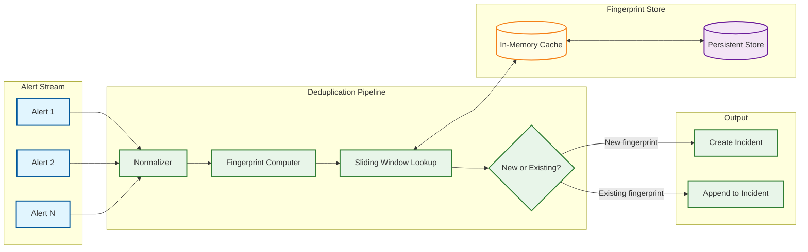
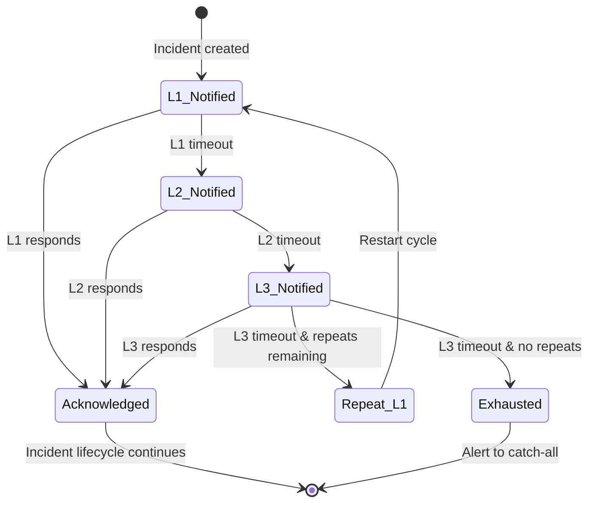
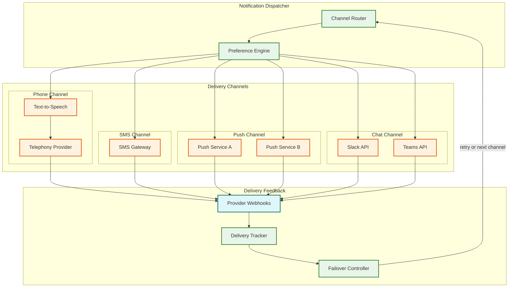

# Deep Dive & Bottlenecks — Incident Management System

## 1. Deep Dive: Alert Deduplication Engine

### 1.1 The Problem

During a major outage, a single root cause (e.g., a database becoming unavailable) can trigger thousands of alerts across hundreds of dependent services within seconds. Without deduplication, the on-call engineer receives 500 phone calls instead of 1 — making it impossible to focus on resolution. But overly aggressive deduplication can merge two genuinely separate incidents into one, hiding a real problem behind an already-acknowledged incident.

### 1.2 Architecture



### 1.3 Fingerprint Computation

The fingerprint is the SHA-256 hash of a normalized dedup key. The normalization pipeline:

1. **Extract dedup_key** — Use caller-provided key if present; otherwise, construct from `source + service_key + alert_class`
2. **Normalize** — Lowercase, trim whitespace, sort JSON object keys deterministically
3. **Hash** — SHA-256 produces a 256-bit fingerprint; collision probability is negligible at any practical alert volume

### 1.4 Sliding Window Mechanics

The fingerprint store maintains a time-bounded window per fingerprint:

- **Window creation** — When a new fingerprint is seen, a window opens with a default TTL (e.g., 24 hours)
- **Window extension** — Each subsequent alert with the same fingerprint resets the TTL (sliding behavior)
- **Window closure** — When the TTL expires with no new alerts, the window closes; the next alert with this fingerprint creates a new incident

This sliding behavior is critical: a "flapping" alert that fires every 30 minutes will remain deduplicated as long as the inter-alert gap is less than the window TTL. But if the issue truly resolves and recurs after 24+ hours, it correctly creates a new incident.

### 1.5 The Contention Problem

During an alert storm, thousands of alerts with the same fingerprint arrive concurrently. Without coordination:

- **Race condition:** Two alerts with the same new fingerprint arrive simultaneously. Both check the store, both see "no existing fingerprint," both create a new incident → duplicate incidents.
- **Solution:** Use atomic compare-and-set (CAS) on the fingerprint store. The first writer wins and creates the incident; subsequent writers see the fingerprint and deduplicate.

```
FUNCTION AtomicDedup(fingerprint, alert):
    success = FingerprintStore.SetIfAbsent(fingerprint, {
        incident_id: PENDING,
        expires_at: NOW() + DEDUP_WINDOW
    })

    IF success:
        // We won the race — create the incident
        incident = CreateIncident(alert)
        FingerprintStore.Update(fingerprint, {incident_id: incident.id})
        RETURN incident
    ELSE:
        // Another alert won — wait for incident_id to be set
        entry = FingerprintStore.GetWithRetry(fingerprint, max_wait=500ms)
        IF entry.incident_id == PENDING:
            // Creator is still working; retry
            RETURN RetryDedup(fingerprint, alert)
        ELSE:
            AppendToIncident(entry.incident_id, alert)
            RETURN entry.incident_id
```

### 1.6 Multi-Layer Deduplication

Beyond exact-fingerprint dedup, the system supports:

| Layer | Mechanism | Example |
|-------|-----------|---------|
| **Exact dedup** | Identical fingerprint | Same alert firing repeatedly |
| **Rule-based grouping** | User-defined rules (IF source = X AND service MATCHES Y, group together) | "Group all database alerts from the same cluster" |
| **Time-window correlation** | Alerts within N seconds of each other on related services | "CPU alert on service A + timeout alert on downstream service B within 60s" |
| **ML-based clustering** | Semantic similarity of alert summaries using vector embeddings | "Cannot reach database" and "Database connection pool exhausted" |

Each layer progressively reduces noise but adds complexity and the risk of over-grouping.

---

## 2. Deep Dive: Escalation State Machine

### 2.1 The State Model



### 2.2 Timer Management

Escalation timers are the most latency-sensitive component. A timer that fires 30 seconds late means 30 seconds of additional MTTR.

**Requirements:**
- Timers must fire within ±5 seconds of the configured deadline
- Timers must survive process restarts (persistent)
- Thousands of concurrent timers (one per unacknowledged incident)
- Timers must be cancellable (when incident is acknowledged)

**Implementation approach — Persistent timer wheel:**

```
STRUCTURE TimerWheel:
    slots        : ARRAY[3600] of LIST[TimerEntry]  // 1-second granularity, 1-hour capacity
    current_slot : INT
    overflow     : SORTED_SET[TimerEntry]  // For timers > 1 hour

FUNCTION ScheduleTimer(incident_id, delay_seconds):
    fire_at = NOW() + delay_seconds
    entry = {incident_id, fire_at}

    IF delay_seconds <= 3600:
        slot = (current_slot + delay_seconds) MOD 3600
        slots[slot].Append(entry)
    ELSE:
        overflow.Add(entry, score=fire_at)

    // Persist to durable store for crash recovery
    TimerPersistence.Write(entry)

FUNCTION Tick():  // Called every second
    current_slot = (current_slot + 1) MOD 3600

    // Fire all timers in current slot
    FOR entry IN slots[current_slot]:
        IF NOT IsCancelled(entry.incident_id):
            EmitEscalationEvent(entry.incident_id)
        TimerPersistence.Delete(entry)

    slots[current_slot].Clear()

    // Move overflow timers that are now within the wheel's range
    due_overflow = overflow.RangeByScore(0, NOW())
    FOR entry IN due_overflow:
        EmitEscalationEvent(entry.incident_id)
        overflow.Remove(entry)
```

### 2.3 The Concurrent Acknowledgment Race

**Scenario:** Escalation timer fires for L1 timeout. At the same moment, the L1 engineer sends an ACK. Without coordination:

1. Timer fires → starts L2 notification
2. ACK arrives → cancels escalation
3. Result: L2 gets an unnecessary page

**Solution:** Use an atomic state transition with a generation counter:

```
FUNCTION AcknowledgeIncident(incident_id, user_id):
    WHILE TRUE:
        state = EscalationState.Get(incident_id)

        // Optimistic concurrency: CAS on generation
        new_state = state.Copy()
        new_state.status = ACKNOWLEDGED
        new_state.generation += 1

        IF EscalationState.CompareAndSet(incident_id, state.generation, new_state):
            CancelTimer(incident_id)
            RETURN SUCCESS
        ELSE:
            // State changed (timer fired concurrently); retry
            CONTINUE
```

If the timer wins the race and advances to L2, the ACK still succeeds (L2 notification is sent but the incident is marked acknowledged — the L2 responder sees it's already handled). This is a deliberate "safe" behavior: one unnecessary notification is better than a missed escalation.

---

## 3. Deep Dive: Notification Delivery Pipeline

### 3.1 Multi-Channel Delivery Architecture



### 3.2 Channel-Specific Challenges

| Channel | Latency | Delivery Confirmation | Failure Modes | Rate Limits |
|---------|---------|----------------------|---------------|-------------|
| **Phone** | 5-15s (call setup) | Call answered / voicemail / no answer | Carrier congestion, number invalid, DND mode | ~100 concurrent calls per provider account |
| **SMS** | 1-5s | Delivery receipt (not always reliable) | Carrier filtering (spam detection), number ported | ~10,000/min per short code |
| **Push** | 0.5-3s | Delivery confirmation from push service | Token expired, app uninstalled, battery saver | ~500K/sec aggregate |
| **Email** | 5-60s | Open tracking (unreliable) | Spam filtering, inbox full, greylisting | ~1000/min per domain |
| **Slack** | 0.5-2s | Read receipt via Slack Events API | Rate limiting (1 msg/sec per channel), token revoked | Tier-based rate limits |

### 3.3 Phone Call Reliability

Phone calls are the most reliable wake-up mechanism for P1 incidents at 3 AM, but they have the worst failure modes:

1. **Multi-provider failover** — Maintain accounts with at least 2 telephony providers. If provider A fails (congestion, outage), fail over to provider B within 10 seconds.
2. **Call outcome detection** — Distinguish between "answered by human," "answered by voicemail," and "no answer." Voicemail detection uses audio analysis (silence patterns) or carrier signaling. A voicemail pickup should NOT count as a successful delivery — it should trigger the next notification attempt.
3. **Interactive voice response** — After connecting, play a TTS summary and require the engineer to press a digit (e.g., "Press 1 to acknowledge, press 2 to escalate"). This confirms human engagement, not just phone pickup.
4. **Caller ID trust** — Engineers must recognize incoming calls. Use a consistent, whitelisted phone number. Rotating numbers cause engineers to ignore calls as spam.

### 3.4 The Notification Deduplication Problem

Separate from alert deduplication, the notification layer must prevent notifying the same user about the same incident multiple times within a short window:

- **Scenario:** Incident I1 triggers notification to User A via push. Before the push is delivered, the escalation engine fires and re-notifies User A (same level, repeat policy).
- **Solution:** Maintain a per-user, per-incident notification dedup window (e.g., 60 seconds). If a notification for the same (user, incident) pair was sent within the window, suppress the duplicate.

---

## 4. Bottleneck Analysis

### 4.1 Alert Storm Amplification

**Bottleneck:** During a major outage, a cascade of 50,000 alerts arrives in 5 minutes. The deduplication engine must process 170 alerts/second while maintaining consistent fingerprint state.

**Impact:** If the dedup engine falls behind, the alert queue grows, increasing alert-to-notification latency beyond the 30-second SLO.

**Mitigation:**
- **Pre-filtering at ingestion** — Apply basic suppression rules (maintenance windows, known-flapping sources) before enqueuing to reduce volume by 30-50%
- **Partitioned processing** — Partition alerts by fingerprint hash; each partition is processed independently with no cross-partition coordination
- **Adaptive rate limiting** — During storms, increase the dedup window TTL (from 24h to 48h) to be more aggressive about grouping, reducing the number of new incidents created

### 4.2 Telephony Provider Rate Limits

**Bottleneck:** Telephony providers typically limit concurrent outbound calls to 50-200 per account. During a P1 incident affecting multiple teams, the system may need to make 100+ calls within minutes.

**Impact:** Call queuing adds minutes to notification latency for engineers later in the queue.

**Mitigation:**
- **Priority queuing** — P1 notifications jump to the head of the call queue; P3 notifications are deferred or downgraded to push/SMS
- **Multi-provider pooling** — Spread calls across multiple telephony provider accounts to multiply the concurrent call capacity
- **Smart batching** — For incidents affecting a large team, call the primary on-call and send push/SMS to the rest simultaneously, rather than calling everyone sequentially

### 4.3 Escalation Timer Thundering Herd

**Bottleneck:** If 1,000 incidents are created in the same minute (during a storm), their escalation timers will all fire in the same minute (e.g., 5 minutes later). This creates a "thundering herd" of 1,000 simultaneous escalation events.

**Impact:** The notification pipeline gets a second burst exactly when it's recovering from the initial alert storm.

**Mitigation:**
- **Timer jitter** — Add random jitter (±10% of the timeout) to escalation timers. 1,000 timers set for "5 minutes" fire between 4:30 and 5:30, spreading the load
- **Batch escalation** — If N incidents for the same service/team are all escalating simultaneously, group them into a single "batch escalation" notification: "12 incidents for Service X require attention"

### 4.4 Schedule Resolution Hot Path

**Bottleneck:** Every incident requires resolving who is currently on-call, which involves evaluating schedule layers, overrides, and timezone conversions. During storms, this computation is repeated thousands of times per minute.

**Impact:** Schedule resolution becomes a CPU bottleneck if computed from scratch on every request.

**Mitigation:**
- **Materialized schedule cache** — Pre-compute the "who is on-call right now" result and cache it with a TTL matching the time until the next rotation change. Cache is invalidated on override creation/deletion.
- **Change-driven invalidation** — The schedule changes only at rotation boundaries and when overrides are created. Subscribe to these events and recompute only when the answer actually changes.

### 4.5 Cross-Region Incident State Conflicts

**Bottleneck:** In active-active multi-region, the same incident may be updated concurrently in both regions (e.g., engineer in Region A acknowledges while the escalation timer fires in Region B).

**Impact:** Without conflict resolution, the incident can end up in an inconsistent state (acknowledged in one region, escalated in another).

**Mitigation:**
- **Last-writer-wins with vector clocks** — Each update carries a vector clock. Conflicts are resolved by comparing clocks and applying domain-specific merge rules (e.g., "acknowledged" always beats "escalating" because it represents human engagement)
- **Leader election per incident** — Route all updates for a given incident to a single "owning" region. The owning region is determined by a consistent hash of the incident ID. Cross-region reads are eventually consistent.
