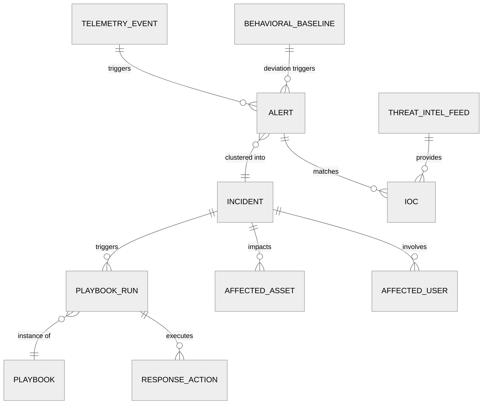

# Low-Level Design — AI-Native Cybersecurity Platform

## Data Model

### Core Entities

```
┌─────────────────────────────────────────────────────────┐
│                    TelemetryEvent                       │
│─────────────────────────────────────────────────────────│
│ event_id         : UUID (deterministic, for dedup)      │
│ tenant_id        : UUID                                 │
│ timestamp        : int64 (epoch_ms)                     │
│ ingestion_time   : int64 (epoch_ms)                     │
│ source_type      : enum (endpoint, network, cloud,      │
│                          identity, email)                │
│ event_type       : enum (process_create, file_write,    │
│                          network_connect, auth_attempt,  │
│                          dns_query, ...)                 │
│ severity_hint    : enum (info, low, medium, high, crit) │
│ agent_id         : string                               │
│ asset_id         : string                               │
│ user_id          : string (nullable)                    │
│ mitre_techniques : list<string> (e.g., ["T1059.001"])   │
│ fields           : map<string, variant>                 │
│   # Endpoint-specific: process_name, parent_pid,        │
│   #   command_line, file_hash, module_loads              │
│   # Network-specific: src_ip, dst_ip, src_port,         │
│   #   dst_port, protocol, bytes_sent, bytes_recv        │
│   # Identity-specific: auth_type, mfa_status, geo_loc   │
│   # Cloud-specific: api_call, resource_arn, region       │
│ enrichments      : map<string, variant>                 │
│   # Added during enrichment: ioc_matches, asset_risk,   │
│   #   user_risk_score, threat_intel_context              │
└─────────────────────────────────────────────────────────┘

┌─────────────────────────────────────────────────────────┐
│                       Alert                             │
│─────────────────────────────────────────────────────────│
│ alert_id         : UUID                                 │
│ tenant_id        : UUID                                 │
│ created_at       : int64 (epoch_ms)                     │
│ detection_source : enum (rule, ml_model, ueba, threat_  │
│                         intel, manual)                   │
│ detection_id     : string (rule ID or model ID)         │
│ severity         : enum (info, low, medium, high, crit) │
│ confidence       : float (0.0 - 1.0)                   │
│ mitre_tactics    : list<string>                         │
│ mitre_techniques : list<string>                         │
│ title            : string                               │
│ description      : string                               │
│ status           : enum (new, triaged, investigating,   │
│                         resolved_true_pos,               │
│                         resolved_false_pos, suppressed)  │
│ assigned_to      : string (nullable)                    │
│ incident_id      : UUID (nullable, set by correlation)  │
│ triggering_events: list<event_id>                       │
│ entity_context   : map<string, variant>                 │
│   # user, asset, process_tree, network_context          │
│ response_actions : list<ActionRef>                      │
│ tags             : list<string>                         │
└─────────────────────────────────────────────────────────┘

┌─────────────────────────────────────────────────────────┐
│                      Incident                           │
│─────────────────────────────────────────────────────────│
│ incident_id      : UUID                                 │
│ tenant_id        : UUID                                 │
│ created_at       : int64 (epoch_ms)                     │
│ updated_at       : int64 (epoch_ms)                     │
│ severity         : enum (info, low, medium, high, crit) │
│ confidence       : float (0.0 - 1.0)                   │
│ status           : enum (new, triaged, investigating,   │
│                         contained, remediated, closed)   │
│ title            : string                               │
│ summary          : string (auto-generated narrative)    │
│ kill_chain_stages: list<enum> (recon, weaponize,        │
│                   deliver, exploit, install, c2, exfil) │
│ mitre_mapping    : map<tactic, list<technique>>         │
│ alert_ids        : list<UUID>                           │
│ affected_assets  : list<asset_id>                       │
│ affected_users   : list<user_id>                        │
│ assigned_to      : string                               │
│ playbook_runs    : list<PlaybookRunRef>                 │
│ timeline         : list<TimelineEntry>                  │
│ ioc_extractions  : list<IOC>                            │
└─────────────────────────────────────────────────────────┘

┌─────────────────────────────────────────────────────────┐
│                         IOC                             │
│─────────────────────────────────────────────────────────│
│ ioc_id           : UUID                                 │
│ type             : enum (ip, domain, url, file_hash_    │
│                         md5, file_hash_sha256, email,    │
│                         mutex, registry_key, cert_hash)  │
│ value            : string                               │
│ source           : string (feed name or incident ID)    │
│ confidence       : float (0.0 - 1.0)                   │
│ severity         : enum (low, medium, high, critical)   │
│ first_seen       : int64 (epoch_ms)                     │
│ last_seen        : int64 (epoch_ms)                     │
│ expiry           : int64 (epoch_ms, for aging)          │
│ tags             : list<string>                         │
│ mitre_mapping    : list<string>                         │
│ related_campaigns: list<string>                         │
│ tlp              : enum (white, green, amber, red)      │
└─────────────────────────────────────────────────────────┘

┌─────────────────────────────────────────────────────────┐
│                  BehavioralBaseline                      │
│─────────────────────────────────────────────────────────│
│ entity_id        : string (user_id or asset_id)         │
│ entity_type      : enum (user, device, service_account, │
│                         application)                     │
│ tenant_id        : UUID                                 │
│ window_start     : int64 (epoch_ms)                     │
│ window_end       : int64 (epoch_ms)                     │
│ features         : map<string, BaselineStats>           │
│   # login_hour_histogram, geo_location_set,             │
│   # process_frequency_map, network_dest_set,            │
│   # data_volume_percentiles, privilege_usage_pattern    │
│ peer_group_id    : string                               │
│ risk_score       : float (0.0 - 100.0)                  │
│ anomaly_count_7d : int                                  │
│ last_updated     : int64 (epoch_ms)                     │
└─────────────────────────────────────────────────────────┘

  BaselineStats:
    mean   : float
    stddev : float
    p50    : float
    p95    : float
    p99    : float
    histogram : list<BucketCount>

┌─────────────────────────────────────────────────────────┐
│                      Playbook                           │
│─────────────────────────────────────────────────────────│
│ playbook_id      : UUID                                 │
│ tenant_id        : UUID                                 │
│ name             : string                               │
│ version          : int                                  │
│ trigger          : PlaybookTrigger                      │
│   # alert_severity >= high AND detection_source = ml    │
│   # OR manual trigger                                   │
│ steps            : list<PlaybookStep>                   │
│ max_execution_time: duration                            │
│ enabled          : boolean                              │
│ created_by       : string                               │
│ last_modified    : int64                                │
└─────────────────────────────────────────────────────────┘

  PlaybookStep:
    step_id    : string
    type       : enum (action, condition, approval_gate,
                       enrichment, notification, parallel,
                       loop, delay)
    config     : map<string, variant>
    on_success : step_id
    on_failure : step_id
    timeout    : duration
```

### Entity Relationship Diagram



---

## API Design

### Threat Hunting API

```
// Search telemetry events with query DSL
POST /api/v1/hunting/search
  Headers:
    Authorization: Bearer <token>
    X-Tenant-ID: <tenant_id>
  Body:
    query: string            // KQL-like query language
    time_range:
      start: timestamp
      end: timestamp
    filters:
      source_types: list<string>
      severity_min: enum
      mitre_techniques: list<string>
    aggregations:            // optional
      group_by: list<string>
      metrics: list<AggMetric>
    sort: list<SortField>
    limit: int (default: 100, max: 10000)
    cursor: string           // for pagination
  Response: 200 OK
    events: list<TelemetryEvent>
    aggregations: map<string, AggResult>
    total_count: int
    next_cursor: string
    query_time_ms: int

// Save a hunting query as a detection rule
POST /api/v1/hunting/queries/{query_id}/promote
  Body:
    rule_name: string
    severity: enum
    response_playbook_id: UUID (optional)
  Response: 201 Created
    rule_id: string
```

### Incident Management API

```
// List incidents with filters
GET /api/v1/incidents
  Query Params:
    status: list<enum>
    severity: list<enum>
    assigned_to: string
    time_range: start,end
    sort: field,direction
    limit: int
    cursor: string
  Response: 200 OK
    incidents: list<Incident>
    next_cursor: string

// Get incident detail with full timeline
GET /api/v1/incidents/{incident_id}
  Response: 200 OK
    incident: Incident
    alerts: list<Alert>
    timeline: list<TimelineEntry>
    affected_assets: list<AssetDetail>
    response_actions: list<ActionDetail>

// Update incident status
PATCH /api/v1/incidents/{incident_id}
  Body:
    status: enum
    severity: enum (optional, for re-classification)
    assigned_to: string (optional)
    notes: string (optional)
  Response: 200 OK

// Merge duplicate incidents
POST /api/v1/incidents/merge
  Body:
    incident_ids: list<UUID>  // min 2
    primary_id: UUID          // surviving incident
  Response: 200 OK
    merged_incident: Incident

// Extract IOCs from incident
POST /api/v1/incidents/{incident_id}/extract-iocs
  Response: 200 OK
    iocs: list<IOC>
    auto_blocked: list<IOC>   // IOCs already sent to block lists
```

### Playbook CRUD API

```
// Create a new playbook
POST /api/v1/playbooks
  Body:
    name: string
    trigger: PlaybookTrigger
    steps: list<PlaybookStep>
    enabled: boolean
  Response: 201 Created
    playbook: Playbook

// Test playbook with simulated alert
POST /api/v1/playbooks/{playbook_id}/test
  Body:
    simulated_alert: Alert
    dry_run: boolean (true = no real actions)
  Response: 200 OK
    execution_log: list<StepResult>
    would_execute_actions: list<Action>
    estimated_duration: duration

// List playbook executions
GET /api/v1/playbooks/{playbook_id}/runs
  Query Params:
    status: list<enum>
    time_range: start,end
  Response: 200 OK
    runs: list<PlaybookRun>
```

### Alert Management API

```
// Bulk update alert status
PATCH /api/v1/alerts/bulk
  Body:
    alert_ids: list<UUID>
    status: enum
    resolution_reason: string (required if resolving)
  Response: 200 OK
    updated_count: int
    failed: list<{alert_id, reason}>

// Suppress alert pattern (tuning)
POST /api/v1/alerts/suppressions
  Body:
    detection_id: string
    conditions: map<string, variant>
      # e.g., { "asset_tag": "dev-server", "process_name": "build-agent" }
    reason: string
    expiry: timestamp (optional, for temporary suppression)
  Response: 201 Created
    suppression_id: UUID
```

---

## Core Algorithms

### Algorithm 1: Behavioral Baseline Computation

The UEBA engine computes per-entity behavioral baselines using a sliding window approach with peer group comparison.

```
FUNCTION compute_behavioral_baseline(entity_id, entity_type, window_days):
    // Collect raw activity features over the window
    events = query_events(
        entity_id = entity_id,
        time_range = [now - window_days * DAY, now]
    )

    features = {}

    // Temporal features
    features["login_hours"] = build_histogram(
        events.filter(type = "auth_success"),
        bucket_by = hour_of_day,
        bins = 24
    )
    features["active_days"] = build_histogram(
        events,
        bucket_by = day_of_week,
        bins = 7
    )

    // Geographic features
    features["geo_locations"] = extract_unique_set(
        events.filter(type = "auth_success"),
        field = "geo_country"
    )

    // Process/application features
    features["process_frequency"] = build_frequency_map(
        events.filter(type = "process_create"),
        key = "process_name",
        top_k = 100
    )

    // Network destination features
    features["network_destinations"] = build_frequency_map(
        events.filter(type = "network_connect"),
        key = "dst_ip_subnet_24",
        top_k = 500
    )

    // Data volume features
    features["data_volume_daily"] = compute_stats(
        events.filter(type IN ["file_write", "file_upload"]),
        metric = "bytes_total",
        group_by = "date"
    )

    // Privilege usage features
    features["privilege_operations"] = build_frequency_map(
        events.filter(type = "privilege_escalation"),
        key = "target_privilege",
        top_k = 50
    )

    // Compute per-feature statistics
    baseline = {}
    FOR EACH feature_name, feature_data IN features:
        baseline[feature_name] = BaselineStats(
            mean = mean(feature_data),
            stddev = stddev(feature_data),
            p50 = percentile(feature_data, 50),
            p95 = percentile(feature_data, 95),
            p99 = percentile(feature_data, 99),
            histogram = feature_data
        )

    // Assign peer group (users in same department/role)
    peer_group = find_peer_group(entity_id, entity_type)
    baseline.peer_group_id = peer_group.id

    // Compute composite risk score
    baseline.risk_score = compute_entity_risk_score(
        baseline, peer_group.aggregate_baseline
    )

    RETURN baseline
```

### Algorithm 2: Anomaly Scoring Engine

Scores incoming events against the entity's behavioral baseline.

```
FUNCTION score_anomaly(event, baseline):
    anomaly_score = 0.0
    anomaly_factors = []

    // Temporal anomaly: is this event at an unusual time?
    hour = extract_hour(event.timestamp)
    temporal_score = 1.0 - baseline.login_hours.probability(hour)
    IF temporal_score > TEMPORAL_THRESHOLD:
        anomaly_score += temporal_score * WEIGHT_TEMPORAL
        anomaly_factors.append({
            factor: "unusual_time",
            detail: "Activity at hour {hour}, baseline probability {1 - temporal_score}",
            contribution: temporal_score * WEIGHT_TEMPORAL
        })

    // Geographic anomaly: is this a new/rare location?
    IF event.geo_location NOT IN baseline.geo_locations:
        geo_score = 1.0  // completely new location
        anomaly_score += geo_score * WEIGHT_GEO
        anomaly_factors.append({
            factor: "new_location",
            detail: "First activity from {event.geo_location}",
            contribution: geo_score * WEIGHT_GEO
        })

    // Impossible travel detection
    prev_event = get_most_recent_auth_event(event.user_id)
    IF prev_event IS NOT NULL:
        time_delta = event.timestamp - prev_event.timestamp
        distance = haversine(event.geo_coords, prev_event.geo_coords)
        required_travel_time = distance / MAX_TRAVEL_SPEED_KMH
        IF time_delta < required_travel_time * 0.8:  // 20% tolerance
            travel_score = 1.0 - (time_delta / required_travel_time)
            anomaly_score += travel_score * WEIGHT_IMPOSSIBLE_TRAVEL
            anomaly_factors.append({
                factor: "impossible_travel",
                detail: "{distance}km in {time_delta}min",
                contribution: travel_score * WEIGHT_IMPOSSIBLE_TRAVEL
            })

    // Process anomaly: is this process rare for this entity?
    IF event.type = "process_create":
        process_freq = baseline.process_frequency.get(event.process_name, 0)
        IF process_freq < RARE_PROCESS_THRESHOLD:
            proc_score = 1.0 - (process_freq / RARE_PROCESS_THRESHOLD)
            anomaly_score += proc_score * WEIGHT_PROCESS
            anomaly_factors.append({
                factor: "rare_process",
                detail: "{event.process_name} seen {process_freq} times in baseline",
                contribution: proc_score * WEIGHT_PROCESS
            })

    // Data volume anomaly: is the volume unusually high?
    IF event.type IN ["file_write", "file_upload"]:
        volume_z_score = (event.bytes - baseline.data_volume_daily.mean) /
                         max(baseline.data_volume_daily.stddev, MIN_STDDEV)
        IF volume_z_score > VOLUME_Z_THRESHOLD:
            vol_score = min(1.0, volume_z_score / MAX_Z_SCORE)
            anomaly_score += vol_score * WEIGHT_VOLUME
            anomaly_factors.append({
                factor: "high_data_volume",
                detail: "Z-score {volume_z_score}, {event.bytes} bytes vs mean {baseline.data_volume_daily.mean}",
                contribution: vol_score * WEIGHT_VOLUME
            })

    // Peer group comparison: is this entity deviating from peers?
    peer_baseline = get_peer_group_baseline(baseline.peer_group_id)
    peer_deviation = compute_peer_deviation(event, baseline, peer_baseline)
    IF peer_deviation > PEER_DEVIATION_THRESHOLD:
        anomaly_score += peer_deviation * WEIGHT_PEER
        anomaly_factors.append({
            factor: "peer_deviation",
            detail: "Deviates from peer group by {peer_deviation}",
            contribution: peer_deviation * WEIGHT_PEER
        })

    // Normalize to [0, 1]
    anomaly_score = min(1.0, anomaly_score)

    RETURN AnomalyResult(
        score = anomaly_score,
        factors = anomaly_factors,
        entity_risk_score = baseline.risk_score,
        should_alert = anomaly_score > ALERT_THRESHOLD
    )
```

### Algorithm 3: Alert Correlation and Incident Clustering

Groups related alerts into incidents using graph-based correlation.

```
FUNCTION correlate_alerts(new_alert, correlation_window):
    // Step 1: Find candidate alerts for correlation
    candidates = query_alerts(
        tenant_id = new_alert.tenant_id,
        time_range = [new_alert.created_at - correlation_window, now],
        status IN ["new", "triaged", "investigating"]
    )

    // Step 2: Build a correlation graph
    graph = CorrelationGraph()
    graph.add_node(new_alert)

    FOR EACH candidate IN candidates:
        score = compute_correlation_score(new_alert, candidate)
        IF score > CORRELATION_THRESHOLD:
            graph.add_edge(new_alert, candidate, weight = score)

    // Step 3: Compute correlation score between two alerts
    // (inlined for clarity)
    FUNCTION compute_correlation_score(alert_a, alert_b):
        score = 0.0

        // Shared entities (same user, asset, IP)
        shared_entities = intersect(
            alert_a.entity_set(), alert_b.entity_set()
        )
        score += len(shared_entities) * WEIGHT_SHARED_ENTITY

        // Temporal proximity (closer in time = more likely related)
        time_delta = abs(alert_a.created_at - alert_b.created_at)
        temporal_factor = exp(-time_delta / TEMPORAL_DECAY_CONSTANT)
        score += temporal_factor * WEIGHT_TEMPORAL_PROXIMITY

        // Kill chain progression (adjacent stages score higher)
        IF alerts_on_adjacent_kill_chain_stages(alert_a, alert_b):
            score += WEIGHT_KILL_CHAIN_ADJACENCY

        // Same MITRE tactic/technique
        shared_techniques = intersect(
            alert_a.mitre_techniques, alert_b.mitre_techniques
        )
        score += len(shared_techniques) * WEIGHT_MITRE_OVERLAP

        // Same campaign IOCs
        IF share_campaign_iocs(alert_a, alert_b):
            score += WEIGHT_CAMPAIGN_MATCH

        RETURN min(1.0, score)

    // Step 4: Find connected components (alert clusters = incidents)
    components = graph.connected_components()

    FOR EACH component IN components:
        IF component.size() == 1 AND component[0] == new_alert:
            // New standalone alert, no correlation found
            create_new_incident(new_alert)
        ELSE:
            // Merge into existing incident or create multi-alert incident
            existing_incidents = unique(
                alert.incident_id FOR alert IN component
                WHERE alert.incident_id IS NOT NULL
            )
            IF len(existing_incidents) == 1:
                add_alert_to_incident(new_alert, existing_incidents[0])
            ELSE IF len(existing_incidents) > 1:
                // Multiple incidents should be merged
                merged = merge_incidents(existing_incidents)
                add_alert_to_incident(new_alert, merged.id)
            ELSE:
                // No existing incident; create one for the cluster
                incident = create_incident_from_cluster(component)
                FOR EACH alert IN component:
                    add_alert_to_incident(alert, incident.id)

    // Step 5: Update incident severity and kill chain mapping
    incident = get_incident(new_alert.incident_id)
    incident.severity = max_severity(incident.alert_ids)
    incident.kill_chain_stages = union_kill_chain_stages(incident.alert_ids)
    incident.mitre_mapping = merge_mitre_mappings(incident.alert_ids)
    update_incident(incident)

    RETURN incident
```

### Algorithm 4: MITRE ATT&CK Technique Mapping

Maps raw telemetry events to MITRE ATT&CK techniques using a decision-tree approach.

```
FUNCTION map_to_mitre(event):
    techniques = []

    IF event.type == "process_create":
        // T1059: Command and Scripting Interpreter
        IF event.process_name IN SCRIPT_INTERPRETERS:
            sub_technique = INTERPRETER_MAP[event.process_name]
            techniques.append("T1059." + sub_technique)

        // T1055: Process Injection
        IF event.fields["injection_detected"]:
            techniques.append("T1055")

        // T1036: Masquerading
        IF is_name_similar_to_system_binary(event.process_name) AND
           NOT is_legitimate_path(event.process_path):
            techniques.append("T1036")

        // T1547: Boot or Logon Autostart Execution
        IF event.fields["persistence_mechanism_detected"]:
            techniques.append("T1547")

    ELSE IF event.type == "network_connect":
        // T1071: Application Layer Protocol for C2
        IF event.fields["dst_port"] IN [80, 443] AND
           is_beacon_pattern(event.fields["connection_timing"]):
            techniques.append("T1071")

        // T1048: Exfiltration Over Alternative Protocol
        IF event.fields["dst_port"] IN NON_STANDARD_PORTS AND
           event.fields["bytes_sent"] > EXFIL_THRESHOLD:
            techniques.append("T1048")

        // T1046: Network Service Discovery
        IF is_port_scan_pattern(event.fields["recent_connections"]):
            techniques.append("T1046")

    ELSE IF event.type == "auth_attempt":
        // T1110: Brute Force
        IF event.fields["failed_attempts_recent"] > BRUTE_FORCE_THRESHOLD:
            techniques.append("T1110")

        // T1078: Valid Accounts (suspicious use)
        IF event.fields["auth_success"] AND
           is_anomalous_auth(event, get_baseline(event.user_id)):
            techniques.append("T1078")

    // Map techniques to tactics
    FOR EACH technique IN techniques:
        tactic = TECHNIQUE_TO_TACTIC_MAP[technique]
        event.mitre_tactics.append(tactic)

    event.mitre_techniques = techniques
    RETURN event
```

---

## Storage Schema Design

### Hot Store (Streaming + 24h Real-Time Queries)

**Technology choice:** Distributed streaming platform with compacted topics

- **Partitioning:** By `tenant_id + source_type` — ensures events from the same tenant are co-located for efficient correlation, while source-type partitioning enables independent scaling of endpoint vs. network vs. cloud ingestion
- **Retention:** 24 hours with time-based compaction
- **Serialization:** Schema-registry-backed binary format for compact encoding and schema evolution

### Warm Store (30-Day Threat Hunting)

**Technology choice:** Columnar search engine optimized for time-series security data

- **Indexing strategy:** Primary index on `(tenant_id, timestamp)`. Secondary indexes on `event_type`, `user_id`, `asset_id`, `process_name`, `src_ip`, `dst_ip`, `file_hash`
- **Partitioning:** By day and tenant, with hot partitions on fast storage and older partitions migrated to cost-effective storage
- **Query language:** KQL-like syntax supporting boolean logic, wildcards, regular expressions, and aggregations

### Cold Archive (1-7 Year Compliance)

**Technology choice:** Object storage with columnar file format

- **File format:** Compressed columnar format partitioned by `tenant_id/year/month/day/source_type`
- **Metadata catalog:** Lightweight index mapping partition keys to file locations for efficient time-range queries
- **Access pattern:** Rare reads; primarily for compliance audits and long-term forensic investigations

### Graph Store (Entity Relationships)

**Technology choice:** Property graph database for entity-relationship modeling

- **Nodes:** Users, devices, IPs, processes, files, domains, services, vulnerabilities
- **Edges:** `logged_into`, `spawned`, `connected_to`, `accessed`, `downloaded`, `has_vulnerability`, `member_of`
- **Properties:** Timestamps, confidence scores, detection sources
- **Query pattern:** Multi-hop traversals for attack path analysis (e.g., "show all entities within 3 hops of compromised user X")

---

## Detection Rule Language

The platform supports a structured detection rule language that compiles to optimized evaluation plans.

```
// Example: Detect suspicious PowerShell execution from Office apps
rule "office_macro_to_powershell" {
    meta:
        severity    = high
        confidence  = 0.85
        mitre       = ["T1059.001", "T1204.002"]
        description = "Office application spawning PowerShell with encoded command"

    match:
        process_create WHERE
            parent_process_name IN ("winword.exe", "excel.exe", "powerpnt.exe") AND
            process_name IN ("powershell.exe", "pwsh.exe") AND
            (command_line CONTAINS "-enc" OR
             command_line CONTAINS "-EncodedCommand" OR
             command_line CONTAINS "FromBase64String")

    within: 30 seconds

    condition:
        count >= 1

    response:
        alert(severity = high)
        enrich(threat_intel_lookup = true)
        auto_respond(playbook = "isolate_and_investigate")
}
```
