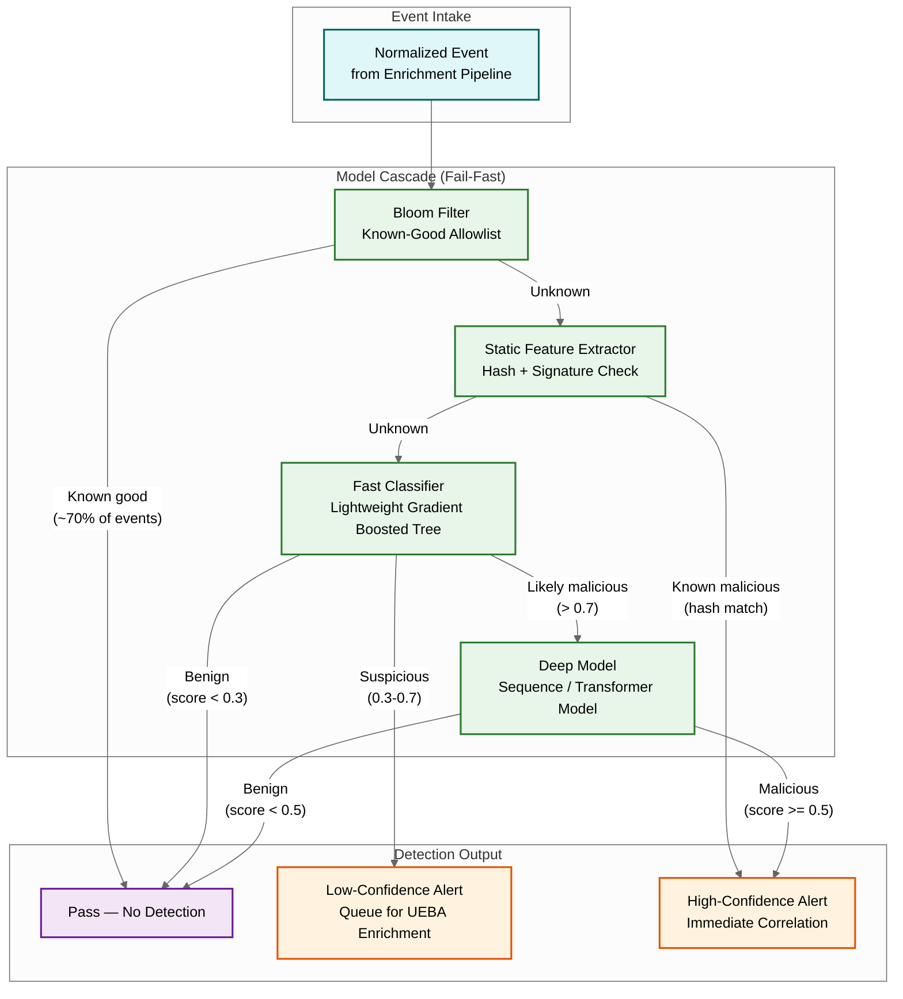
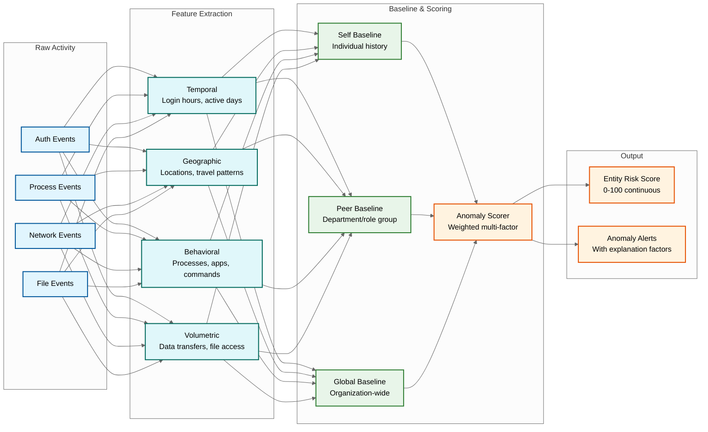
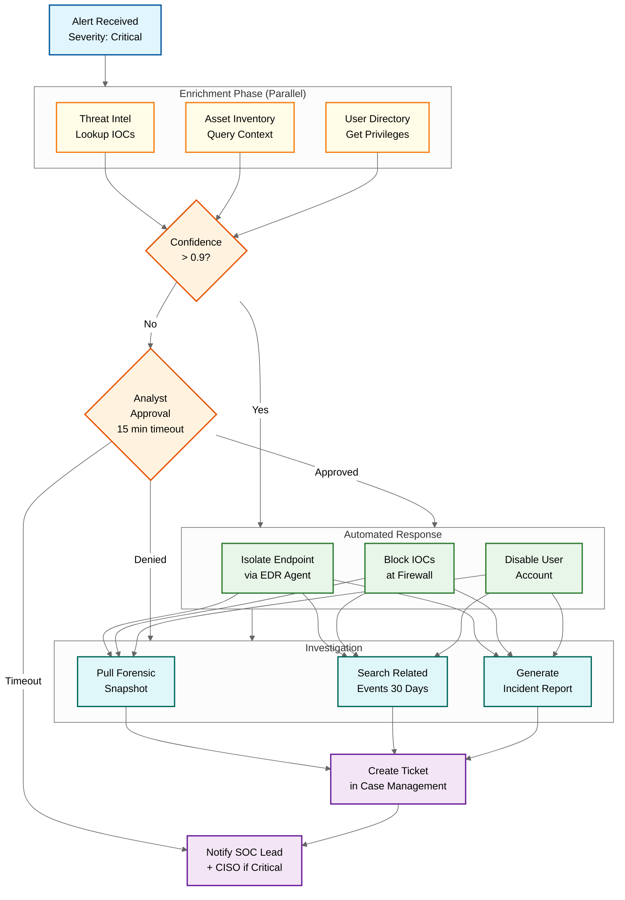

# Deep Dive & Bottlenecks — AI-Native Cybersecurity Platform

## Deep Dive 1: Real-Time ML Detection Engine

### Architecture

The ML detection engine processes every telemetry event through a cascade of models, optimized to minimize inference latency while maximizing detection coverage.



### The Model Cascade Pattern

The cascade is a critical optimization: running the most expensive model (deep transformer) on every event would require ~100x more GPU compute than the cascaded approach.

| Stage | Latency | Events Processed | Purpose |
|-------|---------|-----------------|---------|
| Bloom filter (known-good) | <1μs | 100% (70% filtered) | Eliminate trusted system processes, signed binaries |
| Static features (hash/sig) | <100μs | 30% | Catch known malware via hash matching against IOC database |
| Fast classifier (GBT) | <1ms | 28% | Feature-based classification using ~50 lightweight features (process lineage depth, command-line entropy, file path anomaly) |
| Deep model (transformer) | <50ms | 5% | Sequence model analyzing process chain + network behavior over a sliding window of the last 100 events per entity |

**Key insight:** The cascade processes 2.2M events/sec but only invokes the expensive deep model on ~110K events/sec (~5%), reducing GPU requirements by 20x.

### Feature Engineering for Security ML

Security ML features differ fundamentally from typical ML applications because the feature space is adversarial — attackers deliberately craft inputs to evade detection.

**Robust features (hard to evade):**
- Process tree depth and branching factor
- Entropy of command-line arguments
- Ratio of network bytes sent vs. received (C2 beaconing pattern)
- Time-of-day deviation from entity baseline
- Number of unique destination IPs in a time window

**Fragile features (easy to evade):**
- Exact process name (attacker renames binaries)
- Exact file hash (attacker recompiles with minor changes)
- Specific command-line flags (attacker uses aliases or encoding)
- Exact network port numbers (attacker uses standard ports)

**Design principle:** Weight the model towards robust behavioral features that describe what the software does, not what it's called. An attacker can rename `mimikatz.exe` to `svchost.exe`, but they cannot change the fact that it reads LSASS process memory.

### Model Update and Deployment Pipeline

```
Model Training Pipeline:
  1. Nightly batch: aggregate labeled data (analyst-confirmed true/false positives)
  2. Retrain models on sliding window of recent data (90 days) + curated attack corpus
  3. Evaluate on held-out test set with stratified sampling (ensuring rare attack types represented)
  4. Shadow deployment: new model runs in parallel with production model for 48 hours
  5. Comparison: if new model's false positive rate is within 10% of production AND
     detection rate >= production, promote to production
  6. Gradual rollout: 1% → 10% → 50% → 100% of traffic over 24 hours
  7. Automatic rollback: if false positive rate exceeds 2x baseline within any 1-hour window
```

---

## Deep Dive 2: Behavioral Analysis Engine (UEBA)

### Baseline Construction

The behavioral analysis engine maintains per-entity baselines that capture "normal" behavior across multiple dimensions.



### The Cold-Start Problem

When a new user joins or a new device is deployed, there is no behavioral baseline. The engine handles cold-start through a three-phase learning period:

| Phase | Duration | Strategy |
|-------|----------|----------|
| **Phase 1: Peer-only** | Days 1-3 | Score entirely against peer group baseline. Flag only extreme deviations (>3σ from peer mean). |
| **Phase 2: Blended** | Days 4-14 | Blend individual observations (weight increasing from 20% to 80%) with peer group baseline (weight decreasing from 80% to 20%). |
| **Phase 3: Self-sufficient** | Day 15+ | Score primarily against individual baseline with peer comparison as secondary signal. |

**Trade-off:** During Phase 1, the engine has high false negative risk (attacker behaviors may be within peer group norms) but low false positive risk (only extreme outliers trigger). This is the correct asymmetry for a new entity where false positives would be especially disruptive.

### Peer Group Construction

Peer groups are not simply "same department" — they are computed using behavioral clustering.

```
FUNCTION build_peer_groups(all_entities, feature_matrix):
    // Extract behavioral feature vectors for all entities
    vectors = []
    FOR EACH entity IN all_entities:
        vector = [
            entity.avg_login_hour,
            entity.login_day_distribution,  // 7-dim
            entity.unique_geo_locations,
            entity.unique_processes_count,
            entity.avg_daily_data_volume,
            entity.privilege_level,
            entity.department_encoding,     // one-hot
            entity.role_encoding            // one-hot
        ]
        vectors.append(normalize(vector))

    // Hierarchical clustering with silhouette score optimization
    best_k = optimize_cluster_count(vectors, k_range = [5, 50])
    clusters = hierarchical_clustering(vectors, k = best_k)

    // Validate: no cluster should be smaller than min_peer_group_size
    FOR EACH cluster IN clusters:
        IF cluster.size < MIN_PEER_GROUP_SIZE:
            merge_into_nearest_cluster(cluster, clusters)

    RETURN clusters
```

### Seasonal Adjustment

Behavioral baselines must account for predictable variations: month-end for finance teams, deployment days for engineering, audit seasons for compliance.

```
FUNCTION adjust_for_seasonality(baseline, current_time):
    // Day-of-week adjustment
    dow = day_of_week(current_time)
    dow_factor = baseline.day_of_week_weights[dow]

    // Month-end adjustment (finance teams)
    IF entity_department == "finance" AND days_until_month_end() <= 5:
        month_end_factor = 1.5  // relax thresholds by 50%
    ELSE:
        month_end_factor = 1.0

    // Holiday/PTO awareness
    IF is_known_holiday(current_time) OR entity_on_pto(entity_id):
        // Any activity during PTO is highly anomalous
        pto_factor = 0.3  // tighten thresholds by 70%
    ELSE:
        pto_factor = 1.0

    adjusted_threshold = baseline.threshold * dow_factor * month_end_factor * pto_factor
    RETURN adjusted_threshold
```

---

## Deep Dive 3: SOAR Playbook Execution Engine

### Workflow Execution Model

The SOAR engine executes playbooks as directed acyclic graphs (DAGs) of steps, supporting parallel branches, conditional routing, human-in-the-loop approval gates, and time-bounded wait states.



### Execution Guarantees

| Guarantee | Implementation |
|-----------|----------------|
| **Exactly-once execution** | Each playbook step is idempotent. Steps record completion in a durable store before progressing. Restarts resume from the last completed step. |
| **Timeout handling** | Every step has a configurable timeout. Approval gates default to escalation on timeout (not auto-approve). Action steps retry with exponential backoff (max 3 retries). |
| **Rollback capability** | Destructive actions (isolate endpoint, disable user) record an undo action. If the incident is determined to be a false positive, the analyst can trigger rollback to restore the endpoint and re-enable the user. |
| **Blast-radius control** | Playbooks have configurable scope limits: max endpoints to isolate per run (default: 5), max IPs to block per run (default: 20), max users to disable per run (default: 3). Exceeding limits escalates to human approval. |
| **Audit trail** | Every step execution is logged with: who triggered it, what action was taken, what the result was, and the duration. Immutable audit log for compliance. |

### The Approval Gate Design Problem

Approval gates are the most subtle component: they bridge the gap between automated speed and human judgment.

```
FUNCTION handle_approval_gate(step, context):
    // Determine who should approve
    approver = resolve_approver(
        step.approval_config,
        context.incident_severity,
        context.time_of_day
    )

    // Send approval request with rich context
    request = ApprovalRequest(
        summary = context.incident_summary,
        proposed_actions = step.pending_actions,
        blast_radius = estimate_blast_radius(step.pending_actions),
        confidence = context.detection_confidence,
        time_pressure = context.time_since_detection,
        expires_at = now() + step.timeout
    )
    send_approval_request(approver, request)

    // Wait with timeout
    response = wait_for_response(timeout = step.timeout)

    IF response IS NULL:  // timeout
        IF step.timeout_action == "escalate":
            // Escalate to next tier
            escalate_to_next_tier(step, context)
        ELSE IF step.timeout_action == "auto_approve":
            // Only for lower-severity incidents
            RETURN APPROVED
        ELSE:
            RETURN TIMEOUT_SKIPPED

    RETURN response.decision  // APPROVED or DENIED
```

---

## The False Positive vs. False Negative Trade-Off at Scale

This is the defining challenge of AI-driven security and the most important trade-off in the system.

### The Asymmetric Cost Matrix

|  | **Predicted: Benign** | **Predicted: Malicious** |
|--|----------------------|--------------------------|
| **Actual: Benign** | True Negative (no cost) | False Positive: analyst wastes 15 min investigating; if automated response fires, users are disrupted |
| **Actual: Malicious** | False Negative: attacker proceeds undetected; potential data breach ($4.5M avg cost) | True Positive: attack detected and contained |

The cost of a false negative is ~10,000x the cost of a false positive. But false positives vastly outnumber real attacks. In a typical enterprise:

- Events per day: ~190 billion
- True attacks per day: ~1-5
- Ratio of benign to malicious: ~50 billion to 1

Even a false positive rate of 0.001% produces:
- 190B events × 0.001% = 1.9M false alerts/day — completely unusable

This means the detection system must operate at astronomically low false positive rates while maintaining high true positive rates — a fundamental tension in ML systems.

### Strategies to Manage the Trade-Off

1. **Tiered confidence thresholds:** High-confidence detections (>0.95) trigger automated response. Medium-confidence (0.7-0.95) generate alerts for analyst review. Low-confidence (0.3-0.7) are logged for threat hunting but not alerted.

2. **Multi-signal corroboration:** A single detector at 95% precision with 5% false positive rate is unusable at scale. But if three independent detectors (rule + ML + UEBA) all flag the same entity within a time window, the corroborated precision jumps to >99.99%.

3. **Alert deduplication and clustering:** 1,000 alerts about the same compromised account doing 1,000 suspicious things should be one incident, not 1,000 alerts.

4. **Adaptive thresholds per entity:** A server that legitimately runs PowerShell 1,000 times/day needs a different threshold than a marketing laptop that has never run PowerShell.

5. **Feedback loops:** Every analyst resolution (true positive / false positive) feeds back into model retraining, rule tuning, and baseline adjustment. This creates a flywheel: better models → fewer false positives → analysts investigate more carefully → higher-quality labels → even better models.

---

## Race Conditions in Concurrent Alert Correlation

### The Double-Correlation Problem

When two alerts arrive simultaneously and both correlate with the same existing incident, naive concurrent processing can produce:

1. **Duplicate incidents:** Both correlation processes create a new incident because neither sees the other's alert yet.
2. **Lost correlations:** Alert A creates an incident but Alert B doesn't see it (read-before-write race), creating a separate incident.
3. **Deadlocks:** Two processes try to merge the same pair of incidents in opposite order.

### Solution: Optimistic Correlation with Conflict Resolution

```
FUNCTION correlate_with_concurrency(alert):
    // Optimistic approach: compute correlation without locking
    candidate_incident = find_best_matching_incident(alert)

    IF candidate_incident IS NULL:
        // Try to create new incident with CAS (compare-and-swap)
        success = try_create_incident(alert, expected_version = 0)
        IF NOT success:
            // Another process created an incident; retry correlation
            RETRY correlate_with_concurrency(alert)
    ELSE:
        // Try to add alert to incident with CAS on incident version
        success = try_add_to_incident(
            alert, candidate_incident.id,
            expected_version = candidate_incident.version
        )
        IF NOT success:
            // Incident was modified concurrently; re-read and retry
            RETRY correlate_with_concurrency(alert)

    // Periodic background process: merge incidents that should be correlated
    // but were created separately due to race conditions
    BACKGROUND merge_overlapping_incidents(window = 5_minutes)
```

The background merger is critical: it catches correlation that real-time processing missed due to ordering or timing, ensuring eventual correctness even if real-time correlation is imperfect.

---

## Bottleneck Analysis

### Bottleneck 1: Telemetry Ingestion Throughput

**Problem:** 2.2M events/sec sustained, with 10x burst during incident response (when agents increase telemetry verbosity).

**Mitigation:**
- Streaming bus partitioned by `tenant_id + source_type` for parallelism
- Ingestion nodes are stateless and horizontally scalable
- Back-pressure mechanism: when ingestion lag exceeds 30 seconds, agents switch to reduced-verbosity mode (essential events only)
- Tiered quality of service: security-critical events (alerts, response confirmations) get priority partitions; telemetry events are best-effort during overload

### Bottleneck 2: ML Inference Latency at Scale

**Problem:** Deep model inference takes 10-50ms per event, but only 5% of events reach the deep model (cascade filters the rest). During bursts, the deep model queue can grow.

**Mitigation:**
- GPU inference batching: accumulate events into micro-batches (32-128 events), reducing per-event GPU overhead through parallelism
- Adaptive cascade threshold: when deep model queue exceeds threshold, temporarily raise the fast classifier's "likely malicious" threshold from 0.7 to 0.8, sending fewer events to the deep model
- Model distillation: periodically train a smaller "student" model from the deep model's outputs, deploy as a fallback for capacity emergencies

### Bottleneck 3: Threat Hunting Query Performance

**Problem:** Analysts search over 30 days of data (450 TB) with ad-hoc queries. Full scans are prohibitively slow.

**Mitigation:**
- Columnar storage with per-column compression and skip indexes (min/max per block)
- Materialized views for common query patterns (group by process_name, group by src_ip)
- Tiered query routing: queries touching <24h go to hot store (sub-second); queries touching <7d go to warm store (seconds); queries touching >7d go to cold store (minutes with async notification)
- Bloom filter indexes on high-cardinality fields (file_hash, command_line tokens)

### Bottleneck 4: Graph Traversal for Alert Correlation

**Problem:** Graph queries like "find all entities within 3 hops of compromised user X" can be slow on highly connected nodes (e.g., domain controllers, shared service accounts).

**Mitigation:**
- Degree-capped traversal: limit max fanout per hop (e.g., traverse at most 100 neighbors per hop, prioritized by edge recency and weight)
- Pre-computed attack path summaries for high-value assets
- Time-bounded graph: edges older than the correlation window are excluded from traversal
- Asynchronous graph enrichment: initial correlation uses a lightweight heuristic; full graph analysis runs asynchronously and may merge incidents post-hoc
