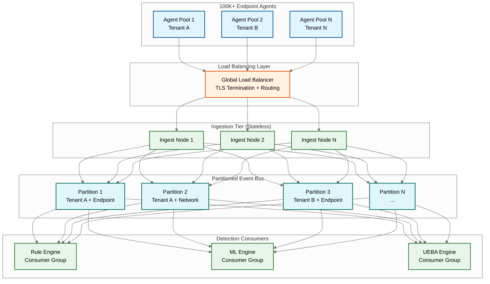
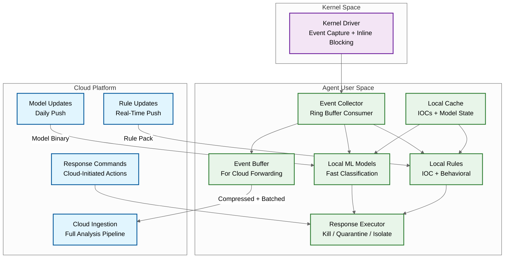
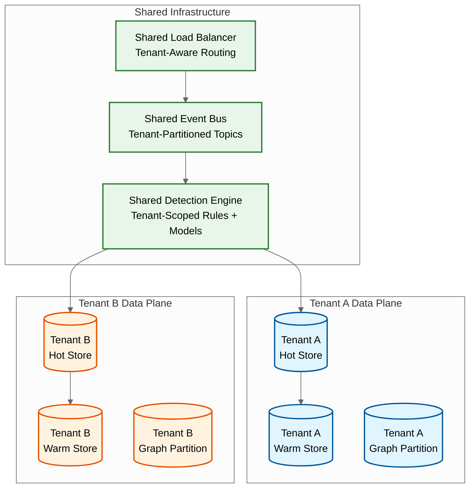

# Scalability & Reliability — AI-Native Cybersecurity Platform

## Scaling Telemetry Ingestion (Millions of Events/sec)

### Horizontal Scaling Architecture

The ingestion pipeline is designed for linear horizontal scaling by partitioning the event stream across multiple independent processing lanes.

### Scaling Dimensions

| Dimension | Strategy | Details |
|-----------|----------|---------|
| **Ingestion throughput** | Stateless horizontal scaling | Add ingestion nodes; each handles ~11K events/sec. Auto-scale based on queue depth. |
| **Event bus capacity** | Partition splitting | Add partitions as tenants or event volume grows. Re-partition without downtime using consumer group rebalancing. |
| **Detection compute** | Independent consumer groups | Rule engine, ML engine, and UEBA engine scale independently. Each reads from the same partitions but processes events in parallel. |
| **Storage throughput** | Write fan-out | Events are written to hot store, warm store (async), and graph store (alerts only) in parallel. Each storage tier scales independently. |

### Back-Pressure and Load Shedding

When ingestion rate exceeds processing capacity, the system applies graduated load shedding:

| Level | Trigger | Action |
|-------|---------|--------|
| **Level 0: Normal** | Queue depth < 10s | Full processing pipeline |
| **Level 1: Elevated** | Queue depth 10-60s | Disable low-priority enrichments (asset risk scoring, vulnerability correlation) |
| **Level 2: High** | Queue depth 60-300s | Skip deep ML model; rely on fast classifier + rules only |
| **Level 3: Critical** | Queue depth > 300s | Agent-side sampling: agents reduce telemetry to essential events only (process create, network connect, auth events) |

**Key principle:** Load shedding never drops security-critical events (alerts, response confirmations, agent health). It reduces the fidelity of routine telemetry to preserve the detection pipeline's capacity for what matters.

---

## Edge-Cloud Hybrid Detection Architecture

### The Detection Split

Security detection operates across a spectrum from edge (endpoint agent) to cloud (centralized platform), with each location offering different trade-offs.

| Detection Tier | Location | Latency | Model Complexity | Context Available | Update Frequency |
|---------------|----------|---------|-----------------|-------------------|-----------------|
| **Tier 0: Kernel-level** | Endpoint kernel driver | <1ms | Lightweight rules, hash matching | Local process + file only | Weekly (driver update) |
| **Tier 1: Agent-level** | Endpoint user-space agent | <100ms | Small ML models (gradient boosted trees), behavioral rules | Local process tree + recent history | Daily (model push) |
| **Tier 2: Cloud real-time** | Streaming pipeline | <1s | Large ML models (transformers), full rule engine | All telemetry, threat intel, asset context | Continuous (streaming model serving) |
| **Tier 3: Cloud batch** | Batch analytics | <15 min | UEBA baselines, graph analytics, threat hunting | Full historical data | Hourly (baseline recompute) |

### Agent Architecture for Edge Detection

### Offline Protection

When the endpoint loses cloud connectivity, the agent continues protecting with:

- **Local IOC cache:** Last-synced IOCs (typically refreshed daily) — catches known threats
- **Local ML models:** Last-pushed models — catches novel threats matching trained patterns
- **Local behavioral rules:** Process tree anomalies, ransomware canary detection (mass file encryption), credential dumping detection (LSASS access)
- **Event buffering:** Up to 48 hours of telemetry buffered locally (compressed), forwarded when connectivity restores

**Limitation:** During offline mode, the agent cannot access cloud-side context (other endpoints' telemetry, threat intel updates, UEBA baselines). Cross-endpoint correlation stops.

---

## Multi-Tenant Architecture for Managed Security

### Tenant Isolation Model

### Isolation Guarantees

| Layer | Isolation Method | Guarantee |
|-------|-----------------|-----------|
| **Network** | Tenant-specific TLS certificates; agent authenticates with tenant-scoped API keys | No cross-tenant network traffic |
| **Compute** | Shared detection engines operate on tenant-partitioned data; no cross-partition reads | Logical isolation; noisy neighbor limits via per-tenant rate limiting |
| **Storage** | Separate storage namespaces per tenant; encryption with per-tenant keys | Cryptographic isolation |
| **Detection rules** | Per-tenant rule sets with shared global rules (platform-provided) | Tenant cannot see or modify another tenant's custom rules |
| **ML models** | Shared base models + per-tenant fine-tuned models | Base model trained on anonymized aggregate data; fine-tuned model trained only on tenant's data |
| **SOAR playbooks** | Per-tenant playbook definitions; integration credentials stored in per-tenant vaults | Playbook from Tenant A cannot trigger actions in Tenant B |

### Noisy Neighbor Prevention

Large tenants (100K+ endpoints) can overwhelm shared resources. Prevention mechanisms:

- **Per-tenant ingestion rate limits:** Configurable events/sec quota per tenant with token-bucket rate limiting
- **Per-tenant detection compute quotas:** ML inference time allocated proportionally; burst capacity shared with preemption
- **Per-tenant query concurrency limits:** Max concurrent hunting queries per tenant
- **Weighted fair queuing:** Event bus consumers process events from all tenants fairly, weighted by tier (enterprise > SMB)

---

## Disaster Recovery

### Recovery Architecture

| Component | RPO | RTO | Strategy |
|-----------|-----|-----|----------|
| Telemetry ingestion | 0 (no data loss) | <5 min | Multi-AZ active-active; agents retry to alternate AZs |
| Detection pipeline | <1 min | <15 min | Standby consumers in DR region, activated on failover |
| Alert/incident state | <1 min | <15 min | Synchronous replication within region; async to DR |
| Warm search data | <1 hour | <4 hours | Async replication; some recent data may be re-indexed from hot store |
| SOAR playbook state | <1 min | <15 min | Playbook definitions replicated; in-flight executions may need restart |
| Configuration (rules, models) | <5 min | <15 min | Configuration store replicated to DR; agent configuration cached locally |

### Failover Scenarios

**Scenario 1: Single AZ failure**
- Agents failover to other AZs in the same region (automatic, <30 seconds)
- Detection pipeline rebalances across remaining AZs
- No data loss; brief increase in detection latency during rebalancing

**Scenario 2: Full region failure**
- Agents failover to DR region endpoints (automatic, <5 minutes)
- DR region detection pipeline activates from standby
- Alert state available from async replication (RPO <1 min)
- Warm search data may have up to 1 hour gap; agents re-send buffered events

**Scenario 3: Cloud platform failure (total outage)**
- Endpoint agents continue protecting locally (Tier 0 + Tier 1 detection)
- Events buffered locally for up to 48 hours
- No cloud-side correlation, threat hunting, or SOAR automation
- Recovery: agents drain buffered events on restoration; detection pipeline processes backlog

---

## Scaling for Growth

### Growth Vectors and Scaling Responses

| Growth Vector | Current | 2x Scale | 10x Scale |
|---------------|---------|----------|-----------|
| Endpoints | 100K | Add ingestion nodes (stateless) | Shard event bus; add regions for geo-distribution |
| Event volume | 2.2M/s | Increase partition count; add detection consumers | Tiered ingestion: pre-filter at edge; sample routine telemetry |
| Detection rules | 5,000 | Optimize rule engine with decision tree compilation | Partition rules by event type; evaluate only applicable rules per event |
| ML models | 10 models | Add GPU inference nodes | Model distillation; move lightweight models to edge |
| Tenants (MSSP) | 100 | Per-tenant resource pools | Dedicated infrastructure for large tenants; shared for SMB |
| Retention | 30 days | Add warm storage nodes | Tiered storage with intelligent archival (keep only alerts + context for >30d) |
