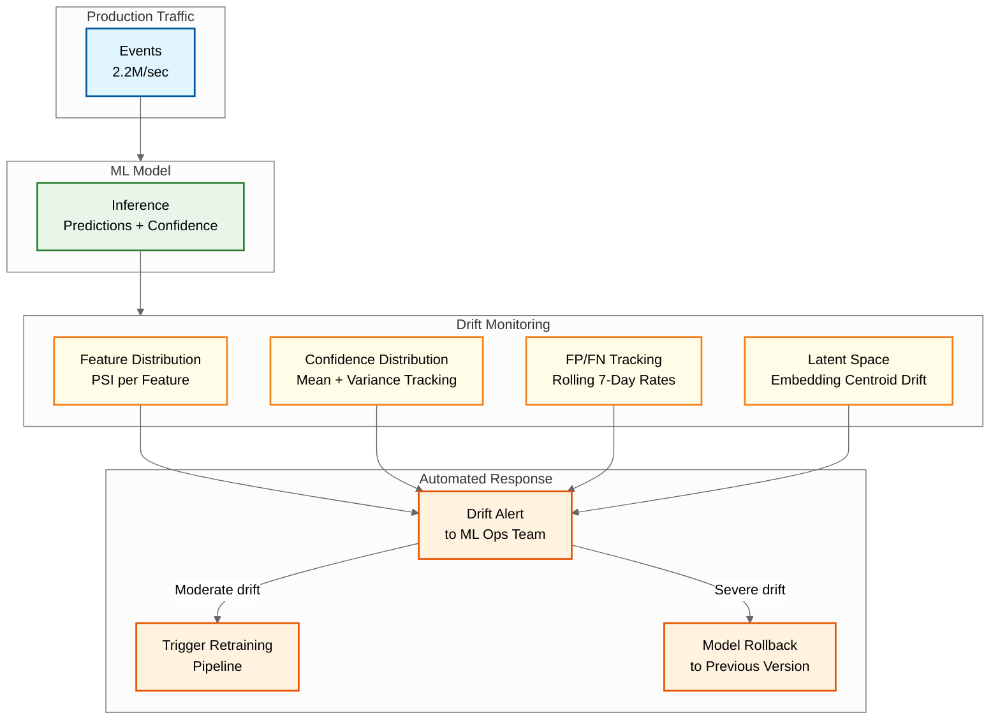

# Observability — AI-Native Cybersecurity Platform

## The Meta-Observability Challenge

Observing a cybersecurity platform presents a unique recursion: the system that monitors everything else must itself be monitored — and its monitoring failures are security-critical. If the detection pipeline silently drops events, the organization is blind to attacks. If SOAR playbooks fail silently, automated response is a fiction. The observability strategy must be as rigorous as the security platform itself.

---

## Detection Pipeline Health Metrics

### Ingestion Pipeline Metrics

| Metric | Description | Alert Threshold | Measurement |
|--------|-------------|-----------------|-------------|
| `ingestion.events_per_sec` | Total events ingested per second | <80% of expected baseline | Counter at ingestion gateway |
| `ingestion.lag_seconds` | Time between event generation (agent timestamp) and ingestion | p99 > 60s | Diff between event timestamp and ingestion timestamp |
| `ingestion.error_rate` | Percentage of events that fail parsing/normalization | >0.1% | Error counter / total counter |
| `ingestion.agent_heartbeat_missing` | Count of agents that have not sent a heartbeat in the last 5 minutes | >0 | Heartbeat tracker with TTL-based expiry |
| `ingestion.dedup_ratio` | Percentage of events identified as duplicates | >5% (indicates agent retry storm) | Dedup filter counter |
| `ingestion.backpressure_level` | Current load shedding level (0-3) | Level >= 2 for > 5 min | State variable in ingestion controller |

### Detection Engine Metrics

| Metric | Description | Alert Threshold | Measurement |
|--------|-------------|-----------------|-------------|
| `detection.rule_evaluation_latency_ms` | Time to evaluate all rules against one event | p99 > 50ms | Timer around rule engine |
| `detection.ml_inference_latency_ms` | Time for ML model cascade to score one event | p99 > 100ms | Timer around ML pipeline |
| `detection.ml_queue_depth` | Number of events waiting for deep model inference | >10,000 | Queue size metric |
| `detection.alerts_per_hour` | Total alerts generated per hour | <50% or >200% of 7-day baseline | Alert counter |
| `detection.rules_evaluated_per_event` | Average rules evaluated per event (after optimization) | >500 (indicates optimization failure) | Counter per event |
| `detection.model_error_rate` | Percentage of events where model inference fails | >0.01% | Error counter |
| `detection.cascade_filter_ratio` | Percentage of events filtered at each cascade stage | Bloom < 50% (indicates allowlist stale) | Per-stage counters |

### Correlation Engine Metrics

| Metric | Description | Alert Threshold | Measurement |
|--------|-------------|-----------------|-------------|
| `correlation.alerts_to_incidents_ratio` | Alerts per incident (dedup/correlation effectiveness) | <5 (under-correlating) or >500 (over-correlating) | Alert count / incident count |
| `correlation.incident_creation_latency_ms` | Time from alert to incident creation | p99 > 30s | Timer from alert timestamp to incident creation |
| `correlation.orphan_alerts` | Alerts that remain uncorrelated for >1 hour | >100/hour | Periodic scan of uncorrelated alerts |
| `correlation.merge_rate` | Incidents merged per hour (indicates initial under-correlation) | >10/hour (indicates poor real-time correlation) | Merge event counter |

---

## Model Drift Monitoring for ML Detectors

ML models in security degrade for two reasons: (1) **concept drift** — the distribution of benign and malicious behavior changes over time (new applications, new attack techniques), and (2) **adversarial drift** — attackers deliberately evolve their techniques to evade the current model.

### Drift Detection Metrics

| Metric | What It Measures | Detection Method | Action |
|--------|-----------------|------------------|--------|
| `model.feature_distribution_shift` | Input feature distributions diverge from training data | KL-divergence or PSI (Population Stability Index) on each feature; alert if PSI > 0.2 | Trigger model retraining pipeline |
| `model.prediction_confidence_distribution` | Average prediction confidence is shifting | Monitor mean and variance of model confidence scores; alert if mean drops >10% | Investigate if model is becoming uncertain about new event patterns |
| `model.false_positive_rate_rolling` | Rolling 7-day false positive rate | Computed from analyst resolutions; alert if >2x baseline | Tune thresholds or retrain |
| `model.false_negative_proxy` | Threats detected by rules but missed by ML | Count of rule-only detections that ML scored as benign | Indicates model blind spots; retrain with these as positive examples |
| `model.latent_space_drift` | Model's internal representations are shifting | Monitor the centroid of embedding vectors for benign and malicious classes; alert if centroids move >2σ | Early warning of concept drift before prediction quality degrades |

### Model Monitoring Dashboard



### Shadow Model Evaluation

Every model update runs as a shadow alongside production for 48 hours before promotion:

```
FUNCTION shadow_model_evaluation(production_model, candidate_model, events):
    FOR EACH event IN events:
        prod_result = production_model.predict(event)
        cand_result = candidate_model.predict(event)

        // Record both predictions
        log_prediction_pair(event.id, prod_result, cand_result)

        // Only production model's result is used for alerting
        USE prod_result

    // After 48 hours, compare:
    comparison = compare_models(
        production_predictions,
        candidate_predictions,
        analyst_labels  // available for resolved alerts
    )

    IF comparison.candidate_fp_rate <= production_fp_rate * 1.1 AND
       comparison.candidate_tp_rate >= production_tp_rate:
        PROMOTE candidate_model TO production
    ELSE:
        REJECT candidate_model
        log_rejection_reason(comparison)
```

---

## MTTD and MTTR Tracking

### Mean Time to Detect (MTTD)

MTTD measures the elapsed time from when a malicious activity first occurs to when the platform generates an alert.

| Detection Tier | MTTD Target | Measurement Method |
|---------------|-------------|-------------------|
| Known malware (hash match) | <1 second | `alert.timestamp - event.agent_timestamp` for hash-based detections |
| Known TTP (rule match) | <5 seconds | `alert.timestamp - event.agent_timestamp` for rule-based detections |
| Novel threat (ML detection) | <30 seconds | `alert.timestamp - event.agent_timestamp` for ML-based detections |
| Behavioral anomaly (UEBA) | <15 minutes | `alert.timestamp - first_anomalous_event.timestamp` |
| Advanced persistent threat | <4 hours | `alert.timestamp - earliest_correlated_event.timestamp` (post-incident analysis) |

### Mean Time to Respond (MTTR)

MTTR measures the elapsed time from alert generation to first containment action.

| Response Type | MTTR Target | Measurement |
|---------------|-------------|-------------|
| Automated (SOAR playbook) | <5 minutes | `first_action.timestamp - alert.timestamp` |
| Semi-automated (with approval gate) | <30 minutes | `first_action.timestamp - alert.timestamp` (includes approval wait) |
| Manual (analyst-driven) | <4 hours | `first_action.timestamp - alert.timestamp` |

### MTTD/MTTR Tracking Implementation

```
FUNCTION compute_mttd_mttr(incidents, period):
    mttd_values = []
    mttr_values = []

    FOR EACH incident IN incidents.where(period):
        IF incident.status IN ["resolved_true_pos", "remediated"]:
            // MTTD: time from earliest malicious event to first alert
            earliest_event = min(
                event.agent_timestamp
                FOR event IN incident.triggering_events
            )
            first_alert = min(
                alert.created_at FOR alert IN incident.alerts
            )
            mttd = first_alert - earliest_event
            mttd_values.append(mttd)

            // MTTR: time from first alert to first containment action
            first_action = min(
                action.executed_at
                FOR action IN incident.response_actions
                WHERE action.type IN ["isolate", "block", "disable"]
            )
            IF first_action IS NOT NULL:
                mttr = first_action - first_alert
                mttr_values.append(mttr)

    RETURN {
        mttd_p50: percentile(mttd_values, 50),
        mttd_p95: percentile(mttd_values, 95),
        mttd_mean: mean(mttd_values),
        mttr_p50: percentile(mttr_values, 50),
        mttr_p95: percentile(mttr_values, 95),
        mttr_mean: mean(mttr_values)
    }
```

---

## Alert Fatigue Metrics

Alert fatigue is the single greatest operational risk in security operations. When analysts are overwhelmed by alerts, they miss real attacks.

### Key Alert Fatigue Indicators

| Metric | Description | Healthy Range | Alert Threshold |
|--------|-------------|---------------|-----------------|
| `alerts.total_per_analyst_per_day` | Alerts assigned to each analyst daily | 30-50 | >100 (cognitive overload) |
| `alerts.mean_investigation_time_min` | Average time spent investigating each alert | 10-20 min | <3 min (rubber-stamping) or >45 min (too complex) |
| `alerts.close_without_action_rate` | Percentage of alerts closed without any response action | 30-50% | >80% (indicates too many low-value alerts) |
| `alerts.reopen_rate` | Percentage of closed alerts reopened within 7 days | <5% | >15% (indicates premature closure) |
| `alerts.auto_suppressed_rate` | Percentage of alerts suppressed by tuning rules | 20-60% | >90% (indicates over-suppression, may miss real threats) |
| `alerts.time_to_first_triage_min` | Time from alert creation to first analyst interaction | <15 min for critical | >60 min for critical (backlog building) |
| `alerts.escalation_rate` | Percentage of Tier 1 alerts escalated to Tier 2 | 10-20% | >40% (indicates Tier 1 cannot handle complexity) |
| `alerts.false_positive_trend` | 7-day rolling false positive rate | Stable or decreasing | Increasing for 3+ consecutive weeks (model/rule degradation) |

### Alert Fatigue Mitigation Strategies (Observed in Metrics)

```
FUNCTION compute_alert_fatigue_score(analyst_id, period):
    metrics = query_analyst_metrics(analyst_id, period)

    fatigue_indicators = 0

    // Indicator 1: High volume
    IF metrics.alerts_per_day > 100:
        fatigue_indicators += 1

    // Indicator 2: Decreasing investigation time (rushing)
    IF metrics.avg_investigation_time_trend == "decreasing" AND
       metrics.avg_investigation_time < 3_minutes:
        fatigue_indicators += 2  // strong indicator

    // Indicator 3: High close-without-action rate
    IF metrics.close_without_action_rate > 0.8:
        fatigue_indicators += 1

    // Indicator 4: Working outside normal hours
    IF metrics.after_hours_alert_percentage > 0.3:
        fatigue_indicators += 1

    // Indicator 5: Rising backlog
    IF metrics.unresolved_alert_count > metrics.daily_capacity * 2:
        fatigue_indicators += 1

    fatigue_score = fatigue_indicators / 6.0  // normalized 0-1

    IF fatigue_score > 0.5:
        alert_soc_manager(
            analyst = analyst_id,
            fatigue_score = fatigue_score,
            recommendation = "Redistribute workload or increase detection tuning"
        )

    RETURN fatigue_score
```

---

## Platform Health Dashboard

### Critical SLIs (Service Level Indicators)

| SLI | Description | SLO | Measurement Window |
|-----|-------------|-----|--------------------|
| Event ingestion completeness | Events ingested / events generated | >99.9% | 5-minute rolling |
| Detection pipeline latency | p99 event-to-alert latency | <3 seconds | 5-minute rolling |
| SOAR execution success rate | Playbook runs completed successfully / total runs | >95% | 1-hour rolling |
| Agent connectivity | Agents reporting / total registered agents | >99.5% | 5-minute snapshot |
| Search query latency (7-day) | p95 query response time for 7-day queries | <15 seconds | 1-hour rolling |
| Model inference availability | Successful inferences / total inference requests | >99.99% | 1-hour rolling |

### Alerting on Observability Gaps

The most dangerous failure mode is a silent gap in observability — telemetry stops flowing from a subset of endpoints, but no alert fires because the volume decrease is within normal variance.

```
FUNCTION detect_observability_gaps():
    // Per-agent expected event rate (learned from 30-day baseline)
    FOR EACH agent IN registered_agents:
        expected_rate = agent.baseline_events_per_minute
        actual_rate = count_events(agent.id, last_5_minutes) / 5

        IF actual_rate < expected_rate * 0.1:  // 90% drop
            IF agent.last_heartbeat > 5_minutes_ago:
                // Agent is alive but not sending events — possible tampering
                create_alert(
                    type = "agent_telemetry_gap",
                    severity = "high",
                    detail = "Agent {agent.id} heartbeat active but event rate dropped 90%",
                    possible_cause = "Agent tampered, blinded, or sandboxed"
                )
            ELSE:
                // Agent offline — expected for shutdowns, less concerning
                create_alert(
                    type = "agent_offline",
                    severity = "medium",
                    detail = "Agent {agent.id} has not sent heartbeat in 5 minutes"
                )
```

---

## Operational Dashboards

### SOC Manager Dashboard

- **Real-time:** Active incidents by severity, analyst workload distribution, SOAR playbook execution status
- **Trending:** MTTD/MTTR over time (7-day/30-day), alert volume vs. analyst capacity, false positive rate trend
- **Coverage:** MITRE ATT&CK heatmap showing detection coverage and gaps, agent deployment status

### Platform Engineering Dashboard

- **Ingestion:** Events/sec by source type, ingestion lag, back-pressure level, error rates
- **Detection:** Rule evaluation throughput, ML inference latency and queue depth, cascade filter ratios
- **Storage:** Hot/warm/cold storage utilization, query performance, retention compliance
- **Infrastructure:** Node health, CPU/memory utilization, network bandwidth, cross-AZ replication lag

### ML Operations Dashboard

- **Model performance:** Rolling FP/TP rates per model, confidence distribution, feature importance stability
- **Drift monitoring:** PSI scores per feature, latent space centroid movement, prediction distribution shifts
- **Pipeline:** Training job status, shadow evaluation results, model promotion history, rollback events
