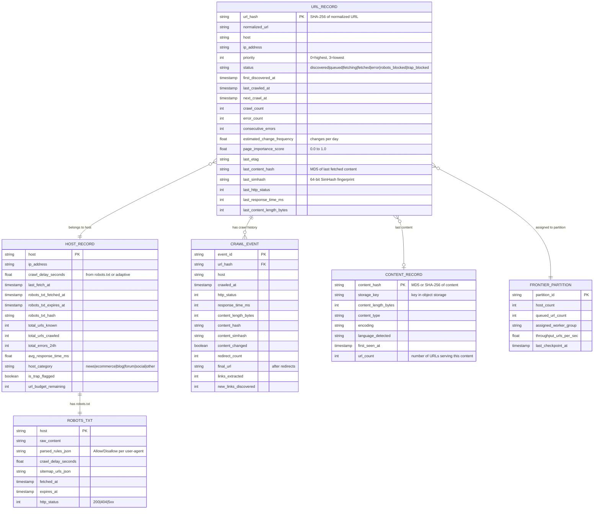

# Low-Level Design — Web Crawlers

## Data Model

### Core Entities



### Indexing Strategy

| Entity | Index | Purpose |
|--------|-------|---------|
| URL_RECORD | `(host, status, next_crawl_at)` | Frontier dequeue: find next URL for a host that is ready for crawl |
| URL_RECORD | `(url_hash)` | Primary key lookup for deduplication and metadata updates |
| URL_RECORD | `(priority, next_crawl_at)` | Recrawl scheduler: find highest-priority URLs due for recrawl |
| HOST_RECORD | `(ip_address)` | IP-based politeness: find all hosts sharing an IP |
| HOST_RECORD | `(robots_txt_expires_at)` | robots.txt refresh: find hosts with expiring robots.txt |
| CRAWL_EVENT | `(url_hash, crawled_at DESC)` | Recent crawl history for change frequency estimation |
| CONTENT_RECORD | `(content_hash)` | Content deduplication lookup |

### Partitioning / Sharding Strategy

| Entity | Shard Key | Rationale |
|--------|-----------|-----------|
| URL_RECORD | `host` (consistent hash) | All URLs for a host are co-located — essential for per-host politeness enforcement and frontier partitioning |
| HOST_RECORD | `host` (same partition as URL_RECORD) | Host metadata co-located with its URLs |
| CRAWL_EVENT | `url_hash` + time-based partitioning | Recent events are hot; old events are archived |
| CONTENT_RECORD | `content_hash` | Uniform distribution; lookups are always by hash |

### Data Retention Policy

| Data | Hot Retention | Cold Retention | Archive |
|------|--------------|----------------|---------|
| URL metadata | Indefinite (active frontier) | N/A | N/A |
| Crawl events | 90 days | 1 year (sampled) | 5 years (aggregated) |
| Page content (latest) | Indefinite | N/A | N/A |
| Page content (historical) | 30 days | 1 year | Deleted |
| robots.txt | Current + 7 days history | 90 days | Deleted |

---

## API Design

### Frontier Service (Internal gRPC)

```
// Fetcher workers call this to get URLs to crawl
rpc GetNextURLs(GetNextURLsRequest) returns (GetNextURLsResponse)
    Request:  { partition_id, batch_size (default: 50), worker_id }
    Response: { urls: [{ url, url_hash, host, ip_address, etag, priority }] }

// Processing pipeline reports crawl results
rpc ReportCrawlResult(CrawlResultRequest) returns (CrawlResultResponse)
    Request:  { url_hash, http_status, content_hash, simhash, content_changed,
                response_time_ms, content_length, links_extracted,
                redirect_chain: [url], error_message }
    Response: { acknowledged: bool }

// Link extractor enqueues newly discovered URLs
rpc EnqueueURLs(EnqueueURLsRequest) returns (EnqueueURLsResponse)
    Request:  { urls: [{ normalized_url, source_url, source_priority }] }
    Response: { accepted: int, rejected_duplicate: int, rejected_trap: int }

// Recrawl scheduler submits URLs due for recrawl
rpc ScheduleRecrawl(RecrawlRequest) returns (RecrawlResponse)
    Request:  { urls: [{ url_hash, priority, reason }] }
    Response: { scheduled: int }
```

### robots.txt Service (Internal)

```
rpc GetRobotsDirectives(RobotsRequest) returns (RobotsResponse)
    Request:  { host, user_agent }
    Response: { allowed: bool, crawl_delay_seconds: float,
                sitemap_urls: [string], cache_ttl_seconds: int }

rpc RefreshRobotsTxt(RefreshRequest) returns (RefreshResponse)
    Request:  { host }
    Response: { fetched: bool, http_status: int, directives_changed: bool }
```

### Admin / Monitoring API (REST)

```
GET    /api/v1/crawl/stats                    Overall crawl statistics
GET    /api/v1/crawl/stats/hosts/{host}       Per-host crawl statistics
GET    /api/v1/frontier/status                Frontier partition status
POST   /api/v1/frontier/seed                  Inject seed URLs
GET    /api/v1/frontier/partitions            List frontier partitions
POST   /api/v1/crawl/pause                    Pause all crawling
POST   /api/v1/crawl/resume                   Resume crawling
POST   /api/v1/hosts/{host}/block             Block a host from crawling
DELETE /api/v1/hosts/{host}/block             Unblock a host
GET    /api/v1/traps                          List detected spider traps
GET    /api/v1/dedup/stats                    Deduplication statistics
```

### Idempotency Handling

- **EnqueueURLs:** Idempotent by URL hash — re-enqueuing an already-known URL updates its priority but does not create a duplicate frontier entry
- **ReportCrawlResult:** Idempotent by `(url_hash, crawled_at)` — duplicate reports for the same crawl event are ignored
- **GetNextURLs:** Not idempotent by design — each call returns different URLs. However, URLs returned but not acknowledged within a timeout are re-enqueued (lease-based checkout)

### Rate Limiting

| Endpoint | Rate Limit | Rationale |
|----------|-----------|-----------|
| GetNextURLs | 1,000 RPS per partition | Bounded by fetcher fleet size |
| EnqueueURLs | 50,000 RPS aggregate | High volume from link extraction; must not overwhelm frontier |
| ReportCrawlResult | 25,000 RPS aggregate | One report per fetched page |
| Admin API | 100 RPS | Human-operated; prevent accidental overload |

---

## Core Algorithms

### Algorithm 1: URL Priority Calculation

```
FUNCTION calculate_priority(url, source_url, metadata):
    // Base priority from page importance (PageRank-like signal)
    base_score = metadata.page_importance_score  // 0.0 to 1.0

    // Boost for pages that change frequently (freshness value)
    IF metadata.estimated_change_frequency > 10:  // changes >10x/day
        freshness_boost = 0.3
    ELSE IF metadata.estimated_change_frequency > 1:
        freshness_boost = 0.2
    ELSE IF metadata.estimated_change_frequency > 0.1:
        freshness_boost = 0.1
    ELSE:
        freshness_boost = 0.0

    // Boost for shallow pages (closer to root = more important)
    path_depth = count_slashes(url.path)
    depth_boost = MAX(0, 0.2 - (path_depth * 0.03))

    // Penalty for pages with high error rates
    IF metadata.consecutive_errors > 3:
        error_penalty = 0.3
    ELSE IF metadata.consecutive_errors > 0:
        error_penalty = metadata.consecutive_errors * 0.05
    ELSE:
        error_penalty = 0.0

    // Bonus for pages from high-authority hosts
    host_authority = lookup_host_authority(url.host)  // 0.0 to 1.0
    authority_boost = host_authority * 0.15

    final_score = base_score + freshness_boost + depth_boost + authority_boost - error_penalty
    final_score = CLAMP(final_score, 0.0, 1.0)

    // Map score to priority bucket
    IF final_score >= 0.75: RETURN PRIORITY_HIGHEST  // Front queue F1
    IF final_score >= 0.50: RETURN PRIORITY_HIGH      // Front queue F2
    IF final_score >= 0.25: RETURN PRIORITY_MEDIUM    // Front queue F3
    RETURN PRIORITY_LOW                                // Front queue F4
```

**Time complexity:** O(1) per URL
**Space complexity:** O(1)

### Algorithm 2: Politeness-Aware URL Dequeue

```
FUNCTION get_next_url(partition):
    // The back queue heap is ordered by next_fetch_time
    WHILE TRUE:
        IF partition.back_queue_heap IS EMPTY:
            RETURN NULL  // No URLs ready

        // Peek at the back queue with the earliest next_fetch_time
        earliest_queue = partition.back_queue_heap.peek()

        IF earliest_queue.next_fetch_time > NOW():
            RETURN NULL  // No host is ready yet; caller should wait

        // Pop the ready back queue from the heap
        ready_queue = partition.back_queue_heap.pop()
        host = ready_queue.host

        // Get the next URL from this host's queue
        url = ready_queue.dequeue()

        IF url IS NULL:
            // This host's queue is empty; refill from front queues
            refill_back_queue(ready_queue, partition.front_queues)
            IF ready_queue IS EMPTY:
                CONTINUE  // Skip this host, try next
            url = ready_queue.dequeue()

        // Check robots.txt (must be fresh)
        robots = get_robots_directives(host)
        IF robots.is_expired():
            // Must refresh robots.txt before proceeding
            trigger_robots_refresh(host)
            ready_queue.enqueue_front(url)  // Put URL back
            ready_queue.next_fetch_time = NOW() + ROBOTS_REFRESH_DELAY
            partition.back_queue_heap.push(ready_queue)
            CONTINUE

        IF NOT robots.is_allowed(url.path):
            // URL is disallowed; mark and skip
            mark_url_robots_blocked(url)
            ready_queue.next_fetch_time = NOW()  // Try next URL immediately
            partition.back_queue_heap.push(ready_queue)
            CONTINUE

        // Calculate next fetch time for this host
        crawl_delay = MAX(robots.crawl_delay, adaptive_delay(host))
        ready_queue.next_fetch_time = NOW() + crawl_delay

        // Put the back queue back in the heap with updated next_fetch_time
        partition.back_queue_heap.push(ready_queue)

        RETURN url
```

**Time complexity:** O(log H) per dequeue where H = number of hosts in partition (heap operations)
**Space complexity:** O(H) for the heap

### Algorithm 3: URL Normalization

```
FUNCTION normalize_url(raw_url):
    // Step 1: Parse URL into components
    parsed = parse_url(raw_url)

    // Step 2: Lowercase scheme and host
    parsed.scheme = lowercase(parsed.scheme)
    parsed.host = lowercase(parsed.host)

    // Step 3: Remove default ports
    IF parsed.scheme = "http" AND parsed.port = 80:
        parsed.port = NULL
    IF parsed.scheme = "https" AND parsed.port = 443:
        parsed.port = NULL

    // Step 4: Remove fragment (anchors are client-side only)
    parsed.fragment = NULL

    // Step 5: Resolve path (remove dot segments)
    parsed.path = resolve_dot_segments(parsed.path)
    // "/a/b/../c" -> "/a/c"
    // "/a/./b" -> "/a/b"

    // Step 6: Decode unreserved percent-encoded characters
    parsed.path = decode_unreserved(parsed.path)
    // "%41" -> "A", "%7E" -> "~"

    // Step 7: Remove trailing slash for non-root paths
    IF parsed.path != "/" AND ends_with(parsed.path, "/"):
        parsed.path = remove_trailing_slash(parsed.path)

    // Step 8: Sort query parameters alphabetically
    IF parsed.query IS NOT NULL:
        params = parse_query_string(parsed.query)
        // Remove known tracking parameters
        REMOVE params WHERE key IN ["utm_source", "utm_medium", "utm_campaign",
                                     "utm_content", "utm_term", "fbclid",
                                     "gclid", "ref", "sessionid", "sid"]
        params = sort_by_key(params)
        parsed.query = rebuild_query_string(params)
        IF parsed.query IS EMPTY:
            parsed.query = NULL

    // Step 9: Reconstruct normalized URL
    RETURN reconstruct_url(parsed)
```

**Time complexity:** O(n) where n = URL length
**Space complexity:** O(n)

### Algorithm 4: SimHash Content Fingerprinting

```
FUNCTION compute_simhash(document, hash_bits = 64):
    // Step 1: Tokenize document into features (shingles)
    tokens = extract_shingles(document, shingle_size = 3)
    // "the quick brown fox" -> ["the quick brown", "quick brown fox"]

    // Step 2: Initialize bit vector
    bit_counts = ARRAY[hash_bits] initialized to 0

    // Step 3: For each token, compute hash and update bit counts
    FOR EACH token IN tokens:
        token_hash = hash_to_bits(token, hash_bits)  // 64-bit hash
        FOR i = 0 TO hash_bits - 1:
            IF bit(token_hash, i) = 1:
                bit_counts[i] += 1
            ELSE:
                bit_counts[i] -= 1

    // Step 4: Convert counts to fingerprint
    fingerprint = 0
    FOR i = 0 TO hash_bits - 1:
        IF bit_counts[i] > 0:
            fingerprint = set_bit(fingerprint, i)

    RETURN fingerprint

FUNCTION is_near_duplicate(simhash_a, simhash_b, threshold = 3):
    // Hamming distance = number of differing bits
    xor_result = simhash_a XOR simhash_b
    hamming_distance = popcount(xor_result)  // count set bits
    RETURN hamming_distance <= threshold
```

**Time complexity:** O(n) where n = number of tokens in document
**Space complexity:** O(hash_bits) = O(64) = O(1)

### Algorithm 5: Recrawl Scheduling (Adaptive Frequency)

```
FUNCTION schedule_recrawls(batch_size):
    // Query URLs that are due for recrawl
    candidates = query_url_db(
        WHERE status = "fetched"
        AND next_crawl_at <= NOW()
        ORDER BY priority ASC, next_crawl_at ASC
        LIMIT batch_size
    )

    FOR EACH url IN candidates:
        enqueue_to_frontier(url, priority = url.priority)

FUNCTION compute_next_crawl_time(url_record, crawl_result):
    // Use exponential moving average of change intervals
    IF crawl_result.content_changed:
        // Page changed — decrease interval (crawl more often)
        new_interval = url_record.current_interval * DECREASE_FACTOR  // e.g., 0.7
        new_interval = MAX(new_interval, MIN_CRAWL_INTERVAL)  // e.g., 1 hour
    ELSE:
        // Page unchanged — increase interval (crawl less often)
        new_interval = url_record.current_interval * INCREASE_FACTOR  // e.g., 1.5
        new_interval = MIN(new_interval, MAX_CRAWL_INTERVAL)  // e.g., 30 days

    // Weight by page importance
    importance_multiplier = 1.0 / (0.5 + url_record.page_importance_score)
    // High importance (1.0) -> multiplier 0.67 (crawl sooner)
    // Low importance (0.0) -> multiplier 2.0 (crawl later)

    adjusted_interval = new_interval * importance_multiplier

    RETURN NOW() + adjusted_interval
```

**Time complexity:** O(1) per URL for interval computation
**Space complexity:** O(1)

---

## URL Deduplication: Bloom Filter Design

### Sizing

For 10 billion URLs with a 1% false positive rate:

```
Optimal number of hash functions (k): k = (m/n) * ln(2)
Required bits (m): m = -n * ln(p) / (ln(2))^2

n = 10,000,000,000 (10B URLs)
p = 0.01 (1% false positive)

m = -10B * ln(0.01) / (ln(2))^2
m = -10B * (-4.605) / 0.4805
m ≈ 95.8 billion bits ≈ 12 GB

k = (95.8B / 10B) * 0.693 ≈ 6.6 ≈ 7 hash functions
```

### Operational Considerations

- **Partitioned Bloom filters:** Each frontier partition maintains its own Bloom filter for URLs in its shard. This avoids cross-partition queries and enables independent scaling.
- **Periodic rebuild:** Bloom filters cannot remove entries. As URLs are purged from the frontier (dead pages, permanent errors), the filter becomes increasingly pessimistic (higher effective false positive rate). Periodic rebuild from the URL database restores the optimal false positive rate.
- **Checkpoint to disk:** The in-memory Bloom filter is checkpointed to disk every N minutes. On restart, the checkpoint is loaded instead of rebuilding from scratch.
