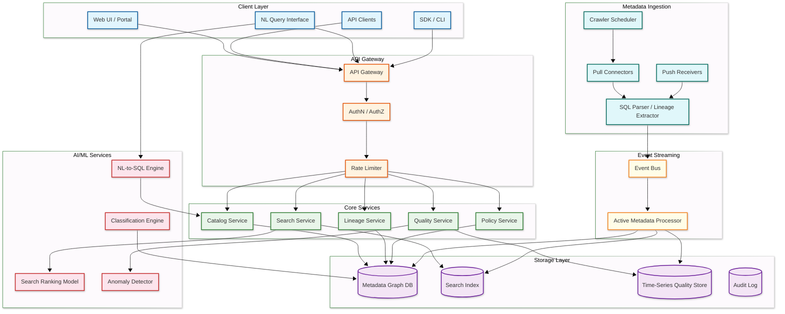
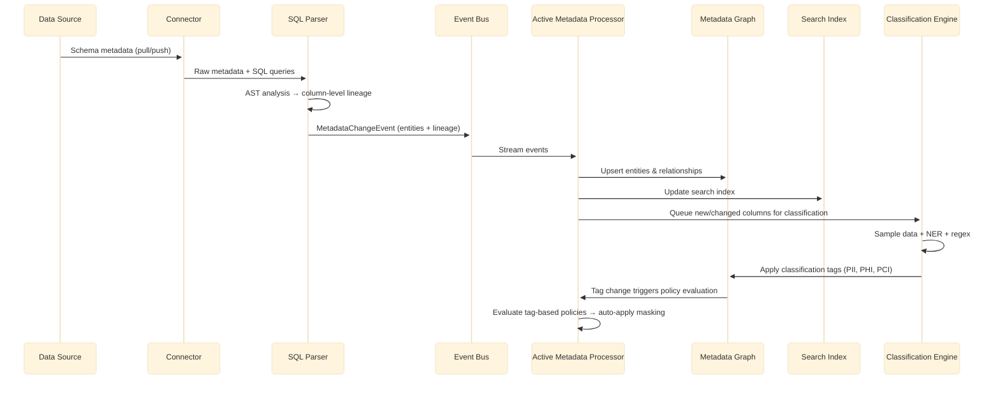
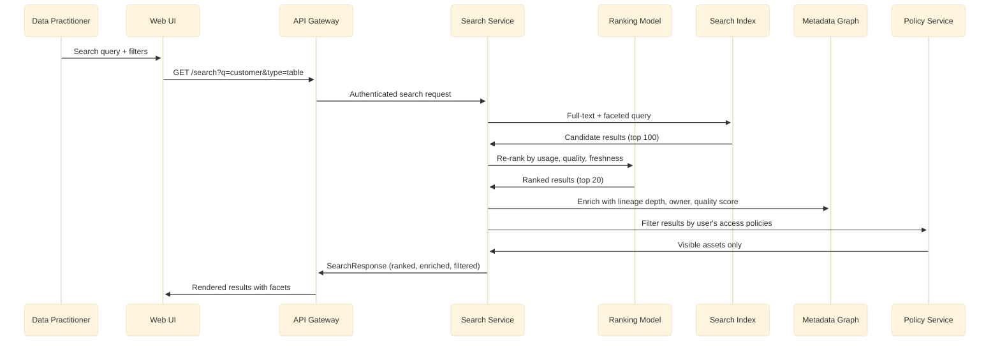

# High-Level Design — AI-Native Data Catalog & Governance

## System Architecture

## Component Descriptions

| Component | Responsibility |
|-----------|---------------|
| **API Gateway** | Routes requests, enforces authentication (OAuth2/OIDC), rate limiting, request validation |
| **Search Service** | Full-text and faceted search with usage-weighted ranking, semantic search via embeddings |
| **Catalog Service** | CRUD operations on metadata entities (tables, columns, pipelines, dashboards, glossary terms) |
| **Lineage Service** | Stores and traverses the column-level lineage graph; supports impact analysis queries |
| **Policy Service** | Evaluates tag-based access policies, column masking rules, and row filtering predicates |
| **Quality Service** | Stores profiling results, computes quality scores, detects anomalies via statistical models |
| **Classification Engine** | Runs NER models (spaCy) and regex patterns against data samples to detect PII/PHI/PCI |
| **NL-to-SQL Engine** | Converts natural language questions to SQL using LLM with catalog metadata as context |
| **Search Ranking Model** | Learns-to-rank model combining text relevance, usage frequency, freshness, quality score |
| **Crawler Scheduler** | Orchestrates periodic and incremental metadata crawls across all connected sources |
| **SQL Parser** | Parses SQL/dbt models to extract column-level lineage from AST analysis |
| **Event Bus** | Streams metadata change events (schema changes, quality signals, lineage updates) |
| **Active Metadata Processor** | Event-driven automation: triggers notifications, policy checks, lineage updates on metadata changes |

---

## Data Flow: Metadata Ingestion Path

## Data Flow: Search & Discovery Path

---

## Key Design Decisions

| Decision | Choice | Alternative | Rationale |
|----------|--------|-------------|-----------|
| **Metadata storage** | RDBMS (PostgreSQL) with adjacency model | Native graph database | RDBMS handles ACID transactions, schema migrations, and operational familiarity; graph queries are handled via recursive CTEs and materialized lineage paths |
| **Search engine** | Dedicated search index (OpenSearch) | RDBMS full-text search | Search requires inverted indexes, faceting, fuzzy matching, and embedding-based semantic search at scale |
| **Ingestion model** | Hybrid push + pull | Pull-only crawling | Push for real-time sources (Airflow, Spark); pull for batch sources (warehouses, BI tools) |
| **Lineage extraction** | SQL AST parsing | Query log pattern matching | AST parsing gives column-level accuracy; pattern matching misses complex CTEs and subqueries |
| **Classification approach** | Hybrid NER + regex + LLM | Regex-only | NER catches unstructured PII in free-text columns; regex handles structured patterns (SSN, email); LLM resolves ambiguous cases |
| **Policy enforcement model** | Tag-based (ABAC) | Role-based (RBAC) only | Tags compose with classification — auto-classified PII columns automatically inherit masking policies |
| **Event architecture** | Event bus with active metadata processor | Polling-based sync | Real-time responsiveness for schema changes, quality alerts, and policy triggers |
| **NL-to-SQL** | LLM with RAG over catalog metadata | Rule-based NL parser | LLM handles open-ended questions; catalog metadata provides schema context for accurate SQL generation |
