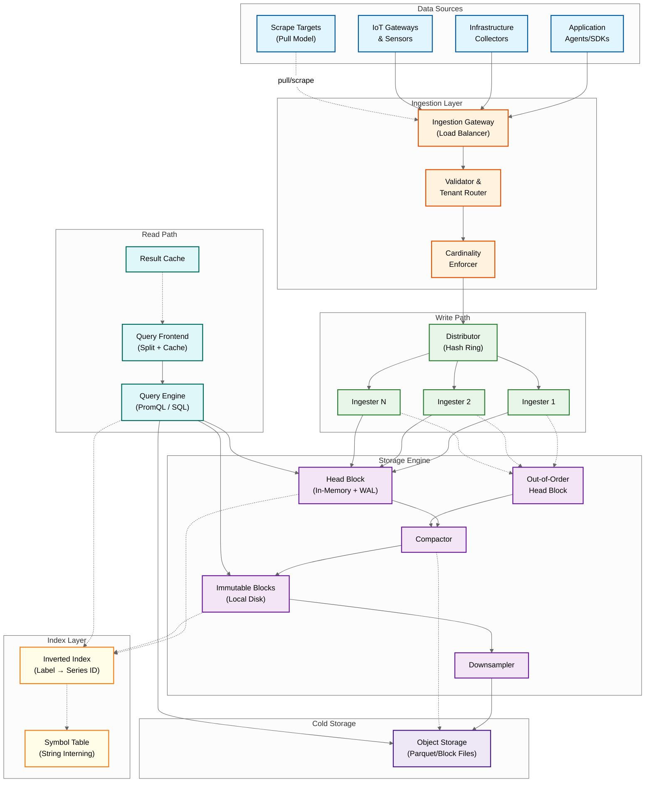
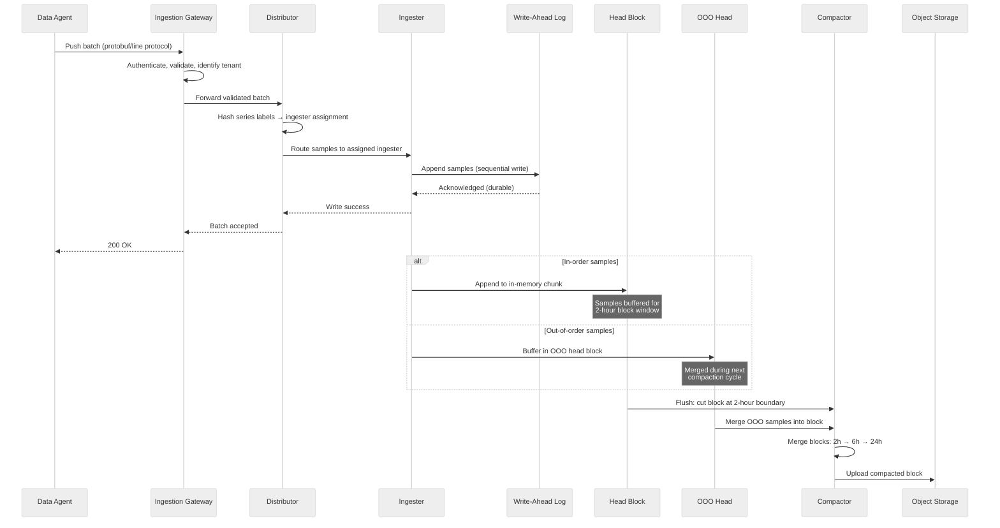
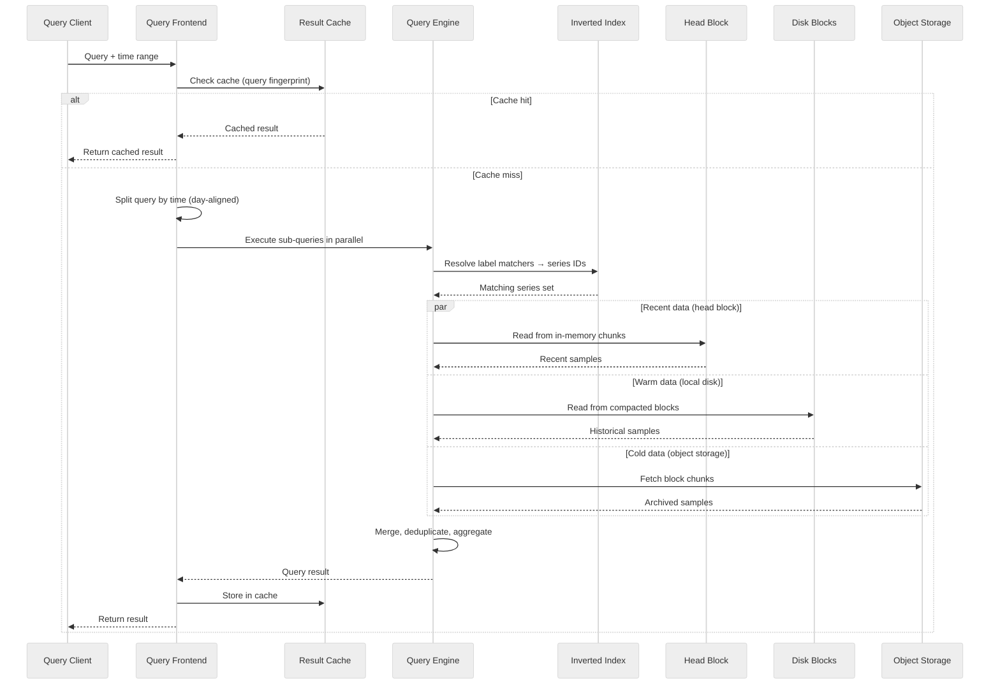

# High-Level Design --- Time-Series Database

## System Architecture

---

## Data Flow: Write Path

The write path is the most throughput-critical flow. It must handle millions of data points per second with sub-millisecond per-batch latency while guaranteeing durability.

### Write Path Components

| Component | Responsibility | Scaling Strategy |
|---|---|---|
| **Ingestion Gateway** | TLS termination, authentication, payload validation, tenant identification, request routing | Stateless horizontal scaling behind load balancer |
| **Distributor** | Consistent hash ring routing: hashes each series' label set to assign ingester ownership; enforces per-tenant rate limits and cardinality caps | Stateless; ring membership via gossip or coordination service |
| **Ingester** | Accepts samples for owned series; appends to WAL for durability; maintains in-memory head block; buffers out-of-order samples; flushes blocks to disk at time boundaries | Stateful (owns series state); horizontal scaling via ring rebalancing; replication factor of 3 |
| **WAL** | Sequential append-only log on local SSD; records every sample before acknowledgment; enables crash recovery via replay | Per-ingester local storage; segment rotation and checkpointing to bound recovery time |
| **Head Block** | In-memory buffer for recent data (last 2 hours); each active series has a Gorilla-compressed chunk; supports efficient recent-data queries | Memory-bound; ~120 bytes overhead per active series |
| **Out-of-Order Head** | Separate in-memory buffer for late-arriving samples within the OOO acceptance window; merged into the main timeline during compaction | Same memory model as head block; bounded by OOO window size |
| **Compactor** | Merges small blocks into larger ones (2h → 6h → 24h); rewrites index; applies tombstones; uploads to object storage | CPU-intensive; runs as separate process; parallelizable across non-overlapping time ranges |
| **Downsampler** | Creates rollup blocks at reduced resolution (5-min, 1-hour) from full-resolution blocks; stores (min, max, sum, count) per interval | Runs after compaction; idempotent; can backfill missed intervals |

---

## Data Flow: Read Path (Query)

### Read Path Optimization Strategies

| Optimization | How It Works | Impact |
|---|---|---|
| **Query splitting** | Frontend splits long time ranges into day-aligned sub-queries; each independently cacheable | Partial cache hits: 6 of 7 days cached means only 1 day computed |
| **Step alignment** | Queries aligned to step boundaries produce identical cache keys across users | Dramatically improves cache hit rate for shared dashboards |
| **Inverted index** | Label matchers resolved to series IDs via posting list intersection; O(n) in matched series | Avoids scanning all series; critical for high-cardinality environments |
| **Chunk pruning** | Each chunk/block carries min/max timestamp; chunks outside query range skipped without decompression | Reduces I/O proportional to time range selectivity |
| **Multi-resolution routing** | Query engine selects appropriate resolution tier (raw, 5-min, 1-hour) based on query time range and step | 30-day query at 1-hour step reads 720 points per series instead of 172,800 |
| **Pre-aggregation (recording rules)** | Expensive queries pre-computed on schedule and stored as new series | Dashboard queries read 1 pre-aggregated series instead of fan-out across thousands |
| **Block-level caching** | Frequently accessed block index headers and chunk data cached in memory | Reduces object storage reads for repeatedly queried time ranges |

---

## Key Architectural Decisions

### Decision 1: Gorilla-Style Chunks vs. Columnar Parquet

| | Gorilla Chunks (Prometheus/VictoriaMetrics) | Columnar Parquet (InfluxDB 3.0/QuestDB) | **Recommendation** |
|---|---|---|---|
| **Compression** | 12x for regular metrics (1.37 bytes/point); degrades for irregular data | 10-20x with dictionary + run-length + delta; more robust across data types | **Hybrid**: Gorilla for hot head block (fast append); Parquet for cold storage (better columnar scan, ecosystem compatibility) |
| **Write performance** | Append to open chunk is O(1) with bit-level encoding | Batch-oriented columnar writes; higher per-write overhead | Gorilla wins for real-time ingestion; Parquet wins for batch loads |
| **Query performance** | Must decompress entire chunk to read any sample; no columnar pruning | Column pruning: read only needed columns; predicate pushdown; vectorized execution | Parquet wins for analytical queries; Gorilla wins for narrow time-range reads |
| **Ecosystem** | Proprietary format; Prometheus-specific tooling | Standard format; interoperable with data lake tools | Parquet enables open data lake integration |

### Decision 2: Monolithic vs. Disaggregated Architecture

| | Monolithic (Prometheus/VictoriaMetrics) | Disaggregated (Mimir/InfluxDB 3.0) | **Recommendation** |
|---|---|---|---|
| **Deployment** | Single process handles ingestion, storage, querying | Separate components: distributor, ingester, compactor, querier, store gateway | **Monolithic** for single-tenant <50M series; **Disaggregated** for multi-tenant or >50M series |
| **Scaling** | Vertical scaling; single-node memory limits cap capacity (~20-50M series) | Independent horizontal scaling per component | Disaggregated enables cost-efficient scaling of write vs. read paths |
| **Operational cost** | Simple deployment; few moving parts; low operational overhead | Requires coordination service, object storage, multiple deployable components | Monolithic for teams without dedicated platform engineers |
| **Failure isolation** | Compaction storm can degrade queries; memory pressure affects everything | Component-level isolation: compaction doesn't affect query latency | Disaggregated isolates failure domains |

### Decision 3: LSM-Tree vs. Custom Block-Based Storage

| | LSM-Tree (VictoriaMetrics/TDengine) | Custom Block-Based (Prometheus TSDB) | **Recommendation** |
|---|---|---|---|
| **Write amplification** | Higher due to level-based compaction; mitigated by time-windowed compaction | Lower; blocks are immutable once flushed; compaction is block merge, not key-level | **Block-based** for pure time-series; LSM for mixed workloads needing updates |
| **Read amplification** | May check multiple levels for a key; bloom filters mitigate | Direct block access via time-range routing; no level scanning | Block-based has simpler read path for time-ordered data |
| **Deletion** | Tombstone-based; space reclaimed on compaction | Block-level deletion: drop entire block file (O(1) for TTL-based retention) | Block-based enables instant retention enforcement |
| **Space amplification** | Temporary during compaction (1.5-2x for leveled) | Minimal; blocks are self-contained and independently compactable | Block-based is more space-predictable |

### Decision 4: Object Storage for Long-Term Retention

| | Local Disk Only | Object Storage Backend | **Recommendation** |
|---|---|---|---|
| **Cost** | ~$0.10/GB/month (SSD) | ~$0.02/GB/month (standard tier) | **Object storage** for blocks older than head block window (2 hours) |
| **Durability** | Dependent on disk redundancy | 99.999999999% (11 nines) built-in | Object storage provides superior durability |
| **Scalability** | Limited by cluster disk capacity | Virtually unlimited | Eliminates storage capacity planning |
| **Query latency** | Sub-millisecond random read | 10-100ms first-byte latency | Mitigated by block index caching and chunk prefetch |

---

## Architecture Pattern Checklist

- [x] **Sync vs Async**: Sync for write acknowledgment (WAL durability); Async for compaction, downsampling, and block upload to object storage
- [x] **Event-driven vs Request-response**: Request-response for ingestion and queries; event-driven for compaction triggers and retention enforcement
- [x] **Push vs Pull**: Hybrid ingestion model; push for most sources, pull for targets exposing metrics endpoints
- [x] **Stateless vs Stateful**: Distributors and query frontends are stateless; Ingesters are stateful (own series in hash ring); Compactors are stateless (operate on block files)
- [x] **Write-heavy optimization**: Append-only WAL, in-memory head block, batch writes, Gorilla compression, no in-place updates
- [x] **Real-time vs Batch**: Real-time for ingestion and recent-data queries; batch for compaction, downsampling, and long-term storage tiering
- [x] **Edge vs Origin**: Agents (edge) perform local pre-aggregation and buffering; TSDB cluster (origin) handles storage and querying
