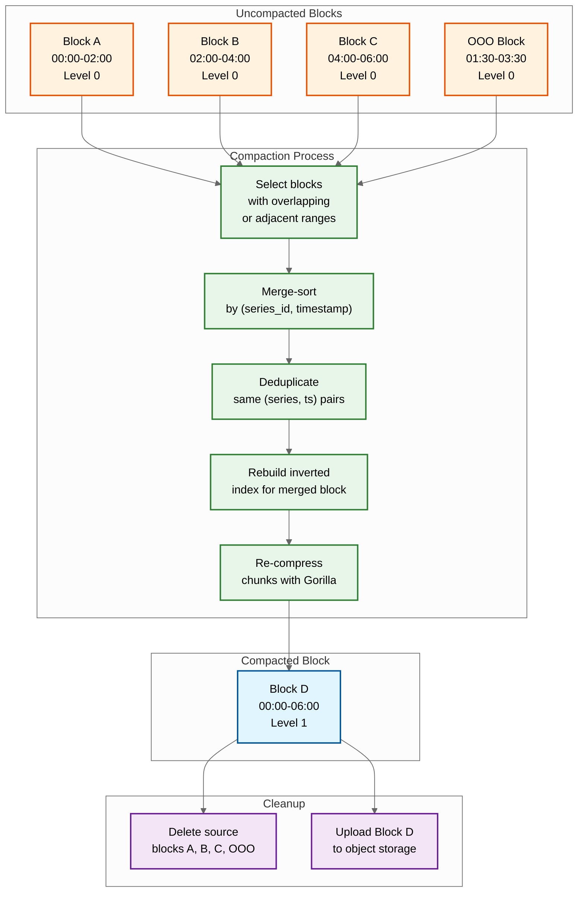

# Deep Dives & Bottlenecks --- Time-Series Database

## Critical Component 1: The Compaction Pipeline

### Why This Is Critical

Compaction is the background process that transforms many small, overlapping blocks into fewer, larger, optimally-organized blocks. Without compaction, the TSDB accumulates thousands of 2-hour block files per month, causing query performance to degrade linearly with retention duration (each query must open and scan more files). Compaction also merges out-of-order samples into the correct timeline, applies tombstone-based deletions, rewrites the inverted index for optimal read performance, and uploads merged blocks to object storage for long-term retention.

### How It Works Internally



### Compaction Algorithm

```
FUNCTION compact(blocks):
    // Phase 1: Select compaction group
    groups = plan_compaction(blocks)
    // Group overlapping time ranges; merge Level 0 blocks into Level 1
    // Group 3 Level 1 blocks (18h) into Level 2
    // Never compact across levels

    FOR EACH group IN groups:
        // Phase 2: Open all source blocks
        readers = [open_block_reader(b) FOR b IN group.blocks]
        merged_block = create_new_block(
            min_time = MIN(b.min_time FOR b IN group.blocks),
            max_time = MAX(b.max_time FOR b IN group.blocks),
            level = group.target_level
        )

        // Phase 3: Merge-sort all series across source blocks
        series_iterator = create_merge_iterator(readers)
        WHILE series_iterator.has_next():
            series_id, chunks = series_iterator.next()

            // Phase 4: Merge chunks, deduplicate, re-compress
            samples = merge_and_deduplicate(chunks)
            // Dedup: if two samples have same (series_id, timestamp),
            // keep the one from the higher-level source block

            // Apply tombstones
            samples = apply_tombstones(samples, tombstones[series_id])

            new_chunk = gorilla_compress(samples)
            merged_block.write_chunk(series_id, new_chunk)

        // Phase 5: Write index for merged block
        merged_block.write_index()

        // Phase 6: Atomic swap
        // Register new block in metadata BEFORE deleting sources
        register_block(merged_block)
        FOR EACH b IN group.blocks:
            mark_for_deletion(b)

    // Phase 7: Garbage collection (deferred)
    // Delete source blocks after confirming no active queries reference them
```

### Failure Modes and Mitigations

| Failure Mode | Impact | Mitigation |
|---|---|---|
| **Compaction storm** | CPU/IO saturation during catch-up compaction after downtime; queries slow | Rate-limit compaction concurrency; prioritize recent blocks; defer old-block compaction |
| **Disk space exhaustion during compaction** | Compaction needs temporary space for merged block before deleting sources (~2x space) | Monitor disk headroom; abort compaction if free space < threshold; object storage offloading reduces local disk pressure |
| **Crash during compaction** | Partially written merged block | Source blocks are only deleted after merged block is fully registered; restart re-reads source blocks; idempotent operation |
| **Overlapping block metadata** | Query returns duplicate data | Query engine deduplicates by (series_id, timestamp); compaction resolves overlap permanently |

---

## Critical Component 2: Out-of-Order Ingestion

### Why This Is Critical

Traditional TSDBs like early Prometheus rejected out-of-order samples---any sample with a timestamp older than the most recent sample for that series was dropped. This works for pull-based monitoring with a single scraper, but fails for push-based architectures where distributed agents have clock skew, network delays cause batches to arrive out of order, or late-arriving aggregations from edge collectors need to backfill recent gaps.

### How It Works Internally

```
FUNCTION ingest_sample(series_id, timestamp, value):
    head = get_head_block(series_id)

    IF timestamp >= head.max_timestamp:
        // In-order: append to main head chunk (fast path)
        head.append(timestamp, value)
        wal.append(series_id, timestamp, value)

    ELSE IF timestamp >= NOW() - OOO_WINDOW:
        // Out-of-order but within acceptance window
        ooo_head = get_ooo_head_block(series_id)
        ooo_head.insert(timestamp, value)
        wal.append_ooo(series_id, timestamp, value)
        ooo_metrics.increment("ooo_samples_total")

    ELSE:
        // Too old: reject
        REJECT("sample too old: timestamp outside OOO window")
        ooo_metrics.increment("ooo_rejected_total")

// OOO head block uses a different data structure:
// Instead of a single append-only chunk per series,
// it maintains a sorted tree of (timestamp, value) pairs
// that allows insertion at arbitrary positions.
// These are merged into the main timeline during compaction.
```

### OOO Memory Model

```
Main Head Block (in-order):
  Series 101: [t1=100, t2=115, t3=130, t4=145]  ← append-only, Gorilla-compressed
  Series 102: [t1=100, t2=115, t3=130]           ← append-only

OOO Head Block (out-of-order):
  Series 101: {t=110: v=42.3, t=125: v=43.1}    ← sorted tree, not compressed
  Series 102: {}                                  ← no OOO samples

After compaction merge:
  Series 101: [t1=100, t=110, t2=115, t=125, t3=130, t4=145]
  // Sorted, deduplicated, Gorilla-compressed in new block
```

### Failure Modes and Mitigations

| Failure Mode | Impact | Mitigation |
|---|---|---|
| **OOO window too small** | Legitimate late samples rejected; data gaps | Configure window based on worst-case agent delay (5-60 minutes); monitor rejection rate |
| **OOO window too large** | Excessive memory for OOO sorted trees; slow compaction merge | Bound OOO memory per series; shed oldest OOO samples under memory pressure |
| **Clock skew between agents** | Samples appear out-of-order even when sent in-order | NTP synchronization; server-side timestamp assignment option; relax OOO window |
| **OOO flood** | Memory exhaustion if many series suddenly send old data | Per-series OOO sample limit; circuit breaker on OOO ingestion rate |

---

## Critical Component 3: The Inverted Index Under Cardinality Pressure

### Why This Is Critical

The inverted index must fit in memory for acceptable query latency. At 25M active series with 8 labels each, the index consumes ~20 GB of RAM. A single developer adding an unbounded label (like `user_id` or `request_id`) to a popular metric can multiply series count by 10,000x in hours, causing OOM kills, query timeouts, and ingestion failures. Cardinality is the single most dangerous scaling threat to a TSDB.

### How Cardinality Explodes

```
Normal metric:
  http_requests_total{method="GET", endpoint="/api", status="200", region="us-east"}
  Labels: 4 dimensions, ~20 unique values each → 20^4 = 160,000 max series

Cardinality explosion (developer adds user_id):
  http_requests_total{method="GET", endpoint="/api", status="200", region="us-east", user_id="abc123"}
  Labels: 5 dimensions, user_id has 1M unique values → 160,000 x 1,000,000 = 160 BILLION max series
  // In practice, not all combinations exist, but even 1% = 1.6 BILLION series

Memory impact of 1.6B series:
  Index: 1.6B x 200 bytes ≈ 320 GB (exceeds any single node)
  Head block: 1.6B x 120 bytes ≈ 192 GB
  Total: 512+ GB → system OOM
```

### Cardinality Enforcement Pipeline

```
FUNCTION enforce_cardinality(tenant_id, series_labels):
    series_id = compute_series_id(series_labels)

    // Check 1: Is this an existing series? (fast path)
    IF series_exists(series_id):
        RETURN ACCEPT

    // Check 2: Per-tenant active series count
    tenant_series_count = get_tenant_series_count(tenant_id)
    IF tenant_series_count >= tenant_config.max_series:
        RETURN REJECT("tenant series limit exceeded")

    // Check 3: Per-metric cardinality
    metric_name = series_labels["__name__"]
    metric_series_count = get_metric_series_count(tenant_id, metric_name)
    IF metric_series_count >= tenant_config.max_series_per_metric:
        RETURN REJECT("metric cardinality limit exceeded")

    // Check 4: Series creation rate
    creation_rate = get_series_creation_rate(tenant_id, LAST_MINUTE)
    IF creation_rate >= tenant_config.max_series_creation_rate:
        RETURN REJECT("series creation rate limit exceeded")

    // Check 5: Label value cardinality check
    FOR EACH (key, value) IN series_labels:
        label_cardinality = get_label_value_count(tenant_id, key)
        IF label_cardinality >= tenant_config.max_label_values:
            RETURN REJECT("label " + key + " cardinality limit exceeded")

    RETURN ACCEPT
```

---

## Concurrency & Race Conditions

### Race Condition 1: Head Block Flush During Active Writes

```
Problem:
  Ingester receives writes to head block while compactor is flushing it to disk.

  Thread A (Writer): append sample to series 101 in head block
  Thread B (Flusher): iterate all series in head block to create disk block

  Risk: Writer sees a partially-flushed head block, or flusher misses samples
         written during the flush.

Solution: Double-buffering with atomic swap
  1. Flusher creates a NEW empty head block (head_new)
  2. Atomic pointer swap: head_current → head_new
  3. All new writes go to head_new immediately
  4. Flusher reads the OLD head block (no concurrent writes) at leisure
  5. Old head block converted to immutable disk block
  6. No locks on the write path; swap is a single atomic pointer update
```

### Race Condition 2: Concurrent Compaction on Overlapping Blocks

```
Problem:
  Two compaction workers select overlapping sets of source blocks.
  Both produce merged blocks covering the same time range.

Solution: Lease-based compaction ownership
  1. Compaction planner assigns non-overlapping block groups
  2. Each compaction job acquires a lease (block IDs → worker mapping)
  3. Lease stored in coordination service with TTL
  4. If worker crashes, lease expires and another worker can retry
  5. Block registration is idempotent: duplicate registration detected by ULID
```

### Race Condition 3: Query During Block Replacement

```
Problem:
  Query starts reading Block A. Compaction replaces Block A with Block B
  (merged from A + C). Block A is deleted while query is still reading.

Solution: Reference counting with deferred deletion
  1. Each block has a reference count
  2. Query increments ref count before reading; decrements after
  3. Compaction marks blocks for deletion but waits until ref count = 0
  4. Blocks with ref count > 0 are retained until all readers finish
  5. Timeout: if ref count doesn't reach 0 within N minutes, force cleanup
     (query will fail with "block not found" and retry against new block)
```

---

## Bottleneck Analysis

### Bottleneck 1: Memory Pressure from Head Block

| Aspect | Details |
|---|---|
| **Root cause** | Each active series consumes ~120 bytes in the head block (chunk header, append buffer, hash map entry). At 25M series, that's 3 GB just for overhead, plus chunk data (~15 GB for 2 hours of samples) |
| **Symptom** | Increasing garbage collection pauses; OOM kills during cardinality spikes; write latency spikes as memory allocator contends |
| **Mitigation** | (1) Reduce head block window from 2 hours to 1 hour (halves memory); (2) Use memory-mapped chunks that can be paged out; (3) Cardinality enforcement prevents unbounded growth; (4) Series that haven't received samples for >2x scrape interval are marked stale and their head chunk is closed |

### Bottleneck 2: Compaction I/O Contention

| Aspect | Details |
|---|---|
| **Root cause** | Compaction reads all source blocks, decompresses, merge-sorts, recompresses, and writes a new block. For large blocks (24 hours of data across 25M series), this can consume 100+ GB of I/O bandwidth |
| **Symptom** | Query latency spikes during compaction; disk I/O saturation alerts; compaction falling behind (growing block count) |
| **Mitigation** | (1) Rate-limit compaction I/O via cgroup or ionice; (2) Run compaction on dedicated nodes (disaggregated architecture); (3) Prioritize compaction of recent blocks (most queried); (4) Skip compaction for blocks that are about to age out of retention |

### Bottleneck 3: Query Fan-Out Across High-Cardinality Series

| Aspect | Details |
|---|---|
| **Root cause** | A query like `sum(rate(http_requests_total[5m])) by (service)` may match 100K series. The query engine must decompress chunks for all 100K series, compute rate for each, then aggregate by service label |
| **Symptom** | Query timeout (>30s); excessive memory allocation for intermediate results; query engine OOM |
| **Mitigation** | (1) Recording rules pre-compute high-fan-out aggregations; (2) Per-query memory limit with early termination; (3) Per-query series limit (e.g., max 500K series per query); (4) Streaming aggregation: aggregate as chunks are decompressed instead of materializing all series in memory |
