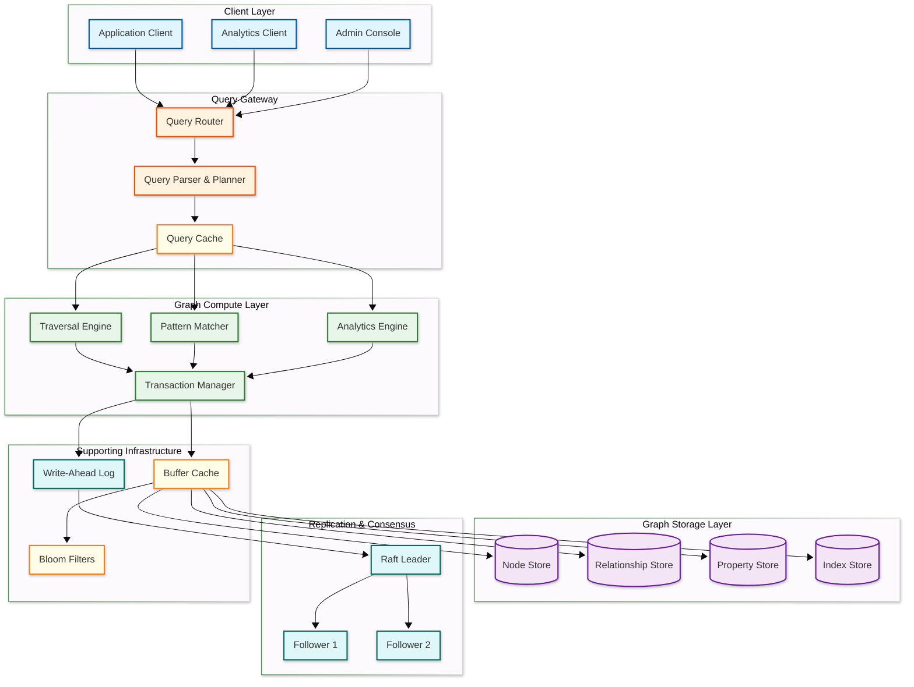
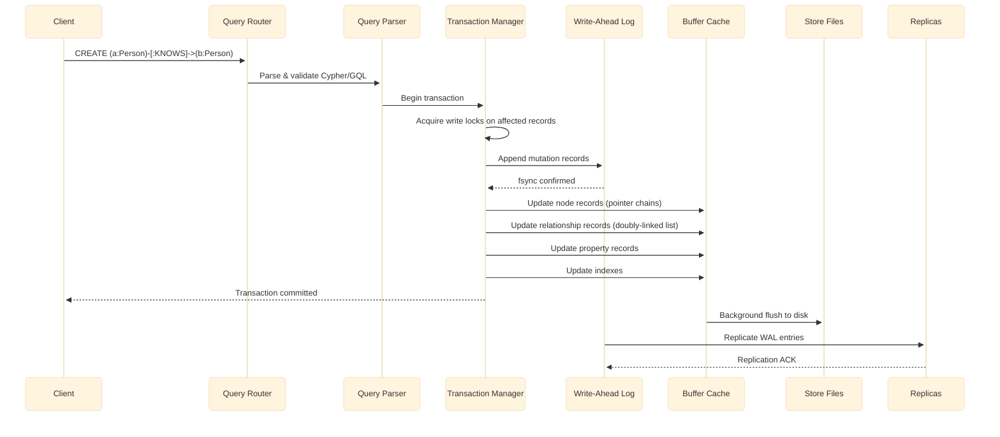

# High-Level Design — Graph Database

## System Architecture

---

## Data Flow

### Write Path (Node/Edge Creation)

**Write path key points:**

1. **WAL-first** — All mutations are durable in the write-ahead log before acknowledgment
2. **Pointer chain updates** — Creating an edge requires updating the adjacency lists of both endpoints (doubly-linked relationship chain)
3. **Lock granularity** — Record-level locks on the specific nodes and edges being modified
4. **Deferred flush** — Buffer cache absorbs writes; background thread flushes dirty pages to store files
5. **Replication** — WAL entries are streamed to followers for synchronous or asynchronous replication

### Read Path (Graph Traversal)

1. **Query parsing** — Cypher/GQL query is parsed into an abstract syntax tree (AST)
2. **Query planning** — The cost-based optimizer evaluates multiple execution plans using cardinality estimates, index availability, and data distribution statistics
3. **Plan selection** — The plan with lowest estimated cost is selected (index scan vs. label scan vs. full scan)
4. **Traversal execution** — The traversal engine follows physical pointers from the starting node through the relationship chain, filtering on labels, types, and property predicates
5. **Result assembly** — Matched patterns are materialized with requested properties and returned to the client
6. **Cache utilization** — Hot nodes and relationships are served from the buffer cache; cache misses trigger disk reads

---

## Key Architectural Decisions

### 1. Native Graph Storage vs. Graph Layer on Relational/Document Store

| Aspect | Native Graph Storage | Non-Native (Graph on RDBMS) |
|--------|--------------------|-----------------------------|
| Traversal performance | O(1) per hop via physical pointers | O(log n) per hop via index lookups |
| Storage efficiency | Fixed-size records, pointer-based | Tables with foreign keys, JOINs |
| Multi-hop queries | Constant time per hop | Exponential cost with hop count |
| Ecosystem maturity | Specialized tooling | Leverage existing RDBMS ecosystem |
| Analytics | Requires separate engine | Can reuse SQL analytics |

**Decision:** Native graph storage with index-free adjacency. The entire value proposition of a graph database depends on O(1) traversal — without it, we are building a slower relational database with graph syntax.

### 2. Property Graph vs. RDF Triple Store

| Aspect | Property Graph | RDF Triple Store |
|--------|---------------|-----------------|
| Data model | Nodes/edges with properties | Subject-predicate-object triples |
| Query language | Cypher, GQL, Gremlin | SPARQL |
| Schema | Flexible, optional constraints | Ontology-based (OWL, RDFS) |
| Traversal | Natural path expressions | SPARQL property paths |
| Use cases | Social, fraud, recommendations | Knowledge management, semantic web |
| Performance | Optimized for local traversals | Optimized for global pattern matching |

**Decision:** Property graph model. It maps more naturally to application data models (users, products, transactions have properties), supports richer edge semantics (typed, weighted, temporal edges), and has broader industry adoption for OLTP graph workloads.

### 3. Synchronous vs. Asynchronous Replication

| Aspect | Synchronous | Asynchronous |
|--------|-------------|--------------|
| Consistency | Strong — reads see latest writes | Eventual — replicas may lag |
| Write latency | Higher (wait for follower ACK) | Lower (acknowledge after local WAL) |
| Durability | No data loss on primary failure | Potential data loss (replication lag) |
| Availability | Reduced during partition | Higher (writes continue regardless) |

**Decision:** Synchronous replication with quorum writes (2 of 3 replicas) for OLTP workloads. Analytics replicas use asynchronous replication to avoid impacting write latency.

### 4. Query Language Strategy

**Decision:** Support GQL (ISO/IEC 39075) as the primary query language with Cypher compatibility. GQL combines the best features of Cypher, PGQL, and G-CORE into an ISO standard that provides pattern matching, path expressions, and graph DDL.

### 5. Caching Strategy

| Cache Layer | What It Caches | Eviction Policy |
|-------------|---------------|-----------------|
| Query result cache | Complete query results for repeated queries | LRU with TTL, invalidated on write |
| Buffer cache | Node, relationship, and property records | Clock-sweep (approximation of LRU) |
| Traversal context cache | Partial traversal state for incremental queries | Session-scoped, TTL-based |
| Index cache | B-tree inner nodes and leaf pages | Priority-based (inner nodes pinned) |

### 6. Message Queue Usage

**Decision:** Write-ahead log serves as the internal replication stream (no external message queue needed for core operations). An external event stream is used only for change data capture (CDC) to notify downstream systems of graph mutations.

---

## Architecture Pattern Checklist

- [x] **Sync vs Async communication** — Synchronous for OLTP queries; async replication to analytics replicas
- [x] **Event-driven vs Request-response** — Request-response for queries; event-driven CDC for downstream consumers
- [x] **Push vs Pull model** — Pull-based replication (followers pull WAL from leader); push-based CDC notifications
- [x] **Stateless vs Stateful services** — Query router is stateless; storage nodes are stateful (own their partition)
- [x] **Read-heavy vs Write-heavy** — Read-heavy (80:1); buffer cache and index-free adjacency optimize reads
- [x] **Real-time vs Batch processing** — Real-time for OLTP traversals; batch for analytics (PageRank, community detection)
- [x] **Edge vs Origin processing** — Origin processing; graph traversals cannot be meaningfully edge-cached due to personalization
